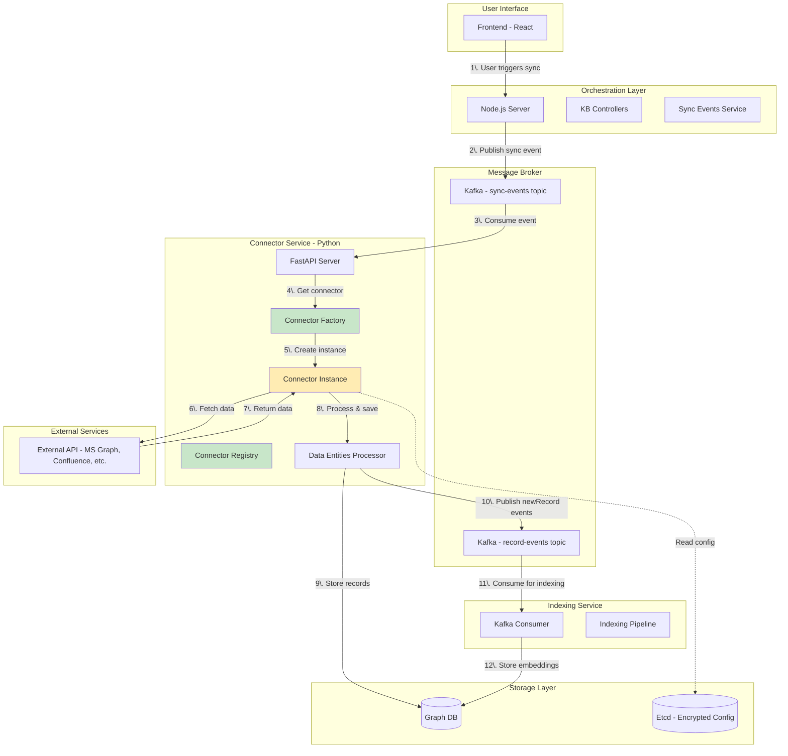
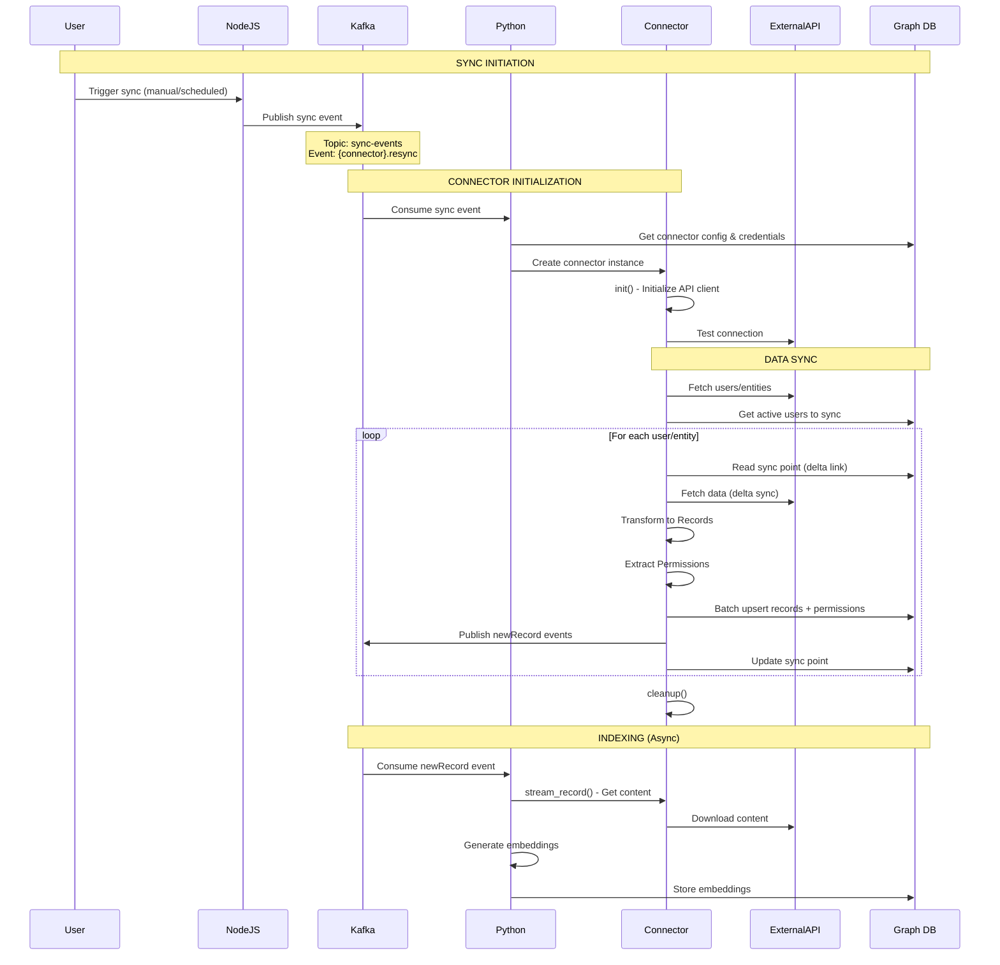
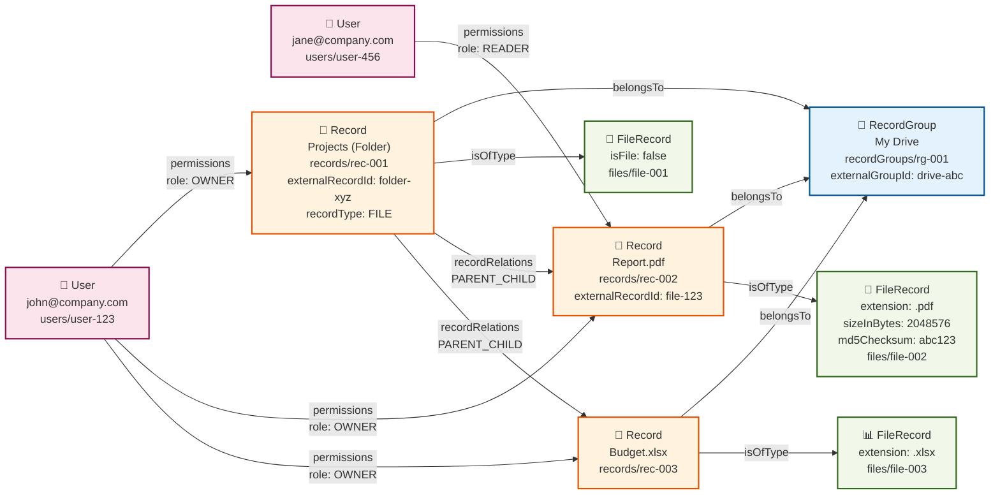

# Connector Integration Playbook

**Target Audience:** Developers with Python/TypeScript knowledge and OAuth understanding

---

## About This Playbook

This playbook is your complete guide to building and integrating new data connectors into the PipesHub AI platform. Whether you're connecting Microsoft 365, Google Workspace, Atlassian products, or any other third-party service, this guide walks you through every step, from understanding the architecture to testing your implementation.

---

## What Are Connectors?

**Connectors** are specialized Python modules that sync data from external services (like OneDrive, Gmail, Slack, Jira, etc.) into the PipesHub AI platform. They act as bridges between third-party APIs and our internal data model.

### What Connectors Do

1. **Authenticate** with external services (OAuth, API tokens, service accounts)
2. **Fetch data** from external APIs (files, emails, documents, tickets, etc.)
3. **Transform data** into our standardized Record model
4. **Extract permissions** to maintain access control
5. **Sync incrementally** using delta links or timestamps (avoiding full re-syncs)
6. **Publish events** to trigger indexing and embedding generation

### Connector Examples

- **OneDrive Connector**: Syncs files and folders from Microsoft OneDrive
- **Gmail Connector**: Syncs emails and attachments from Gmail
- **Confluence Connector**: Syncs pages and spaces from Atlassian Confluence
- **Jira Connector**: Syncs issues and comments from Atlassian Jira
- **Slack Connector**: Syncs messages and files from Slack channels

Each connector inherits from a `BaseConnector` class and implements standard methods for syncing, streaming content, and handling cleanup.

---

## Table of Contents

1. [Overview & Architecture](#1-overview--architecture)
2. [Prerequisites](#2-prerequisites)
3. [Understanding the Codebase](#3-understanding-the-codebase)
4. [Understanding the Graph DB Model](#4-understanding-the-graph-db-model)
5. [Quick Start Checklist](#5-quick-start-checklist)
6. [Python Backend Implementation](#6-python-backend-implementation)
7. [Frontend Integration](#7-frontend-integration)
8. [Testing Your Connector](#8-testing-your-connector)
9. [Common Pitfalls & Troubleshooting](#9-common-pitfalls--troubleshooting)
10. [Appendix](#10-appendix)

---

## 1. Overview & Architecture

### System Architecture

The connector system is distributed across multiple services:



### Connector Lifecycle Flow



### Key Concepts

- **Connector**: Python class that implements sync logic for an external service
- **Record**: Data entity (file, email, document, etc.) stored in Graph DB
- **Permission**: Access control edge connecting users to records
- **Sync Point**: Stored state for delta/incremental sync (delta links, timestamps)
- **Data Entities Processor**: Handles record persistence and permission management
- **Kafka Events**: Async communication between services

---

## 2. Prerequisites

### Required Knowledge

- ✅ Python 3.x (async/await, type hints)
- ✅ OAuth 2.0 flows
- ✅ REST API integration
- ✅ Git & GitHub workflow

### Development Environment Setup

Before starting connector development, ensure your local development environment is properly configured.

**📋 Follow the project setup guide:**

- **[CONTRIBUTING.md](https://github.com/pipeshub-ai/pipeshub-ai/blob/main/CONTRIBUTING.md)** - Complete setup instructions for the development environment

**Required tools:**

- Python 3.10
- Node.js 22.15
- Docker
- MongoDB Compass
- Graph DB, Kafka, Redis, MongoDB, ETCD Server, Qdrant (running locally or via Docker)
- Code editor (VS Code recommended)

> 💡 **Important:** Complete the setup in CONTRIBUTING.md before proceeding with connector development. This ensures all services are running and dependencies are installed correctly.

### External Service Setup

Before starting, you'll need:

1. **Developer account** for the service you're integrating (Microsoft 365, GitLab, etc.)
2. **OAuth application registered** (or API tokens)
3. **API credentials** (Client ID, Client Secret, etc.)
4. **API documentation** for the service

> 💡 **Note:** Each external service has different setup processes. Research the specific API documentation for:
>
> - Authentication methods (OAuth, API tokens, service accounts)
> - Required scopes/permissions
> - Rate limits
> - Webhook/delta sync capabilities

---

## 3. Understanding the Codebase

### Directory Structure

```
backend/
├── python/
│   └── app/
│       ├── connectors/
│       │   ├── api/
│       │   │   └── router.py                    # FastAPI endpoints
│       │   ├── core/
│       │   │   ├── base/
│       │   │   │   ├── connector/
│       │   │   │   │   └── connector_service.py # BaseConnector class
│       │   │   │   ├── data_processor/
│       │   │   │   │   └── data_source_entities_processor.py
│       │   │   │   └── data_store/
│       │   │   │       └── data_store.py
│       │   │   ├── factory/
│       │   │   │   └── connector_factory.py     # Connector registration
│       │   │   └── registry/
│       │   │       └── connector_builder.py     # @ConnectorBuilder decorator
│       │   └── sources/
│       │       ├── microsoft/
│       │       │   ├── outlook/
│       │       │   │   └── connector.py         # ⭐ Example connector
│       │       │   ├── onedrive/
│       │       │   └── common/
│       │       │       └── apps.py              # App definitions
│       │       ├── atlassian/
│       │       │   ├── confluence_cloud/
│       │       │   └── jira_cloud/
│       │       └── YOUR_CONNECTOR/              # 🆕 Create your connector here
│       │          └── connector.py
│       │
│       ├── sources/
│       │   ├── external/                        # External API wrappers
│       │   │   └── microsoft/
│       │   │       └── outlook/
│       │   │           └── outlook.py
│       │   └── client/                          # Generic API clients
│       │       └── microsoft/
│       │           └── microsoft.py
│       ├── models/
│       │   ├── entities.py                      # Record models
│       │   └── permission.py                    # Permission models
│       └── config/

frontend/
└── public/
    └── assets/
        └── icons/
            └── connectors/
                └── yourconnector.svg           # 🆕 Add connector icon
```

### Key Components Overview

| Component                                                                                                                                                                  | Location                                                         | Purpose                                          |
| -------------------------------------------------------------------------------------------------------------------------------------------------------------------------- | ---------------------------------------------------------------- | ------------------------------------------------ |
| **[BaseConnector](https://github.com/pipeshub-ai/pipeshub-ai/blob/main/backend/python/app/connectors/core/base/connector/connector_service.py)**                           | `python/app/connectors/core/base/connector/connector_service.py` | Abstract base class - all connectors extend this |
| **[ConnectorBuilder](https://github.com/pipeshub-ai/pipeshub-ai/blob/main/backend/python/app/connectors/core/registry/connector_builder.py)**                              | `python/app/connectors/core/registry/connector_builder.py`       | Decorator for connector metadata & UI schema     |
| **[ConnectorFactory](https://github.com/pipeshub-ai/pipeshub-ai/blob/main/backend/python/app/connectors/core/factory/connector_factory.py)**                               | `python/app/connectors/core/factory/connector_factory.py`        | Registry mapping connector names to classes      |
| **[DataSourceEntitiesProcessor](https://github.com/pipeshub-ai/pipeshub-ai/blob/main/backend/python/app/connectors/core/base/data_processor/data_source_entities_processor.py)** | `python/app/connectors/core/base/data_processor/data_source_entities_processor.py` | Handles record/permission persistence            |
| **[Record Models](https://github.com/pipeshub-ai/pipeshub-ai/blob/main/backend/python/app/models/entities.py)**                                                            | `python/app/models/entities.py`                                  | Data models (FileRecord, MailRecord, etc.)       |
| **[External API Clients](https://github.com/pipeshub-ai/pipeshub-ai/tree/main/backend/python/app/sources/external)**                                                       | `python/app/sources/external/`                                   | Wrappers for external service APIs               |

---

## 4. Understanding the Graph DB Model

### Overview

Connector data is stored in Graph DB as a **property graph** - a network of nodes (vertices) connected by edges (relationships). Understanding this graph structure is essential for correctly modeling your connector's data.

### Core Node Types (Collections)

| Node Type                                                                                                            | Collection     | Purpose                                                        | Example                                        |
| -------------------------------------------------------------------------------------------------------------------- | -------------- | -------------------------------------------------------------- | ---------------------------------------------- |
| **[Record](https://github.com/pipeshub-ai/pipeshub-ai/blob/main/backend/python/app/models/entities.py#L44)**         | `records`      | Base entity for all synced data (files, emails, tickets, etc.) | A document, email, or webpage                  |
| **[FileRecord](https://github.com/pipeshub-ai/pipeshub-ai/blob/main/backend/python/app/models/entities.py#L134)**    | `files`        | File-specific metadata (size, hash, extension)                 | `invoice.pdf`, `presentation.pptx`             |
| **[MailRecord](https://github.com/pipeshub-ai/pipeshub-ai/blob/main/backend/python/app/models/entities.py#L237)**    | `mails`        | Email-specific metadata (subject, from, to, thread)            | An email message                               |
| **[WebpageRecord](https://github.com/pipeshub-ai/pipeshub-ai/blob/main/backend/python/app/models/entities.py#L266)** | `webpages`     | Webpage-specific metadata                                      | A Confluence page, Notion page                 |
| **[TicketRecord](https://github.com/pipeshub-ai/pipeshub-ai/blob/main/backend/python/app/models/entities.py#L288)**  | `tickets`      | Ticket-specific metadata (status, priority, assignee)          | A Jira issue, Linear ticket                    |
| **[RecordGroup](https://github.com/pipeshub-ai/pipeshub-ai/blob/main/backend/python/app/models/entities.py#L431)**   | `recordGroups` | Container for records                                          | Slack channel, SharePoint site, mailbox, drive |
| **[User](https://github.com/pipeshub-ai/pipeshub-ai/blob/main/backend/python/app/models/entities.py#L539)**          | `users`        | System users in your organization                              | Active user accounts                           |
| **[AppUser](https://github.com/pipeshub-ai/pipeshub-ai/blob/main/backend/python/app/models/entities.py#L612)**       | `users`        | Connector-specific user identities                             | External users, service accounts               |

### Core Edge Types (Relationships)

| Edge Type                                                                                                                        | Collection        | From → To                           | Purpose                                | Example                                      |
| -------------------------------------------------------------------------------------------------------------------------------- | ----------------- | ----------------------------------- | -------------------------------------- | -------------------------------------------- |
| **[Permissions](https://github.com/pipeshub-ai/pipeshub-ai/blob/main/backend/python/app/models/permission.py#L22)**              | `permissions`     | User → Record                       | Access control (READER, WRITER, OWNER) | User has READ access to a file               |
| **[RecordRelations](https://github.com/pipeshub-ai/pipeshub-ai/blob/main/backend/python/app/config/constants/arangodb.py#L221)** | `recordRelations` | Record → Record                     | Record-to-record relationships         | Folder contains file, email has attachment   |
| **IsOfType**                                                                                                                     | `isOfType`        | Record → FileRecord/MailRecord/etc. | Links base record to specific type     | Base record is a FileRecord                  |
| **BelongsTo**                                                                                                                    | `belongsTo`       | Record/User → RecordGroup           | Membership in a container              | File belongs to a drive, user belongs to org |

#### RecordRelations Types

The `recordRelations` edge has a `relationshipType` field that defines the relationship (see [`RecordRelations` enum](https://github.com/pipeshub-ai/pipeshub-ai/blob/main/backend/python/app/config/constants/arangodb.py#L221)):

| Relationship Type | Use Case                     | Example                                      |
| ----------------- | ---------------------------- | -------------------------------------------- |
| **PARENT_CHILD**  | Hierarchical structure       | Folder contains file, Drive contains folder  |
| **SIBLING**       | Related items at same level  | Emails in same thread, related documents     |
| **ATTACHMENT**    | One item attached to another | File attached to email, attachment to ticket |

### Record Fields Reference

Every [`Record`](https://github.com/pipeshub-ai/pipeshub-ai/blob/main/backend/python/app/models/entities.py#L44) entity has these key fields:

| Field                         | Graph DB Key                  | Type   | Required | Purpose                                                    |
| ----------------------------- | ----------------------------- | ------ | -------- | ---------------------------------------------------------- |
| **id**                        | `_key`                        | string | ✅       | Unique identifier (auto-generated UUID)                    |
| **org_id**                    | `orgId`                       | string | ✅       | Organization identifier                                    |
| **record_name**               | `recordName`                  | string | ✅       | Display name                                               |
| **record_type**               | `recordType`                  | enum   | ✅       | FILE, MAIL, WEBPAGE, TICKET, etc.                          |
| **external_record_id**        | `externalRecordId`            | string | ✅       | ID in external system (OneDrive file ID, Gmail message ID) |
| **external_revision_id**      | `externalRevisionId`          | string | ❌       | Version ID in external system                              |
| **external_record_group_id**  | `externalGroupId`             | string | ❌       | Parent container ID (drive ID, mailbox ID)                 |
| **parent_external_record_id** | `externalParentId`            | string | ❌       | Parent record ID (parent folder ID)                        |
| **connector_name**            | `connectorName`               | enum   | ✅       | Connector that created this record (ONEDRIVE, GMAIL)       |
| **origin**                    | `origin`                      | enum   | ✅       | CONNECTOR or UPLOAD                                        |
| **version**                   | `version`                     | int    | ✅       | Version number for sync tracking                           |
| **mime_type**                 | `mimeType`                    | string | ❌       | MIME type (application/pdf, text/plain)                    |
| **weburl**                    | `webUrl`                      | string | ❌       | URL to view in external system                             |
| **created_at**                | `createdAtTimestamp`          | int    | ✅       | Epoch timestamp (ms)                                       |
| **updated_at**                | `updatedAtTimestamp`          | int    | ✅       | Epoch timestamp (ms)                                       |
| **source_created_at**         | `sourceCreatedAtTimestamp`    | int    | ❌       | Created timestamp from external system                     |
| **source_updated_at**         | `sourceLastModifiedTimestamp` | int    | ❌       | Modified timestamp from external system                    |

> 💡 **Naming Convention**: Python uses `snake_case` (e.g., `record_name`), Graph DB uses `camelCase` (e.g., `recordName`). The Record model's `to_arango_base_record()` method handles this conversion.

### Example: OneDrive File Hierarchy

Here's how a typical OneDrive structure is stored in Graph DB:



### Key Insights from the Example

1. **Dual Representation**: Every record has two nodes:

   - **Base Record** (`records` collection) - Common fields for all records
   - **Specific Record** (`files`/`mails`/etc.) - Type-specific metadata
   - Connected by `isOfType` edge

2. **RecordGroups as Containers**:

   - Drives, mailboxes, Slack channels are `RecordGroup` entities
   - Records link to their container via `belongsTo` edge
   - Groups have their own `externalGroupId` from the source system

3. **Hierarchical Relationships**:

   - Parent-child relationships use `recordRelations` edge with `relationshipType: PARENT_CHILD`
   - Alternative: Store `externalParentId` in the record (for initial sync), then create edge

4. **Permissions are Directional**:

   - Always from User → Record (not Record → User)
   - Each permission has a `role` field: `READER`, `WRITER`, or `OWNER`

5. **External IDs are Critical**:
   - `externalRecordId`: Unique ID from source system (OneDrive file ID, Gmail message ID)
   - `externalGroupId`: Container ID (drive ID, mailbox ID)
   - `externalParentId`: Parent record ID (for hierarchies)
   - Used for delta sync, deduplication, and updates

### Common Data Patterns

#### Pattern 1: File Hierarchy (OneDrive, Google Drive, SharePoint)

```
RecordGroup (Drive)
  └─ belongsTo ─ Record (Folder)
                   └─ recordRelations (PARENT_CHILD) ─ Record (File)
                                                         └─ isOfType ─ FileRecord
```

#### Pattern 2: Email with Attachment (Outlook, Gmail)

```
RecordGroup (Mailbox)
  └─ belongsTo ─ Record (Email)
                   ├─ isOfType ─ MailRecord
                   └─ recordRelations (ATTACHMENT) ─ Record (File)
                                                        └─ isOfType ─ FileRecord
```

#### Pattern 3: Email Thread (Sibling Relationship)

```
Record (Email 1) ←─ recordRelations (SIBLING) ─→ Record (Email 2)
     ↓                                                    ↓
  MailRecord                                          MailRecord
  (threadId: "thread-123")                           (threadId: "thread-123")
```

---

## 5. Quick Start Checklist

### Files to Create (🆕 New Files)

- [ ] **Python Connector Class**

  - `backend/python/app/connectors/sources/{vendor}/{connector_name}/connector.py`

- [ ] **Python App Definition** (if new vendor)

  - `backend/python/app/connectors/sources/{vendor}/common/apps.py`

- [ ] **Python Test File**

  - `backend/python/app/connectors/sources/{vendor}/{connector_name}/test.py`

- [ ] **Frontend Connector Icon**

  - `frontend/public/assets/icons/connectors/{connector_name}.svg`

- [ ] **External API Client** (optional - if not exists)
  - `backend/python/app/sources/external/{vendor}/{connector_name}/{connector_name}.py`

### Files to Modify (✏️ Edit Existing)

- [ ] **Python**

  - `backend/python/app/connectors/core/factory/connector_factory.py` - Register connector
  - `backend/python/app/connectors/api/router.py` - Add stream handler (if needed)

---

## 6. Python Backend Implementation

### Step 6.1: Create App Definition

**File:** `backend/python/app/connectors/sources/{vendor}/common/apps.py`

See example: [Microsoft apps.py](https://github.com/pipeshub-ai/pipeshub-ai/blob/main/backend/python/app/connectors/sources/microsoft/common/apps.py)

```python
from app.config.constants.arangodb import Connectors
from app.connectors.core.interfaces.connector.apps import App, AppGroup

class YourConnectorApp(App):
    """App definition for YourConnector."""

    def __init__(self) -> None:
        super().__init__(
            app_name=Connectors.YOUR_CONNECTOR,  # This will be defined in Step 7.1
            app_group=AppGroup.YOUR_VENDOR  # e.g., AppGroup.MICROSOFT_365
        )
```

### Step 6.2: Create Connector Class (Boilerplate)

**File:** `backend/python/app/connectors/sources/{vendor}/{connector_name}/connector.py`

See example: [OneDrive Connector](https://github.com/pipeshub-ai/pipeshub-ai/blob/main/backend/python/app/connectors/sources/microsoft/onedrive/connector.py)

```python
import uuid
from datetime import datetime, timezone
from logging import Logger
from typing import Any, AsyncGenerator, Dict, List, Optional

from fastapi import HTTPException
from fastapi.responses import StreamingResponse

from app.config.configuration_service import ConfigurationService
from app.config.constants.arangodb import (
    CollectionNames,
    Connectors,
    MimeTypes,
    OriginTypes,
)
from app.connectors.core.base.connector.connector_service import BaseConnector
from app.connectors.core.base.data_processor.data_source_entities_processor import (
    DataSourceEntitiesProcessor,
)
from app.connectors.core.base.data_store.data_store import DataStoreProvider
from app.connectors.core.base.sync_point.sync_point import (
    SyncDataPointType,
    SyncPoint,
    generate_record_sync_point_key,
)
from app.connectors.core.registry.connector_builder import (
    AuthField,
    ConnectorBuilder,
    DocumentationLink,
    FilterField,
)
from app.connectors.sources.{vendor}.common.apps import YourConnectorApp
from app.models.entities import (
    AppUser,
    FileRecord,
    Record,
    RecordGroupType,
    RecordType,
)
from app.models.permission import EntityType, Permission, PermissionType

# TODO: Import your external API client if needed
# from app.sources.external.{vendor}.{connector_name}.{connector_name} import YourAPIClient


@ConnectorBuilder("YourConnector")
    .in_group("Your Vendor")  # e.g., "Microsoft 365", "Atlassian"
    .with_auth_type("OAUTH_ADMIN_CONSENT")  # or "OAUTH", "API_TOKEN"
    .with_description("Sync data from YourConnector")
    .with_categories(["Category1", "Category2"])  # e.g., ["Email"], ["Storage"]
    .configure(lambda builder: builder
        .with_icon("/assets/icons/connectors/yourconnector.svg")
        .add_documentation_link(DocumentationLink(
            "Setup Guide",
            "https://docs.yourservice.com/setup"
        ))
        .with_redirect_uri("connectors/YourConnector/oauth/callback", False)
        # Add authentication fields
        .add_auth_field(AuthField(
            name="clientId",
            display_name="Client ID",
            placeholder="Enter your Client ID",
            description="The OAuth Client ID from your app registration"
        ))
        .add_auth_field(AuthField(
            name="clientSecret",
            display_name="Client Secret",
            placeholder="Enter your Client Secret",
            description="The OAuth Client Secret",
            field_type="PASSWORD",
            is_secret=True
        ))
        # Add filter fields (optional)
        .add_filter_field(FilterField(
            name="dateRange",
            display_name="Date Range",
            description="Select date range for sync",
            field_type="DATERANGE"
        ), "static")
        # Configure sync strategies
        .with_sync_strategies(["SCHEDULED", "MANUAL"])
        .with_scheduled_config(True, 60)  # Enable scheduling, default 60 min interval
    )
    .build_decorator()
class YourConnector(BaseConnector):
    """Connector for syncing data from YourService."""

    def __init__(
        self,
        logger: Logger,
        data_entities_processor: DataSourceEntitiesProcessor,
        data_store_provider: DataStoreProvider,
        config_service: ConfigurationService
    ) -> None:
        super().__init__(
            YourConnectorApp(),
            logger,
            data_entities_processor,
            data_store_provider,
            config_service,
        )

        # TODO: Initialize your external API client reference
        self.external_client: Optional[Any] = None

        # Initialize sync point for delta sync
        # See: https://github.com/pipeshub-ai/pipeshub-ai/blob/main/backend/python/app/connectors/core/base/sync_point/sync_point.py
        self.sync_point = SyncPoint(
            connector_name=Connectors.YOUR_CONNECTOR,
            org_id=self.data_entities_processor.org_id,
            sync_data_point_type=SyncDataPointType.RECORDS,
            data_store_provider=self.data_store_provider
        )

    async def init(self) -> bool:
        """Initialize the connector with credentials and API client."""
        try:
            org_id = self.data_entities_processor.org_id

            # TODO: Load credentials from config
            credentials = await self._get_credentials(org_id)

            # TODO: Initialize your external API client
            # self.external_client = YourAPIClient(credentials)

            # Test connection
            if not self.test_connection_and_access():
                self.logger.error("Connection test failed")
                return False

            return True

        except Exception as e:
            self.logger.error(f"Failed to initialize connector: {e}")
            return False

    def test_connection_and_access(self) -> bool:
        """Test connection and access to external API."""
        try:
            # TODO: Implement connection test
            # Example: Make a simple API call to verify credentials
            return True
        except Exception as e:
            self.logger.error(f"Connection test failed: {e}")
            return False

    async def _get_credentials(self, org_id: str) -> Dict:
        """Load connector credentials from configuration."""
        try:
            config_path = f"/services/connectors/{self.app.get_app_name().value.lower()}/config"
            config = await self.config_service.get_config(config_path)

            if not config:
                raise ValueError("Connector configuration not found")

            # TODO: Extract and return credentials
            return {
                "client_id": config["auth"]["clientId"],
                "client_secret": config["auth"]["clientSecret"],
                # Add other credential fields
            }
        except Exception as e:
            self.logger.error(f"Failed to load credentials: {e}")
            raise

    async def run_sync(self) -> None:
        """Run full synchronization."""
        try:
            org_id = self.data_entities_processor.org_id
            self.logger.info("Starting sync...")

            # TODO: Implement your sync logic
            # Step 1: Ensure external client is initialized
            if not self.external_client:
                raise Exception("External API client not initialized. Call init() first.")

            # Step 2: Get users from external API (if applicable)
            # external_users = await self._get_all_users_external()

            # Step 3: Get active users from database to filter
            # NOTE: Sync should only be ran for active users on platform, which can be get from data_entities_processor
            # active_users = await self.data_entities_processor.get_all_active_users()

            # Step 4: Process users/entities and sync data
            # await self._process_entities(org_id, users_to_sync)

            self.logger.info("Sync completed successfully")

        except Exception as e:
            self.logger.error(f"Error during sync: {e}")
            raise

    async def run_incremental_sync(self) -> None:
        """Run incremental synchronization using delta links."""
        # Most connectors can delegate to run_sync() if delta sync is handled internally
        await self.run_sync()

    async def stream_record(self, record: Record) -> StreamingResponse:
        """Stream record content (download file/email/document)."""
        try:
            # TODO: Implement record streaming
            # Step 1: Extract record metadata
            # record_id = record.external_record_id

            # Step 2: Download content from external API
            # content = await self.external_client.download(record_id)

            # Step 3: Return streaming response
            # async def generate():
            #     yield content

            # return StreamingResponse(
            #     generate(),
            #     media_type=record.mime_type.value if record.mime_type else "application/octet-stream"
            # )

            raise NotImplementedError("Stream record not implemented")

        except Exception as e:
            raise HTTPException(status_code=500, detail=f"Failed to stream record: {str(e)}")

    def get_signed_url(self, record: Record) -> Optional[str]:
        """Get signed URL for record access (optional - if API supports it)."""
        # TODO: Implement if your API provides signed URLs
        return None

    async def handle_webhook_notification(self, org_id: str, notification: Dict) -> bool:
        """Handle webhook notifications (optional - for real-time sync)."""
        try:
            # TODO: Implement webhook handling if supported
            return True
        except Exception as e:
            self.logger.error(f"Error handling webhook: {e}")
            return False

    def cleanup(self) -> None:
        """Clean up resources used by the connector."""
        try:
            # TODO: Clean up external clients, caches, etc.
            self.external_client = None
        except Exception as e:
            self.logger.error(f"Error during cleanup: {e}")

    @classmethod
    async def create_connector(
        cls,
        logger: Logger,
        data_store_provider: DataStoreProvider,
        config_service: ConfigurationService
    ) -> 'YourConnector':
        """Factory method to create and initialize connector."""
        data_entities_processor = DataSourceEntitiesProcessor(
            logger,
            data_store_provider,
            config_service
        )
        await data_entities_processor.initialize()

        return YourConnector(
            logger,
            data_entities_processor,
            data_store_provider,
            config_service
        )
```

### Step 6.3: Implement Business Logic

Now implement the actual sync logic in the TODO sections:

#### 6.3.1: Fetching Data from External API

```python
async def _get_all_users_external(self) -> List[AppUser]:
    """Get all users from external API."""
    try:
        # TODO: Call your external API
        # response = await self.external_client.get_users()

        # TODO: Transform to AppUser entities
        # See: https://github.com/pipeshub-ai/pipeshub-ai/blob/main/backend/python/app/models/entities.py#L612
        users = []
        # for user_data in response:
        #     app_user = AppUser(
        #         app_name=Connectors.YOUR_CONNECTOR,
        #         source_user_id=user_data['id'],
        #         email=user_data['email'],
        #         full_name=user_data['name']
        #     )
        #     users.append(app_user)

        return users

    except Exception as e:
        self.logger.error(f"Error getting users: {e}")
        return []
```

#### 6.3.2: Processing Entities and Creating Records

```python
async def _process_entities(self, org_id: str, users: List[AppUser]) -> None:
    """Process entities and create records."""
    try:
        # Save users to database
        # See: https://github.com/pipeshub-ai/pipeshub-ai/blob/main/backend/python/app/connectors/core/base/data_processor/data_source_entities_processor.py#L268
        await self.data_entities_processor.on_new_app_users(users)

        # Process each user's data
        for user in users:
            await self._process_user_data(org_id, user)

    except Exception as e:
        self.logger.error(f"Error processing entities: {e}")
        raise

async def _process_user_data(self, org_id: str, user: AppUser) -> None:
    """Process data for a single user."""
    try:
        # TODO: Fetch user's data from external API
        # items = await self.external_client.get_items(user.source_user_id)

        # TODO: Read sync point for delta sync
        # See: https://github.com/pipeshub-ai/pipeshub-ai/blob/main/backend/python/app/connectors/core/base/sync_point/sync_point.py#L16
        sync_point_key = generate_record_sync_point_key(
            RecordType.FILE.value,  # Or appropriate type
            "users",
            user.source_user_id
        )
        sync_point = await self.sync_point.read_sync_point(sync_point_key)
        delta_link = sync_point.get('delta_link') if sync_point else None

        # TODO: Fetch only changed items if delta_link exists
        # items = await self.external_client.get_items_delta(user.source_user_id, delta_link)

        # Transform items to records
        records_with_permissions = []
        # for item in items:
        #     record = self._transform_to_record(org_id, item, user)
        #     permissions = self._extract_permissions(item, user)
        #     records_with_permissions.append((record, permissions))

        # Save records in batch
        # See: https://github.com/pipeshub-ai/pipeshub-ai/blob/main/backend/python/app/connectors/core/base/data_processor/data_source_entities_processor.py#L205
        if records_with_permissions:
            await self.data_entities_processor.on_new_records(records_with_permissions)

        # TODO: Update sync point with new delta_link
        # await self.sync_point.update_sync_point(
        #     sync_point_key,
        #     {'delta_link': new_delta_link, 'last_sync_timestamp': int(datetime.now(timezone.utc).timestamp() * 1000)}
        # )

    except Exception as e:
        self.logger.error(f"Error processing user {user.email}: {e}")
```

#### 6.3.3: Transforming API Data to Records

```python
def _transform_to_record(self, org_id: str, item: Dict, user: AppUser) -> Record:
    """Transform external API item to Record entity."""

    # Example for FileRecord (adjust based on your data type)
    # See: https://github.com/pipeshub-ai/pipeshub-ai/blob/main/backend/python/app/models/entities.py#L134
    record = FileRecord(
        id=str(uuid.uuid4()),
        org_id=org_id,
        record_name=item.get('name', 'Unnamed'),
        record_type=RecordType.FILE,  # Or MAIL, DOCUMENT, etc.
        external_record_id=item['id'],
        external_revision_id=item.get('etag'),
        version=0,
        origin=OriginTypes.CONNECTOR,
        connector_name=Connectors.YOUR_CONNECTOR,
        source_created_at=self._parse_datetime(item.get('created_at')),
        source_updated_at=self._parse_datetime(item.get('updated_at')),
        weburl=item.get('web_url', ''),
        mime_type=MimeTypes.PDF,  # Determine from item data
        parent_external_record_id=item.get('parent_id'),
        external_record_group_id=item.get('group_id'),
        record_group_type=RecordGroupType.FOLDER,  # Or appropriate type
        size_in_bytes=item.get('size', 0),
        is_file=True,
        extension=self._get_extension(item.get('name', '')),
    )

    return record

def _parse_datetime(self, dt_str: Optional[str]) -> Optional[int]:
    """Parse datetime string to epoch milliseconds."""
    if not dt_str:
        return None
    try:
        dt = datetime.fromisoformat(dt_str.replace('Z', '+00:00'))
        return int(dt.timestamp() * 1000)
    except Exception:
        return None

def _get_extension(self, filename: str) -> Optional[str]:
    """Extract file extension."""
    if '.' in filename:
        return filename.split('.')[-1].lower()
    return None
```

#### 6.3.4: Extracting Permissions

```python
def _extract_permissions(self, item: Dict, owner: AppUser) -> List[Permission]:
    """Extract permissions from item data."""
    permissions = []

    try:
        # Owner permission
        # See: https://github.com/pipeshub-ai/pipeshub-ai/blob/main/backend/python/app/models/permission.py#L22
        permissions.append(Permission(
            email=owner.email,
            type=PermissionType.OWNER,
            entity_type=EntityType.USER,
        ))

        # TODO: Extract other permissions from item data
        # for permission_data in item.get('permissions', []):
        #     permission = Permission(
        #         email=permission_data.get('email'),
        #         type=self._map_permission_type(permission_data.get('role')),
        #         entity_type=EntityType.USER,
        #     )
        #     permissions.append(permission)

        return permissions

    except Exception as e:
        self.logger.error(f"Error extracting permissions: {e}")
        return permissions

def _map_permission_type(self, role: str) -> PermissionType:
    """Map external API role to internal PermissionType."""
    role_map = {
        'owner': PermissionType.OWNER,
        'editor': PermissionType.WRITER,
        'writer': PermissionType.WRITER,
        'reader': PermissionType.READ,
        'viewer': PermissionType.READ,
    }
    return role_map.get(role.lower(), PermissionType.READ)
```

### Step 6.4: Register Connector in Factory

**File:** [`backend/python/app/connectors/core/factory/connector_factory.py`](https://github.com/pipeshub-ai/pipeshub-ai/blob/main/backend/python/app/connectors/core/factory/connector_factory.py)

```python
# Add import at top
from app.connectors.sources.{vendor}.{connector_name}.connector import YourConnector

class ConnectorFactory:
    _connector_registry: Dict[str, Type[BaseConnector]] = {
        "onedrive": OneDriveConnector,
        "sharepointonline": SharePointConnector,
        "outlook": OutlookConnector,
        "yourconnector": YourConnector,  # 🆕 Add this line
    }
```

---

## 7. Frontend Integration

### Step 7.1: Add Connector Icon

**File:** `frontend/public/assets/icons/connectors/yourconnector.svg`

> 💡 **Tip:** You can use existing brand icons or create custom ones. Ensure the path matches the one specified in your `@ConnectorBuilder` decorator.

### Step 7.2: Frontend UI Integration

The connector will automatically appear in the UI once configured.

---

## 8. Testing Your Connector

### Step 8.1: Create Test File

**File:** `backend/python/app/connectors/sources/{vendor}/{connector_name}/test.py`

```python
"""
Test file for YourConnector.
Run this to test your connector implementation before integrating with the full system.
"""

import asyncio
import sys
from pathlib import Path

# Add project root to path
sys.path.insert(0, str(Path(__file__).parent.parent.parent.parent.parent))

from app.config.configuration_service import ConfigurationService
from app.config.providers.etcd.etcd3_encrypted_store import Etcd3EncryptedKeyValueStore
from app.connectors.core.base.data_store.data_store import DataStoreProvider
from app.connectors.sources.{vendor}.{connector_name}.connector import YourConnector
from app.utils.logger import create_logger


async def test_connector():
    """Test connector initialization and basic operations."""

    # Setup
    logger = create_logger("test_yourconnector")
    key_value_store = Etcd3EncryptedKeyValueStore(logger)
    config_service = ConfigurationService(logger, key_value_store)

    # TODO: Initialize data store provider
    # data_store_provider = DataStoreProvider(...)

    try:
        logger.info("=" * 50)
        logger.info("Testing YourConnector")
        logger.info("=" * 50)

        # Test 1: Create connector instance
        logger.info("\n1. Creating connector instance...")
        connector = await YourConnector.create_connector(
            logger,
            None,  # data_store_provider - set to None for basic testing
            config_service
        )
        logger.info("✅ Connector instance created")

        # Test 2: Initialize connector
        logger.info("\n2. Initializing connector...")
        init_result = await connector.init()
        if init_result:
            logger.info("✅ Connector initialized successfully")
        else:
            logger.error("❌ Connector initialization failed")
            return

        # Test 3: Test connection
        logger.info("\n3. Testing connection...")
        connection_ok = connector.test_connection_and_access()
        if connection_ok:
            logger.info("✅ Connection test passed")
        else:
            logger.error("❌ Connection test failed")
            return

        # Test 4: Fetch sample data (without saving to database)
        logger.info("\n4. Fetching sample data from API...")
        # TODO: Implement test data fetching
        # users = await connector._get_all_users_external()
        # logger.info(f"✅ Fetched {len(users)} users")

        # Test 5: Test sync (dry run - comment out database operations)
        # logger.info("\n5. Running test sync (dry run)...")
        # await connector.run_sync()
        # logger.info("✅ Sync test completed")

        logger.info("\n" + "=" * 50)
        logger.info("All tests passed! ✅")
        logger.info("=" * 50)

    except Exception as e:
        logger.error(f"\n❌ Test failed: {e}", exc_info=True)
    finally:
        # Cleanup
        connector.cleanup()


if __name__ == "__main__":
    asyncio.run(test_connector())
```

### Step 8.2: Run Backend Tests

```bash
# Navigate to Python backend
cd backend/python

# Activate virtual environment
source venv/bin/activate  # Linux/Mac
# or
venv\Scripts\activate  # Windows

# Run your test
python -m app.connectors.sources.{vendor}.{connector_name}.test
```

**Expected Output:**

```
==================================================
Testing YourConnector
==================================================

1. Creating connector instance...
✅ Connector instance created

2. Initializing connector...
✅ Connector initialized successfully

3. Testing connection...
✅ Connection test passed

==================================================
All tests passed! ✅
==================================================
```

### Step 8.3: Test with Full System

Once backend tests pass, test with the full system. Follow the setup in **[CONTRIBUTING.md](https://github.com/pipeshub-ai/pipeshub-ai/blob/main/CONTRIBUTING.md)** to ensure all services are running.

#### Prerequisites

Ensure the following services are running:

1. **Docker containers** (Graph DB, Kafka, etcd, etc.)
2. **Frontend** - React app running on `http://localhost:3001`
3. **Node.js backend** - Express server
4. **Python services**:
   - `connectors_main.py` - Connector sync service
   - `docling_main.py` - Document processing service
   - `indexing_main.py` - Document indexing service
   - `query_main.py` - Query/search service

#### Testing Process

1. **Create Account**

   - Navigate to `http://localhost:3001`
   - Register and create an account
   - Test with both account types (if applicable):
     - **Personal Account**
     - **Organization Account**

2. **Configure Connector**

   - Go to **Connectors** page
   - Find your connector in the list
   - Click **Connect** or **Configure**
   - Fill in authentication details (OAuth or API credentials)
   - Save configuration

3. **Enable Sync**

   - Turn on **Sync** toggle for the connector
   - Click **Sync Now** to trigger manual sync
   - Monitor logs:
     - Python connector service logs (connectors_main)
     - Kafka messages
     - Graph DB collections

4. **Verify Data Sync**

   - Check **Graph DB** collections:
     - `records` - Base records created
     - `files`/`mails`/`webpages` - Type-specific records
     - `recordGroups` - Containers (drives, mailboxes, etc.)
     - `permissions` - User access edges
   - Verify all expected files/records are synced
   - Check record metadata (external IDs, timestamps, etc.)

5. **Verify Indexing**

   - Monitor **indexing_main** service logs
   - Check each record's indexing status in Graph DB:
     - `indexingStatus: "COMPLETED"`
     - `extractionStatus: "COMPLETED"`
   - Verify all records have status: **PASS** (successfully indexed)

6. **Test Search & Query**
   - Go to **Chat** page
   - Ask questions related to your synced content
   - Verify LLM has context from indexed files:
     - Answers should reference your documents
     - Check citations/sources in responses
   - Try different queries to test retrieval quality

#### Quick Verification Checklist

- [ ] All services running (Docker, Frontend, Node.js, Python services)
- [ ] Account created successfully
- [ ] Connector appears in UI
- [ ] Authentication configured and saved
- [ ] Sync triggered and completed
- [ ] Records stored in Graph DB
- [ ] Indexing completed with PASS status
- [ ] LLM responds with context from synced files

### Step 8.4: Testing Checklist

- [ ] Connector appears in UI connector list
- [ ] Configuration form displays correctly
- [ ] OAuth flow works (if applicable)
- [ ] Credentials are saved and encrypted
- [ ] Manual sync triggers successfully
- [ ] Records are created in Graph DB
- [ ] Permissions are correctly assigned
- [ ] Content can be searched
- [ ] Content can be viewed/downloaded
- [ ] Scheduled sync works
- [ ] Delta/incremental sync works
- [ ] Record deletion works
- [ ] Error handling works (invalid credentials, network errors, etc.)

---

## 9. Debugging & Troubleshooting

### 9.1 Debugging Methods

#### Test File Debugging (Recommended for Development)

**Location:** `backend/python/app/connectors/sources/{vendor}/{connector_name}/test.py`

This is the simplest way to debug connector logic without running the full system:

**Benefits:**

- Fast iteration (no need to restart services)
- Easy to add print statements and breakpoints
- Can test individual methods in isolation
- No database cleanup required

#### UI-Based Debugging (Full System Testing)

When testing through the UI, keep in mind:

1. **Code Changes Require Service Restart**

   - After modifying connector code, **restart `connectors_main.py`** service
   - No need to restart other services unless you modified their code
   - Frontend hot-reloads automatically (no restart needed)

2. **Service-Specific Logs**

   Monitor different services based on the issue:

   | Issue Type               | Service to Check     | Log Location                     |
   | ------------------------ | -------------------- | -------------------------------- |
   | **Authentication/OAuth** | Node.js backend      | Terminal running Node.js         |
   | **Account creation**     | `query_main.py`      | Terminal running query_main      |
   | **Connector sync**       | `connectors_main.py` | Terminal running connectors_main |
   | **Document processing**  | `docling_main.py`    | Terminal running docling_main    |
   | **Indexing/Embeddings**  | `indexing_main.py`   | Terminal running indexing_main   |

### 9.2 Complete Database Cleanup (Fresh Start)

Sometimes you need to clean all data to test the entire flow from scratch (user creation → sync → indexing).

> ⚠️ **Warning:** This will delete ALL data. Only use in development environments.

#### Step-by-Step Cleanup Process

**1. Stop All Services**

```bash
# Stop all Python services
# Press Ctrl+C in each terminal running:
# - connectors_main.py
# - docling_main.py
# - indexing_main.py
# - query_main.py

# Stop Node.js backend
# Press Ctrl+C in terminal running Node.js server
```

**2. Clean MongoDB Collections**

- Open **MongoDB Compass**
- Connect to `mongodb://localhost:27017` with username - `admin` and password - `password` (or the one set in your .env file)
- Navigate to database (usually `es` or your configured database name)
- Find and delete the `es` collection:
  - Right-click on collection
  - Select "Drop Collection"
  - Confirm deletion

**3. Clean Graph Database**

- Open **Graph DB Web UI**: `http://localhost:8529/`
- Login with credentials:
  - Username: `root`
  - Password: `your_password` (or the one set in your `.env` file)
- Select `_system` database from top dropdown
- Click **"Databases"** in left sidebar
- Find `es` database in the list
- Click the trash icon (🗑️) next to `es` database
- Confirm deletion

**4. Clean etcd Configuration**

First, install etcd Manager if not already installed:

- **Download:** [etcd Manager Releases](https://github.com/gtamas/etcdmanager/releases)
- Install and open etcd Manager

Then clean the configuration:

- Open **etcd Manager**
- Click **"Manage Keys"** in left sidebar
- Click the **"Purge"** button
- Confirm to remove all keys
- This clears all connector configurations and credentials

**5. Restart Services (In Order)**

Start services in this specific order:

```bash
# Terminal 1: Start Node.js backend
cd backend/nodejs
npm run dev

# Terminal 2: Start connectors service (wait for Node.js to be ready)
cd backend/python
python -m app.connectors_main

# Wait for both services to be fully up and running (check logs)

# Terminal 3: Start docling service
cd backend/python
python -m app.docling_main

# Terminal 4: Start indexing service
cd backend/python
python -m app.indexing_main

# Terminal 5: Start query service
cd backend/python
python -m app.query_main
```

**6. Test From Scratch**

- Navigate to `http://localhost:3001`
- Register new account
- Configure connector
- Test full sync and indexing flow

### 9.3 Common Issues & Solutions

#### Issue 1: "Changes not reflected after modifying connector code"

**Symptom:** Code changes don't take effect

**Solution:**

```bash
# Restart connectors_main service
# Press Ctrl+C in terminal running connectors_main.py
# Then restart:
python -m app.connectors_main
```

#### Issue 2: "Connector not appearing in UI"

**Symptom:** Connector doesn't show up in connectors page

**Checklist:**

- [ ] Connector registered in `connector_factory.py`
- [ ] `@ConnectorBuilder` decorator configured correctly
- [ ] Icon file exists at specified path
- [ ] Node.js backend restarted after adding connector
- [ ] Check browser console for errors

**Solution:**

```bash
# Restart Node.js backend
cd backend/nodejs
npm run dev
```

#### Issue 3: "Records synced but not indexing"

**Symptom:** Records appear in Graph DB but `indexingStatus` remains `NOT_STARTED`

**Debug Steps:**

1. **Check Kafka messages:**
   ```bash
   # In WSL or Linux terminal
   kafka-console-consumer --topic record-events --bootstrap-server localhost:9092
   ```
2. **Check docling_main logs:**

   - Look for document processing messages
   - Check for errors in document parsing/conversion

3. **Check indexing_main logs:**

   - Look for "Consuming record event" messages
   - Check for errors in indexing pipeline

4. **Test stream_record() method:**
   - Ensure `stream_record()` is implemented
   - Test it returns valid content
   - Check MIME type is supported

## 10. Appendix

### A. ConnectorBuilder API Reference

See [Appendix A: ConnectorBuilder API](#appendix-a-connectorbuilder-api) for:

- All available builder methods
- Field types and validation
- Authentication types
- Sync strategies
- Filter configuration

### B. External API Client Guidelines

See [Appendix B: External API Clients](#appendix-b-external-api-clients) for:

- When to create new clients vs. reuse existing
- Directory structure (`app/sources/external/` vs `app/sources/client/`)
- Client implementation patterns
- Error handling
- Rate limiting

### C. Kafka Events Reference

See [Appendix C: Kafka Events](#appendix-c-kafka-events) for:

- Event types and payloads
- Topic naming conventions
- Publishing events
- Consuming events
- Event ordering and guarantees

---

## Appendix A: ConnectorBuilder API

Full implementation: [`ConnectorBuilder` class](https://github.com/pipeshub-ai/pipeshub-ai/blob/main/backend/python/app/connectors/core/registry/connector_builder.py)

### Complete Builder Method Reference

```python
@ConnectorBuilder("ConnectorName")
    .in_group("Vendor Name")
    .with_auth_type("AUTH_TYPE")
    .with_description("Connector description")
    .with_categories(["Category1", "Category2"])
    .configure(lambda builder: builder
        # ... configuration methods
    )
    .build_decorator()
```

### Configuration Methods

#### Basic Configuration

```python
.with_icon("/assets/icons/connectors/icon.svg")
.add_documentation_link(DocumentationLink(
    "Link Title",
    "https://docs.example.com/path",
    "setup"  # or "api", "troubleshooting"
))
.with_redirect_uri("connectors/Name/oauth/callback", display=False)
```

#### Authentication Fields

**Text Field:**

```python
.add_auth_field(AuthField(
    name="fieldName",
    display_name="Field Display Name",
    placeholder="Enter value",
    description="Field description",
    field_type="TEXT",          # Default
    required=True,              # Default
    default_value="",
    min_length=10,
    max_length=1000,
    is_secret=False
))
```

**Password/Secret Field:**

```python
.add_auth_field(AuthField(
    name="clientSecret",
    display_name="Client Secret",
    field_type="PASSWORD",
    is_secret=True              # Encrypted in storage
))
```

**Checkbox Field:**

```python
.add_auth_field(AuthField(
    name="hasAdminConsent",
    display_name="Has Admin Consent",
    field_type="CHECKBOX",
    default_value=False
))
```

**URL Field:**

```python
.add_auth_field(AuthField(
    name="redirectUri",
    field_type="URL",
    max_length=2000
))
```

#### Filter Fields

**Multi-Select:**

```python
.add_filter_field(FilterField(
    name="folders",
    display_name="Folders",
    description="Select folders to sync",
    field_type="MULTISELECT",
    default_value=[],
    options=[]  # Populated dynamically
), "https://api.example.com/folders")  # Endpoint to fetch options
```

**Date Range:**

```python
.add_filter_field(FilterField(
    name="dateRange",
    display_name="Date Range",
    field_type="DATERANGE"
), "static")
```

#### Sync Configuration

**Sync Strategies:**

```python
.with_sync_strategies(["SCHEDULED", "MANUAL", "WEBHOOK"])
```

**Scheduled Sync:**

```python
.with_scheduled_config(
    supported=True,
    interval_minutes=60  # Default interval
)
```

**Webhook Support:**

```python
.with_webhook_config(
    supported=True,
    events=["created", "updated", "deleted"]
)
```

#### Conditional Display

Show/hide fields based on other field values:

```python
.add_conditional_display(
    "redirectUri",           # Field to show/hide
    "hasAdminConsent",       # Condition field
    "equals",                # Operator: equals, not_equals, in, not_in
    False                    # Value to match
)
```

---

## Appendix B: External API Clients

Browse: [External API clients](https://github.com/pipeshub-ai/pipeshub-ai/tree/main/backend/python/app/sources/external) | [Generic clients](https://github.com/pipeshub-ai/pipeshub-ai/tree/main/backend/python/app/sources/client)

### Directory Structure

```
app/sources/
├── external/                    # External API SDK wrappers
│   ├── microsoft/
│   │   ├── outlook/
│   │   │   └── outlook.py      # Outlook API wrapper using Kiota SDK
│   │   └── users_groups/
│   │       └── users_groups.py # MS Graph Users/Groups API
│   ├── atlassian/
│   └── google/
└── client/                      # Generic API clients
    ├── microsoft/
    │   └── microsoft.py         # Generic MSGraphClient
    └── http_client.py           # Base HTTP client utilities
```

### When to Create External API Wrappers

**Create in `app/sources/external/`** when:

- Using vendor-provided SDK (e.g., Kiota-generated client for Microsoft)
- Need to wrap multiple related endpoints (users, groups, files, etc.)
- API has complex authentication flows
- Need to handle API-specific pagination, rate limiting, error codes

**Example: Outlook API Wrapper**

See: [Outlook API client](https://github.com/pipeshub-ai/pipeshub-ai/blob/main/backend/python/app/sources/external/microsoft/outlook/outlook.py)

```python
# app/sources/external/microsoft/outlook/outlook.py

from app.sources.client.microsoft.microsoft import MSGraphClient

class OutlookCalendarContactsDataSource:
    """Wrapper for Outlook Calendar & Contacts APIs using MS Graph."""

    def __init__(self, client: MSGraphClient):
        self.client = client

    async def users_list_mail_folders(
        self,
        user_id: str,
        top: int = 100
    ) -> OutlookMailFoldersResponse:
        """Get mail folders for a user."""
        # Implementation using client
        pass

    async def users_get_messages(
        self,
        user_id: str,
        message_id: str
    ) -> OutlookCalendarContactsResponse:
        """Get a specific message."""
        pass
```

### Reusing Existing Clients

Before creating new clients, check if you can reuse:

**Microsoft connectors:**

- Use [`MSGraphClient`](https://github.com/pipeshub-ai/pipeshub-ai/blob/main/backend/python/app/sources/client/microsoft/microsoft.py) from `app/sources/client/microsoft/microsoft.py`
- Use existing data sources from [`app/sources/external/microsoft/`](https://github.com/pipeshub-ai/pipeshub-ai/tree/main/backend/python/app/sources/external/microsoft)

**Google connectors:**

- Use Google API clients (if available in project)

**Atlassian connectors:**

- Check existing [Confluence](https://github.com/pipeshub-ai/pipeshub-ai/blob/main/backend/python/app/connectors/sources/atlassian/confluence_cloud/connector.py) / [Jira](https://github.com/pipeshub-ai/pipeshub-ai/blob/main/backend/python/app/connectors/sources/atlassian/jira_cloud/connector.py) clients

---

## Appendix C: Kafka Events

### Event Topics

| Topic           | Purpose                          | Producers         | Consumers                |
| --------------- | -------------------------------- | ----------------- | ------------------------ |
| `sync-events`   | Trigger connector syncs          | Node.js           | Python connector service |
| `record-events` | New/updated records for indexing | Python connectors | Indexing service         |

### Event Types

**Sync Events** (Published by Node.js, consumed by Python):

```typescript
// Format: {connector}.resync
SyncDriveEvent = "drive.resync";
SyncGmailEvent = "gmail.resync";
SyncOutlookEvent = "outlook.resync";
SyncYourConnectorEvent = "yourconnector.resync";
```

**Record Events** (Published by Python, consumed by indexing service):

```python
newRecord    # New record created, needs indexing
updateRecord # Record content updated, needs re-indexing
deleteRecord # Record deleted, remove embeddings
```

### Event Payload Structures

**Sync Event Payload:**

```json
{
  "eventType": "outlook.resync",
  "timestamp": 1704067200000,
  "payload": {
    "orgId": "org-uuid",
    "connectorName": "outlook",
    "connector": "OUTLOOK"
  }
}
```

**New Record Event Payload:**

```json
{
  "eventType": "newRecord",
  "timestamp": 1704067200000,
  "payload": {
    "recordId": "record-uuid",
    "virtualRecordId": "virtual-record-uuid",
    "orgId": "org-uuid",
    "connector": "OUTLOOK",
    "recordName": "Email Subject.eml",
    "mimeType": "text/html",
    "extension": "html",
    "signedUrlRoute": "http://python-service/api/v1/index/org-id/outlook/record/record-id"
  }
}
```

### Publishing Events from Connector

Events are published automatically by `DataEntitiesProcessor` when you call:

```python
# This publishes newRecord events to Kafka automatically
# See usage examples:
# - OneDrive: https://github.com/pipeshub-ai/pipeshub-ai/blob/main/backend/python/app/connectors/sources/microsoft/onedrive/connector.py#L523
# - SharePoint: https://github.com/pipeshub-ai/pipeshub-ai/blob/main/backend/python/app/connectors/sources/microsoft/sharepoint_online/connector.py#L536
# - Confluence: https://github.com/pipeshub-ai/pipeshub-ai/blob/main/backend/python/app/connectors/sources/atlassian/confluence_cloud/connector.py#L389
await self.data_entities_processor.on_new_records(records_with_permissions)
```

You don't need to manually publish events in most cases.

---

## Reference Links

- **Example Connectors:** [OneDrive](https://github.com/pipeshub-ai/pipeshub-ai/blob/main/backend/python/app/connectors/sources/microsoft/onedrive/connector.py) | [SharePoint](https://github.com/pipeshub-ai/pipeshub-ai/blob/main/backend/python/app/connectors/sources/microsoft/sharepoint_online/connector.py) | [Confluence](https://github.com/pipeshub-ai/pipeshub-ai/blob/main/backend/python/app/connectors/sources/atlassian/confluence_cloud/connector.py) | [Jira](https://github.com/pipeshub-ai/pipeshub-ai/blob/main/backend/python/app/connectors/sources/atlassian/jira_cloud/connector.py)
- **Core Classes:**
  - [BaseConnector](https://github.com/pipeshub-ai/pipeshub-ai/blob/main/backend/python/app/connectors/core/base/connector/connector_service.py) - Abstract base class for all connectors
  - [ConnectorBuilder](https://github.com/pipeshub-ai/pipeshub-ai/blob/main/backend/python/app/connectors/core/registry/connector_builder.py) - Decorator for connector metadata
  - [ConnectorFactory](https://github.com/pipeshub-ai/pipeshub-ai/blob/main/backend/python/app/connectors/core/factory/connector_factory.py) - Connector registration
  - [DataEntitiesProcessor](https://github.com/pipeshub-ai/pipeshub-ai/blob/main/backend/python/app/connectors/core/base/data_processor/data_source_entities_processor.py) - Record/permission persistence
  - [SyncPoint](https://github.com/pipeshub-ai/pipeshub-ai/blob/main/backend/python/app/connectors/core/base/sync_point/sync_point.py) - Delta sync management
- **Data Models:**
  - [Record Models](https://github.com/pipeshub-ai/pipeshub-ai/blob/main/backend/python/app/models/entities.py) - Record, FileRecord, MailRecord, WebpageRecord, TicketRecord
  - [Permission Models](https://github.com/pipeshub-ai/pipeshub-ai/blob/main/backend/python/app/models/permission.py) - Permission, PermissionType
  - [User Models](https://github.com/pipeshub-ai/pipeshub-ai/blob/main/backend/python/app/models/entities.py#L539) - User, AppUser
  - [RecordGroup](https://github.com/pipeshub-ai/pipeshub-ai/blob/main/backend/python/app/models/entities.py#L431) - Container entities
- **Constants & Enums:**
  - [ArangoDB Constants](https://github.com/pipeshub-ai/pipeshub-ai/blob/main/backend/python/app/config/constants/arangodb.py) - Connectors, RecordType, RecordRelations, PermissionType, etc.

---

**End of Playbook**

_For questions or contributions to this playbook, please contact the development team._
