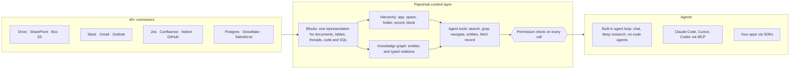

<div align="center">

<a href="https://www.pipeshub.com"></a>

<h3>The open-source context layer for AI agents</h3>

<p>
  <a href="https://www.pipeshub.com/">Website</a> ·
  <a href="https://docs.pipeshub.com/">Docs</a> ·
  <a href="https://discord.com/invite/K5RskzJBm2">Discord</a> ·
  <a href="https://plum-myrtle-9f7.notion.site/Pipeshub-s-Product-Roadmap-33841c164f54803a9989fd0fdbfdb1ee">Roadmap</a>
</p>

<a href="https://trendshift.io/repositories/14618"></a>

<p>
  <a href="https://opensource.org/licenses/Apache-2.0"></a>
  <a href="https://github.com/pipeshub-ai/pipeshub-ai/releases"></a>
  <a href="https://hub.docker.com/r/pipeshubai/pipeshub-ai"></a>
  <a href="https://discord.com/invite/K5RskzJBm2"></a>
  
  
  <a href="https://github.com/pipeshub-ai/pipeshub-ai/issues">
    
  </a>
  <a href="https://github.com/pipeshub-ai/pipeshub-ai/pulls">
    
  </a>
  <br/>
  <a href="https://x.com/PipesHub"></a>
  <a href="https://www.linkedin.com/company/pipeshub"></a>
  <br/>
  
  <br/>
  <a href="https://www.npmjs.com/package/@pipeshub-ai/sdk"></a>
  <a href="https://pypi.org/project/pipeshub-sdk/"></a>
  <a href="https://github.com/pipeshub-ai/pipeshub-sdk-go"></a>
  <a href="https://www.npmjs.com/package/@pipeshub-ai/mcp"></a>
</p>

**Translations:** [Français](docs/i18n/fr/README.md) · [Deutsch](docs/i18n/de/README.md) · [简体中文](docs/i18n/zh-CN/README.md) · [日本語](docs/i18n/ja/README.md) · [Русский](docs/i18n/ru/README.md) · [עברית](docs/i18n/he/README.md) · [한국어](docs/i18n/ko/README.md) · [Español](docs/i18n/es/README.md) · [Português](docs/i18n/pt/README.md) · [Türkçe](docs/i18n/tr/README.md) · [Tiếng Việt](docs/i18n/vi/README.md) · [Italiano](docs/i18n/it/README.md)

</div>

<h2 id="about-pipeshub">Give your agents a workspace, not a pile of chunks</h2>

<strong>[PipesHub](https://www.pipeshub.com/)</strong> turns everything your company knows into a permission-aware workspace that AI agents explore the way coding agents explore a repository. Agents search it, `grep` it, walk its folders and knowledge graph, read only what they need, and cite the exact block each answer came from.

Connect Slack, Google Drive, GitHub, Microsoft 365, Jira, Notion, Postgres and 25+ other systems. Use the built-in chat, deep research and agents, or give the same context to Claude Code, Cursor, Codex and your own agents over MCP and the SDKs. Self-hosted, Apache 2.0, bring your own model.

> [!TIP]
> Deploy with a single command:
> ```bash
> curl -fsSL https://get.pipeshub.com/install | bash
> ```

## Why a context layer?

Agents usually fail on company knowledge because of their context, not their model. Top-k chunk retrieval hands the agent a handful of fragments and drops where each one lives, what it links to, who may see it, and where it came from.

Coding agents got good once they could `ls`, `grep` and read a repository instead of being handed pasted snippets. PipesHub gives agents the same over your company's data.

| | Top-k chunk RAG | PipesHub |
| --- | --- | --- |
| **What the agent sees first** | A few text chunks | Each record's name, location, metadata and summary, plus the blocks that matched |
| **How it digs further** | It can't: one retrieval per question | Hybrid search, `grep`/`find` over records, folder navigation and knowledge-graph lookups, in a loop |
| **Structure** | Lost at chunking | Every source becomes Blocks: sections, tables with rows and cells, threads, code, SQL tables with their schema |
| **Permissions** | Often approximated at index time | Checked against the source system's permissions for the requesting user, on every tool call |
| **Citations** | Per chunk, if any | Per block: the page, table cell, row, slide or line, with invented citations removed |

## How it works



Every source becomes **Blocks**, one representation that keeps tables, threads and code intact and remembers the exact page, cell or line each block came from. Two maps sit over the Blocks: the **hierarchy** of the source system and a **knowledge graph** of entities. Agents explore both with **tools that disclose in stages**: search results lead with each record's metadata and summary, and the agent greps, navigates, follows entities or reads a full record only when it needs to. **Every tool call is checked against the source system's permissions** for the person the agent acts for.

**[Read how the context layer works →](docs/context-layer.md)** It covers the Block format, the hierarchy and graph, every agent tool and the code it lives in, permission enforcement, the agent loop, and current limitations.

## What you can build with PipesHub

One context layer, many products on top of it. Use the built-in apps as they are, or build your own over MCP and the SDKs.

| Build | What PipesHub gives you | Start here |
| --- | --- | --- |
| **Agentic RAG pipelines** | Retrieval tools an agent calls in a loop (hybrid search, `grep`, navigation, entity lookups, full-record reads), with permission checks and block-level citations already done | [SDK starter](https://github.com/pipeshub-ai/examples/tree/main/sdk-starter) · [MCP](#use-it-from-claude-code-cursor-or-codex) |
| **Enterprise search** | One search box across 40+ connectors that shows each person only what they may see, with cited answers | Built in · [example](https://github.com/pipeshub-ai/examples/tree/main/private-enterprise-search) |
| **Workplace AI assistant** | Chat and deep research over company knowledge, plus web search and voice input | Built in |
| **Context for coding agents** | Claude Code, Cursor and Codex answer from design docs, tickets, incidents and chat threads, not only the code | [example](https://github.com/pipeshub-ai/examples/tree/main/company-knowledge-mcp) |
| **No-code agents and automations** | An agent builder with actions in Slack, Gmail, Jira, Confluence, GitHub, Linear, Notion, Salesforce, Zendesk, Freshdesk and 20 more tools | Built in |
| **Customer support copilots** | Answers drawn from past tickets, runbooks and docs (ServiceNow, Zammad, Jira, Confluence), with actions back in the ticketing tool | Built in · SDKs |
| **Sales and account intelligence** | Salesforce accounts, contacts and deals in the knowledge graph, searchable alongside the emails, documents and chats about the same customers | Built in |
| **Questions over your databases** | Postgres, MariaDB and Snowflake tables indexed with their schemas and foreign keys, plus sandboxes that run SQL and Python for analysis | Built in |
| **Reports, charts and dashboards** | Agents write and run code in a sandbox and return the result as a shareable artifact | Built in |
| **Engineering knowledge search** | Code, pull requests and commits from GitHub and GitLab, linked to the tickets and docs around them | Built in |
| **Your own apps on company knowledge** | Python, TypeScript and Go SDKs, "Sign in with PipesHub" so each user searches as themselves, and an upload API for documents no connector covers | [examples](https://github.com/pipeshub-ai/examples) |
| **Private, on-prem AI** | Everything above, self-hosted, on any LLM provider or local models via Ollama, with data kept in your infrastructure | [Deploy](#-deployment-guide) |

## Use it from Claude Code, Cursor or Codex

**[Give your coding assistant secure access to your company's knowledge →](https://github.com/pipeshub-ai/examples/tree/main/company-knowledge-mcp)**

About ten minutes once PipesHub is running with data indexed. Mint a Personal Access Token (no admin needed), connect your assistant (one command for Claude Code, one config file for Cursor or Codex), and ask *"why was the retry logic in the billing worker changed?"* It answers from the incident postmortem, the pull request, the chat thread and the design doc, each cited, and only if you're allowed to see them.

Over MCP, assistants get PipesHub's search, chat and record tools today. The rest of the agent tool set (`grep`, `navigate`, entity lookups) is coming to MCP next.

Want the same retrieval inside your own code, or behind a search box for your team? The [SDK starter and search example](https://github.com/pipeshub-ai/examples) cover both. Built something? [Show us](https://github.com/pipeshub-ai/examples/issues/new?template=showcase.yml).

## PipesHub in Action

### Citations


### Connectors


<details>
<summary><b>More demos: all records, knowledge search</b></summary>

### All Records


### Knowledge Search


</details>

## Features

**Context for agents**

- 🗂️ **Explorable, not just searchable:** Hybrid search, `grep` over records, folder navigation and knowledge-graph lookups, all as agent tools.
- 🔒 **Permission-aware at every step:** Every tool call is checked against the source system's permissions for the person the agent acts for.
- 📝 **Block-level citations:** Answers cite the page, table cell, row, slide or line they came from.
- 🧱 **Structured, semi-structured and unstructured in one layer:** Documents, spreadsheets, tickets, chat threads, code and SQL tables all become Blocks.

**Connected to your systems**

- 🔌 **40+ connectors:** Google Workspace, Microsoft 365, Slack, Jira, Confluence, Notion, GitHub, GitLab, Salesforce, ServiceNow, Postgres, Snowflake and more, with real-time and scheduled sync.
- 🕸️ **Knowledge graph:** Entities and relations extracted at indexing time and used at answer time.
- 🎙️ **Multimodal:** Images, diagrams and scanned files, plus voice input.
- 🧠 **Bring your own model, fully self-hosted:** Any LLM provider or a local model, deployed in your own infrastructure.

## PipesHub Cloud

Prefer a fully managed PipesHub without running your own infrastructure? PipesHub Cloud is coming soon.

👉 **[Join the Cloud Waitlist](https://pipeshub.com/cloud-waitlist)** to get early access.

## Connectors

<p align="center">
<a href="https://pipeshub.com/connectors"></a>
</p>

## 🚀 Deployment Guide

PipesHub can be run locally or deployed on any server using Docker Compose. The interactive installer handles all configuration — including secrets, graph DB, broker, and image tag selection — and generates a `.env` for you.

> **HTTPS on cloud servers:** If you deploy PipesHub on a cloud server, use an HTTPS endpoint. Browsers block certain requests over plain HTTP. Use Cloudflare, Nginx, or Traefik to terminate TLS. A white screen after HTTP-only deployment is typically caused by this restriction.

---

### ⚡ Quickstart (Recommended)

Requires [Docker](https://docs.docker.com/get-docker/) with Compose v2. One command:

```bash
curl -fsSL https://get.pipeshub.com/install | bash
```

This downloads the deployment files for the latest release into `./pipeshub` and
launches the interactive installer. Open **http://localhost:3000** once it
finishes.

> **Prefer to read before running?** Download and inspect the script first:
>
> ```bash
> curl -fsSL https://get.pipeshub.com/install -o pipeshub-install.sh
> less pipeshub-install.sh        # review it
> bash pipeshub-install.sh
> ```

The installer will:
- Check Docker, RAM, and disk prerequisites
- Ask whether you want a **slim** or **full** deployment
- Let you optionally customise the graph DB, message broker, and KV store
- Generate randomised secrets and write a `.env` file
- Pull images and start the stack
- Wait for PipesHub to become healthy, verify it is reachable, and print the URL

### 🛠️ From a cloned repository (developers)

To build from source, contribute, or pin the installer to your checkout:

```bash
git clone https://github.com/pipeshub-ai/pipeshub-ai.git
cd pipeshub-ai

# Same installer, run from the repo root
./install.sh
```

Building local images from source requires this cloned-repo path (`./install.sh --build`);
the one-command installer above always uses prebuilt images.

> **Advanced options:** installer flags (`--yes`, `--version`, `--reconfigure`, `--print-env-only`), CI environment variables, slim vs. full deployment types, manual Compose profile usage, and local source builds are covered in [Advanced Deployment Options](deployment/docker-compose/ADVANCED_DEPLOYMENT.md).

## Build on PipesHub: MCP and SDKs

The built-in search experience is one way to use PipesHub. The same connected,
permission-filtered context is available to your own agents and applications —
over MCP for any compatible client, or through the SDKs when you are calling it
from your own code.

An agent connects as a specific person rather than as the application, so it
retrieves exactly what that person is allowed to see. Access is resolved when
the query runs, against the source system's own permissions, instead of being
approximated at build time.

Step-by-step tutorials for the most common builds — an MCP for your coding
assistant, private enterprise search, and SDK starters — live in
[**pipeshub-ai/examples**](https://github.com/pipeshub-ai/examples). The
reference material for each building block is below.

### MCP Server

Use PipesHub with any MCP-compatible client to bring your enterprise context into AI workflows. Check the README for setup and usage.

**Repository:** [pipeshub-ai/mcp-server](https://github.com/pipeshub-ai/mcp-server/)

Using [Omnigent](https://omnigent.ai)? See [`integrations/omnigent/`](integrations/omnigent/) for three ways to connect, from a web-UI attach to a scripted connect kit.

### SDKs

PipesHub provides developer SDKs for Python, TypeScript, and Go to help you integrate quickly. Check the respective SDK repository README for setup and usage details.

| Name | Description | Link |
|------|-------------|------|
| **Python SDK** | Python SDK for PipesHub | [pipeshub-ai/pipeshub-sdk-python](https://github.com/pipeshub-ai/pipeshub-sdk-python) |
| **TypeScript SDK** | TypeScript SDK for PipesHub | [pipeshub-ai/pipeshub-sdk-typescript](https://github.com/pipeshub-ai/pipeshub-sdk-typescript) |
| **Go SDK** | Go SDK for PipesHub | [pipeshub-ai/pipeshub-sdk-go](https://github.com/pipeshub-ai/pipeshub-sdk-go) |

> Need an SDK in another language? Reach out to us at developer@pipeshub.com

## RoadMap

<p>We ship in the open. Here's what's done and what's next:</p>

<ul>
<li>✅ 🤖 <strong>Workplace AI agents</strong>: first-class no-code agent builder</li>
<li>✅ 🔗 <strong>MCP (Model Context Protocol)</strong> support, both server and client</li>
<li>✅ 🧰 <strong>Developers SDKs</strong></li>
<li>✅ 🔍 <strong>Code search</strong> across GitHub and GitLab</li>
<li>⬜ 👤 <strong>Personalized search</strong> based on team, role, and history</li>
<li>✅ ☸️ <strong>Production Kubernetes</strong> deployment with HA defaults</li>
<li>⬜ 📈 <strong>PageRank-augmented relevance</strong> across the knowledge graph</li>
</ul>
<p>👉 <strong><a href="https://plum-myrtle-9f7.notion.site/Pipeshub-s-Product-Roadmap-33841c164f54803a9989fd0fdbfdb1ee">View the full product roadmap on Notion</a></strong></p>

<hr>

## 👥 Contributing

Want to join our community of developers? Please check out our [Contributing Guide](https://github.com/pipeshub-ai/pipeshub-ai/blob/main/CONTRIBUTING.md) for more details on how to set up the development environment, our coding standards, and the contribution workflow.
<h3>Where to go for what</h3>

<table>

<tr><td>Ask a question or get help</td><td><a href="https://discord.com/invite/K5RskzJBm2">Discord</a></td></tr>
<tr><td>Report a bug or request a feature</td><td><a href="https://github.com/pipeshub-ai/pipeshub-ai/issues">GitHub Issues</a></td></tr>
<tr><td>Report a security issue</td><td><a href="https://github.com/pipeshub-ai/pipeshub-ai/blob/main/SECURITY.md">Report Security Issue</a></td></tr>
<tr><td>Read the docs</td><td><a href="https://docs.pipeshub.com/">Pipeshub Docs</a></td></tr>
<tr><td>See what changed in each release</td><td><a href="https://github.com/pipeshub-ai/pipeshub-ai/blob/main/CHANGELOG.md">Changelog</a></td></tr>
</table>

## FAQ

### What is PipesHub?

PipesHub is the open-source context layer for AI agents. It turns the knowledge stored across your company's business systems into a permission-aware workspace that agents can search, `grep`, navigate and cite.

It connects systems such as Slack, Google Drive, GitHub, Microsoft 365 and Notion, then makes what they hold available in two ways: permission-aware search with citations for your team, and trusted context for your AI agents through APIs, SDKs and MCP. Agents get the same governed view of your company's knowledge that a person would, with the same access controls applied, so they can answer from real company data instead of guessing across tools. You can use the built-in search experience, or build your own agents, workflows and applications on top of it.

### How is PipesHub different from other workplace AI tools?

Most tools hand an AI model a few retrieved text chunks. PipesHub gives agents tools to explore your company's knowledge the way a coding agent explores a repository: hybrid search, `grep` over records, folder navigation and knowledge-graph lookups, each checked against the requesting user's permissions in the source system. Every source becomes Blocks, so answers cite the exact page, table cell, row or slide. It is fully open source (Apache 2.0) and self-hostable, so your data never leaves your infrastructure. See [Why a context layer?](#why-a-context-layer)

### What connectors does PipesHub support?

PipesHub has 40+ connectors across 30+ systems, with real-time and scheduled indexing. See the [connectors overview](https://docs.pipeshub.com/connectors/overview).

### What LLM providers does PipesHub support?

PipesHub is "Bring Your Own Model" — you can use any LLM provider. Deploy in your VPC with your preferred models.

**More questions:** file formats, tech stack, the knowledge graph, multimodal support and troubleshooting are answered in the [full FAQ](docs/FAQ.md).

<hr>
<div align="center">
<h3>⭐ Star us on GitHub!</h3>

<p>It helps the project reach the teams who need it.</p>

<p>
<a href="https://github.com/pipeshub-ai/pipeshub-ai">

</a>
</p>

<p>
<a href="https://www.star-history.com/?repos=pipeshub-ai%2Fpipeshub-ai">
 <picture>
   <source media="(prefers-color-scheme: dark)" srcset="https://api.star-history.com/chart?repos=pipeshub-ai/pipeshub-ai&amp;type=date&amp;theme=dark&amp;legend=top-left&amp;sealed_token=msbcJ843ZmXCld8-zgduwH9hV6yn69hyfrnwfkcWiRqe7htnO6pSbQJrkxdoarzriLW6aGAETT-iQ3m7yWN3BacAyPyHfNIiPGabl6r6CbXFjcvJ7n1NZw" />
   <source media="(prefers-color-scheme: light)" srcset="https://api.star-history.com/chart?repos=pipeshub-ai/pipeshub-ai&amp;type=date&amp;legend=top-left&amp;sealed_token=msbcJ843ZmXCld8-zgduwH9hV6yn69hyfrnwfkcWiRqe7htnO6pSbQJrkxdoarzriLW6aGAETT-iQ3m7yWN3BacAyPyHfNIiPGabl6r6CbXFjcvJ7n1NZw" />
   
 </picture>
</a>
</p>

<p><sub>Built with ❤️ by the <a href="https://www.pipeshub.com/">PipesHub team</a> and contributors around the world.</sub></p>

</div>

