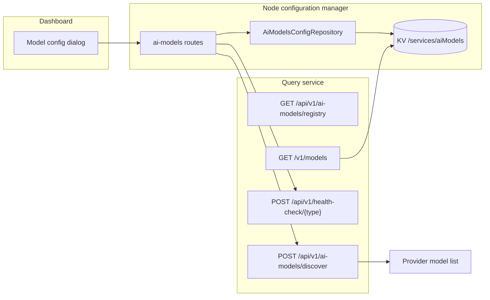
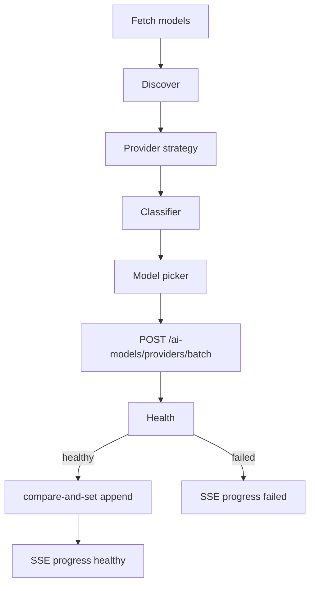
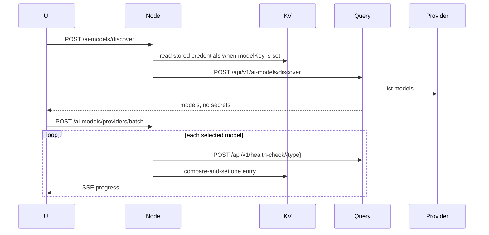

# AI models

How an organization configures chat, embedding, image, speech-to-text, and text-to-speech models, and how those models are discovered and listed.

## High level

The dashboard never stores provider credentials. Node keeps one encrypted document. Each saved model is its own entry. Models added together share a `connectionId` and a copy of the credentials, so rotating the key updates every model in that connection in one compare-and-set write.

## Low level

Discovery strategies call the provider's list endpoint (OpenAI-compatible servers use `GET {base}/v1/models`). The classifier keeps provider metadata, then the catalog, then id rules. Unknown models stay `other` and the picker hides them until "Show other types" is on.

Providers without a list endpoint (`discovery.mode: manual`) skip the Fetch button. The admin types a model in the form; typing a second id in "Custom model id" moves both into the selected list.

Once at least one model is selected, each row owns its friendly name, context length, Reasoning, and Multimodal. The form hides those fields so there is one place to set them. A row starts from what the provider reported, and falls back to the form values when the provider said nothing. With one model and no selected list, the form saves through the single-model path as before.

A batch save health-checks up to three models at a time. Healthy models are written one compare-and-set at a time. A failed model is not saved and stays selected. Saved models leave the list. Retry sends only the failed model with the `connectionId` from the first run, so it joins the same connection. The server rejects a `connectionId` that does not belong to a saved entry of the same provider. A shared `configuration.modelFriendlyName` is dropped; friendly names are per model. If the type had no models, the first one saved becomes default even when the chosen default failed. One configured event is published after the batch if anything was saved.

Legacy comma-separated `configuration.model` values stay readable. New saves write one model name per entry.

## Data flow

`GET /v1/models` and `GET /api/v1/models` on the query service, and the same paths on the Node app, list configured models in the OpenAI model-list shape. The payload has ids and a `task`. It does not include API keys or endpoints.

## Where to change it

| Concern | Location |
| --- | --- |
| Provider form fields | `backend/python/app/config/ai_models/providers/` |
| List-model strategies | `backend/python/app/services/ai_models/discovery/` |
| Runtime model construction | `backend/python/app/utils/aimodels.py` |
| Stored document and batch save | `backend/nodejs/apps/src/modules/configuration_manager/` |
| Picker and onboarding | `frontend/app/(main)/workspace/ai-models/` |
