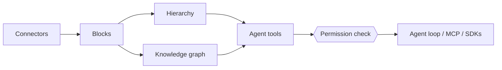

# How PipesHub's context layer works

PipesHub gives an AI agent your company's knowledge as a workspace it can explore, not as a handful of retrieved chunks. This page describes the five parts of that workspace and where each lives in the code. Paths are relative to `backend/python/app/`.

## 1. Blocks: one representation for every kind of data

Indexing parses every file, page, message, ticket, spreadsheet and database table into a `BlocksContainer`: a list of `Block`s grouped into `BlockGroup`s (`models/blocks.py`).

- **Block types in use:** text, image, table row, record summary, code.
- **Group types:** tables and sheets, lists, sections, conversations, commits and patches, forms, key-value areas, SQL tables and views, code classes.
- **Tables keep their shape.** Table, row and cell metadata stay attached, and SQL tables carry their DDL. Foreign keys become graph edges, so an agent can follow one table to a related one.
- **Every block knows where it came from.** `CitationMetadata` records the page and bounding box, sheet cell, table row and column, slide, or line. That is what lets an answer cite the exact cell or slide instead of a whole document.
- **Every record gets semantic metadata.** `SemanticMetadata` holds a summary, topics, categories, departments, languages, keywords and the entities the record mentions.

Structured (SQL, CRM), semi-structured (spreadsheets, tickets, chat) and unstructured (documents, pages) sources all end up in this one shape. Agents reason over one format instead of one per source.

## 2. How the Blocks are organized: folders and a knowledge graph

**Hierarchy.** Records keep the structure of the system they came from: app → space or drive → folder → record → block. Parent/child and other typed relations (`PARENT_CHILD`, `LINKED_TO`, `BLOCKS`, `DEPENDS_ON`, `FOREIGN_KEY`, …) are graph edges.

**Knowledge graph.** At indexing time PipesHub extracts entities (people, projects, customers, products) and links them to the records that mention them. The resolver (`modules/entity_resolution/resolver.py`, design in [entity-resolution.md](./entity-resolution.md)) merges duplicates in three tiers:

1. exact match on the normalized name;
2. hybrid dense + BM25 lookup of the nearest existing entity;
3. one LLM decision per record on whether to merge.

The graph is stored behind `IGraphDBProvider`, so it runs on Neo4j (default) or ArangoDB.

## 3. Agent tools that reveal detail step by step

Instead of filling the agent's context with everything up front, PipesHub gives it tools and shows more detail only when the agent asks.

| Tool | What it does | Code |
| --- | --- | --- |
| `search` | Hybrid dense + BM25 search fused with reciprocal rank fusion (Qdrant or OpenSearch), with LLM-written `grep` patterns run alongside. Hits come back with graph context: parent and related records. | `agents/actions/knowledge_graph/`, `utils/pattern_match.py`, `utils/chat_helpers.py` |
| `run_command`, `find_records` | Runs `grep`, `rg`, `find`, `ls`, `head`, `tail`, `wc`, `sort`, `uniq` and similar over records stored as files that mirror the source layout (`records/<connector>/<space>/<folder>/…`). There is no shell, dangerous flags are blocked, and `find_records` turns matching paths into record IDs. | `agents/actions/storage_search/storage_search.py` |
| `navigate`, `list_files` | Walks app → space → folder → record up to three levels at once, with breadcrumbs, paging and date filters. Accepts a URL or issue key as the starting node. | `agents/actions/knowledge_graph/` |
| `lookup_record` | Turns a URL, Jira key or external ID into a PipesHub record. | `agents/actions/knowledge_graph/` |
| `search_entities`, `find_records_by_entity` | Finds a person, project or customer, then every record that mentions them. | `agents/actions/knowledge_graph/` |
| `fetch_full_record` | Reads a whole record in pages (`start_block`, `max_blocks`). | `agents/actions/knowledge_graph/ops/fetch.py` |

The order works like this:

1. **Search results lead with metadata.** Each hit shows the record's ID, name, source, type, dates, location breadcrumb, link, summary and topics, then the matching blocks in document order.
2. **The full-record tool appears only once it is useful.** A post-tool hook (`agents/agent_loop/hooks/citations.py`) registers `fetch_full_record` once the agent holds record IDs.
3. **Entity tools follow the same pattern.** `find_records_by_entity` is granted after `search_entities` has run (`agents/agent_loop/hooks/progressive_tools.py`).

## 4. Permissions on every call

Permissions are edges in the graph, synced from each source system: user, group, role, organization and "anyone" shares, plus inheritance from parent containers. Every tool checks them for the person the agent is acting for:

- **`grep` / `find`:** output lines that point at records the user cannot read are dropped, and a command that targets such a record directly is denied (`_filter_output_by_permission`).
- **`fetch_full_record` and `navigate`:** check access to the record or node before returning anything.
- **Entity tools and `lookup_record`:** return the same "nothing found" response whether a record does not exist or the user may not see it, so hidden data is not revealed.
- **Graph enrichment on search hits:** filtered to records the user can read.

An agent connected with a personal access token or user OAuth sees exactly what that person would see. Access is resolved at query time against the source's permissions, not approximated at index time.

## 5. The agent loop

PipesHub runs its own agent loop (`agent_loop_lib/`, wired in `agents/agent_loop/`). Its router picks one of three shapes per request:

- **ReAct**, for most questions.
- **Plan–critique–execute**, with a `verify_result` check before answering.
- **An orchestrator** that spawns sub-agents (internal exploration, web, coding) and merges their findings.

Answers cite blocks as `[source](refN)`. Each reference maps to a real block, and references the model invented are removed before the answer is returned (`utils/citations.py`).

## Using the context layer from outside PipesHub

- **MCP:** the Node API serves `/mcp` (Streamable HTTP) with OAuth, personal access tokens or service tokens. Tools: `pipeshub_search`, `pipeshub_chat`, `pipeshub_get_record_content`, `pipeshub_download_record`, `pipeshub_directory`, `pipeshub_sources`, `pipeshub_agents`. Setup for Claude Code, Cursor and Codex: [examples/company-knowledge-mcp](https://github.com/pipeshub-ai/examples/tree/main/company-knowledge-mcp).
- **SDKs:** [Python](https://github.com/pipeshub-ai/pipeshub-sdk-python), [TypeScript](https://github.com/pipeshub-ai/pipeshub-sdk-typescript), [Go](https://github.com/pipeshub-ai/pipeshub-sdk-go).

## Current limitations

- `grep` and `find` over records work when blob storage is local. On S3 or Azure Blob, search still runs, but the pattern-match tools are skipped.
- MCP exposes search, chat and record tools. `grep`, `navigate` and the entity tools are available to PipesHub's own agents and are coming to MCP next.
- A `wc -l` style count can include records the user cannot open. The lines themselves are filtered.
