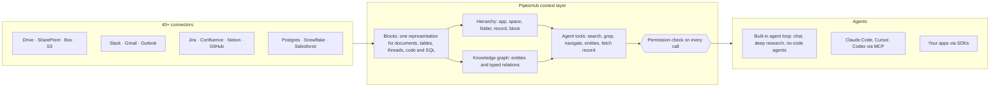

<div align="center">

**Translations:** [English](../../../README.md) · [Français](../fr/README.md) · **Deutsch** · [简体中文](../zh-CN/README.md) · [日本語](../ja/README.md) · [Русский](../ru/README.md) · [עברית](../he/README.md) · [한국어](../ko/README.md) · [Español](../es/README.md) · [Português](../pt/README.md) · [Türkçe](../tr/README.md) · [Tiếng Việt](../vi/README.md) · [Italiano](../it/README.md)

</div>

<div align="center">

<a href="https://www.pipeshub.com"></a>

<h3>Die Open-Source-Kontextschicht für KI-Agenten</h3>

<p>
  <a href="https://www.pipeshub.com/">Website</a> ·
  <a href="https://docs.pipeshub.com/">Doku</a> ·
  <a href="https://discord.com/invite/K5RskzJBm2">Discord</a> ·
  <a href="https://plum-myrtle-9f7.notion.site/Pipeshub-s-Product-Roadmap-33841c164f54803a9989fd0fdbfdb1ee">Roadmap</a>
</p>

<a href="https://trendshift.io/repositories/14618"></a>

<p>
  <a href="https://opensource.org/licenses/Apache-2.0"></a>
  <a href="https://github.com/pipeshub-ai/pipeshub-ai/releases"></a>
  <a href="https://hub.docker.com/r/pipeshubai/pipeshub-ai"></a>
  <a href="https://discord.com/invite/K5RskzJBm2"></a>
  
  
  <a href="https://github.com/pipeshub-ai/pipeshub-ai/issues">
    
  </a>
  <a href="https://github.com/pipeshub-ai/pipeshub-ai/pulls">
    
  </a>
  <br/>
  <a href="https://x.com/PipesHub"></a>
  <a href="https://www.linkedin.com/company/pipeshub"></a>
  <br/>
  
  <br/>
  <a href="https://www.npmjs.com/package/@pipeshub-ai/sdk"></a>
  <a href="https://pypi.org/project/pipeshub-sdk/"></a>
  <a href="https://github.com/pipeshub-ai/pipeshub-sdk-go"></a>
  <a href="https://www.npmjs.com/package/@pipeshub-ai/mcp"></a>
</p>

</div>

<h2 id="about-pipeshub">Geben Sie Ihren KI-Agenten ein echtes Verständnis Ihres Unternehmens</h2>

<strong>[PipesHub](https://www.pipeshub.com/)</strong> macht alles, was Ihr Unternehmen weiß, zu einem berechtigungsbewussten Arbeitsbereich. KI-Agenten erkunden ihn so, wie Coding-Agenten ein Repository erkunden. Sie durchsuchen ihn, wenden `grep` darauf an, gehen seine Ordner und seinen Knowledge Graph durch, lesen nur das Nötige und zitieren genau den Block, aus dem jede Antwort stammt.

Verbinden Sie Slack, Google Drive, GitHub, Microsoft 365, Jira, Notion, Postgres und über 25 weitere Systeme. Nutzen Sie den integrierten Chat, Deep Research und Agenten, oder geben Sie denselben Kontext über MCP und die SDKs an Claude Code, Cursor, Codex und Ihre eigenen Agenten weiter. Selbst gehostet, Apache 2.0, mit Ihrem eigenen Modell.

> [!TIP]
> Mit einem einzigen Befehl bereitstellen:
> ```bash
> curl -fsSL https://get.pipeshub.com/install | bash
> ```

## Warum eine Kontextschicht?

Bei Unternehmenswissen scheitern Agenten meist an ihrem Kontext, nicht an ihrem Modell. Top-k-Chunk-Retrieval gibt dem Agenten eine Handvoll Fragmente. Dabei geht verloren, wo jedes davon liegt, worauf es verweist, wer es sehen darf und woher es stammt.

Coding-Agenten wurden gut, sobald sie `ls` und `grep` ausführen und ein Repository lesen konnten, statt eingefügte Snippets zu bekommen. PipesHub bietet Agenten dasselbe für die Daten Ihres Unternehmens.

| | Top-k-Chunk-RAG | PipesHub |
| --- | --- | --- |
| **Was der Agent zuerst sieht** | Ein paar Text-Chunks | Name, Ort, Metadaten und Zusammenfassung jedes Datensatzes, dazu die passenden Blöcke |
| **Wie er tiefer gräbt** | Gar nicht: ein Retrieval pro Frage | Hybride Suche, `grep`/`find` über Datensätze, Ordnernavigation und Knowledge-Graph-Abfragen, in einer Schleife |
| **Struktur** | Geht beim Chunking verloren | Jede Quelle wird zu Blocks: Abschnitte, Tabellen mit Zeilen und Zellen, Threads, Code, SQL-Tabellen samt Schema |
| **Berechtigungen** | Oft beim Indexieren nur angenähert | Bei jedem Tool-Aufruf gegen die Berechtigungen des Quellsystems für den anfragenden Nutzer geprüft |
| **Zitate** | Pro Chunk, falls überhaupt | Pro Block: Seite, Tabellenzelle, Zeile, Folie oder Codezeile; erfundene Zitate werden entfernt |

## So funktioniert es



Jede Quelle wird zu **Blocks** (Blöcken), einer einheitlichen Darstellung, die Tabellen, Threads und Code intakt hält und sich die genaue Seite, Zelle oder Zeile merkt, aus der jeder Block stammt. Die Blocks sind auf zwei Arten geordnet: nach der **Ordnerstruktur** jedes Quellsystems und in einem **Knowledge Graph** aus Personen, Projekten und Kunden. Agenten erkunden beides mit **Tools, die Details Schritt für Schritt zeigen**: Eine Suche zeigt zuerst Name, Zusammenfassung und passende Stellen jedes Datensatzes, und der Agent geht nur tiefer (grep, Ordner durchsuchen, Entitäten folgen, den ganzen Datensatz lesen), wenn er es braucht. **Jeder Tool-Aufruf wird gegen die Berechtigungen des Quellsystems geprüft**, und zwar für die Person, in deren Namen der Agent handelt.

**[Lesen Sie, wie die Kontextschicht funktioniert →](../../context-layer.md)** Dort finden Sie das Block-Format, die Hierarchie und den Graphen, jedes Agent-Tool und den Code dazu, die Durchsetzung von Berechtigungen, die Agent-Schleife und aktuelle Einschränkungen.

## Was Sie mit PipesHub bauen können

Eine Kontextschicht, viele Produkte darauf. Nutzen Sie die integrierten Apps so, wie sie sind, oder bauen Sie eigene über MCP und die SDKs.

| Anwendungsfall | Was PipesHub Ihnen liefert | Hier starten |
| --- | --- | --- |
| **Agentische RAG-Pipelines** | Retrieval-Tools, die ein Agent in einer Schleife aufruft (hybride Suche, `grep`, Navigation, Entitätsabfragen, Lesen ganzer Datensätze), mit bereits erledigten Berechtigungsprüfungen und Zitaten auf Block-Ebene | [SDK-Starter](https://github.com/pipeshub-ai/examples/tree/main/sdk-starter) · [MCP](#nutzung-aus-claude-code-cursor-oder-codex) |
| **Unternehmenssuche** | Ein Suchfeld über mehr als 40 Konnektoren, das jeder Person nur zeigt, was sie sehen darf, mit zitierten Antworten | Integriert · [Beispiel](https://github.com/pipeshub-ai/examples/tree/main/private-enterprise-search) |
| **KI-Assistent für den Arbeitsplatz** | Chat und Deep Research über das Unternehmenswissen, dazu Websuche und Spracheingabe | Integriert |
| **Kontext für Coding-Agenten** | Claude Code, Cursor und Codex antworten auf Basis von Design-Dokumenten, Tickets, Incidents und Chat-Threads, nicht nur des Codes | [Beispiel](https://github.com/pipeshub-ai/examples/tree/main/company-knowledge-mcp) |
| **No-Code-Agenten und Workflow-Builder** | Ein visueller Drag-and-Drop-Builder, der Unternehmenswissen mit Aktionen in Slack, Gmail, Jira, Confluence, GitHub, Linear, Notion, Salesforce, Zendesk, Freshdesk und 20 weiteren Tools verbindet. Oder bauen Sie Ihr eigenes Workflow-Produkt auf derselben API, sodass jeder Schritt berechtigungsbewussten Kontext erhält. | Integriert · [Headless bauen](#kann-ich-pipeshub-headless-nutzen-ohne-die-oberfläche) |
| **Copiloten für den Kundensupport** | Antworten aus früheren Tickets, Runbooks und Dokumentation (ServiceNow, Zammad, Jira, Confluence), mit Aktionen zurück im Ticketsystem | Integriert · SDKs |
| **Vertriebs- und Account-Intelligence** | Salesforce-Accounts, -Kontakte und -Deals im Knowledge Graph, durchsuchbar zusammen mit den E-Mails, Dokumenten und Chats zu denselben Kunden | Integriert |
| **Fragen an Ihre Datenbanken** | Postgres-, MariaDB- und Snowflake-Tabellen, indexiert mit ihren Schemas und Fremdschlüsseln, dazu Sandboxes, die SQL und Python für Analysen ausführen | Integriert |
| **Berichte, Diagramme und Dashboards** | Agenten schreiben und führen Code in einer Sandbox aus und liefern das Ergebnis als teilbares Artefakt | Integriert |
| **Suche im Engineering-Wissen** | Code, Pull Requests und Commits aus GitHub und GitLab, verknüpft mit den zugehörigen Tickets und Dokumenten | Integriert |
| **Eigene Apps auf Unternehmenswissen** | SDKs für Python, TypeScript und Go, „Sign in with PipesHub“, damit jeder Nutzer als er selbst sucht, und eine Upload-API für Dokumente, die kein Konnektor abdeckt | [Beispiele](https://github.com/pipeshub-ai/examples) |
| **Rechts- und Vertrags-Apps (CLM)** | Stellen Sie Fragen zu Verträgen in Drive, SharePoint, Box oder hochgeladenen Dateien. Antworten zitieren die genaue Klausel oder Seite, und jede Person sieht nur die Verträge, die sie sehen darf. | [Headless bauen](#kann-ich-pipeshub-headless-nutzen-ohne-die-oberfläche) |
| **Private KI, on-prem** | Alles oben Genannte, selbst gehostet, mit jedem LLM-Anbieter oder lokalen Modellen über Ollama, wobei die Daten in Ihrer Infrastruktur bleiben | [Bereitstellen](#-bereitstellungsanleitung) |

## Nutzung aus Claude Code, Cursor oder Codex

**[Geben Sie Ihrem Coding-Assistenten sicheren Zugriff auf das Wissen Ihres Unternehmens →](https://github.com/pipeshub-ai/examples/tree/main/company-knowledge-mcp)**

Rund zehn Minuten, sobald PipesHub läuft und Daten indexiert sind. Erstellen Sie ein Personal Access Token (keine Adminrechte nötig), verbinden Sie Ihren Assistenten (ein Befehl für Claude Code, eine Konfigurationsdatei für Cursor oder Codex) und fragen Sie *„Warum wurde die Retry-Logik im Billing-Worker geändert?“*. Die Antwort stützt sich auf das Incident-Postmortem, den Pull Request, den Chat-Thread und das Design-Dokument, jeweils mit Zitat, und nur, wenn Sie diese sehen dürfen.

Über MCP erhalten Assistenten schon heute die Such-, Chat- und Datensatz-Tools von PipesHub. Die übrigen Agent-Tools (`grep`, `navigate`, Entitätsabfragen) kommen als Nächstes zu MCP.

Sie möchten dasselbe Retrieval in Ihrem eigenen Code oder hinter einem Suchfeld für Ihr Team? Das [SDK-Starter- und Suchbeispiel](https://github.com/pipeshub-ai/examples) deckt beides ab. Etwas gebaut? [Zeigen Sie es uns](https://github.com/pipeshub-ai/examples/issues/new?template=showcase.yml).

## PipesHub in Aktion

### Zitate


### Konnektoren


<details>
<summary><b>Weitere Demos: alle Datensätze, Wissenssuche</b></summary>

### Alle Datensätze


### Wissenssuche


</details>

## Funktionen

**Kontext für Agenten**

- 🗂️ **Erkundbar, nicht nur durchsuchbar:** Hybride Suche, `grep` über Datensätze, Ordnernavigation und Knowledge-Graph-Abfragen, alles als Agent-Tools.
- 🔒 **Berechtigungsbewusst bei jedem Schritt:** Jeder Tool-Aufruf wird gegen die Berechtigungen des Quellsystems geprüft, für die Person, in deren Namen der Agent handelt.
- 📝 **Zitate auf Block-Ebene:** Antworten zitieren die Seite, Tabellenzelle, Zeile, Folie oder Codezeile, aus der sie stammen.
- 🧱 **Strukturiert, semistrukturiert und unstrukturiert in einer Schicht:** Dokumente, Tabellenkalkulationen, Tickets, Chat-Threads, Code und SQL-Tabellen werden alle zu Blocks.

**Mit Ihren Systemen verbunden**

- 🔌 **Über 40 Konnektoren:** Google Workspace, Microsoft 365, Slack, Jira, Confluence, Notion, GitHub, GitLab, Salesforce, ServiceNow, Postgres, Snowflake und mehr, mit Echtzeit- und geplanter Synchronisierung.
- 🕸️ **Knowledge Graph:** Entitäten und Beziehungen werden beim Indexieren extrahiert und beim Antworten genutzt.
- 🎙️ **Multimodal:** Bilder, Diagramme und gescannte Dateien, dazu Spracheingabe.
- 🧠 **Eigenes Modell, vollständig selbst gehostet:** Jeder LLM-Anbieter oder ein lokales Modell, bereitgestellt in Ihrer eigenen Infrastruktur.

## PipesHub Cloud

Sie möchten ein vollständig verwaltetes PipesHub, ohne eigene Infrastruktur zu betreiben? PipesHub Cloud kommt bald.

👉 **[Tragen Sie sich in die Cloud-Warteliste ein](https://pipeshub.com/cloud-waitlist)**, um frühen Zugang zu erhalten.

## Konnektoren

<p align="center">
<a href="https://pipeshub.com/connectors"></a>
</p>

## 🚀 Bereitstellungsanleitung

PipesHub lässt sich lokal ausführen oder mit Docker Compose auf jedem Server bereitstellen. Der interaktive Installer übernimmt die gesamte Konfiguration, einschließlich Secrets, Graph-DB, Broker und Auswahl des Image-Tags, und erzeugt eine `.env` für Sie.

> **HTTPS auf Cloud-Servern:** Wenn Sie PipesHub auf einem Cloud-Server bereitstellen, verwenden Sie einen HTTPS-Endpunkt. Browser blockieren bestimmte Anfragen über reines HTTP. Nutzen Sie Cloudflare, Nginx oder Traefik, um TLS zu terminieren. Ein weißer Bildschirm nach einer reinen HTTP-Bereitstellung hat meist diese Ursache.

---

### ⚡ Schnellstart (empfohlen)

Erfordert [Docker](https://docs.docker.com/get-docker/) mit Compose v2. Ein Befehl:

```bash
curl -fsSL https://get.pipeshub.com/install | bash
```

Damit werden die Bereitstellungsdateien des neuesten Releases nach `./pipeshub` heruntergeladen und
der interaktive Installer gestartet. Öffnen Sie **http://localhost:3000**, sobald er
fertig ist.

> **Lieber erst lesen, dann ausführen?** Laden Sie das Skript herunter und prüfen Sie es zuerst:
>
> ```bash
> curl -fsSL https://get.pipeshub.com/install -o pipeshub-install.sh
> less pipeshub-install.sh        # review it
> bash pipeshub-install.sh
> ```

Der Installer wird:
- Docker, RAM und Speicherplatz als Voraussetzungen prüfen
- Fragen, ob Sie eine **slim**- oder **full**-Bereitstellung möchten
- Ihnen optional erlauben, Graph-DB, Message Broker und KV-Store anzupassen
- Zufällige Secrets erzeugen und eine `.env`-Datei schreiben
- Images herunterladen und den Stack starten
- Warten, bis PipesHub bereit ist, seine Erreichbarkeit prüfen und die URL ausgeben

### 🛠️ Aus einem geklonten Repository (für Entwickler)

Um aus dem Quellcode zu bauen, beizutragen oder den Installer an Ihren Checkout zu binden:

```bash
git clone https://github.com/pipeshub-ai/pipeshub-ai.git
cd pipeshub-ai

# Same installer, run from the repo root
./install.sh
```

Lokale Images aus dem Quellcode lassen sich nur über das geklonte Repository bauen (`./install.sh --build`);
der Ein-Befehl-Installer oben verwendet immer vorgefertigte Images.

> **Erweiterte Optionen:** Installer-Flags (`--yes`, `--version`, `--reconfigure`, `--print-env-only`), CI-Umgebungsvariablen, die Bereitstellungstypen slim und full, die manuelle Nutzung von Compose-Profilen und lokale Builds aus dem Quellcode werden unter [Erweiterte Bereitstellungsoptionen](../../../deployment/docker-compose/ADVANCED_DEPLOYMENT.md) beschrieben.

## Auf PipesHub aufbauen: MCP und SDKs

Die integrierte Suche ist nur eine Art, PipesHub zu nutzen. Derselbe verbundene,
nach Berechtigungen gefilterte Kontext steht Ihren eigenen Agenten und Anwendungen zur Verfügung:
über MCP für jeden kompatiblen Client oder über die SDKs, wenn Sie ihn
aus Ihrem eigenen Code aufrufen.

Ein Agent verbindet sich als eine bestimmte Person, nicht als die Anwendung. So
ruft er genau das ab, was diese Person sehen darf. Der Zugriff wird bei der
Ausführung der Abfrage anhand der Berechtigungen des Quellsystems aufgelöst, statt
beim Build nur angenähert zu werden.

Schritt-für-Schritt-Tutorials für die häufigsten Anwendungsfälle – ein MCP für Ihren Coding-
Assistenten, private Unternehmenssuche und SDK-Starter – finden Sie in
[**pipeshub-ai/examples**](https://github.com/pipeshub-ai/examples). Das
Referenzmaterial zu jedem Baustein folgt unten.

### MCP-Server

Nutzen Sie PipesHub mit jedem MCP-kompatiblen Client, um Ihren Unternehmenskontext in KI-Workflows zu bringen. Einrichtung und Nutzung stehen in der README.

**Repository:** [pipeshub-ai/mcp-server](https://github.com/pipeshub-ai/mcp-server/)

Sie nutzen [Omnigent](https://omnigent.ai)? Unter [`integrations/omnigent/`](../../../integrations/omnigent/) finden Sie drei Wege zur Verbindung, vom Anhängen über die Web-UI bis zu einem skriptbasierten Connect-Kit.

### SDKs

PipesHub bietet Entwickler-SDKs für Python, TypeScript und Go, damit Sie schnell integrieren können. Einrichtung und Nutzung stehen in der README des jeweiligen SDK-Repositorys.

| Name | Beschreibung | Link |
|------|-------------|------|
| **Python SDK** | Python-SDK für PipesHub | [pipeshub-ai/pipeshub-sdk-python](https://github.com/pipeshub-ai/pipeshub-sdk-python) |
| **TypeScript SDK** | TypeScript-SDK für PipesHub | [pipeshub-ai/pipeshub-sdk-typescript](https://github.com/pipeshub-ai/pipeshub-sdk-typescript) |
| **Go SDK** | Go-SDK für PipesHub | [pipeshub-ai/pipeshub-sdk-go](https://github.com/pipeshub-ai/pipeshub-sdk-go) |

> Sie brauchen ein SDK in einer anderen Sprache? Schreiben Sie uns an developer@pipeshub.com

## Roadmap

<p>Wir entwickeln offen. Das ist fertig und das kommt als Nächstes:</p>

<ul>
<li>✅ 🤖 <strong>KI-Agenten für den Arbeitsplatz</strong>: ein vollwertiger No-Code-Agent-Builder</li>
<li>✅ 🔗 Unterstützung für <strong>MCP (Model Context Protocol)</strong>, als Server und als Client</li>
<li>✅ 🧰 <strong>SDKs für Entwickler</strong></li>
<li>✅ 🔍 <strong>Codesuche</strong> über GitHub und GitLab</li>
<li>⬜ 👤 <strong>Personalisierte Suche</strong> nach Team, Rolle und Verlauf</li>
<li>✅ ☸️ <strong>Produktive Kubernetes</strong>-Bereitstellung mit Hochverfügbarkeit als Standard</li>
<li>⬜ 📈 <strong>PageRank-gestützte Relevanz</strong> über den Knowledge Graph</li>
</ul>
<p>👉 <strong><a href="https://plum-myrtle-9f7.notion.site/Pipeshub-s-Product-Roadmap-33841c164f54803a9989fd0fdbfdb1ee">Die vollständige Produkt-Roadmap auf Notion ansehen</a></strong></p>

<hr>

## 👥 Mitwirken

Sie möchten Teil unserer Entwickler-Community werden? In unserem [Leitfaden für Beiträge](https://github.com/pipeshub-ai/pipeshub-ai/blob/main/CONTRIBUTING.md) erfahren Sie, wie Sie die Entwicklungsumgebung einrichten, welche Coding-Standards gelten und wie der Beitragsprozess abläuft.
<h3>Wohin mit welchem Anliegen</h3>

<table>

<tr><td>Eine Frage stellen oder Hilfe bekommen</td><td><a href="https://discord.com/invite/K5RskzJBm2">Discord</a></td></tr>
<tr><td>Einen Fehler melden oder eine Funktion anfragen</td><td><a href="https://github.com/pipeshub-ai/pipeshub-ai/issues">GitHub Issues</a></td></tr>
<tr><td>Ein Sicherheitsproblem melden</td><td><a href="https://github.com/pipeshub-ai/pipeshub-ai/blob/main/SECURITY.md">Sicherheitsproblem melden</a></td></tr>
<tr><td>Die Dokumentation lesen</td><td><a href="https://docs.pipeshub.com/">Pipeshub Docs</a></td></tr>
<tr><td>Sehen, was sich in jedem Release geändert hat</td><td><a href="https://github.com/pipeshub-ai/pipeshub-ai/blob/main/CHANGELOG.md">Changelog</a></td></tr>
</table>

## FAQ

### Was ist PipesHub?

PipesHub ist die Open-Source-Kontextschicht für KI-Agenten. Es macht das Wissen aus den Geschäftssystemen Ihres Unternehmens zu einem berechtigungsbewussten Arbeitsbereich, den Agenten durchsuchen, mit `grep` durchforsten, navigieren und zitieren können.

Es verbindet Systeme wie Slack, Google Drive, GitHub, Microsoft 365 und Notion und stellt deren Inhalte auf zwei Wegen bereit: als berechtigungsbewusste Suche mit Zitaten für Ihr Team und als vertrauenswürdigen Kontext für Ihre KI-Agenten über APIs, SDKs und MCP. Agenten erhalten dieselbe kontrollierte Sicht auf das Unternehmenswissen wie ein Mensch, mit denselben Zugriffskontrollen. So antworten sie auf Basis echter Unternehmensdaten, statt über verschiedene Tools hinweg zu raten. Sie können die integrierte Suche nutzen oder darauf Ihre eigenen Agenten, Workflows und Anwendungen bauen.

### Kann ich PipesHub headless nutzen, ohne die Oberfläche?

Ja. Die PipesHub-Web-App nutzt dieselbe API, die Sie auch selbst aufrufen können. Alles, was Sie in der Oberfläche tun, können Sie also auch im Code tun: Quellen verbinden, Dateien hochladen, Nutzer und Berechtigungen verwalten, suchen, chatten sowie Agenten bauen und ausführen.

- **REST API:** eine [OpenAPI-Spezifikation](../../../backend/nodejs/apps/src/modules/api-docs/pipeshub-openapi.yaml) mit rund 300 Endpunkten. Sie finden sie unter `/api/v1/docs` auf Ihrer Instanz.
- **SDKs:** [Python](https://github.com/pipeshub-ai/pipeshub-sdk-python), [TypeScript](https://github.com/pipeshub-ai/pipeshub-sdk-typescript) und [Go](https://github.com/pipeshub-ai/pipeshub-sdk-go).
- **MCP:** für Claude Code, Cursor, Codex und andere MCP-Clients.

Wählen Sie, wie sich Ihr Code anmeldet:
- **Personal Access Token oder OAuth:** handelt als eine Person und sieht nur, was diese Person sehen darf.
- **Service-Account:** für Hintergrundjobs, mit eigenen Berechtigungen.
- **OAuth-App:** lässt jeden Nutzer Ihrer App sich als er selbst anmelden („Sign in with PipesHub“).

Teams nutzen das, um eigene Produkte auf PipesHub zu bauen, etwa Workflow-Builder, Tools für Recht und Vertragsmanagement (CLM), Support-Konsolen und interne Agenten, ohne die PipesHub-Oberfläche zu zeigen.

### Wie unterscheidet sich PipesHub von anderen KI-Tools für den Arbeitsplatz?

Die meisten Tools geben einem KI-Modell ein paar abgerufene Text-Chunks. PipesHub gibt Agenten Tools, um das Wissen Ihres Unternehmens so zu erkunden, wie ein Coding-Agent ein Repository erkundet: hybride Suche, `grep` über Datensätze, Ordnernavigation und Knowledge-Graph-Abfragen. Jedes davon wird gegen die Berechtigungen des anfragenden Nutzers im Quellsystem geprüft. Jede Quelle wird zu Blocks, sodass Antworten die genaue Seite, Tabellenzelle, Zeile oder Folie zitieren. PipesHub ist vollständig Open Source (Apache 2.0) und selbst hostbar, Ihre Daten verlassen also nie Ihre Infrastruktur. Siehe [Warum eine Kontextschicht?](#warum-eine-kontextschicht)

### Welche Konnektoren unterstützt PipesHub?

PipesHub bietet über 40 Konnektoren für mehr als 30 Systeme, mit Echtzeit- und geplanter Indexierung. Siehe die [Konnektor-Übersicht](https://docs.pipeshub.com/connectors/overview).

### Welche LLM-Anbieter unterstützt PipesHub?

PipesHub folgt dem Prinzip „Bring Your Own Model“: Sie können jeden LLM-Anbieter nutzen. Stellen Sie es in Ihrer VPC mit Ihren bevorzugten Modellen bereit.

**Weitere Fragen:** Dateiformate, Tech-Stack, Knowledge Graph, multimodale Unterstützung und Fehlerbehebung werden in der [vollständigen FAQ](../../FAQ.md) beantwortet.

<hr>
<div align="center">
<h3>⭐ Geben Sie uns einen Stern auf GitHub!</h3>

<p>So erreicht das Projekt die Teams, die es brauchen.</p>

<p>
<a href="https://github.com/pipeshub-ai/pipeshub-ai">

</a>
</p>

<p>
<a href="https://www.star-history.com/?repos=pipeshub-ai%2Fpipeshub-ai">
 <picture>
   <source media="(prefers-color-scheme: dark)" srcset="https://api.star-history.com/chart?repos=pipeshub-ai/pipeshub-ai&amp;type=date&amp;theme=dark&amp;legend=top-left&amp;sealed_token=msbcJ843ZmXCld8-zgduwH9hV6yn69hyfrnwfkcWiRqe7htnO6pSbQJrkxdoarzriLW6aGAETT-iQ3m7yWN3BacAyPyHfNIiPGabl6r6CbXFjcvJ7n1NZw" />
   <source media="(prefers-color-scheme: light)" srcset="https://api.star-history.com/chart?repos=pipeshub-ai/pipeshub-ai&amp;type=date&amp;legend=top-left&amp;sealed_token=msbcJ843ZmXCld8-zgduwH9hV6yn69hyfrnwfkcWiRqe7htnO6pSbQJrkxdoarzriLW6aGAETT-iQ3m7yWN3BacAyPyHfNIiPGabl6r6CbXFjcvJ7n1NZw" />
   
 </picture>
</a>
</p>

<p><sub>Mit ❤️ gebaut vom <a href="https://www.pipeshub.com/">PipesHub-Team</a> und Mitwirkenden auf der ganzen Welt.</sub></p>

</div>

