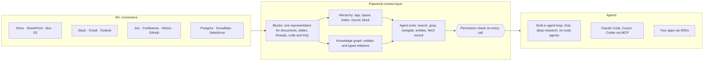

<div align="center">

**Translations:** [English](../../../README.md) · [Français](../fr/README.md) · [Deutsch](../de/README.md) · [简体中文](../zh-CN/README.md) · [日本語](../ja/README.md) · [Русский](../ru/README.md) · [עברית](../he/README.md) · [한국어](../ko/README.md) · **Español** · [Português](../pt/README.md) · [Türkçe](../tr/README.md) · [Tiếng Việt](../vi/README.md) · [Italiano](../it/README.md)

</div>

<div align="center">

<a href="https://www.pipeshub.com"></a>

<h3>La capa de contexto de código abierto para agentes de IA</h3>

<p>
  <a href="https://www.pipeshub.com/">Sitio web</a> ·
  <a href="https://docs.pipeshub.com/">Documentación</a> ·
  <a href="https://discord.com/invite/K5RskzJBm2">Discord</a> ·
  <a href="https://plum-myrtle-9f7.notion.site/Pipeshub-s-Product-Roadmap-33841c164f54803a9989fd0fdbfdb1ee">Hoja de ruta</a>
</p>

<a href="https://trendshift.io/repositories/14618"></a>

<p>
  <a href="https://opensource.org/licenses/Apache-2.0"></a>
  <a href="https://github.com/pipeshub-ai/pipeshub-ai/releases"></a>
  <a href="https://hub.docker.com/r/pipeshubai/pipeshub-ai"></a>
  <a href="https://discord.com/invite/K5RskzJBm2"></a>
  
  
  <a href="https://github.com/pipeshub-ai/pipeshub-ai/issues">
    
  </a>
  <a href="https://github.com/pipeshub-ai/pipeshub-ai/pulls">
    
  </a>
  <br/>
  <a href="https://x.com/PipesHub"></a>
  <a href="https://www.linkedin.com/company/pipeshub"></a>
  <br/>
  
  <br/>
  <a href="https://www.npmjs.com/package/@pipeshub-ai/sdk"></a>
  <a href="https://pypi.org/project/pipeshub-sdk/"></a>
  <a href="https://github.com/pipeshub-ai/pipeshub-sdk-go"></a>
  <a href="https://www.npmjs.com/package/@pipeshub-ai/mcp"></a>
</p>

</div>

<h2 id="about-pipeshub">Dale a tus agentes de IA una comprensión real de tu empresa</h2>

<strong>[PipesHub](https://www.pipeshub.com/)</strong> convierte todo lo que sabe tu empresa en un espacio de trabajo que respeta los permisos. Los agentes de IA lo exploran igual que los agentes de código exploran un repositorio. Lo buscan, le aplican `grep`, recorren sus carpetas y su grafo de conocimiento, leen solo lo que necesitan y citan el bloque exacto del que sale cada respuesta.

Conecta Slack, Google Drive, GitHub, Microsoft 365, Jira, Notion, Postgres y más de 25 sistemas. Usa el chat integrado, la investigación profunda y los agentes, o da el mismo contexto a Claude Code, Cursor, Codex y tus propios agentes mediante MCP y los SDK. Autoalojado, Apache 2.0 y con el modelo que elijas.

> [!TIP]
> Despliega con un solo comando:
> ```bash
> curl -fsSL https://get.pipeshub.com/install | bash
> ```

## ¿Por qué una capa de contexto?

Con el conocimiento de empresa, los agentes suelen fallar por su contexto, no por su modelo. La recuperación top-k de fragmentos le da al agente un puñado de trozos sueltos. Se pierde dónde vive cada uno, a qué enlaza, quién puede verlo y de dónde viene.

Los agentes de código mejoraron en cuanto pudieron usar `ls` y `grep` y leer un repositorio, en lugar de recibir fragmentos pegados. PipesHub da a los agentes lo mismo sobre los datos de tu empresa.

| | RAG top-k por fragmentos | PipesHub |
| --- | --- | --- |
| **Lo que el agente ve primero** | Unos pocos fragmentos de texto | El nombre, la ubicación, los metadatos y el resumen de cada registro, además de los bloques que coinciden |
| **Cómo profundiza** | No puede: una recuperación por pregunta | Búsqueda híbrida, `grep`/`find` sobre registros, navegación por carpetas y consultas al grafo de conocimiento, en bucle |
| **Estructura** | Se pierde al fragmentar | Cada fuente se convierte en Blocks: secciones, tablas con filas y celdas, hilos, código, tablas SQL con su esquema |
| **Permisos** | A menudo aproximados al indexar | Comprobados contra los permisos del sistema de origen para el usuario que hace la consulta, en cada llamada a una herramienta |
| **Citas** | Por fragmento, si las hay | Por bloque: la página, la celda, la fila, la diapositiva o la línea, sin citas inventadas |

## Cómo funciona



Cada fuente se convierte en **Blocks** (bloques), una representación única que mantiene intactos las tablas, los hilos y el código, y recuerda la página, la celda o la línea exacta de la que sale cada bloque. Cada documento se guarda como texto plano, así que los agentes pueden hacer `grep` sobre un PDF, un archivo de Word o una presentación igual que sobre un archivo de texto. Los Blocks se organizan de dos formas: según la **estructura de carpetas** de cada sistema de origen y en un **grafo de conocimiento** de personas, proyectos y clientes. Los agentes exploran ambos con **herramientas que muestran el detalle paso a paso**: una búsqueda muestra primero el nombre, el resumen y los fragmentos coincidentes de cada registro, y el agente solo profundiza (grep, recorrer carpetas, seguir entidades, leer el registro completo) cuando lo necesita. **Cada llamada a una herramienta se comprueba contra los permisos del sistema de origen** para la persona en cuyo nombre actúa el agente.

**[Lee cómo funciona la capa de contexto →](../../context-layer.md)** Cubre el formato de Blocks, la jerarquía y el grafo, cada herramienta del agente y el código donde vive, la aplicación de permisos, el bucle del agente y las limitaciones actuales.

## Lo que puedes construir con PipesHub

Una capa de contexto, muchos productos encima. Usa las aplicaciones integradas tal cual o construye las tuyas mediante MCP y los SDK.

| Qué construir | Lo que te da PipesHub | Empieza aquí |
| --- | --- | --- |
| **Pipelines de RAG agéntico** | Herramientas de recuperación que un agente llama en bucle (búsqueda híbrida, `grep`, navegación, consultas de entidades, lectura de registros completos), con las comprobaciones de permisos y las citas por bloque ya resueltas | [Starter de SDK](https://github.com/pipeshub-ai/examples/tree/main/sdk-starter) · [MCP](#úsalo-desde-claude-code-cursor-o-codex) |
| **Búsqueda empresarial** | Un solo buscador sobre más de 40 conectores que muestra a cada persona solo lo que puede ver, con respuestas citadas | Integrado · [ejemplo](https://github.com/pipeshub-ai/examples/tree/main/private-enterprise-search) |
| **Asistente de IA para el trabajo** | Chat e investigación profunda sobre el conocimiento de la empresa, además de búsqueda web y entrada por voz | Integrado |
| **Contexto para agentes de código** | Claude Code, Cursor y Codex responden a partir de documentos de diseño, tickets, incidentes e hilos de chat, no solo del código | [ejemplo](https://github.com/pipeshub-ai/examples/tree/main/company-knowledge-mcp) |
| **Agentes y creadores de flujos de trabajo sin código** | Un creador visual de arrastrar y soltar que conecta el conocimiento de la empresa con acciones en Slack, Gmail, Jira, Confluence, GitHub, Linear, Notion, Salesforce, Zendesk, Freshdesk y 20 herramientas más. O construye tu propio producto de flujos de trabajo sobre la misma API, para que cada paso reciba un contexto que respeta los permisos. | Integrado · [Construir en headless](#puedo-usar-pipeshub-en-modo-headless-sin-su-interfaz) |
| **Copilotos de atención al cliente** | Respuestas sacadas de tickets anteriores, runbooks y documentación (ServiceNow, Zammad, Jira, Confluence), con acciones de vuelta en la herramienta de tickets | Integrado · SDK |
| **Inteligencia comercial y de cuentas** | Cuentas, contactos y oportunidades de Salesforce en el grafo de conocimiento, consultables junto a los correos, documentos y chats sobre los mismos clientes | Integrado |
| **Preguntas sobre tus bases de datos** | Tablas de Postgres, MariaDB y Snowflake indexadas con sus esquemas y claves foráneas, además de sandboxes que ejecutan SQL y Python para el análisis | Integrado |
| **Informes, gráficos y paneles** | Los agentes escriben y ejecutan código en un sandbox y devuelven el resultado como un artefacto que se puede compartir | Integrado |
| **Búsqueda en el conocimiento de ingeniería** | Código, pull requests y commits de GitHub y GitLab, enlazados con los tickets y documentos que los rodean | Integrado |
| **Tus propias apps sobre el conocimiento de la empresa** | SDK de Python, TypeScript y Go, «Sign in with PipesHub» para que cada usuario busque con su propia identidad, y una API de subida para documentos que ningún conector cubre | [ejemplos](https://github.com/pipeshub-ai/examples) |
| **Apps legales y de contratos (CLM)** | Haz preguntas sobre contratos en Drive, SharePoint, Box o archivos subidos. Las respuestas citan la cláusula o la página exacta, y cada persona solo ve los contratos a los que tiene acceso. | [Construir en headless](#puedo-usar-pipeshub-en-modo-headless-sin-su-interfaz) |
| **IA privada, on-premise** | Todo lo anterior, autoalojado, con cualquier proveedor de LLM o modelos locales mediante Ollama, y con los datos dentro de tu infraestructura | [Desplegar](#-guía-de-despliegue) |

## Úsalo desde Claude Code, Cursor o Codex

**[Da a tu asistente de código acceso seguro al conocimiento de tu empresa →](https://github.com/pipeshub-ai/examples/tree/main/company-knowledge-mcp)**

Unos diez minutos con PipesHub en marcha y los datos indexados. Crea un Personal Access Token (no hace falta ser administrador), conecta tu asistente (un comando para Claude Code, un archivo de configuración para Cursor o Codex) y pregunta *«¿por qué se cambió la lógica de reintentos del billing worker?»*. Responde a partir del postmortem del incidente, la pull request, el hilo de chat y el documento de diseño, cada uno citado, y solo si tienes permiso para verlos.

Mediante MCP, los asistentes ya tienen hoy las herramientas de búsqueda, chat y registros de PipesHub. El resto de herramientas del agente (`grep`, `navigate`, consultas de entidades) llegará pronto a MCP.

¿Quieres la misma recuperación dentro de tu propio código, o detrás de un buscador para tu equipo? El [starter de SDK y el ejemplo de búsqueda](https://github.com/pipeshub-ai/examples) cubren ambos casos. ¿Has construido algo? [Enséñanoslo](https://github.com/pipeshub-ai/examples/issues/new?template=showcase.yml).

## PipesHub en acción

### Citas


### Conectores


<details>
<summary><b>Más demos: todos los registros, búsqueda de conocimiento</b></summary>

### Todos los registros


### Búsqueda de conocimiento


</details>

## Funcionalidades

**Contexto para agentes**

- 🗂️ **Explorable, no solo consultable:** búsqueda híbrida, `grep` sobre cada documento (incluidos PDF y archivos de Office), navegación por carpetas y consultas al grafo de conocimiento, todo como herramientas del agente.
- 🔒 **Respeta los permisos en cada paso:** cada llamada a una herramienta se comprueba contra los permisos del sistema de origen para la persona en cuyo nombre actúa el agente.
- 📝 **Citas a nivel de bloque:** las respuestas citan la página, la celda, la fila, la diapositiva o la línea de la que provienen.
- 🧱 **Estructurado, semiestructurado y no estructurado en una sola capa:** documentos, hojas de cálculo, tickets, hilos de chat, código y tablas SQL se convierten en Blocks.

**Conectado a tus sistemas**

- 🔌 **Más de 40 conectores:** Google Workspace, Microsoft 365, Slack, Jira, Confluence, Notion, GitHub, GitLab, Salesforce, ServiceNow, Postgres, Snowflake y más, con sincronización en tiempo real y programada.
- 🕸️ **Grafo de conocimiento:** entidades y relaciones extraídas al indexar y usadas al responder.
- 🎙️ **Multimodal:** imágenes, diagramas y archivos escaneados, además de entrada por voz.
- 🧠 **Tu propio modelo, totalmente autoalojado:** cualquier proveedor de LLM o un modelo local, desplegado en tu propia infraestructura.

## PipesHub Cloud

¿Prefieres un PipesHub totalmente gestionado sin mantener tu propia infraestructura? PipesHub Cloud llega pronto.

👉 **[Únete a la lista de espera de Cloud](https://pipeshub.com/cloud-waitlist)** para obtener acceso anticipado.

## Conectores

<p align="center">
<a href="https://pipeshub.com/connectors"></a>
</p>

## 🚀 Guía de despliegue

PipesHub puede ejecutarse en local o desplegarse en cualquier servidor con Docker Compose. El instalador interactivo se encarga de toda la configuración (secretos, base de datos de grafos, broker y elección de la etiqueta de imagen) y genera un `.env` por ti.

> **HTTPS en servidores en la nube:** si despliegas PipesHub en un servidor en la nube, usa un endpoint HTTPS. Los navegadores bloquean ciertas peticiones por HTTP simple. Usa Cloudflare, Nginx o Traefik para terminar TLS. Una pantalla en blanco tras un despliegue solo con HTTP suele deberse a esta restricción.

---

### ⚡ Inicio rápido (recomendado)

Requiere [Docker](https://docs.docker.com/get-docker/) con Compose v2. Un solo comando:

```bash
curl -fsSL https://get.pipeshub.com/install | bash
```

Esto descarga los archivos de despliegue de la última versión en `./pipeshub` y
lanza el instalador interactivo. Abre **http://localhost:3000** cuando
termine.

> **¿Prefieres leer antes de ejecutar?** Descarga e inspecciona primero el script:
>
> ```bash
> curl -fsSL https://get.pipeshub.com/install -o pipeshub-install.sh
> less pipeshub-install.sh        # review it
> bash pipeshub-install.sh
> ```

El instalador:
- Comprueba los requisitos de Docker, RAM y disco
- Pregunta si quieres un despliegue **slim** o **full**
- Te permite personalizar, si quieres, la base de datos de grafos, el broker de mensajes y el almacén KV
- Genera secretos aleatorios y escribe un archivo `.env`
- Descarga las imágenes y arranca el stack
- Espera a que PipesHub esté sano, comprueba que es accesible e imprime la URL

### 🛠️ Desde un repositorio clonado (desarrolladores)

Para compilar desde el código fuente, contribuir o fijar el instalador a tu copia local:

```bash
git clone https://github.com/pipeshub-ai/pipeshub-ai.git
cd pipeshub-ai

# Same installer, run from the repo root
./install.sh
```

Compilar imágenes locales desde el código fuente requiere esta vía del repositorio clonado (`./install.sh --build`);
el instalador de un solo comando de arriba siempre usa imágenes precompiladas.

> **Opciones avanzadas:** los flags del instalador (`--yes`, `--version`, `--reconfigure`, `--print-env-only`), las variables de entorno de CI, los tipos de despliegue slim y full, el uso manual de perfiles de Compose y las compilaciones locales desde el código fuente se explican en [Opciones avanzadas de despliegue](../../../deployment/docker-compose/ADVANCED_DEPLOYMENT.md).

## Construye sobre PipesHub: MCP y SDK

La búsqueda integrada es una forma de usar PipesHub. El mismo contexto conectado
y filtrado por permisos está disponible para tus propios agentes y aplicaciones:
mediante MCP para cualquier cliente compatible, o mediante los SDK cuando lo llamas
desde tu propio código.

Un agente se conecta como una persona concreta, no como la aplicación, así que
recupera exactamente lo que esa persona puede ver. El acceso se resuelve cuando
se ejecuta la consulta, según los permisos del propio sistema de origen, en lugar de
aproximarse al construir el índice.

Los tutoriales paso a paso para los casos más comunes (un MCP para tu asistente
de código, búsqueda empresarial privada y starters de SDK) están en
[**pipeshub-ai/examples**](https://github.com/pipeshub-ai/examples). El
material de referencia de cada pieza está a continuación.

### Servidor MCP

Usa PipesHub con cualquier cliente compatible con MCP para llevar el contexto de tu empresa a tus flujos de trabajo de IA. Consulta el README para la instalación y el uso.

**Repositorio:** [pipeshub-ai/mcp-server](https://github.com/pipeshub-ai/mcp-server/)

¿Usas [Omnigent](https://omnigent.ai)? Consulta [`integrations/omnigent/`](../../../integrations/omnigent/) para ver tres formas de conectarte, desde adjuntarlo en la interfaz web hasta un kit de conexión por script.

### SDK

PipesHub ofrece SDK para desarrolladores en Python, TypeScript y Go para que integres rápido. Consulta el README del repositorio de cada SDK para la instalación y el uso.

| Nombre | Descripción | Enlace |
|------|-------------|------|
| **Python SDK** | SDK de Python para PipesHub | [pipeshub-ai/pipeshub-sdk-python](https://github.com/pipeshub-ai/pipeshub-sdk-python) |
| **TypeScript SDK** | SDK de TypeScript para PipesHub | [pipeshub-ai/pipeshub-sdk-typescript](https://github.com/pipeshub-ai/pipeshub-sdk-typescript) |
| **Go SDK** | SDK de Go para PipesHub | [pipeshub-ai/pipeshub-sdk-go](https://github.com/pipeshub-ai/pipeshub-sdk-go) |

> ¿Necesitas un SDK en otro lenguaje? Escríbenos a developer@pipeshub.com

## Hoja de ruta

<p>Desarrollamos en abierto. Esto es lo que ya está hecho y lo que viene:</p>

<ul>
<li>✅ 🤖 <strong>Agentes de IA para el trabajo</strong>: un creador de agentes sin código de primer nivel</li>
<li>✅ 🔗 Soporte de <strong>MCP (Model Context Protocol)</strong>, como servidor y como cliente</li>
<li>✅ 🧰 <strong>SDK para desarrolladores</strong></li>
<li>✅ 🔍 <strong>Búsqueda de código</strong> en GitHub y GitLab</li>
<li>⬜ 👤 <strong>Búsqueda personalizada</strong> según equipo, rol e historial</li>
<li>✅ ☸️ Despliegue de <strong>Kubernetes para producción</strong> con alta disponibilidad por defecto</li>
<li>⬜ 📈 <strong>Relevancia reforzada con PageRank</strong> sobre el grafo de conocimiento</li>
</ul>
<p>👉 <strong><a href="https://plum-myrtle-9f7.notion.site/Pipeshub-s-Product-Roadmap-33841c164f54803a9989fd0fdbfdb1ee">Ver la hoja de ruta completa del producto en Notion</a></strong></p>

<hr>

## 👥 Contribuir

¿Quieres unirte a nuestra comunidad de desarrolladores? Consulta nuestra [guía de contribución](https://github.com/pipeshub-ai/pipeshub-ai/blob/main/CONTRIBUTING.md) para saber cómo configurar el entorno de desarrollo, nuestros estándares de código y el flujo de contribución.
<h3>Dónde acudir para cada cosa</h3>

<table>

<tr><td>Hacer una pregunta u obtener ayuda</td><td><a href="https://discord.com/invite/K5RskzJBm2">Discord</a></td></tr>
<tr><td>Informar de un error o pedir una funcionalidad</td><td><a href="https://github.com/pipeshub-ai/pipeshub-ai/issues">GitHub Issues</a></td></tr>
<tr><td>Informar de un problema de seguridad</td><td><a href="https://github.com/pipeshub-ai/pipeshub-ai/blob/main/SECURITY.md">Informar de un problema de seguridad</a></td></tr>
<tr><td>Leer la documentación</td><td><a href="https://docs.pipeshub.com/">Pipeshub Docs</a></td></tr>
<tr><td>Ver qué cambió en cada versión</td><td><a href="https://github.com/pipeshub-ai/pipeshub-ai/blob/main/CHANGELOG.md">Changelog</a></td></tr>
</table>

## Preguntas frecuentes

### ¿Qué es PipesHub?

PipesHub es la capa de contexto de código abierto para agentes de IA. Convierte el conocimiento repartido por los sistemas de negocio de tu empresa en un espacio de trabajo que respeta los permisos y que los agentes pueden buscar, recorrer con `grep`, navegar y citar.

Conecta sistemas como Slack, Google Drive, GitHub, Microsoft 365 y Notion, y pone su contenido a tu disposición de dos formas: una búsqueda con citas que respeta los permisos para tu equipo, y un contexto fiable para tus agentes de IA mediante API, SDK y MCP. Los agentes obtienen la misma vista controlada del conocimiento de la empresa que tendría una persona, con los mismos controles de acceso. Así responden con datos reales de la empresa en lugar de adivinar entre herramientas. Puedes usar la búsqueda integrada o construir encima tus propios agentes, flujos de trabajo y aplicaciones.

### ¿Puedo usar PipesHub en modo headless, sin su interfaz?

Sí. La aplicación web de PipesHub usa la misma API que puedes llamar tú mismo, así que todo lo que haces en la interfaz también puedes hacerlo desde código: conectar fuentes, subir archivos, gestionar usuarios y permisos, buscar, chatear, y crear y ejecutar agentes.

- **API REST:** una [especificación OpenAPI](../../../backend/nodejs/apps/src/modules/api-docs/pipeshub-openapi.yaml) con unos 300 endpoints. Consúltala en `/api/v1/docs` de tu instancia.
- **SDK:** [Python](https://github.com/pipeshub-ai/pipeshub-sdk-python), [TypeScript](https://github.com/pipeshub-ai/pipeshub-sdk-typescript) y [Go](https://github.com/pipeshub-ai/pipeshub-sdk-go).
- **MCP:** para Claude Code, Cursor, Codex y otros clientes MCP.

Elige cómo inicia sesión tu código:
- **Personal Access Token u OAuth:** actúa como una persona y solo ve lo que esa persona puede ver.
- **Cuenta de servicio:** para tareas en segundo plano, con sus propios permisos.
- **App OAuth:** permite que cada usuario de tu app inicie sesión con su propia identidad («Sign in with PipesHub»).

Los equipos lo usan para construir sus propios productos sobre PipesHub, como creadores de flujos de trabajo, herramientas legales y de gestión de contratos (CLM), consolas de soporte y agentes internos, sin mostrar la interfaz de PipesHub.

### ¿En qué se diferencia PipesHub de otras herramientas de IA para el trabajo?

La mayoría de las herramientas dan a un modelo de IA unos pocos fragmentos de texto recuperados. PipesHub da a los agentes herramientas para explorar el conocimiento de tu empresa como un agente de código explora un repositorio: búsqueda híbrida, `grep` sobre registros, navegación por carpetas y consultas al grafo de conocimiento. Cada una se comprueba contra los permisos del usuario en el sistema de origen. Cada fuente se convierte en Blocks, así que las respuestas citan la página, la celda, la fila o la diapositiva exacta. Es totalmente de código abierto (Apache 2.0) y autoalojable, así que tus datos nunca salen de tu infraestructura. Consulta [¿Por qué una capa de contexto?](#por-qué-una-capa-de-contexto)

### ¿Qué conectores admite PipesHub?

PipesHub tiene más de 40 conectores para más de 30 sistemas, con indexación en tiempo real y programada. Consulta el [resumen de conectores](https://docs.pipeshub.com/connectors/overview).

### ¿Qué proveedores de LLM admite PipesHub?

PipesHub sigue el modelo «Bring Your Own Model»: puedes usar cualquier proveedor de LLM. Despliégalo en tu VPC con los modelos que prefieras.

**Más preguntas:** los formatos de archivo, el stack tecnológico, el grafo de conocimiento, el soporte multimodal y la resolución de problemas se tratan en las [preguntas frecuentes completas](../../FAQ.md).

<hr>
<div align="center">
<h3>⭐ ¡Danos una estrella en GitHub!</h3>

<p>Ayuda a que el proyecto llegue a los equipos que lo necesitan.</p>

<p>
<a href="https://github.com/pipeshub-ai/pipeshub-ai">

</a>
</p>

<p>
<a href="https://www.star-history.com/?repos=pipeshub-ai%2Fpipeshub-ai">
 <picture>
   <source media="(prefers-color-scheme: dark)" srcset="https://api.star-history.com/chart?repos=pipeshub-ai/pipeshub-ai&amp;type=date&amp;theme=dark&amp;legend=top-left&amp;sealed_token=msbcJ843ZmXCld8-zgduwH9hV6yn69hyfrnwfkcWiRqe7htnO6pSbQJrkxdoarzriLW6aGAETT-iQ3m7yWN3BacAyPyHfNIiPGabl6r6CbXFjcvJ7n1NZw" />
   <source media="(prefers-color-scheme: light)" srcset="https://api.star-history.com/chart?repos=pipeshub-ai/pipeshub-ai&amp;type=date&amp;legend=top-left&amp;sealed_token=msbcJ843ZmXCld8-zgduwH9hV6yn69hyfrnwfkcWiRqe7htnO6pSbQJrkxdoarzriLW6aGAETT-iQ3m7yWN3BacAyPyHfNIiPGabl6r6CbXFjcvJ7n1NZw" />
   
 </picture>
</a>
</p>

<p><sub>Hecho con ❤️ por el <a href="https://www.pipeshub.com/">equipo de PipesHub</a> y colaboradores de todo el mundo.</sub></p>

</div>

