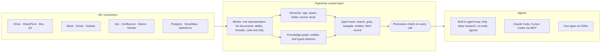

<div align="center">

**Translations:** [English](../../../README.md) · **Français** · [Deutsch](../de/README.md) · [简体中文](../zh-CN/README.md) · [日本語](../ja/README.md) · [Русский](../ru/README.md) · [עברית](../he/README.md) · [한국어](../ko/README.md) · [Español](../es/README.md) · [Português](../pt/README.md) · [Türkçe](../tr/README.md) · [Tiếng Việt](../vi/README.md) · [Italiano](../it/README.md)

</div>

<div align="center">

<a href="https://www.pipeshub.com"></a>

<h3>La couche de contexte open source pour les agents IA</h3>

<p>
  <a href="https://www.pipeshub.com/">Site web</a> ·
  <a href="https://docs.pipeshub.com/">Docs</a> ·
  <a href="https://discord.com/invite/K5RskzJBm2">Discord</a> ·
  <a href="https://plum-myrtle-9f7.notion.site/Pipeshub-s-Product-Roadmap-33841c164f54803a9989fd0fdbfdb1ee">Feuille de route</a>
</p>

<a href="https://trendshift.io/repositories/14618"></a>

<p>
  <a href="https://opensource.org/licenses/Apache-2.0"></a>
  <a href="https://github.com/pipeshub-ai/pipeshub-ai/releases"></a>
  <a href="https://hub.docker.com/r/pipeshubai/pipeshub-ai"></a>
  <a href="https://discord.com/invite/K5RskzJBm2"></a>
  
  
  <a href="https://github.com/pipeshub-ai/pipeshub-ai/issues">
    
  </a>
  <a href="https://github.com/pipeshub-ai/pipeshub-ai/pulls">
    
  </a>
  <br/>
  <a href="https://x.com/PipesHub"></a>
  <a href="https://www.linkedin.com/company/pipeshub"></a>
  <br/>
  
  <br/>
  <a href="https://www.npmjs.com/package/@pipeshub-ai/sdk"></a>
  <a href="https://pypi.org/project/pipeshub-sdk/"></a>
  <a href="https://github.com/pipeshub-ai/pipeshub-sdk-go"></a>
  <a href="https://www.npmjs.com/package/@pipeshub-ai/mcp"></a>
</p>

</div>

<h2 id="about-pipeshub">Donnez à vos agents IA une vraie compréhension de votre entreprise</h2>

<strong>[PipesHub](https://www.pipeshub.com/)</strong> transforme tout ce que sait votre entreprise en un espace de travail qui respecte les permissions. Les agents IA l'explorent comme les agents de code explorent un dépôt. Ils y cherchent, y lancent `grep`, parcourent ses dossiers et son graphe de connaissances, ne lisent que ce dont ils ont besoin et citent le bloc exact d'où vient chaque réponse.

Connectez Slack, Google Drive, GitHub, Microsoft 365, Jira, Notion, Postgres et plus de 25 autres systèmes. Utilisez le chat intégré, la recherche approfondie et les agents, ou donnez le même contexte à Claude Code, Cursor, Codex et à vos propres agents via MCP et les SDK. Auto-hébergé, sous licence Apache 2.0, avec le modèle de votre choix.

> [!TIP]
> Déployez en une seule commande :
> ```bash
> curl -fsSL https://get.pipeshub.com/install | bash
> ```

## Pourquoi une couche de contexte ?

Sur les connaissances d'entreprise, les agents échouent le plus souvent à cause de leur contexte, pas de leur modèle. La récupération top-k de fragments donne à l'agent une poignée d'extraits. Elle perd l'emplacement de chacun, ses liens, qui a le droit de le voir et sa provenance.

Les agents de code sont devenus bons dès qu'ils ont pu lancer `ls` et `grep` et lire un dépôt, au lieu de recevoir des extraits collés. PipesHub offre la même chose aux agents sur les données de votre entreprise.

| | RAG top-k par fragments | PipesHub |
| --- | --- | --- |
| **Ce que l'agent voit d'abord** | Quelques fragments de texte | Le nom, l'emplacement, les métadonnées et le résumé de chaque enregistrement, plus les blocs correspondants |
| **Comment il creuse davantage** | Impossible : une seule récupération par question | Recherche hybride, `grep`/`find` sur les enregistrements, navigation dans les dossiers et requêtes dans le graphe de connaissances, en boucle |
| **Structure** | Perdue au découpage | Chaque source devient des Blocks : sections, tableaux avec lignes et cellules, fils de discussion, code, tables SQL avec leur schéma |
| **Permissions** | Souvent approximées à l'indexation | Vérifiées par rapport aux permissions du système source pour l'utilisateur à l'origine de la demande, à chaque appel d'outil |
| **Citations** | Par fragment, s'il y en a | Par bloc : la page, la cellule de tableau, la ligne, la diapositive ou la ligne de code, sans citations inventées |

## Comment ça marche



Chaque source devient des **Blocks** (des blocs), une représentation unique qui garde intacts les tableaux, les fils de discussion et le code, et qui retient la page, la cellule ou la ligne exacte d'où vient chaque bloc. Les Blocks sont organisés de deux façons : selon la **structure de dossiers** de chaque système source, et dans un **graphe de connaissances** des personnes, des projets et des clients. Les agents explorent les deux avec des **outils qui révèlent le détail étape par étape** : une recherche affiche d'abord le nom, le résumé et les passages correspondants de chaque enregistrement, et l'agent ne creuse davantage (grep, parcours des dossiers, suivi des entités, lecture de l'enregistrement complet) que s'il en a besoin. **Chaque appel d'outil est vérifié par rapport aux permissions du système source** pour la personne au nom de laquelle l'agent agit.

**[Découvrez comment fonctionne la couche de contexte →](../../context-layer.md)** Ce document couvre le format des Blocks, la hiérarchie et le graphe, chaque outil d'agent et le code qui l'implémente, l'application des permissions, la boucle d'agent et les limites actuelles.

## Ce que vous pouvez construire avec PipesHub

Une seule couche de contexte, de nombreux produits par-dessus. Utilisez les applications intégrées telles quelles, ou construisez les vôtres via MCP et les SDK.

| À construire | Ce que PipesHub vous apporte | Par où commencer |
| --- | --- | --- |
| **Pipelines de RAG agentique** | Des outils de récupération qu'un agent appelle en boucle (recherche hybride, `grep`, navigation, requêtes d'entités, lecture d'enregistrements complets), avec la vérification des permissions et les citations par bloc déjà prises en charge | [Starter SDK](https://github.com/pipeshub-ai/examples/tree/main/sdk-starter) · [MCP](#utilisez-le-depuis-claude-code-cursor-ou-codex) |
| **Recherche d'entreprise** | Une seule barre de recherche sur plus de 40 connecteurs, qui ne montre à chacun que ce qu'il a le droit de voir, avec des réponses citées | Intégré · [exemple](https://github.com/pipeshub-ai/examples/tree/main/private-enterprise-search) |
| **Assistant IA pour le travail** | Chat et recherche approfondie sur les connaissances de l'entreprise, plus la recherche web et la saisie vocale | Intégré |
| **Contexte pour les agents de code** | Claude Code, Cursor et Codex répondent à partir des documents de conception, des tickets, des incidents et des fils de discussion, pas seulement du code | [exemple](https://github.com/pipeshub-ai/examples/tree/main/company-knowledge-mcp) |
| **Agents sans code et constructeurs de workflows** | Un constructeur visuel par glisser-déposer qui relie le savoir de l'entreprise à des actions dans Slack, Gmail, Jira, Confluence, GitHub, Linear, Notion, Salesforce, Zendesk, Freshdesk et 20 autres outils. Ou construisez votre propre produit de workflows sur la même API, pour que chaque étape reçoive un contexte qui respecte les permissions. | Intégré · [Construire en headless](#puis-je-utiliser-pipeshub-en-mode-headless-sans-son-interface-) |
| **Copilotes de support client** | Des réponses tirées des anciens tickets, des runbooks et de la documentation (ServiceNow, Zammad, Jira, Confluence), avec des actions renvoyées dans l'outil de ticketing | Intégré · SDK |
| **Intelligence commerciale et comptes** | Les comptes, contacts et opportunités Salesforce dans le graphe de connaissances, consultables avec les e-mails, documents et conversations sur les mêmes clients | Intégré |
| **Questions sur vos bases de données** | Les tables Postgres, MariaDB et Snowflake indexées avec leurs schémas et clés étrangères, plus des bacs à sable qui exécutent du SQL et du Python pour l'analyse | Intégré |
| **Rapports, graphiques et tableaux de bord** | Les agents écrivent et exécutent du code dans un bac à sable et renvoient le résultat sous forme d'artefact partageable | Intégré |
| **Recherche dans les connaissances d'ingénierie** | Code, pull requests et commits de GitHub et GitLab, reliés aux tickets et documents qui les entourent | Intégré |
| **Vos propres applications sur les connaissances de l'entreprise** | Des SDK Python, TypeScript et Go, « Sign in with PipesHub » pour que chaque utilisateur cherche avec sa propre identité, et une API d'upload pour les documents qu'aucun connecteur ne couvre | [exemples](https://github.com/pipeshub-ai/examples) |
| **Applications juridiques et de contrats (CLM)** | Posez des questions sur vos contrats dans Drive, SharePoint, Box ou des fichiers importés. Les réponses citent la clause ou la page exacte, et chacun ne voit que les contrats auxquels il a accès. | [Construire en headless](#puis-je-utiliser-pipeshub-en-mode-headless-sans-son-interface-) |
| **IA privée, sur site** | Tout ce qui précède, auto-hébergé, avec n'importe quel fournisseur de LLM ou des modèles locaux via Ollama, et des données qui restent dans votre infrastructure | [Déployer](#-guide-de-déploiement) |

## Utilisez-le depuis Claude Code, Cursor ou Codex

**[Donnez à votre assistant de code un accès sécurisé aux connaissances de votre entreprise →](https://github.com/pipeshub-ai/examples/tree/main/company-knowledge-mcp)**

Comptez environ dix minutes une fois PipesHub lancé et vos données indexées. Créez un Personal Access Token (pas besoin d'être administrateur), connectez votre assistant (une commande pour Claude Code, un fichier de configuration pour Cursor ou Codex) et demandez *« pourquoi la logique de retry du billing worker a-t-elle changé ? »*. Il répond à partir du postmortem de l'incident, de la pull request, du fil de discussion et du document de conception, chacun cité, et seulement si vous avez le droit de les voir.

Via MCP, les assistants ont déjà accès aux outils de recherche, de chat et d'enregistrements de PipesHub. Le reste des outils d'agent (`grep`, `navigate`, requêtes d'entités) arrive bientôt sur MCP.

Vous voulez la même récupération dans votre propre code, ou derrière une barre de recherche pour votre équipe ? Le [starter SDK et l'exemple de recherche](https://github.com/pipeshub-ai/examples) couvrent les deux cas. Vous avez construit quelque chose ? [Montrez-le-nous](https://github.com/pipeshub-ai/examples/issues/new?template=showcase.yml).

## PipesHub en action

### Citations


### Connecteurs


<details>
<summary><b>Plus de démos : tous les enregistrements, recherche de connaissances</b></summary>

### Tous les enregistrements


### Recherche de connaissances


</details>

## Fonctionnalités

**Du contexte pour les agents**

- 🗂️ **Explorable, pas seulement interrogeable :** recherche hybride, `grep` sur les enregistrements, navigation dans les dossiers et requêtes dans le graphe de connaissances, le tout sous forme d'outils d'agent.
- 🔒 **Respect des permissions à chaque étape :** chaque appel d'outil est vérifié par rapport aux permissions du système source pour la personne au nom de laquelle l'agent agit.
- 📝 **Citations au niveau du bloc :** les réponses citent la page, la cellule de tableau, la ligne, la diapositive ou la ligne de code dont elles proviennent.
- 🧱 **Structuré, semi-structuré et non structuré dans une seule couche :** documents, tableurs, tickets, fils de discussion, code et tables SQL deviennent tous des Blocks.

**Connecté à vos systèmes**

- 🔌 **Plus de 40 connecteurs :** Google Workspace, Microsoft 365, Slack, Jira, Confluence, Notion, GitHub, GitLab, Salesforce, ServiceNow, Postgres, Snowflake et d'autres, avec synchronisation en temps réel et planifiée.
- 🕸️ **Graphe de connaissances :** entités et relations extraites à l'indexation et utilisées au moment de répondre.
- 🎙️ **Multimodal :** images, diagrammes et fichiers numérisés, plus la saisie vocale.
- 🧠 **Votre propre modèle, entièrement auto-hébergé :** n'importe quel fournisseur de LLM ou un modèle local, déployé dans votre propre infrastructure.

## PipesHub Cloud

Vous préférez un PipesHub entièrement géré, sans gérer votre propre infrastructure ? PipesHub Cloud arrive bientôt.

👉 **[Rejoignez la liste d'attente Cloud](https://pipeshub.com/cloud-waitlist)** pour obtenir un accès anticipé.

## Connecteurs

<p align="center">
<a href="https://pipeshub.com/connectors"></a>
</p>

## 🚀 Guide de déploiement

PipesHub peut tourner en local ou être déployé sur n'importe quel serveur avec Docker Compose. L'installateur interactif gère toute la configuration (secrets, base de données de graphe, broker et choix du tag d'image) et génère un `.env` pour vous.

> **HTTPS sur les serveurs cloud :** si vous déployez PipesHub sur un serveur cloud, utilisez un point de terminaison HTTPS. Les navigateurs bloquent certaines requêtes en HTTP simple. Utilisez Cloudflare, Nginx ou Traefik pour terminer TLS. Un écran blanc après un déploiement en HTTP seul vient généralement de cette restriction.

---

### ⚡ Démarrage rapide (recommandé)

Nécessite [Docker](https://docs.docker.com/get-docker/) avec Compose v2. Une seule commande :

```bash
curl -fsSL https://get.pipeshub.com/install | bash
```

Cette commande télécharge les fichiers de déploiement de la dernière version dans `./pipeshub` et
lance l'installateur interactif. Ouvrez **http://localhost:3000** une fois
l'installation terminée.

> **Vous préférez lire avant d'exécuter ?** Téléchargez et inspectez d'abord le script :
>
> ```bash
> curl -fsSL https://get.pipeshub.com/install -o pipeshub-install.sh
> less pipeshub-install.sh        # review it
> bash pipeshub-install.sh
> ```

L'installateur va :
- Vérifier les prérequis Docker, RAM et disque
- Vous demander si vous voulez un déploiement **slim** ou **full**
- Vous permettre de personnaliser, si vous le souhaitez, la base de données de graphe, le broker de messages et le store KV
- Générer des secrets aléatoires et écrire un fichier `.env`
- Télécharger les images et démarrer la stack
- Attendre que PipesHub soit opérationnel, vérifier qu'il est joignable et afficher l'URL

### 🛠️ Depuis un dépôt cloné (développeurs)

Pour compiler depuis les sources, contribuer ou utiliser l'installateur de votre copie locale :

```bash
git clone https://github.com/pipeshub-ai/pipeshub-ai.git
cd pipeshub-ai

# Same installer, run from the repo root
./install.sh
```

La compilation d'images locales depuis les sources nécessite ce dépôt cloné (`./install.sh --build`) ;
l'installateur en une commande ci-dessus utilise toujours des images précompilées.

> **Options avancées :** les flags de l'installateur (`--yes`, `--version`, `--reconfigure`, `--print-env-only`), les variables d'environnement de CI, les types de déploiement slim et full, l'utilisation manuelle des profils Compose et la compilation locale depuis les sources sont décrits dans [Options de déploiement avancées](../../../deployment/docker-compose/ADVANCED_DEPLOYMENT.md).

## Construire sur PipesHub : MCP et SDK

L'expérience de recherche intégrée n'est qu'une façon d'utiliser PipesHub. Le même contexte,
connecté et filtré selon les permissions, est disponible pour vos propres agents et applications :
via MCP pour tout client compatible, ou via les SDK quand vous l'appelez
depuis votre propre code.

Un agent se connecte en tant que personne précise, et non en tant qu'application. Il
récupère donc exactement ce que cette personne a le droit de voir. L'accès est résolu au moment
où la requête s'exécute, selon les permissions du système source, au lieu d'être
approximé lors de la construction de l'index.

Des tutoriels pas à pas pour les cas les plus courants (un MCP pour votre assistant
de code, une recherche d'entreprise privée et des starters SDK) se trouvent dans
[**pipeshub-ai/examples**](https://github.com/pipeshub-ai/examples). La
documentation de référence de chaque brique se trouve ci-dessous.

### Serveur MCP

Utilisez PipesHub avec n'importe quel client compatible MCP pour apporter le contexte de votre entreprise dans vos workflows IA. Consultez le README pour l'installation et l'utilisation.

**Dépôt :** [pipeshub-ai/mcp-server](https://github.com/pipeshub-ai/mcp-server/)

Vous utilisez [Omnigent](https://omnigent.ai) ? Consultez [`integrations/omnigent/`](../../../integrations/omnigent/) pour trois façons de vous connecter, de l'attachement via l'interface web à un kit de connexion scripté.

### SDK

PipesHub fournit des SDK pour Python, TypeScript et Go afin de vous aider à intégrer rapidement. Consultez le README du dépôt de chaque SDK pour l'installation et l'utilisation.

| Nom | Description | Lien |
|------|-------------|------|
| **Python SDK** | SDK Python pour PipesHub | [pipeshub-ai/pipeshub-sdk-python](https://github.com/pipeshub-ai/pipeshub-sdk-python) |
| **TypeScript SDK** | SDK TypeScript pour PipesHub | [pipeshub-ai/pipeshub-sdk-typescript](https://github.com/pipeshub-ai/pipeshub-sdk-typescript) |
| **Go SDK** | SDK Go pour PipesHub | [pipeshub-ai/pipeshub-sdk-go](https://github.com/pipeshub-ai/pipeshub-sdk-go) |

> Besoin d'un SDK dans un autre langage ? Écrivez-nous à developer@pipeshub.com

## Feuille de route

<p>Nous développons en public. Voici ce qui est fait et ce qui arrive :</p>

<ul>
<li>✅ 🤖 <strong>Agents IA pour le travail</strong> : un vrai constructeur d'agents sans code</li>
<li>✅ 🔗 Prise en charge de <strong>MCP (Model Context Protocol)</strong>, côté serveur et côté client</li>
<li>✅ 🧰 <strong>SDK pour les développeurs</strong></li>
<li>✅ 🔍 <strong>Recherche de code</strong> sur GitHub et GitLab</li>
<li>⬜ 👤 <strong>Recherche personnalisée</strong> selon l'équipe, le rôle et l'historique</li>
<li>✅ ☸️ Déploiement <strong>Kubernetes de production</strong> avec haute disponibilité par défaut</li>
<li>⬜ 📈 <strong>Pertinence enrichie par PageRank</strong> sur le graphe de connaissances</li>
</ul>
<p>👉 <strong><a href="https://plum-myrtle-9f7.notion.site/Pipeshub-s-Product-Roadmap-33841c164f54803a9989fd0fdbfdb1ee">Voir la feuille de route complète sur Notion</a></strong></p>

<hr>

## 👥 Contribuer

Vous voulez rejoindre notre communauté de développeurs ? Consultez notre [guide de contribution](https://github.com/pipeshub-ai/pipeshub-ai/blob/main/CONTRIBUTING.md) pour savoir comment configurer l'environnement de développement, connaître nos standards de code et le processus de contribution.
<h3>Où trouver quoi</h3>

<table>

<tr><td>Poser une question ou obtenir de l'aide</td><td><a href="https://discord.com/invite/K5RskzJBm2">Discord</a></td></tr>
<tr><td>Signaler un bug ou demander une fonctionnalité</td><td><a href="https://github.com/pipeshub-ai/pipeshub-ai/issues">GitHub Issues</a></td></tr>
<tr><td>Signaler un problème de sécurité</td><td><a href="https://github.com/pipeshub-ai/pipeshub-ai/blob/main/SECURITY.md">Signaler un problème de sécurité</a></td></tr>
<tr><td>Lire la documentation</td><td><a href="https://docs.pipeshub.com/">Pipeshub Docs</a></td></tr>
<tr><td>Voir ce qui a changé dans chaque version</td><td><a href="https://github.com/pipeshub-ai/pipeshub-ai/blob/main/CHANGELOG.md">Changelog</a></td></tr>
</table>

## FAQ

### Qu'est-ce que PipesHub ?

PipesHub est la couche de contexte open source pour les agents IA. Il transforme les connaissances réparties dans les systèmes métier de votre entreprise en un espace de travail qui respecte les permissions, que les agents peuvent interroger, parcourir avec `grep`, explorer et citer.

Il connecte des systèmes comme Slack, Google Drive, GitHub, Microsoft 365 et Notion, puis rend leur contenu disponible de deux façons : une recherche avec citations qui respecte les permissions pour votre équipe, et un contexte fiable pour vos agents IA via des API, des SDK et MCP. Les agents ont la même vue encadrée des connaissances de l'entreprise qu'une personne, avec les mêmes contrôles d'accès. Ils répondent donc à partir de vraies données d'entreprise au lieu de deviner d'un outil à l'autre. Vous pouvez utiliser l'expérience de recherche intégrée, ou construire vos propres agents, workflows et applications par-dessus.

### Puis-je utiliser PipesHub en mode headless, sans son interface ?

Oui. L'application web de PipesHub utilise la même API que vous pouvez appeler vous-même. Tout ce que vous faites dans l'interface, vous pouvez donc aussi le faire dans votre code : connecter des sources, importer des fichiers, gérer les utilisateurs et les permissions, rechercher, discuter, et construire et exécuter des agents.

- **API REST :** une [spécification OpenAPI](../../../backend/nodejs/apps/src/modules/api-docs/pipeshub-openapi.yaml) d'environ 300 endpoints. Consultez-la à l'adresse `/api/v1/docs` sur votre instance.
- **SDK :** [Python](https://github.com/pipeshub-ai/pipeshub-sdk-python), [TypeScript](https://github.com/pipeshub-ai/pipeshub-sdk-typescript) et [Go](https://github.com/pipeshub-ai/pipeshub-sdk-go).
- **MCP :** pour Claude Code, Cursor, Codex et les autres clients MCP.

Choisissez comment votre code se connecte :
- **Personal Access Token ou OAuth :** agit au nom d'une personne et ne voit que ce qu'elle a le droit de voir.
- **Compte de service :** pour les tâches en arrière-plan, avec ses propres permissions.
- **Application OAuth :** permet à chaque utilisateur de votre application de se connecter avec sa propre identité (« Sign in with PipesHub »).

Des équipes s'en servent pour construire leurs propres produits sur PipesHub, comme des constructeurs de workflows, des outils juridiques et de gestion des contrats (CLM), des consoles de support et des agents internes, sans afficher l'interface de PipesHub.

### En quoi PipesHub diffère-t-il des autres outils d'IA pour le travail ?

La plupart des outils donnent à un modèle d'IA quelques fragments de texte récupérés. PipesHub donne aux agents des outils pour explorer les connaissances de votre entreprise comme un agent de code explore un dépôt : recherche hybride, `grep` sur les enregistrements, navigation dans les dossiers et requêtes dans le graphe de connaissances. Chacun est vérifié par rapport aux permissions de l'utilisateur dans le système source. Chaque source devient des Blocks, si bien que les réponses citent la page, la cellule de tableau, la ligne ou la diapositive exacte. Il est entièrement open source (Apache 2.0) et auto-hébergeable : vos données ne quittent jamais votre infrastructure. Voir [Pourquoi une couche de contexte ?](#pourquoi-une-couche-de-contexte-)

### Quels connecteurs PipesHub prend-il en charge ?

PipesHub propose plus de 40 connecteurs couvrant plus de 30 systèmes, avec indexation en temps réel et planifiée. Voir la [vue d'ensemble des connecteurs](https://docs.pipeshub.com/connectors/overview).

### Quels fournisseurs de LLM PipesHub prend-il en charge ?

PipesHub fonctionne en « Bring Your Own Model » : vous pouvez utiliser n'importe quel fournisseur de LLM. Déployez-le dans votre VPC avec les modèles de votre choix.

**Autres questions :** les formats de fichiers, la stack technique, le graphe de connaissances, le support multimodal et le dépannage sont traités dans la [FAQ complète](../../FAQ.md).

<hr>
<div align="center">
<h3>⭐ Ajoutez-nous une étoile sur GitHub !</h3>

<p>Cela aide le projet à atteindre les équipes qui en ont besoin.</p>

<p>
<a href="https://github.com/pipeshub-ai/pipeshub-ai">

</a>
</p>

<p>
<a href="https://www.star-history.com/?repos=pipeshub-ai%2Fpipeshub-ai">
 <picture>
   <source media="(prefers-color-scheme: dark)" srcset="https://api.star-history.com/chart?repos=pipeshub-ai/pipeshub-ai&amp;type=date&amp;theme=dark&amp;legend=top-left&amp;sealed_token=msbcJ843ZmXCld8-zgduwH9hV6yn69hyfrnwfkcWiRqe7htnO6pSbQJrkxdoarzriLW6aGAETT-iQ3m7yWN3BacAyPyHfNIiPGabl6r6CbXFjcvJ7n1NZw" />
   <source media="(prefers-color-scheme: light)" srcset="https://api.star-history.com/chart?repos=pipeshub-ai/pipeshub-ai&amp;type=date&amp;legend=top-left&amp;sealed_token=msbcJ843ZmXCld8-zgduwH9hV6yn69hyfrnwfkcWiRqe7htnO6pSbQJrkxdoarzriLW6aGAETT-iQ3m7yWN3BacAyPyHfNIiPGabl6r6CbXFjcvJ7n1NZw" />
   
 </picture>
</a>
</p>

<p><sub>Conçu avec ❤️ par l'<a href="https://www.pipeshub.com/">équipe PipesHub</a> et des contributeurs du monde entier.</sub></p>

</div>

