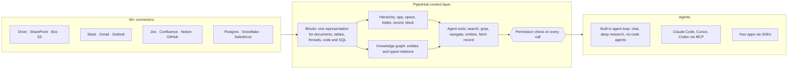

<div align="center">

**Translations:** [English](../../../README.md) · [Français](../fr/README.md) · [Deutsch](../de/README.md) · [简体中文](../zh-CN/README.md) · [日本語](../ja/README.md) · [Русский](../ru/README.md) · **עברית** · [한국어](../ko/README.md) · [Español](../es/README.md) · [Português](../pt/README.md) · [Türkçe](../tr/README.md) · [Tiếng Việt](../vi/README.md) · [Italiano](../it/README.md)

</div>

<div align="center">

<a href="https://www.pipeshub.com"></a>

<h3>שכבת ההקשר בקוד פתוח לסוכני AI</h3>

<p>
  <a href="https://www.pipeshub.com/">אתר</a> ·
  <a href="https://docs.pipeshub.com/">תיעוד</a> ·
  <a href="https://discord.com/invite/K5RskzJBm2">Discord</a> ·
  <a href="https://plum-myrtle-9f7.notion.site/Pipeshub-s-Product-Roadmap-33841c164f54803a9989fd0fdbfdb1ee">מפת דרכים</a>
</p>

<a href="https://trendshift.io/repositories/14618"></a>

<p>
  <a href="https://opensource.org/licenses/Apache-2.0"></a>
  <a href="https://github.com/pipeshub-ai/pipeshub-ai/releases"></a>
  <a href="https://hub.docker.com/r/pipeshubai/pipeshub-ai"></a>
  <a href="https://discord.com/invite/K5RskzJBm2"></a>
  
  
  <a href="https://github.com/pipeshub-ai/pipeshub-ai/issues">
    
  </a>
  <a href="https://github.com/pipeshub-ai/pipeshub-ai/pulls">
    
  </a>
  <br/>
  <a href="https://x.com/PipesHub"></a>
  <a href="https://www.linkedin.com/company/pipeshub"></a>
  <br/>
  
  <br/>
  <a href="https://www.npmjs.com/package/@pipeshub-ai/sdk"></a>
  <a href="https://pypi.org/project/pipeshub-sdk/"></a>
  <a href="https://github.com/pipeshub-ai/pipeshub-sdk-go"></a>
  <a href="https://www.npmjs.com/package/@pipeshub-ai/mcp"></a>
</p>

</div>

<div dir="rtl">

<h2 id="about-pipeshub">תנו לסוכנים שלכם סביבת עבודה, לא ערימה של קטעים</h2>

<strong>[PipesHub](https://www.pipeshub.com/)</strong> הופכת את כל מה שהחברה שלכם יודעת לסביבת עבודה שמכבדת הרשאות. סוכני AI חוקרים אותה כמו שסוכני קוד חוקרים מאגר קוד. הם מחפשים בה, מריצים עליה `grep`, עוברים בין התיקיות שלה ובגרף הידע שלה, קוראים רק את מה שהם צריכים, ומצטטים את הבלוק המדויק שממנו הגיעה כל תשובה.

חברו את Slack, Google Drive, GitHub, Microsoft 365, Jira, Notion, Postgres ועוד 25+ מערכות. השתמשו בצ'אט המובנה, במחקר המעמיק ובסוכנים, או העבירו את אותו הקשר ל-Claude Code, Cursor, Codex ולסוכנים שלכם דרך MCP וה-SDK. אחסון עצמי, Apache 2.0, ובחירה חופשית של מודל.

> [!TIP]
> פריסה בפקודה אחת:
> ```bash
> curl -fsSL https://get.pipeshub.com/install | bash
> ```

## למה שכבת הקשר?

סוכנים נכשלים בדרך כלל על ידע ארגוני בגלל ההקשר שלהם, לא בגלל המודל. אחזור top-k של קטעים מוסר לסוכן קומץ שברים, ומאבד היכן כל אחד מהם נמצא, למה הוא מקשר, מי רשאי לראות אותו ומאיפה הוא הגיע.

סוכני קוד השתפרו מאוד ברגע שיכלו להריץ `ls` ו-`grep` ולקרוא מאגר קוד, במקום לקבל קטעי קוד מודבקים. PipesHub נותנת לסוכנים את אותה יכולת על הנתונים של החברה שלכם.

| | RAG על קטעי top-k | PipesHub |
| --- | --- | --- |
| **מה הסוכן רואה קודם** | כמה קטעי טקסט | השם, המיקום, המטא-דאטה והתקציר של כל רשומה, וגם הבלוקים שהתאימו |
| **איך הוא מעמיק** | הוא לא יכול: אחזור אחד לכל שאלה | חיפוש היברידי, `grep`/`find` על רשומות, ניווט בתיקיות ושאילתות לגרף הידע, בלולאה |
| **מבנה** | הולך לאיבוד בחיתוך לקטעים | כל מקור הופך ל-Blocks: סעיפים, טבלאות עם שורות ותאים, שרשורים, קוד, טבלאות SQL עם הסכמה שלהן |
| **הרשאות** | לרוב בקירוב, בזמן האינדוקס | נבדקות מול ההרשאות של מערכת המקור עבור המשתמש המבקש, בכל קריאה לכלי |
| **ציטוטים** | לפי קטע, אם בכלל | לפי בלוק: העמוד, תא הטבלה, השורה, השקופית או שורת הקוד, וציטוטים מומצאים מוסרים |

## איך זה עובד



כל מקור הופך ל-**Blocks** (בלוקים): ייצוג אחד ששומר על טבלאות, שרשורים וקוד בשלמותם, וזוכר את העמוד, התא או השורה המדויקים שמהם הגיע כל בלוק. מעל ה-Blocks יש שתי מפות: **ההיררכיה** של מערכת המקור ו**גרף ידע** של ישויות. סוכנים חוקרים את שתיהן בעזרת **כלים שחושפים מידע בשלבים**. תוצאות החיפוש מציגות קודם את המטא-דאטה והתקציר של כל רשומה. הסוכן מריץ grep, מנווט, עוקב אחרי ישויות או קורא רשומה מלאה רק כשהוא צריך. **כל קריאה לכלי נבדקת מול ההרשאות של מערכת המקור** עבור האדם שבשמו הסוכן פועל.

**[קראו איך שכבת ההקשר עובדת ←](../../context-layer.md)** המסמך מכסה את פורמט ה-Blocks, את ההיררכיה והגרף, כל כלי של הסוכן והקוד שבו הוא ממומש, אכיפת הרשאות, לולאת הסוכן והמגבלות הנוכחיות.

## מה אפשר לבנות עם PipesHub

שכבת הקשר אחת, הרבה מוצרים מעליה. השתמשו באפליקציות המובנות כמו שהן, או בנו משלכם דרך MCP וה-SDK.

| מה בונים | מה PipesHub נותנת | מאיפה מתחילים |
| --- | --- | --- |
| **צינורות RAG מבוססי סוכנים** | כלי אחזור שסוכן קורא להם בלולאה (חיפוש היברידי, `grep`, ניווט, שאילתות ישויות, קריאת רשומה מלאה), עם בדיקות הרשאות וציטוטים ברמת הבלוק שכבר מוכנים | [ערכת התחלה ל-SDK](https://github.com/pipeshub-ai/examples/tree/main/sdk-starter) · [MCP](#שימוש-מתוך-claude-code-cursor-או-codex) |
| **חיפוש ארגוני** | תיבת חיפוש אחת על פני 40+ מחברים, שמציגה לכל אדם רק את מה שמותר לו לראות, עם תשובות מצוטטות | מובנה · [דוגמה](https://github.com/pipeshub-ai/examples/tree/main/private-enterprise-search) |
| **עוזר AI לסביבת העבודה** | צ'אט ומחקר מעמיק על הידע של החברה, וגם חיפוש ברשת וקלט קולי | מובנה |
| **הקשר לסוכני קוד** | Claude Code, Cursor ו-Codex עונים מתוך מסמכי תכנון, כרטיסים, תקלות ושרשורי צ'אט, לא רק מהקוד | [דוגמה](https://github.com/pipeshub-ai/examples/tree/main/company-knowledge-mcp) |
| **סוכנים ואוטומציות ללא קוד** | בונה סוכנים עם פעולות ב-Slack, Gmail, Jira, Confluence, GitHub, Linear, Notion, Salesforce, Zendesk, Freshdesk ועוד 20 כלים | מובנה |
| **קופיילוטים לתמיכת לקוחות** | תשובות מתוך כרטיסים קודמים, ספרי הפעלה ותיעוד (ServiceNow, Zammad, Jira, Confluence), עם פעולות בחזרה בכלי ניהול הכרטיסים | מובנה · SDK |
| **מודיעין מכירות ולקוחות** | חשבונות, אנשי קשר ועסקאות מ-Salesforce בגרף הידע, שאפשר לחפש לצד המיילים, המסמכים והצ'אטים על אותם לקוחות | מובנה |
| **שאלות על מסדי הנתונים שלכם** | טבלאות Postgres, MariaDB ו-Snowflake עוברות אינדוקס עם הסכמות והמפתחות הזרים שלהן, וגם ארגזי חול שמריצים SQL ו-Python לניתוח | מובנה |
| **דוחות, גרפים ולוחות מחוונים** | סוכנים כותבים ומריצים קוד בארגז חול ומחזירים את התוצאה כארטיפקט שאפשר לשתף | מובנה |
| **חיפוש בידע ההנדסי** | קוד, pull requests ו-commits מ-GitHub ומ-GitLab, מקושרים לכרטיסים ולמסמכים שסביבם | מובנה |
| **האפליקציות שלכם על הידע של החברה** | SDK ל-Python, TypeScript ו-Go, "Sign in with PipesHub" כדי שכל משתמש יחפש בשמו, ו-API להעלאת מסמכים שאף מחבר לא מכסה | [דוגמאות](https://github.com/pipeshub-ai/examples) |
| **AI פרטי, on-prem** | כל מה שלמעלה, באחסון עצמי, עם כל ספק LLM או מודלים מקומיים דרך Ollama, והנתונים נשארים בתשתית שלכם | [פריסה](#-מדריך-פריסה) |

## שימוש מתוך Claude Code, Cursor או Codex

**[תנו לעוזר הקוד שלכם גישה מאובטחת לידע של החברה ←](https://github.com/pipeshub-ai/examples/tree/main/company-knowledge-mcp)**

כעשר דקות, אחרי ש-PipesHub רצה והנתונים עברו אינדוקס. הנפיקו Personal Access Token (לא נדרשות הרשאות מנהל). חברו את העוזר שלכם: פקודה אחת ל-Claude Code, קובץ הגדרות אחד ל-Cursor או ל-Codex. ואז שאלו *"למה שונתה לוגיקת הניסיונות החוזרים ב-billing worker?"* העוזר עונה מתוך תחקיר התקלה, ה-pull request, שרשור הצ'אט ומסמך התכנון, כל אחד עם ציטוט, ורק אם מותר לכם לראות אותם.

דרך MCP, עוזרים מקבלים כבר היום את כלי החיפוש, הצ'אט והרשומות של PipesHub. שאר כלי הסוכן (`grep`, `navigate`, שאילתות ישויות) יגיעו ל-MCP בהמשך.

רוצים את אותו אחזור בתוך הקוד שלכם, או מאחורי תיבת חיפוש לצוות? [ערכת ההתחלה של ה-SDK ודוגמת החיפוש](https://github.com/pipeshub-ai/examples) מכסות את שני המקרים. בניתם משהו? [הראו לנו](https://github.com/pipeshub-ai/examples/issues/new?template=showcase.yml).

## PipesHub בפעולה

### ציטוטים


### מחברים


<details>
<summary><b>הדגמות נוספות: כל הרשומות, חיפוש ידע</b></summary>

### כל הרשומות


### חיפוש ידע


</details>

## תכונות

**הקשר לסוכנים**

- 🗂️ **ניתן לחקירה, לא רק לחיפוש:** חיפוש היברידי, `grep` על רשומות, ניווט בתיקיות ושאילתות לגרף הידע, כולם ככלים לסוכן.
- 🔒 **מודעות להרשאות בכל שלב:** כל קריאה לכלי נבדקת מול ההרשאות של מערכת המקור עבור האדם שבשמו הסוכן פועל.
- 📝 **ציטוטים ברמת הבלוק:** התשובות מצטטות את העמוד, תא הטבלה, השורה, השקופית או שורת הקוד שמהם הגיעו.
- 🧱 **נתונים מובנים, חצי-מובנים ולא-מובנים בשכבה אחת:** מסמכים, גיליונות, כרטיסים, שרשורי צ'אט, קוד וטבלאות SQL, כולם הופכים ל-Blocks.

**מחובר למערכות שלכם**

- 🔌 **40+ מחברים:** Google Workspace, Microsoft 365, Slack, Jira, Confluence, Notion, GitHub, GitLab, Salesforce, ServiceNow, Postgres, Snowflake ועוד, עם סנכרון בזמן אמת ולפי לוח זמנים.
- 🕸️ **גרף ידע:** ישויות וקשרים שמחולצים בזמן האינדוקס ומשמשים בזמן המענה.
- 🎙️ **רב-מודאלי:** תמונות, תרשימים וקבצים סרוקים, וגם קלט קולי.
- 🧠 **המודל שלכם, באחסון עצמי מלא:** כל ספק LLM או מודל מקומי, בפריסה על התשתית שלכם.

## PipesHub Cloud

מעדיפים PipesHub מנוהל לגמרי, בלי להפעיל תשתית משלכם? PipesHub Cloud יגיע בקרוב.

👉 **[הצטרפו לרשימת ההמתנה ל-Cloud](https://pipeshub.com/cloud-waitlist)** כדי לקבל גישה מוקדמת.

## מחברים

<p align="center">
<a href="https://pipeshub.com/connectors"></a>
</p>

## 🚀 מדריך פריסה

אפשר להריץ את PipesHub מקומית או לפרוס אותה על כל שרת בעזרת Docker Compose. המתקין האינטראקטיבי מטפל בכל ההגדרות, כולל סודות, מסד נתוני הגרף, מתווך ההודעות ובחירת תג האימג', ומייצר עבורכם קובץ `.env`.

> **HTTPS בשרתי ענן:** אם אתם פורסים את PipesHub על שרת ענן, השתמשו בכתובת HTTPS. דפדפנים חוסמים בקשות מסוימות על HTTP רגיל. השתמשו ב-Cloudflare, Nginx או Traefik לסיום TLS. מסך לבן אחרי פריסה עם HTTP בלבד נגרם בדרך כלל בגלל המגבלה הזו.

---

### ⚡ התחלה מהירה (מומלץ)

נדרש [Docker](https://docs.docker.com/get-docker/) עם Compose v2. פקודה אחת:

```bash
curl -fsSL https://get.pipeshub.com/install | bash
```

הפקודה מורידה את קובצי הפריסה של הגרסה האחרונה אל `./pipeshub`
ומפעילה את המתקין האינטראקטיבי. כשהוא מסיים, פתחו את **http://localhost:3000**.

> **מעדיפים לקרוא לפני שמריצים?** הורידו ובדקו את הסקריפט קודם:
>
> ```bash
> curl -fsSL https://get.pipeshub.com/install -o pipeshub-install.sh
> less pipeshub-install.sh        # review it
> bash pipeshub-install.sh
> ```

המתקין:
- בודק את Docker, את ה-RAM ואת שטח הדיסק
- שואל אם אתם רוצים פריסת **slim** או **full**
- מאפשר לכם, אם תרצו, להתאים את מסד נתוני הגרף, מתווך ההודעות ומאגר ה-KV
- מייצר סודות אקראיים וכותב קובץ `.env`
- מושך את האימג'ים ומפעיל את המערכת
- ממתין עד ש-PipesHub תקינה, מוודא שאפשר להגיע אליה ומדפיס את הכתובת

### 🛠️ ממאגר משוכפל (למפתחים)

כדי לבנות מקוד המקור, לתרום, או לנעול את המתקין לעותק המקומי שלכם:

```bash
git clone https://github.com/pipeshub-ai/pipeshub-ai.git
cd pipeshub-ai

# Same installer, run from the repo root
./install.sh
```

בניית אימג'ים מקומיים מקוד המקור אפשרית רק מהמאגר המשוכפל (`./install.sh --build`);
המתקין בפקודה אחת שלמעלה תמיד משתמש באימג'ים מוכנים מראש.

> **אפשרויות מתקדמות:** דגלי המתקין (`--yes`, `--version`, `--reconfigure`, `--print-env-only`), משתני סביבה ל-CI, סוגי פריסה slim ו-full, שימוש ידני בפרופילים של Compose ובנייה מקומית מקוד המקור מתוארים ב-[אפשרויות פריסה מתקדמות](../../../deployment/docker-compose/ADVANCED_DEPLOYMENT.md).

## לבנות על PipesHub: MCP ו-SDK

חוויית החיפוש המובנית היא דרך אחת להשתמש ב-PipesHub. אותו הקשר מחובר
ומסונן לפי הרשאות זמין גם לסוכנים ולאפליקציות שלכם,
דרך MCP לכל לקוח תואם, או דרך ה-SDK כשאתם קוראים לו
מהקוד שלכם.

סוכן מתחבר בשם אדם מסוים ולא בשם האפליקציה, ולכן הוא
מאחזר בדיוק את מה שאותו אדם רשאי לראות. הגישה נקבעת כשהשאילתה
רצה, מול ההרשאות של מערכת המקור עצמה, ולא בקירוב
בזמן הבנייה.

מדריכים צעד אחר צעד לבנייה הנפוצה ביותר, כמו MCP לעוזר הקוד
שלכם, חיפוש ארגוני פרטי וערכות התחלה ל-SDK, נמצאים
ב-[**pipeshub-ai/examples**](https://github.com/pipeshub-ai/examples). חומרי
העזר לכל אבן בניין נמצאים למטה.

### שרת MCP

השתמשו ב-PipesHub עם כל לקוח שתומך ב-MCP כדי להכניס את ההקשר הארגוני שלכם לתהליכי AI. ההגדרה והשימוש מתוארים ב-README.

**מאגר:** [pipeshub-ai/mcp-server](https://github.com/pipeshub-ai/mcp-server/)

משתמשים ב-[Omnigent](https://omnigent.ai)? ראו את [`integrations/omnigent/`](../../../integrations/omnigent/) לשלוש דרכי חיבור, מחיבור דרך ממשק הווב ועד ערכת חיבור מבוססת סקריפטים.

### SDK

PipesHub מספקת SDK למפתחים ב-Python, TypeScript ו-Go כדי לעזור לכם להשתלב במהירות. פרטי ההגדרה והשימוש נמצאים ב-README של מאגר ה-SDK המתאים.

| שם | תיאור | קישור |
|------|-------------|------|
| **Python SDK** | Python SDK עבור PipesHub | [pipeshub-ai/pipeshub-sdk-python](https://github.com/pipeshub-ai/pipeshub-sdk-python) |
| **TypeScript SDK** | TypeScript SDK עבור PipesHub | [pipeshub-ai/pipeshub-sdk-typescript](https://github.com/pipeshub-ai/pipeshub-sdk-typescript) |
| **Go SDK** | Go SDK עבור PipesHub | [pipeshub-ai/pipeshub-sdk-go](https://github.com/pipeshub-ai/pipeshub-sdk-go) |

> צריכים SDK בשפה אחרת? כתבו לנו ל-developer@pipeshub.com

## מפת דרכים

<p>אנחנו מפתחים בגלוי. הנה מה שכבר הושלם ומה מגיע בהמשך:</p>

<ul>
<li>✅ 🤖 <strong>סוכני AI לסביבת העבודה</strong>: בונה סוכנים ללא קוד ברמה מלאה</li>
<li>✅ 🔗 תמיכה ב-<strong>MCP (Model Context Protocol)</strong>, גם כשרת וגם כלקוח</li>
<li>✅ 🧰 <strong>SDK למפתחים</strong></li>
<li>✅ 🔍 <strong>חיפוש קוד</strong> ב-GitHub וב-GitLab</li>
<li>⬜ 👤 <strong>חיפוש מותאם אישית</strong> לפי צוות, תפקיד והיסטוריה</li>
<li>✅ ☸️ <strong>פריסת Kubernetes לייצור</strong> עם ברירות מחדל של זמינות גבוהה</li>
<li>⬜ 📈 <strong>רלוונטיות משופרת בעזרת PageRank</strong> על פני גרף הידע</li>
</ul>
<p>👉 <strong><a href="https://plum-myrtle-9f7.notion.site/Pipeshub-s-Product-Roadmap-33841c164f54803a9989fd0fdbfdb1ee">צפו במפת הדרכים המלאה של המוצר ב-Notion</a></strong></p>

<hr>

## 👥 תרומה לפרויקט

רוצים להצטרף לקהילת המפתחים שלנו? עיינו ב[מדריך התרומה](https://github.com/pipeshub-ai/pipeshub-ai/blob/main/CONTRIBUTING.md) כדי ללמוד איך להקים את סביבת הפיתוח, מהם תקני הקוד שלנו ואיך עובד תהליך התרומה.
<h3>לאן לפנות ובשביל מה</h3>

<table>

<tr><td>לשאול שאלה או לקבל עזרה</td><td><a href="https://discord.com/invite/K5RskzJBm2">Discord</a></td></tr>
<tr><td>לדווח על באג או לבקש תכונה</td><td><a href="https://github.com/pipeshub-ai/pipeshub-ai/issues">GitHub Issues</a></td></tr>
<tr><td>לדווח על בעיית אבטחה</td><td><a href="https://github.com/pipeshub-ai/pipeshub-ai/blob/main/SECURITY.md">דיווח על בעיית אבטחה</a></td></tr>
<tr><td>לקרוא את התיעוד</td><td><a href="https://docs.pipeshub.com/">התיעוד של Pipeshub</a></td></tr>
<tr><td>לראות מה השתנה בכל גרסה</td><td><a href="https://github.com/pipeshub-ai/pipeshub-ai/blob/main/CHANGELOG.md">יומן שינויים</a></td></tr>
</table>

## שאלות נפוצות

### מה זה PipesHub?

PipesHub היא שכבת ההקשר בקוד פתוח לסוכני AI. היא הופכת את הידע שמאוחסן במערכות העסקיות של החברה שלכם לסביבת עבודה שמכבדת הרשאות, שסוכנים יכולים לחפש בה, להריץ עליה `grep`, לנווט בה ולצטט ממנה.

היא מחברת מערכות כמו Slack, Google Drive, GitHub, Microsoft 365 ו-Notion, ומנגישה את מה שהן מכילות בשתי דרכים: חיפוש שמכבד הרשאות, עם ציטוטים, לצוות שלכם, והקשר אמין לסוכני ה-AI שלכם דרך API, SDK ו-MCP. סוכנים מקבלים את אותה תצוגה מבוקרת של הידע הארגוני שאדם היה מקבל, עם אותן בקרות גישה, כך שהם יכולים לענות מנתוני החברה האמיתיים במקום לנחש בין כלים. אפשר להשתמש בחוויית החיפוש המובנית, או לבנות עליה סוכנים, תהליכי עבודה ואפליקציות משלכם.

### במה PipesHub שונה מכלי AI אחרים לסביבת העבודה?

רוב הכלים מוסרים למודל AI כמה קטעי טקסט שאוחזרו. PipesHub נותנת לסוכנים כלים לחקור את הידע של החברה שלכם כמו שסוכן קוד חוקר מאגר קוד: חיפוש היברידי, `grep` על רשומות, ניווט בתיקיות ושאילתות לגרף הידע, וכל אחד מהם נבדק מול ההרשאות של המשתמש המבקש במערכת המקור. כל מקור הופך ל-Blocks, כך שהתשובות מצטטות את העמוד, תא הטבלה, השורה או השקופית המדויקים. היא בקוד פתוח מלא (Apache 2.0) וניתנת לאחסון עצמי, כך שהנתונים שלכם לעולם לא יוצאים מהתשתית שלכם. ראו [למה שכבת הקשר?](#למה-שכבת-הקשר)

### באילו מחברים PipesHub תומכת?

ל-PipesHub יש 40+ מחברים לכ-30+ מערכות, עם אינדוקס בזמן אמת ולפי לוח זמנים. ראו את [סקירת המחברים](https://docs.pipeshub.com/connectors/overview).

### באילו ספקי LLM PipesHub תומכת?

PipesHub פועלת בגישת "Bring Your Own Model": אפשר להשתמש בכל ספק LLM. פרסו ב-VPC שלכם עם המודלים שאתם מעדיפים.

**שאלות נוספות:** פורמטי קבצים, מחסנית הטכנולוגיות, גרף הידע, תמיכה רב-מודאלית ופתרון תקלות מקבלים מענה ב[שאלות הנפוצות המלאות](../../FAQ.md).

</div>

<hr>
<div align="center">
<h3>⭐ תנו לנו כוכב ב-GitHub!</h3>

<p>זה עוזר לפרויקט להגיע לצוותים שזקוקים לו.</p>

<p>
<a href="https://github.com/pipeshub-ai/pipeshub-ai">

</a>
</p>

<p>
<a href="https://www.star-history.com/?repos=pipeshub-ai%2Fpipeshub-ai">
 <picture>
   <source media="(prefers-color-scheme: dark)" srcset="https://api.star-history.com/chart?repos=pipeshub-ai/pipeshub-ai&amp;type=date&amp;theme=dark&amp;legend=top-left&amp;sealed_token=msbcJ843ZmXCld8-zgduwH9hV6yn69hyfrnwfkcWiRqe7htnO6pSbQJrkxdoarzriLW6aGAETT-iQ3m7yWN3BacAyPyHfNIiPGabl6r6CbXFjcvJ7n1NZw" />
   <source media="(prefers-color-scheme: light)" srcset="https://api.star-history.com/chart?repos=pipeshub-ai/pipeshub-ai&amp;type=date&amp;legend=top-left&amp;sealed_token=msbcJ843ZmXCld8-zgduwH9hV6yn69hyfrnwfkcWiRqe7htnO6pSbQJrkxdoarzriLW6aGAETT-iQ3m7yWN3BacAyPyHfNIiPGabl6r6CbXFjcvJ7n1NZw" />
   
 </picture>
</a>
</p>

<p><sub>נבנה באהבה ❤️ על ידי <a href="https://www.pipeshub.com/">צוות PipesHub</a> ותורמים מרחבי העולם.</sub></p>

</div>
