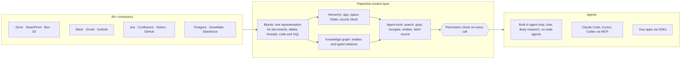

<div align="center">

**Translations:** [English](../../../README.md) · [Français](../fr/README.md) · [Deutsch](../de/README.md) · [简体中文](../zh-CN/README.md) · [日本語](../ja/README.md) · [Русский](../ru/README.md) · [עברית](../he/README.md) · [한국어](../ko/README.md) · [Español](../es/README.md) · [Português](../pt/README.md) · [Türkçe](../tr/README.md) · [Tiếng Việt](../vi/README.md) · **Italiano**

</div>

<div align="center">

<a href="https://www.pipeshub.com"></a>

<h3>Il livello di contesto open source per agenti IA</h3>

<p>
  <a href="https://www.pipeshub.com/">Website</a> ·
  <a href="https://docs.pipeshub.com/">Docs</a> ·
  <a href="https://discord.com/invite/K5RskzJBm2">Discord</a> ·
  <a href="https://plum-myrtle-9f7.notion.site/Pipeshub-s-Product-Roadmap-33841c164f54803a9989fd0fdbfdb1ee">Roadmap</a>
</p>

<a href="https://trendshift.io/repositories/14618"></a>

<p>
  <a href="https://opensource.org/licenses/Apache-2.0"></a>
  <a href="https://github.com/pipeshub-ai/pipeshub-ai/releases"></a>
  <a href="https://hub.docker.com/r/pipeshubai/pipeshub-ai"></a>
  <a href="https://discord.com/invite/K5RskzJBm2"></a>
  
  
  <a href="https://github.com/pipeshub-ai/pipeshub-ai/issues">
    
  </a>
  <a href="https://github.com/pipeshub-ai/pipeshub-ai/pulls">
    
  </a>
  <br/>
  <a href="https://x.com/PipesHub"></a>
  <a href="https://www.linkedin.com/company/pipeshub"></a>
  <br/>
  
  <br/>
  <a href="https://www.npmjs.com/package/@pipeshub-ai/sdk"></a>
  <a href="https://pypi.org/project/pipeshub-sdk/"></a>
  <a href="https://github.com/pipeshub-ai/pipeshub-sdk-go"></a>
  <a href="https://www.npmjs.com/package/@pipeshub-ai/mcp"></a>
</p>

</div>

<h2 id="about-pipeshub">Date ai vostri agenti IA una vera comprensione della vostra azienda</h2>

<strong>[PipesHub](https://www.pipeshub.com/)</strong> trasforma tutto ciò che la vostra azienda sa in uno spazio di lavoro che rispetta i permessi, che gli agenti IA esplorano come gli agenti di coding esplorano un repository. Gli agenti lo interrogano, ci fanno `grep`, ne percorrono le cartelle e il knowledge graph, leggono solo ciò che serve e citano il blocco esatto da cui viene ogni risposta.

Collegate Slack, Google Drive, GitHub, Microsoft 365, Jira, Notion, Postgres e oltre 25 altri sistemi. Usate la chat, la ricerca approfondita e gli agenti integrati, oppure fornite lo stesso contesto a Claude Code, Cursor, Codex e ai vostri agenti tramite MCP e gli SDK. Self-hosted, Apache 2.0, con il modello che preferite.

> [!TIP]
> Deploy con un solo comando:
> ```bash
> curl -fsSL https://get.pipeshub.com/install | bash
> ```

## Perché un livello di contesto?

Sulla conoscenza aziendale gli agenti falliscono di solito per il contesto, non per il modello. Il recupero top-k di frammenti consegna all'agente una manciata di pezzi e perde dove si trova ognuno, a cosa è collegato, chi può vederlo e da dove proviene.

Gli agenti di coding sono diventati bravi quando hanno potuto usare `ls`, `grep` e leggere un repository, invece di ricevere snippet incollati. PipesHub offre agli agenti la stessa cosa sui dati della vostra azienda.

| | RAG con frammenti top-k | PipesHub |
| --- | --- | --- |
| **Cosa vede prima l'agente** | Alcuni frammenti di testo | Nome, posizione, metadati e riepilogo di ogni record, più i blocchi corrispondenti |
| **Come approfondisce** | Non può: un solo recupero per domanda | Ricerca ibrida, `grep`/`find` sui record, navigazione tra cartelle e lookup nel knowledge graph, in un ciclo |
| **Struttura** | Persa durante il chunking | Ogni fonte diventa Blocks: sezioni, tabelle con righe e celle, thread, codice, tabelle SQL con il loro schema |
| **Permessi** | Spesso approssimati in fase di indicizzazione | Verificati sui permessi del sistema di origine per l'utente che fa la richiesta, a ogni chiamata di tool |
| **Citazioni** | Per frammento, se ci sono | Per blocco: la pagina, la cella di tabella, la riga, la slide o la riga di codice, con le citazioni inventate rimosse |

## Come funziona



Ogni fonte diventa **Blocks** (blocchi): un'unica rappresentazione che mantiene intatti tabelle, thread e codice e ricorda la pagina, la cella o la riga esatta da cui viene ogni blocco. Ogni documento è salvato come testo semplice, quindi gli agenti possono fare `grep` su un PDF, un file Word o una presentazione come su un file di testo. I Blocks sono organizzati in due modi: secondo la **struttura delle cartelle** di ogni sistema di origine e in un **knowledge graph** di persone, progetti e clienti. Gli agenti esplorano entrambi con **tool che mostrano i dettagli passo dopo passo**: una ricerca mostra prima il nome, il riepilogo e i passaggi corrispondenti di ogni record, e l'agente va più a fondo (grep, navigazione tra le cartelle, entità collegate, lettura del record completo) solo quando serve. **Ogni chiamata di tool viene verificata sui permessi del sistema di origine** per la persona per cui l'agente agisce.

**[Scopri come funziona il livello di contesto →](../../context-layer.md)** Copre il formato Block, la gerarchia e il grafo, ogni tool dell'agente e il codice in cui vive, l'applicazione dei permessi, il ciclo dell'agente e i limiti attuali.

## Cosa potete costruire con PipesHub

Un solo livello di contesto, tanti prodotti costruiti sopra. Usate le app integrate così come sono, oppure costruite le vostre tramite MCP e gli SDK.

| Cosa costruire | Cosa vi dà PipesHub | Da dove partire |
| --- | --- | --- |
| **Pipeline di RAG agentico** | Tool di recupero che un agente chiama in un ciclo (ricerca ibrida, `grep`, navigazione, lookup delle entità, lettura di record completi), con controlli dei permessi e citazioni a livello di blocco già pronti | [Starter SDK](https://github.com/pipeshub-ai/examples/tree/main/sdk-starter) · [MCP](#usatelo-da-claude-code-cursor-o-codex) |
| **Ricerca aziendale** | Una sola casella di ricerca su oltre 40 connettori che mostra a ogni persona solo ciò che può vedere, con risposte citate | Integrata · [esempio](https://github.com/pipeshub-ai/examples/tree/main/private-enterprise-search) |
| **Assistente IA per il lavoro** | Chat e ricerca approfondita sulla conoscenza aziendale, più ricerca web e input vocale | Integrato |
| **Contesto per agenti di coding** | Claude Code, Cursor e Codex rispondono partendo da design doc, ticket, incidenti e thread di chat, non solo dal codice | [esempio](https://github.com/pipeshub-ai/examples/tree/main/company-knowledge-mcp) |
| **Agenti e workflow builder no-code** | Un builder visuale drag-and-drop che collega la conoscenza aziendale ad azioni in Slack, Gmail, Jira, Confluence, GitHub, Linear, Notion, Salesforce, Zendesk, Freshdesk e altri 20 strumenti. Oppure costruite il vostro prodotto di workflow sulla stessa API, così ogni passaggio riceve un contesto che rispetta i permessi. | Integrato · [Costruire headless](#posso-usare-pipeshub-in-modalità-headless-senza-la-sua-interfaccia) |
| **Copilot per l'assistenza clienti** | Risposte tratte da ticket passati, runbook e documentazione (ServiceNow, Zammad, Jira, Confluence), con azioni direttamente nello strumento di ticketing | Integrato · SDK |
| **Intelligence su vendite e account** | Account, contatti e trattative di Salesforce nel knowledge graph, ricercabili insieme a email, documenti e chat sugli stessi clienti | Integrato |
| **Domande sui vostri database** | Tabelle di Postgres, MariaDB e Snowflake indicizzate con schemi e chiavi esterne, più sandbox che eseguono SQL e Python per l'analisi | Integrato |
| **Report, grafici e dashboard** | Gli agenti scrivono ed eseguono codice in una sandbox e restituiscono il risultato come artefatto condivisibile | Integrato |
| **Ricerca nella conoscenza di engineering** | Codice, pull request e commit da GitHub e GitLab, collegati ai ticket e ai documenti che li riguardano | Integrato |
| **Le vostre app sulla conoscenza aziendale** | SDK per Python, TypeScript e Go, "Sign in with PipesHub" perché ogni utente cerchi con la propria identità, e un'API di upload per i documenti non coperti da alcun connettore | [esempi](https://github.com/pipeshub-ai/examples) |
| **App legali e per i contratti (CLM)** | Fate domande sui contratti in Drive, SharePoint, Box o nei file caricati. Le risposte citano la clausola o la pagina esatta, e ogni persona vede solo i contratti a cui ha accesso. | [Costruire headless](#posso-usare-pipeshub-in-modalità-headless-senza-la-sua-interfaccia) |
| **IA privata e on-premise** | Tutto quanto sopra, self-hosted, con qualsiasi provider LLM o modelli locali tramite Ollama, con i dati che restano nella vostra infrastruttura | [Deploy](#-guida-al-deployment) |

## Usatelo da Claude Code, Cursor o Codex

**[Date al vostro assistente di coding un accesso sicuro alla conoscenza aziendale →](https://github.com/pipeshub-ai/examples/tree/main/company-knowledge-mcp)**

Circa dieci minuti, una volta che PipesHub è in esecuzione con i dati indicizzati. Create un Personal Access Token (non servono permessi di admin), collegate il vostro assistente (un comando per Claude Code, un file di configurazione per Cursor o Codex) e chiedete *"perché è stata cambiata la logica di retry nel worker di fatturazione?"* Risponde partendo dal postmortem dell'incidente, dalla pull request, dal thread di chat e dal design doc, ognuno citato, e solo se avete il permesso di vederli.

Tramite MCP, gli assistenti hanno già oggi i tool di ricerca, chat e record di PipesHub. Il resto dei tool dell'agente (`grep`, `navigate`, lookup delle entità) arriverà presto su MCP.

Volete lo stesso recupero dentro il vostro codice, o dietro una casella di ricerca per il team? Lo [starter SDK e l'esempio di ricerca](https://github.com/pipeshub-ai/examples) coprono entrambi i casi. Avete costruito qualcosa? [Mostratecelo](https://github.com/pipeshub-ai/examples/issues/new?template=showcase.yml).

## PipesHub in azione

### Citazioni


### Connettori


<details>
<summary><b>Altre demo: tutti i record, ricerca nella conoscenza</b></summary>

### Tutti i record


### Ricerca nella conoscenza


</details>

## Funzionalità

**Contesto per gli agenti**

- 🗂️ **Esplorabile, non solo ricercabile:** ricerca ibrida, `grep` su ogni documento (PDF e file Office inclusi), navigazione tra cartelle e lookup nel knowledge graph, tutti come tool dell'agente.
- 🔒 **Rispetta i permessi a ogni passo:** ogni chiamata di tool viene verificata sui permessi del sistema di origine per la persona per cui l'agente agisce.
- 📝 **Citazioni a livello di blocco:** le risposte citano la pagina, la cella di tabella, la riga, la slide o la riga di codice da cui provengono.
- 🧱 **Dati strutturati, semi-strutturati e non strutturati in un solo livello:** documenti, fogli di calcolo, ticket, thread di chat, codice e tabelle SQL diventano tutti Blocks.

**Collegato ai vostri sistemi**

- 🔌 **Oltre 40 connettori:** Google Workspace, Microsoft 365, Slack, Jira, Confluence, Notion, GitHub, GitLab, Salesforce, ServiceNow, Postgres, Snowflake e altri, con sincronizzazione in tempo reale e pianificata.
- 🕸️ **Knowledge graph:** entità e relazioni estratte in fase di indicizzazione e usate al momento della risposta.
- 🎙️ **Multimodale:** immagini, diagrammi e file scansionati, più l'input vocale.
- 🧠 **Il vostro modello, completamente self-hosted:** qualsiasi provider LLM o un modello locale, nella vostra infrastruttura.

## PipesHub Cloud

Preferite un PipesHub completamente gestito, senza gestire la vostra infrastruttura? PipesHub Cloud arriverà presto.

👉 **[Iscrivetevi alla lista d'attesa di Cloud](https://pipeshub.com/cloud-waitlist)** per avere accesso anticipato.

## Connettori

<p align="center">
<a href="https://pipeshub.com/connectors"></a>
</p>

## 🚀 Guida al deployment

PipesHub può girare in locale o essere distribuito su qualsiasi server con Docker Compose. L'installer interattivo gestisce tutta la configurazione — compresi segreti, graph DB, broker e scelta del tag dell'immagine — e genera un `.env` per voi.

> **HTTPS sui server cloud:** se distribuite PipesHub su un server cloud, usate un endpoint HTTPS. I browser bloccano alcune richieste su HTTP semplice. Usate Cloudflare, Nginx o Traefik per terminare il TLS. Una schermata bianca dopo un deployment solo HTTP è di solito causata da questa restrizione.

---

### ⚡ Avvio rapido (consigliato)

Richiede [Docker](https://docs.docker.com/get-docker/) con Compose v2. Un solo comando:

```bash
curl -fsSL https://get.pipeshub.com/install | bash
```

Scarica i file di deployment dell'ultima release in `./pipeshub` e
avvia l'installer interattivo. Aprite **http://localhost:3000** quando
ha finito.

> **Preferite leggere prima di eseguire?** Scaricate e controllate prima lo script:
>
> ```bash
> curl -fsSL https://get.pipeshub.com/install -o pipeshub-install.sh
> less pipeshub-install.sh        # review it
> bash pipeshub-install.sh
> ```

L'installer:
- Verifica i prerequisiti di Docker, RAM e disco
- Chiede se volete un deployment **slim** o **full**
- Vi permette di personalizzare, se volete, il graph DB, il message broker e il KV store
- Genera segreti casuali e scrive un file `.env`
- Scarica le immagini e avvia lo stack
- Attende che PipesHub sia in salute, verifica che sia raggiungibile e stampa l'URL

### 🛠️ Da un repository clonato (sviluppatori)

Per compilare dai sorgenti, contribuire o legare l'installer al vostro checkout:

```bash
git clone https://github.com/pipeshub-ai/pipeshub-ai.git
cd pipeshub-ai

# Same installer, run from the repo root
./install.sh
```

Per compilare immagini locali dai sorgenti serve questo percorso con il repository clonato (`./install.sh --build`);
l'installer a comando singolo qui sopra usa sempre immagini precompilate.

> **Opzioni avanzate:** i flag dell'installer (`--yes`, `--version`, `--reconfigure`, `--print-env-only`), le variabili d'ambiente per la CI, i tipi di deployment slim e full, l'uso manuale dei profili di Compose e le build locali dai sorgenti sono descritti in [Opzioni di deployment avanzate](../../../deployment/docker-compose/ADVANCED_DEPLOYMENT.md).

## Costruire su PipesHub: MCP e SDK

L'esperienza di ricerca integrata è un modo di usare PipesHub. Lo stesso contesto
collegato e filtrato per permessi è disponibile per i vostri agenti e applicazioni —
tramite MCP per qualsiasi client compatibile, o tramite gli SDK quando lo chiamate
dal vostro codice.

Un agente si collega come una persona specifica e non come l'applicazione, quindi
recupera esattamente ciò che quella persona può vedere. L'accesso viene risolto quando
la query viene eseguita, sui permessi del sistema di origine, invece di essere
approssimato in fase di build.

I tutorial passo passo per i casi più comuni — un MCP per il vostro assistente
di coding, la ricerca aziendale privata e gli starter SDK — si trovano in
[**pipeshub-ai/examples**](https://github.com/pipeshub-ai/examples). Il
materiale di riferimento per ogni componente è qui sotto.

### Server MCP

Usate PipesHub con qualsiasi client compatibile con MCP per portare il contesto aziendale nei vostri flussi di IA. Consultate il README per configurazione e uso.

**Repository:** [pipeshub-ai/mcp-server](https://github.com/pipeshub-ai/mcp-server/)

Usate [Omnigent](https://omnigent.ai)? Vedete [`integrations/omnigent/`](../../../integrations/omnigent/) per tre modi di collegarvi, da un attach dalla UI web a un kit di connessione via script.

### SDK

PipesHub offre SDK per Python, TypeScript e Go per integrarvi rapidamente. Consultate il README del repository di ogni SDK per i dettagli su configurazione e uso.

| Nome | Descrizione | Link |
|------|-------------|------|
| **Python SDK** | SDK Python per PipesHub | [pipeshub-ai/pipeshub-sdk-python](https://github.com/pipeshub-ai/pipeshub-sdk-python) |
| **TypeScript SDK** | SDK TypeScript per PipesHub | [pipeshub-ai/pipeshub-sdk-typescript](https://github.com/pipeshub-ai/pipeshub-sdk-typescript) |
| **Go SDK** | SDK Go per PipesHub | [pipeshub-ai/pipeshub-sdk-go](https://github.com/pipeshub-ai/pipeshub-sdk-go) |

> Vi serve un SDK in un altro linguaggio? Scriveteci a developer@pipeshub.com

## Roadmap

<p>Sviluppiamo in modo aperto. Ecco cosa è pronto e cosa arriverà:</p>

<ul>
<li>✅ 🤖 <strong>Agenti IA per il lavoro</strong>: builder di agenti no-code di prima classe</li>
<li>✅ 🔗 Supporto a <strong>MCP (Model Context Protocol)</strong>, sia server sia client</li>
<li>✅ 🧰 <strong>SDK per sviluppatori</strong></li>
<li>✅ 🔍 <strong>Ricerca nel codice</strong> su GitHub e GitLab</li>
<li>⬜ 👤 <strong>Ricerca personalizzata</strong> in base a team, ruolo e cronologia</li>
<li>✅ ☸️ Deployment su <strong>Kubernetes in produzione</strong> con impostazioni predefinite ad alta disponibilità</li>
<li>⬜ 📈 <strong>Rilevanza potenziata da PageRank</strong> su tutto il knowledge graph</li>
</ul>
<p>👉 <strong><a href="https://plum-myrtle-9f7.notion.site/Pipeshub-s-Product-Roadmap-33841c164f54803a9989fd0fdbfdb1ee">Vedete la roadmap completa del prodotto su Notion</a></strong></p>

<hr>

## 👥 Contribuire

Volete unirvi alla nostra community di sviluppatori? Leggete la nostra [Guida per i contributori](https://github.com/pipeshub-ai/pipeshub-ai/blob/main/CONTRIBUTING.md) per sapere come configurare l'ambiente di sviluppo, i nostri standard di codice e il flusso di contribuzione.
<h3>Dove trovare cosa</h3>

<table>

<tr><td>Fare una domanda o chiedere aiuto</td><td><a href="https://discord.com/invite/K5RskzJBm2">Discord</a></td></tr>
<tr><td>Segnalare un bug o richiedere una funzionalità</td><td><a href="https://github.com/pipeshub-ai/pipeshub-ai/issues">GitHub Issues</a></td></tr>
<tr><td>Segnalare un problema di sicurezza</td><td><a href="https://github.com/pipeshub-ai/pipeshub-ai/blob/main/SECURITY.md">Segnala un problema di sicurezza</a></td></tr>
<tr><td>Leggere la documentazione</td><td><a href="https://docs.pipeshub.com/">Documentazione di Pipeshub</a></td></tr>
<tr><td>Vedere cosa è cambiato in ogni release</td><td><a href="https://github.com/pipeshub-ai/pipeshub-ai/blob/main/CHANGELOG.md">Changelog</a></td></tr>
</table>

## Domande frequenti

### Che cos'è PipesHub?

PipesHub è il livello di contesto open source per agenti IA. Trasforma la conoscenza conservata nei sistemi della vostra azienda in uno spazio di lavoro che rispetta i permessi, in cui gli agenti possono cercare, fare `grep`, navigare e citare.

Collega sistemi come Slack, Google Drive, GitHub, Microsoft 365 e Notion e rende disponibile ciò che contengono in due modi: ricerca con citazioni che rispetta i permessi per il vostro team, e contesto affidabile per i vostri agenti IA tramite API, SDK e MCP. Gli agenti ottengono la stessa vista governata della conoscenza aziendale che avrebbe una persona, con gli stessi controlli di accesso, così possono rispondere da dati aziendali reali invece di tirare a indovinare tra strumenti diversi. Potete usare l'esperienza di ricerca integrata, oppure costruirci sopra i vostri agenti, workflow e applicazioni.

### Posso usare PipesHub in modalità headless, senza la sua interfaccia?

Sì. L'app web di PipesHub usa la stessa API che potete chiamare voi stessi, quindi tutto ciò che fate nell'interfaccia potete farlo anche dal codice: collegare fonti, caricare file, gestire utenti e permessi, cercare, chattare, e creare ed eseguire agenti.

- **API REST:** una [specifica OpenAPI](../../../backend/nodejs/apps/src/modules/api-docs/pipeshub-openapi.yaml) con circa 300 endpoint. Consultatela su `/api/v1/docs` nella vostra istanza.
- **SDK:** [Python](https://github.com/pipeshub-ai/pipeshub-sdk-python), [TypeScript](https://github.com/pipeshub-ai/pipeshub-sdk-typescript) e [Go](https://github.com/pipeshub-ai/pipeshub-sdk-go).
- **MCP:** per Claude Code, Cursor, Codex e altri client MCP.

Scegliete come accede il vostro codice:
- **Personal Access Token o OAuth:** agisce come una persona e vede solo ciò che quella persona può vedere.
- **Account di servizio:** per i job in background, con i propri permessi.
- **App OAuth:** permette a ogni utente della vostra app di accedere con la propria identità ("Sign in with PipesHub").

I team lo usano per costruire i propri prodotti su PipesHub, come workflow builder, strumenti legali e di gestione dei contratti (CLM), console di supporto e agenti interni, senza mostrare l'interfaccia di PipesHub.

### In cosa PipesHub è diverso da altri strumenti di IA per il lavoro?

La maggior parte degli strumenti passa a un modello di IA qualche frammento di testo recuperato. PipesHub dà agli agenti i tool per esplorare la conoscenza aziendale come un agente di coding esplora un repository: ricerca ibrida, `grep` sui record, navigazione tra cartelle e lookup nel knowledge graph, ognuno verificato sui permessi dell'utente richiedente nel sistema di origine. Ogni fonte diventa Blocks, quindi le risposte citano la pagina, la cella di tabella, la riga o la slide esatta. È completamente open source (Apache 2.0) e self-hostable, quindi i vostri dati non lasciano mai la vostra infrastruttura. Vedete [Perché un livello di contesto?](#perché-un-livello-di-contesto)

### Quali connettori supporta PipesHub?

PipesHub ha oltre 40 connettori per più di 30 sistemi, con indicizzazione in tempo reale e pianificata. Vedete la [panoramica dei connettori](https://docs.pipeshub.com/connectors/overview).

### Quali provider LLM supporta PipesHub?

PipesHub segue l'approccio "Bring Your Own Model" (portate il vostro modello) — potete usare qualsiasi provider LLM. Distribuitelo nella vostra VPC con i modelli che preferite.

**Altre domande:** formati di file, stack tecnologico, knowledge graph, supporto multimodale e risoluzione dei problemi sono trattati nelle [FAQ complete](../../FAQ.md).

<hr>
<div align="center">
<h3>⭐ Metteteci una stella su GitHub!</h3>

<p>Aiuta il progetto a raggiungere i team che ne hanno bisogno.</p>

<p>
<a href="https://github.com/pipeshub-ai/pipeshub-ai">

</a>
</p>

<p>
<a href="https://www.star-history.com/?repos=pipeshub-ai%2Fpipeshub-ai">
 <picture>
   <source media="(prefers-color-scheme: dark)" srcset="https://api.star-history.com/chart?repos=pipeshub-ai/pipeshub-ai&amp;type=date&amp;theme=dark&amp;legend=top-left&amp;sealed_token=msbcJ843ZmXCld8-zgduwH9hV6yn69hyfrnwfkcWiRqe7htnO6pSbQJrkxdoarzriLW6aGAETT-iQ3m7yWN3BacAyPyHfNIiPGabl6r6CbXFjcvJ7n1NZw" />
   <source media="(prefers-color-scheme: light)" srcset="https://api.star-history.com/chart?repos=pipeshub-ai/pipeshub-ai&amp;type=date&amp;legend=top-left&amp;sealed_token=msbcJ843ZmXCld8-zgduwH9hV6yn69hyfrnwfkcWiRqe7htnO6pSbQJrkxdoarzriLW6aGAETT-iQ3m7yWN3BacAyPyHfNIiPGabl6r6CbXFjcvJ7n1NZw" />
   
 </picture>
</a>
</p>

<p><sub>Realizzato con ❤️ dal <a href="https://www.pipeshub.com/">team di PipesHub</a> e da contributori di tutto il mondo.</sub></p>

</div>

