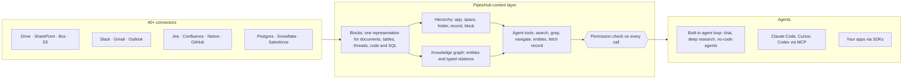

<div align="center">

**Translations:** [English](../../../README.md) · [Français](../fr/README.md) · [Deutsch](../de/README.md) · [简体中文](../zh-CN/README.md) · **日本語** · [Русский](../ru/README.md) · [עברית](../he/README.md) · [한국어](../ko/README.md) · [Español](../es/README.md) · [Português](../pt/README.md) · [Türkçe](../tr/README.md) · [Tiếng Việt](../vi/README.md) · [Italiano](../it/README.md)

</div>

<div align="center">

<a href="https://www.pipeshub.com"></a>

<h3>AI エージェントのためのオープンソース・コンテキストレイヤー</h3>

<p>
  <a href="https://www.pipeshub.com/">ウェブサイト</a> ·
  <a href="https://docs.pipeshub.com/">ドキュメント</a> ·
  <a href="https://discord.com/invite/K5RskzJBm2">Discord</a> ·
  <a href="https://plum-myrtle-9f7.notion.site/Pipeshub-s-Product-Roadmap-33841c164f54803a9989fd0fdbfdb1ee">ロードマップ</a>
</p>

<a href="https://trendshift.io/repositories/14618"></a>

<p>
  <a href="https://opensource.org/licenses/Apache-2.0"></a>
  <a href="https://github.com/pipeshub-ai/pipeshub-ai/releases"></a>
  <a href="https://hub.docker.com/r/pipeshubai/pipeshub-ai"></a>
  <a href="https://discord.com/invite/K5RskzJBm2"></a>
  
  
  <a href="https://github.com/pipeshub-ai/pipeshub-ai/issues">
    
  </a>
  <a href="https://github.com/pipeshub-ai/pipeshub-ai/pulls">
    
  </a>
  <br/>
  <a href="https://x.com/PipesHub"></a>
  <a href="https://www.linkedin.com/company/pipeshub"></a>
  <br/>
  
  <br/>
  <a href="https://www.npmjs.com/package/@pipeshub-ai/sdk"></a>
  <a href="https://pypi.org/project/pipeshub-sdk/"></a>
  <a href="https://github.com/pipeshub-ai/pipeshub-sdk-go"></a>
  <a href="https://www.npmjs.com/package/@pipeshub-ai/mcp"></a>
</p>

</div>

<h2 id="about-pipeshub">AI エージェントに、会社を本当に理解させる</h2>

<strong>[PipesHub](https://www.pipeshub.com/)</strong> は、社内にあるあらゆる知識を権限を考慮したワークスペースに変えます。AI エージェントは、コーディングエージェントがリポジトリを探索するのと同じようにこのワークスペースを探索します。検索し、`grep` をかけ、フォルダーやナレッジグラフをたどり、必要なものだけを読み、各回答の出典となったブロックを正確に引用します。

Slack、Google Drive、GitHub、Microsoft 365、Jira、Notion、Postgres をはじめ、25 以上のシステムと接続できます。組み込みのチャット、ディープリサーチ、エージェントを使うことも、同じコンテキストを MCP や SDK 経由で Claude Code、Cursor、Codex、独自のエージェントに渡すこともできます。セルフホスト型で、Apache 2.0 ライセンス、モデルは自由に持ち込めます。

> [!TIP]
> コマンド 1 つでデプロイできます：
> ```bash
> curl -fsSL https://get.pipeshub.com/install | bash
> ```

## なぜコンテキストレイヤーなのか？

社内の知識でエージェントがうまく動かない原因は、たいていモデルではなくコンテキストにあります。Top-k のチャンク検索では、エージェントに渡されるのは断片がいくつかだけです。各断片がどこにあり、何とつながり、誰が閲覧でき、どこから来たのかは失われます。

コーディングエージェントが実用的になったのは、貼り付けられたスニペットを受け取るだけでなく、リポジトリに対して `ls` や `grep` を実行し、中身を読めるようになってからです。PipesHub は、社内データに対して同じことをエージェントに可能にします。

| | Top-k チャンク RAG | PipesHub |
| --- | --- | --- |
| **エージェントが最初に見るもの** | 数個のテキストチャンク | 各レコードの名前、場所、メタデータ、要約、そして一致したブロック |
| **さらに掘り下げる方法** | できない：1 つの質問につき検索は 1 回 | ハイブリッド検索、レコードへの `grep`/`find`、フォルダーナビゲーション、ナレッジグラフ検索をループで実行 |
| **構造** | チャンク化で失われる | すべてのソースが Blocks になる：セクション、行とセルを持つテーブル、スレッド、コード、スキーマ付きの SQL テーブル |
| **権限** | インデックス作成時に近似されることが多い | ツール呼び出しのたびに、リクエストしたユーザーについてソースシステムの権限と照合 |
| **引用** | チャンク単位（あれば） | ブロック単位：ページ、テーブルのセル、行、スライド、行番号。捏造された引用は除去 |

## 仕組み



すべてのソースは **Blocks**（ブロック）になります。Blocks はテーブル、スレッド、コードをそのまま保つ単一の表現で、各ブロックがどのページ、セル、行から来たのかを正確に記録します。Blocks は 2 つの方法で整理されます。各ソースシステムの**フォルダー構造**と、人、プロジェクト、顧客の**ナレッジグラフ**です。エージェントは**詳細を段階的に示すツール**で両方を探索します。検索ではまず各レコードの名前、要約、一致した箇所が表示され、エージェントは必要なときだけさらに掘り下げます（grep、フォルダーの閲覧、エンティティの追跡、レコード全体の読み込み）。**すべてのツール呼び出しは、エージェントが代理で動いている人について、ソースシステムの権限と照合されます。**

**[コンテキストレイヤーの仕組みを読む →](../../context-layer.md)** Block フォーマット、階層とグラフ、各エージェントツールとその実装コード、権限の適用、エージェントループ、現時点での制約を説明しています。

## PipesHub で構築できるもの

1 つのコンテキストレイヤーの上に、多くのプロダクトを載せられます。組み込みのアプリをそのまま使うことも、MCP や SDK で独自のアプリを構築することもできます。

| 構築するもの | PipesHub が提供するもの | はじめかた |
| --- | --- | --- |
| **エージェント型 RAG パイプライン** | エージェントがループで呼び出す検索ツール（ハイブリッド検索、`grep`、ナビゲーション、エンティティ検索、レコード全体の読み込み）。権限チェックとブロック単位の引用は組み込み済み | [SDK スターター](https://github.com/pipeshub-ai/examples/tree/main/sdk-starter) · [MCP](#claude-codecursorcodex-から使う) |
| **エンタープライズ検索** | 40 以上のコネクターを横断する 1 つの検索ボックス。各ユーザーには閲覧できるものだけを表示し、引用付きで回答 | 組み込み · [サンプル](https://github.com/pipeshub-ai/examples/tree/main/private-enterprise-search) |
| **職場向け AI アシスタント** | 社内の知識を対象にしたチャットとディープリサーチ。Web 検索と音声入力にも対応 | 組み込み |
| **コーディングエージェントのためのコンテキスト** | Claude Code、Cursor、Codex が、コードだけでなく設計ドキュメント、チケット、インシデント、チャットのスレッドをもとに回答 | [サンプル](https://github.com/pipeshub-ai/examples/tree/main/company-knowledge-mcp) |
| **ノーコードのエージェントとワークフロービルダー** | 社内の知識を Slack、Gmail、Jira、Confluence、GitHub、Linear、Notion、Salesforce、Zendesk、Freshdesk ほか 20 のツールでのアクションにつなぐ、ドラッグ＆ドロップのビジュアルビルダー。同じ API の上に独自のワークフロープロダクトを構築することもでき、どのステップにも権限を考慮したコンテキストが渡ります。 | 組み込み · [ヘッドレスで構築](#pipeshub-を-ui-なしのヘッドレスで使えますか) |
| **カスタマーサポート向けコパイロット** | 過去のチケット、ランブック、ドキュメント（ServiceNow、Zammad、Jira、Confluence）をもとに回答し、チケット管理ツールでアクションも実行 | 組み込み · SDK |
| **営業・アカウントインテリジェンス** | Salesforce の取引先、連絡先、商談をナレッジグラフに取り込み、同じ顧客に関するメール、ドキュメント、チャットと合わせて検索 | 組み込み |
| **データベースへの質問** | Postgres、MariaDB、Snowflake のテーブルをスキーマや外部キーとともにインデックス化。分析用に SQL や Python を実行するサンドボックスも用意 | 組み込み |
| **レポート、チャート、ダッシュボード** | エージェントがサンドボックスでコードを書いて実行し、結果を共有可能なアーティファクトとして返す | 組み込み |
| **エンジニアリングナレッジ検索** | GitHub と GitLab のコード、プルリクエスト、コミットを、関連するチケットやドキュメントと結び付けて検索 | 組み込み |
| **社内の知識を使った独自アプリ** | Python、TypeScript、Go の SDK、各ユーザーが本人として検索できる「Sign in with PipesHub」、そしてどのコネクターでも扱えないドキュメント向けのアップロード API | [サンプル](https://github.com/pipeshub-ai/examples) |
| **法務・契約（CLM）アプリ** | Drive、SharePoint、Box、アップロードしたファイルにある契約書について質問できます。回答は条項やページを正確に引用し、各ユーザーには閲覧を許可された契約書だけが表示されます。 | [ヘッドレスで構築](#pipeshub-を-ui-なしのヘッドレスで使えますか) |
| **プライベートなオンプレミス AI** | 上記のすべてをセルフホストで。任意の LLM プロバイダーや Ollama 経由のローカルモデルを使い、データは自社のインフラ内に保持 | [デプロイ](#-デプロイガイド) |

## Claude Code、Cursor、Codex から使う

**[コーディングアシスタントに社内の知識への安全なアクセスを与える →](https://github.com/pipeshub-ai/examples/tree/main/company-knowledge-mcp)**

PipesHub が稼働し、データのインデックス作成が済んでいれば、10 分ほどで完了します。Personal Access Token を発行し（管理者権限は不要）、アシスタントを接続して（Claude Code ならコマンド 1 つ、Cursor や Codex なら設定ファイル 1 つ）、*「請求ワーカーのリトライ処理はなぜ変更されたのか？」* と尋ねてみてください。インシデントのポストモーテム、プルリクエスト、チャットのスレッド、設計ドキュメントをもとに、それぞれ引用付きで回答します。もちろん、あなたに閲覧権限があるものだけです。

現在、アシスタントは MCP 経由で PipesHub の検索、チャット、レコードのツールを使えます。残りのエージェントツール（`grep`、`navigate`、エンティティ検索）は、次に MCP に対応する予定です。

同じ検索を自分のコードの中で使いたい、あるいはチームのための検索ボックスの裏側に置きたい場合は、[SDK スターターと検索サンプル](https://github.com/pipeshub-ai/examples) がどちらにも対応しています。何か作りましたか？ [ぜひ見せてください](https://github.com/pipeshub-ai/examples/issues/new?template=showcase.yml)。

## PipesHub の動作例

### 引用


### コネクター


<details>
<summary><b>その他のデモ：すべてのレコード、ナレッジ検索</b></summary>

### すべてのレコード


### ナレッジ検索


</details>

## 機能

**エージェントのためのコンテキスト**

- 🗂️ **検索できるだけでなく、探索できる：** ハイブリッド検索、レコードへの `grep`、フォルダーナビゲーション、ナレッジグラフ検索を、すべてエージェントツールとして提供します。
- 🔒 **すべてのステップで権限を考慮：** すべてのツール呼び出しは、エージェントが代理で動いている人について、ソースシステムの権限と照合されます。
- 📝 **ブロック単位の引用：** 回答は、出典となったページ、テーブルのセル、行、スライド、行番号を引用します。
- 🧱 **構造化・半構造化・非構造化データを 1 つのレイヤーに：** ドキュメント、スプレッドシート、チケット、チャットのスレッド、コード、SQL テーブルのすべてが Blocks になります。

**社内システムとつながる**

- 🔌 **40 以上のコネクター：** Google Workspace、Microsoft 365、Slack、Jira、Confluence、Notion、GitHub、GitLab、Salesforce、ServiceNow、Postgres、Snowflake など。リアルタイム同期とスケジュール同期に対応します。
- 🕸️ **ナレッジグラフ：** インデックス作成時にエンティティと関係を抽出し、回答時に活用します。
- 🎙️ **マルチモーダル：** 画像、図、スキャンしたファイルに加え、音声入力にも対応します。
- 🧠 **モデルは持ち込み自由、完全セルフホスト：** 任意の LLM プロバイダーやローカルモデルを、自社のインフラにデプロイして使えます。

## PipesHub Cloud

自社でインフラを運用せず、フルマネージドの PipesHub を使いたいですか？ PipesHub Cloud はまもなく登場します。

👉 **[Cloud のウェイトリストに登録](https://pipeshub.com/cloud-waitlist)** して、いち早くアクセスしましょう。

## コネクター

<p align="center">
<a href="https://pipeshub.com/connectors"></a>
</p>

## 🚀 デプロイガイド

PipesHub はローカルで実行することも、Docker Compose を使って任意のサーバーにデプロイすることもできます。対話式インストーラーが、シークレット、グラフ DB、メッセージブローカー、イメージタグの選択を含むすべての設定を処理し、`.env` を生成します。

> **クラウドサーバーでの HTTPS：** PipesHub をクラウドサーバーにデプロイする場合は、HTTPS エンドポイントを使ってください。ブラウザーは、平文の HTTP 経由の一部のリクエストをブロックします。TLS の終端には Cloudflare、Nginx、Traefik を使用してください。HTTP のみでデプロイした後に白い画面が表示される場合、原因はたいていこの制限です。

---

### ⚡ クイックスタート（推奨）

Compose v2 を含む [Docker](https://docs.docker.com/get-docker/) が必要です。コマンドは 1 つだけです：

```bash
curl -fsSL https://get.pipeshub.com/install | bash
```

このコマンドは最新リリースのデプロイファイルを `./pipeshub` にダウンロードし、
対話式インストーラーを起動します。完了したら **http://localhost:3000** を
開いてください。

> **実行前に中身を確認したい場合：** まずスクリプトをダウンロードして確認できます：
>
> ```bash
> curl -fsSL https://get.pipeshub.com/install -o pipeshub-install.sh
> less pipeshub-install.sh        # review it
> bash pipeshub-install.sh
> ```

インストーラーは次のことを行います：
- Docker、RAM、ディスクの前提条件を確認する
- **slim**（軽量）と **full**（フル）のどちらのデプロイにするかを尋ねる
- 必要に応じて、グラフ DB、メッセージブローカー、KV ストアをカスタマイズできるようにする
- ランダムなシークレットを生成し、`.env` ファイルに書き込む
- イメージを取得し、スタックを起動する
- PipesHub が正常な状態になるまで待ち、アクセスできることを確認して URL を表示する

### 🛠️ クローンしたリポジトリから（開発者向け）

ソースからビルドする、コントリビュートする、またはインストーラーを手元のチェックアウトに固定する場合：

```bash
git clone https://github.com/pipeshub-ai/pipeshub-ai.git
cd pipeshub-ai

# Same installer, run from the repo root
./install.sh
```

ソースからローカルイメージをビルドするには、このクローンしたリポジトリを使う方法（`./install.sh --build`）が必要です。
上記のワンコマンドインストーラーは、常にビルド済みイメージを使います。

> **高度なオプション：** インストーラーのフラグ（`--yes`、`--version`、`--reconfigure`、`--print-env-only`）、CI 用の環境変数、slim と full のデプロイタイプの違い、Compose プロファイルの手動利用、ローカルでのソースビルドについては、[高度なデプロイオプション](../../../deployment/docker-compose/ADVANCED_DEPLOYMENT.md)で説明しています。

## PipesHub で構築する：MCP と SDK

組み込みの検索機能は、PipesHub の使い方の 1 つにすぎません。接続済みで
権限によるフィルタリングが済んだ同じコンテキストを、独自のエージェントや
アプリケーションでも利用できます。互換クライアントからは MCP 経由で、
自分のコードから呼び出す場合は SDK を通じて使えます。

エージェントはアプリケーションとしてではなく、特定の人として接続します。
そのため、その人が閲覧を許可されているものだけを正確に取得します。アクセス権は
ビルド時に近似されるのではなく、クエリの実行時にソースシステム自身の権限に
基づいて判定されます。

よくある構築例のステップバイステップのチュートリアル（コーディングアシスタント向けの
MCP、プライベートなエンタープライズ検索、SDK スターター）は
[**pipeshub-ai/examples**](https://github.com/pipeshub-ai/examples) にあります。
各構成要素のリファレンスは以下のとおりです。

### MCP サーバー

MCP 互換のクライアントで PipesHub を使い、エンタープライズのコンテキストを AI ワークフローに取り込めます。セットアップと使い方は README を参照してください。

**リポジトリ：** [pipeshub-ai/mcp-server](https://github.com/pipeshub-ai/mcp-server/)

[Omnigent](https://omnigent.ai) を使っていますか？ [`integrations/omnigent/`](../../../integrations/omnigent/) に、Web UI からの接続からスクリプト化された接続キットまで、3 つの接続方法があります。

### SDK

PipesHub は Python、TypeScript、Go 向けの開発者 SDK を提供しており、すばやく統合できます。セットアップと使い方の詳細は、各 SDK リポジトリの README を参照してください。

| 名前 | 説明 | リンク |
|------|-------------|------|
| **Python SDK** | PipesHub 用 Python SDK | [pipeshub-ai/pipeshub-sdk-python](https://github.com/pipeshub-ai/pipeshub-sdk-python) |
| **TypeScript SDK** | PipesHub 用 TypeScript SDK | [pipeshub-ai/pipeshub-sdk-typescript](https://github.com/pipeshub-ai/pipeshub-sdk-typescript) |
| **Go SDK** | PipesHub 用 Go SDK | [pipeshub-ai/pipeshub-sdk-go](https://github.com/pipeshub-ai/pipeshub-sdk-go) |

> 他の言語の SDK が必要ですか？ developer@pipeshub.com までご連絡ください。

## ロードマップ

<p>私たちはオープンに開発しています。完了したことと、次に取り組むことは以下のとおりです：</p>

<ul>
<li>✅ 🤖 <strong>職場向け AI エージェント</strong>：本格的なノーコードエージェントビルダー</li>
<li>✅ 🔗 <strong>MCP（Model Context Protocol）</strong>のサポート（サーバーとクライアントの両方）</li>
<li>✅ 🧰 <strong>開発者向け SDK</strong></li>
<li>✅ 🔍 GitHub と GitLab をまたいだ<strong>コード検索</strong></li>
<li>⬜ 👤 チーム、役割、履歴に基づく<strong>パーソナライズ検索</strong></li>
<li>✅ ☸️ HA を前提としたデフォルト設定による<strong>本番運用向け Kubernetes</strong> デプロイ</li>
<li>⬜ 📈 ナレッジグラフ全体での <strong>PageRank による関連度の強化</strong></li>
</ul>
<p>👉 <strong><a href="https://plum-myrtle-9f7.notion.site/Pipeshub-s-Product-Roadmap-33841c164f54803a9989fd0fdbfdb1ee">Notion で製品ロードマップの全体を見る</a></strong></p>

<hr>

## 👥 コントリビュート

開発者コミュニティに参加しませんか？ 開発環境のセットアップ方法、コーディング規約、コントリビューションの流れについては、[コントリビューションガイド](https://github.com/pipeshub-ai/pipeshub-ai/blob/main/CONTRIBUTING.md)をご覧ください。
<h3>目的別の窓口</h3>

<table>

<tr><td>質問する・サポートを受ける</td><td><a href="https://discord.com/invite/K5RskzJBm2">Discord</a></td></tr>
<tr><td>バグの報告・機能のリクエスト</td><td><a href="https://github.com/pipeshub-ai/pipeshub-ai/issues">GitHub Issues</a></td></tr>
<tr><td>セキュリティ問題の報告</td><td><a href="https://github.com/pipeshub-ai/pipeshub-ai/blob/main/SECURITY.md">セキュリティ問題を報告</a></td></tr>
<tr><td>ドキュメントを読む</td><td><a href="https://docs.pipeshub.com/">Pipeshub ドキュメント</a></td></tr>
<tr><td>各リリースの変更点を見る</td><td><a href="https://github.com/pipeshub-ai/pipeshub-ai/blob/main/CHANGELOG.md">変更履歴</a></td></tr>
</table>

## よくある質問

### PipesHub とは何ですか？

PipesHub は、AI エージェントのためのオープンソースのコンテキストレイヤーです。社内のさまざまな業務システムに蓄積された知識を、権限を考慮したワークスペースに変えます。エージェントはそこで検索、`grep`、ナビゲート、引用ができます。

Slack、Google Drive、GitHub、Microsoft 365、Notion などのシステムと接続し、そこにある情報を 2 つの形で利用できるようにします。1 つはチーム向けの、引用付きで権限を考慮した検索です。もう 1 つは、API、SDK、MCP を通じて AI エージェントに提供する信頼できるコンテキストです。エージェントは人と同じように統制された社内知識のビューを得て、同じアクセス制御が適用されます。そのため、ツールをまたいで推測するのではなく、実際の社内データに基づいて回答できます。組み込みの検索機能を使うことも、その上に独自のエージェント、ワークフロー、アプリケーションを構築することもできます。

### PipesHub を UI なしのヘッドレスで使えますか？

はい。PipesHub の Web アプリは、あなた自身も呼び出せる同じ API を使っています。そのため、UI でできることはすべてコードでもできます。ソースの接続、ファイルのアップロード、ユーザーと権限の管理、検索、チャット、エージェントの構築と実行などです。

- **REST API：** 約 300 のエンドポイントを持つ [OpenAPI 仕様](../../../backend/nodejs/apps/src/modules/api-docs/pipeshub-openapi.yaml)。インスタンスの `/api/v1/docs` で閲覧できます。
- **SDK：** [Python](https://github.com/pipeshub-ai/pipeshub-sdk-python)、[TypeScript](https://github.com/pipeshub-ai/pipeshub-sdk-typescript)、[Go](https://github.com/pipeshub-ai/pipeshub-sdk-go)。
- **MCP：** Claude Code、Cursor、Codex などの MCP クライアント向け。

コードのサインイン方法を選んでください：
- **Personal Access Token または OAuth：** 1 人のユーザーとして動作し、その人が閲覧できるものだけを参照します。
- **サービスアカウント：** バックグラウンドジョブ向けで、独自の権限を持ちます。
- **OAuth アプリ：** アプリの各ユーザーが本人としてサインインできるようにします（「Sign in with PipesHub」）。

チームはこれを使って、PipesHub の上に独自のプロダクトを構築しています。たとえばワークフロービルダー、法務・契約管理（CLM）ツール、サポートコンソール、社内エージェントなどです。PipesHub の UI は表示しません。

### PipesHub は他の職場向け AI ツールと何が違うのですか？

多くのツールは、検索で取得したテキストチャンクをいくつか AI モデルに渡すだけです。PipesHub は、コーディングエージェントがリポジトリを探索するように社内の知識を探索するためのツールをエージェントに与えます。ハイブリッド検索、レコードへの `grep`、フォルダーナビゲーション、ナレッジグラフ検索で、いずれもソースシステムにおけるリクエストしたユーザーの権限と照合されます。すべてのソースが Blocks になるため、回答はページ、テーブルのセル、行、スライドを正確に引用できます。完全なオープンソース（Apache 2.0）でセルフホストできるので、データが自社のインフラの外に出ることはありません。[なぜコンテキストレイヤーなのか？](#なぜコンテキストレイヤーなのか)を参照してください。

### PipesHub はどのコネクターに対応していますか？

PipesHub は 30 以上のシステムにわたる 40 以上のコネクターを備え、リアルタイムとスケジュールによるインデックス作成に対応しています。[コネクターの概要](https://docs.pipeshub.com/connectors/overview)を参照してください。

### PipesHub はどの LLM プロバイダーに対応していますか？

PipesHub は「Bring Your Own Model（モデルの持ち込み）」に対応しており、任意の LLM プロバイダーを使えます。好みのモデルと組み合わせて、自社の VPC にデプロイできます。

**その他の質問：** ファイル形式、技術スタック、ナレッジグラフ、マルチモーダル対応、トラブルシューティングについては、[FAQ の全文](../../FAQ.md)で回答しています。

<hr>
<div align="center">
<h3>⭐ GitHub でスターをお願いします！</h3>

<p>このプロジェクトを必要としているチームに届ける助けになります。</p>

<p>
<a href="https://github.com/pipeshub-ai/pipeshub-ai">

</a>
</p>

<p>
<a href="https://www.star-history.com/?repos=pipeshub-ai%2Fpipeshub-ai">
 <picture>
   <source media="(prefers-color-scheme: dark)" srcset="https://api.star-history.com/chart?repos=pipeshub-ai/pipeshub-ai&amp;type=date&amp;theme=dark&amp;legend=top-left&amp;sealed_token=msbcJ843ZmXCld8-zgduwH9hV6yn69hyfrnwfkcWiRqe7htnO6pSbQJrkxdoarzriLW6aGAETT-iQ3m7yWN3BacAyPyHfNIiPGabl6r6CbXFjcvJ7n1NZw" />
   <source media="(prefers-color-scheme: light)" srcset="https://api.star-history.com/chart?repos=pipeshub-ai/pipeshub-ai&amp;type=date&amp;legend=top-left&amp;sealed_token=msbcJ843ZmXCld8-zgduwH9hV6yn69hyfrnwfkcWiRqe7htnO6pSbQJrkxdoarzriLW6aGAETT-iQ3m7yWN3BacAyPyHfNIiPGabl6r6CbXFjcvJ7n1NZw" />
   
 </picture>
</a>
</p>

<p><sub><a href="https://www.pipeshub.com/">PipesHub チーム</a>と世界中のコントリビューターが ❤️ を込めて開発しています。</sub></p>

</div>
