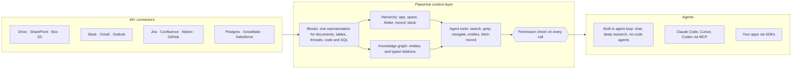

<div align="center">

**Translations:** [English](../../../README.md) · [Français](../fr/README.md) · [Deutsch](../de/README.md) · [简体中文](../zh-CN/README.md) · [日本語](../ja/README.md) · [Русский](../ru/README.md) · [עברית](../he/README.md) · **한국어** · [Español](../es/README.md) · [Português](../pt/README.md) · [Türkçe](../tr/README.md) · [Tiếng Việt](../vi/README.md) · [Italiano](../it/README.md)

</div>

<div align="center">

<a href="https://www.pipeshub.com"></a>

<h3>AI 에이전트를 위한 오픈소스 컨텍스트 레이어</h3>

<p>
  <a href="https://www.pipeshub.com/">웹사이트</a> ·
  <a href="https://docs.pipeshub.com/">문서</a> ·
  <a href="https://discord.com/invite/K5RskzJBm2">Discord</a> ·
  <a href="https://plum-myrtle-9f7.notion.site/Pipeshub-s-Product-Roadmap-33841c164f54803a9989fd0fdbfdb1ee">로드맵</a>
</p>

<a href="https://trendshift.io/repositories/14618"></a>

<p>
  <a href="https://opensource.org/licenses/Apache-2.0"></a>
  <a href="https://github.com/pipeshub-ai/pipeshub-ai/releases"></a>
  <a href="https://hub.docker.com/r/pipeshubai/pipeshub-ai"></a>
  <a href="https://discord.com/invite/K5RskzJBm2"></a>
  
  
  <a href="https://github.com/pipeshub-ai/pipeshub-ai/issues">
    
  </a>
  <a href="https://github.com/pipeshub-ai/pipeshub-ai/pulls">
    
  </a>
  <br/>
  <a href="https://x.com/PipesHub"></a>
  <a href="https://www.linkedin.com/company/pipeshub"></a>
  <br/>
  
  <br/>
  <a href="https://www.npmjs.com/package/@pipeshub-ai/sdk"></a>
  <a href="https://pypi.org/project/pipeshub-sdk/"></a>
  <a href="https://github.com/pipeshub-ai/pipeshub-sdk-go"></a>
  <a href="https://www.npmjs.com/package/@pipeshub-ai/mcp"></a>
</p>

</div>

<h2 id="about-pipeshub">에이전트에게 청크 더미가 아니라 워크스페이스를 주세요</h2>

<strong>[PipesHub](https://www.pipeshub.com/)</strong>는 회사가 가진 모든 지식을 권한을 인식하는 워크스페이스로 바꿉니다. AI 에이전트는 코딩 에이전트가 저장소를 탐색하듯 이 워크스페이스를 탐색합니다. 검색하고, `grep`을 실행하고, 폴더와 지식 그래프를 따라가며, 필요한 것만 읽고, 각 답변의 출처가 된 블록을 정확히 인용합니다.

Slack, Google Drive, GitHub, Microsoft 365, Jira, Notion, Postgres를 비롯해 25개 이상의 시스템을 연결하세요. 내장된 채팅, 딥 리서치, 에이전트를 사용할 수도 있고, 같은 컨텍스트를 MCP와 SDK를 통해 Claude Code, Cursor, Codex, 그리고 직접 만든 에이전트에 제공할 수도 있습니다. 셀프 호스팅, Apache 2.0 라이선스이며, 원하는 모델을 직접 가져와 쓸 수 있습니다.

> [!TIP]
> 명령어 하나로 배포하세요:
> ```bash
> curl -fsSL https://get.pipeshub.com/install | bash
> ```

## 왜 컨텍스트 레이어인가?

에이전트가 회사 지식을 다루지 못하는 이유는 대개 모델이 아니라 컨텍스트에 있습니다. Top-k 청크 검색은 에이전트에게 조각 몇 개만 건네고, 각 조각이 어디에 있는지, 무엇과 연결되는지, 누가 볼 수 있는지, 어디서 왔는지는 버립니다.

코딩 에이전트가 쓸 만해진 것은 붙여 넣은 스니펫을 받는 대신 저장소에서 직접 `ls`, `grep`을 실행하고 읽을 수 있게 되면서부터입니다. PipesHub는 회사 데이터에서도 에이전트가 같은 일을 할 수 있게 해 줍니다.

| | Top-k 청크 RAG | PipesHub |
| --- | --- | --- |
| **에이전트가 먼저 보는 것** | 텍스트 청크 몇 개 | 각 레코드의 이름, 위치, 메타데이터, 요약, 그리고 일치한 블록 |
| **더 깊이 파고드는 방법** | 불가능: 질문당 검색 한 번 | 하이브리드 검색, 레코드 대상 `grep`/`find`, 폴더 탐색, 지식 그래프 조회를 반복 실행 |
| **구조** | 청킹 과정에서 손실 | 모든 소스가 Blocks로 변환: 섹션, 행과 셀이 있는 표, 스레드, 코드, 스키마를 포함한 SQL 테이블 |
| **권한** | 인덱싱 시점에 근사치로 처리되는 경우가 많음 | 모든 도구 호출마다 요청한 사용자에 대해 소스 시스템의 권한으로 확인 |
| **인용** | 청크 단위 (있다면) | 블록 단위: 페이지, 표 셀, 행, 슬라이드, 줄. 지어낸 인용은 제거 |

## 작동 방식



모든 소스는 **Blocks**(블록)로 변환됩니다. Blocks는 표, 스레드, 코드를 온전히 유지하는 단일 표현이며, 각 블록이 어떤 페이지, 셀, 줄에서 왔는지 정확히 기억합니다. Blocks 위에는 두 개의 지도가 있습니다. 소스 시스템의 **계층 구조**와 엔티티로 이루어진 **지식 그래프**입니다. 에이전트는 **단계적으로 정보를 공개하는 도구**로 이 둘을 탐색합니다. 검색 결과는 먼저 각 레코드의 메타데이터와 요약을 보여 주고, 에이전트는 필요할 때만 grep, 탐색, 엔티티 추적, 전체 레코드 읽기를 수행합니다. **모든 도구 호출은 에이전트가 대신 일하는 사람에 대해 소스 시스템의 권한으로 확인됩니다.**

**[컨텍스트 레이어의 작동 방식 읽기 →](../../context-layer.md)** Block 형식, 계층 구조와 그래프, 각 에이전트 도구와 그 코드 위치, 권한 적용, 에이전트 루프, 현재의 한계를 다룹니다.

## PipesHub로 만들 수 있는 것

하나의 컨텍스트 레이어 위에 여러 제품을 올릴 수 있습니다. 내장 앱을 그대로 쓰거나, MCP와 SDK로 직접 만들어 보세요.

| 만들 것 | PipesHub가 제공하는 것 | 시작하기 |
| --- | --- | --- |
| **에이전틱 RAG 파이프라인** | 에이전트가 반복 호출하는 검색 도구(하이브리드 검색, `grep`, 탐색, 엔티티 조회, 전체 레코드 읽기). 권한 확인과 블록 단위 인용이 이미 갖춰져 있음 | [SDK 스타터](https://github.com/pipeshub-ai/examples/tree/main/sdk-starter) · [MCP](#claude-code-cursor-codex에서-사용하기) |
| **엔터프라이즈 검색** | 40개 이상의 커넥터를 아우르는 하나의 검색창. 각 사용자에게 볼 수 있는 것만 보여 주고 인용과 함께 답변 | 내장 · [예제](https://github.com/pipeshub-ai/examples/tree/main/private-enterprise-search) |
| **업무용 AI 어시스턴트** | 회사 지식을 대상으로 한 채팅과 딥 리서치, 그리고 웹 검색과 음성 입력 | 내장 |
| **코딩 에이전트를 위한 컨텍스트** | Claude Code, Cursor, Codex가 코드뿐 아니라 설계 문서, 티켓, 장애 기록, 채팅 스레드를 바탕으로 답변 | [예제](https://github.com/pipeshub-ai/examples/tree/main/company-knowledge-mcp) |
| **노코드 에이전트와 자동화** | Slack, Gmail, Jira, Confluence, GitHub, Linear, Notion, Salesforce, Zendesk, Freshdesk 외 20개 도구에서 액션을 실행하는 에이전트 빌더 | 내장 |
| **고객 지원 코파일럿** | 과거 티켓, 런북, 문서(ServiceNow, Zammad, Jira, Confluence)를 바탕으로 답변하고, 티켓 도구에서 바로 액션 실행 | 내장 · SDK |
| **영업 및 고객 인텔리전스** | Salesforce의 고객사, 연락처, 거래를 지식 그래프에 담아, 같은 고객에 관한 이메일, 문서, 채팅과 함께 검색 | 내장 |
| **데이터베이스에 질문하기** | Postgres, MariaDB, Snowflake 테이블을 스키마와 외래 키까지 함께 인덱싱하고, 분석용 SQL과 Python을 실행하는 샌드박스 제공 | 내장 |
| **보고서, 차트, 대시보드** | 에이전트가 샌드박스에서 코드를 작성하고 실행해 결과를 공유 가능한 아티팩트로 반환 | 내장 |
| **엔지니어링 지식 검색** | GitHub와 GitLab의 코드, 풀 리퀘스트, 커밋을 관련 티켓 및 문서와 연결 | 내장 |
| **회사 지식 위에 만드는 나만의 앱** | Python, TypeScript, Go SDK, 각 사용자가 본인으로 검색하게 하는 "Sign in with PipesHub", 그리고 어떤 커넥터도 다루지 않는 문서를 위한 업로드 API | [예제](https://github.com/pipeshub-ai/examples) |
| **프라이빗 온프레미스 AI** | 위의 모든 것을 셀프 호스팅으로. 어떤 LLM 제공자든, Ollama를 통한 로컬 모델이든 사용할 수 있으며 데이터는 여러분의 인프라 안에 보관 | [배포](#-배포-가이드) |

## Claude Code, Cursor, Codex에서 사용하기

**[코딩 어시스턴트에게 회사 지식에 대한 안전한 접근 권한 주기 →](https://github.com/pipeshub-ai/examples/tree/main/company-knowledge-mcp)**

PipesHub가 실행 중이고 데이터 인덱싱이 끝났다면 10분 정도면 됩니다. Personal Access Token을 발급하고(관리자 권한 불필요), 어시스턴트를 연결한 다음(Claude Code는 명령어 하나, Cursor나 Codex는 설정 파일 하나), *"결제 워커의 재시도 로직은 왜 바뀌었나요?"* 라고 물어보세요. 장애 포스트모템, 풀 리퀘스트, 채팅 스레드, 설계 문서를 바탕으로 각각 인용과 함께 답합니다. 물론 여러분이 볼 수 있는 자료만 사용합니다.

현재 어시스턴트는 MCP를 통해 PipesHub의 검색, 채팅, 레코드 도구를 사용할 수 있습니다. 나머지 에이전트 도구(`grep`, `navigate`, 엔티티 조회)도 곧 MCP에 추가될 예정입니다.

같은 검색을 직접 작성한 코드 안에서, 또는 팀을 위한 검색창 뒤에서 쓰고 싶으신가요? [SDK 스타터와 검색 예제](https://github.com/pipeshub-ai/examples)가 두 경우를 모두 다룹니다. 무언가를 만드셨나요? [저희에게 보여 주세요](https://github.com/pipeshub-ai/examples/issues/new?template=showcase.yml).

## PipesHub 실제 화면

### 인용


### 커넥터


<details>
<summary><b>더 많은 데모: 전체 레코드, 지식 검색</b></summary>

### 전체 레코드


### 지식 검색


</details>

## 기능

**에이전트를 위한 컨텍스트**

- 🗂️ **검색을 넘어 탐색까지:** 하이브리드 검색, 레코드 대상 `grep`, 폴더 탐색, 지식 그래프 조회를 모두 에이전트 도구로 제공합니다.
- 🔒 **모든 단계에서 권한 인식:** 모든 도구 호출은 에이전트가 대신 일하는 사람에 대해 소스 시스템의 권한으로 확인됩니다.
- 📝 **블록 단위 인용:** 답변은 출처가 된 페이지, 표 셀, 행, 슬라이드, 줄을 인용합니다.
- 🧱 **정형, 반정형, 비정형 데이터를 하나의 레이어로:** 문서, 스프레드시트, 티켓, 채팅 스레드, 코드, SQL 테이블이 모두 Blocks가 됩니다.

**여러분의 시스템과 연결**

- 🔌 **40개 이상의 커넥터:** Google Workspace, Microsoft 365, Slack, Jira, Confluence, Notion, GitHub, GitLab, Salesforce, ServiceNow, Postgres, Snowflake 등을 실시간 및 예약 동기화로 연결합니다.
- 🕸️ **지식 그래프:** 인덱싱 시점에 엔티티와 관계를 추출하고, 답변 시점에 활용합니다.
- 🎙️ **멀티모달:** 이미지, 다이어그램, 스캔 파일은 물론 음성 입력도 지원합니다.
- 🧠 **원하는 모델 사용, 완전한 셀프 호스팅:** 어떤 LLM 제공자나 로컬 모델이든 자체 인프라에 배포해 사용할 수 있습니다.

## PipesHub Cloud

인프라를 직접 운영하지 않고 완전 관리형 PipesHub를 쓰고 싶으신가요? PipesHub Cloud가 곧 출시됩니다.

👉 **[Cloud 대기자 명단에 등록](https://pipeshub.com/cloud-waitlist)** 하고 먼저 사용해 보세요.

## 커넥터

<p align="center">
<a href="https://pipeshub.com/connectors"></a>
</p>

## 🚀 배포 가이드

PipesHub는 로컬에서 실행하거나 Docker Compose로 어떤 서버에든 배포할 수 있습니다. 대화형 설치 프로그램이 시크릿, 그래프 DB, 메시지 브로커, 이미지 태그 선택을 포함한 모든 설정을 처리하고 `.env` 파일을 생성해 줍니다.

> **클라우드 서버에서의 HTTPS:** 클라우드 서버에 PipesHub를 배포한다면 HTTPS 엔드포인트를 사용하세요. 브라우저는 일반 HTTP로 보내는 일부 요청을 차단합니다. Cloudflare, Nginx, Traefik으로 TLS를 종료하세요. HTTP로만 배포한 뒤 흰 화면이 나타난다면 대개 이 제한 때문입니다.

---

### ⚡ 빠른 시작 (권장)

Compose v2가 포함된 [Docker](https://docs.docker.com/get-docker/)가 필요합니다. 명령어 하나면 됩니다:

```bash
curl -fsSL https://get.pipeshub.com/install | bash
```

이 명령은 최신 릴리스의 배포 파일을 `./pipeshub`에 내려받고
대화형 설치 프로그램을 실행합니다. 설치가 끝나면 **http://localhost:3000**을
여세요.

> **실행 전에 먼저 읽어 보고 싶으신가요?** 스크립트를 내려받아 먼저 확인하세요:
>
> ```bash
> curl -fsSL https://get.pipeshub.com/install -o pipeshub-install.sh
> less pipeshub-install.sh        # review it
> bash pipeshub-install.sh
> ```

설치 프로그램은 다음을 수행합니다:
- Docker, RAM, 디스크 사전 요구 사항 확인
- **slim**(경량) 또는 **full**(전체) 배포 중 무엇을 원하는지 질문
- 필요하면 그래프 DB, 메시지 브로커, KV 저장소를 직접 선택할 수 있도록 지원
- 무작위 시크릿을 생성하고 `.env` 파일 작성
- 이미지를 내려받고 스택 시작
- PipesHub가 정상 상태가 될 때까지 기다린 뒤, 접속 가능한지 확인하고 URL 출력

### 🛠️ 클론한 저장소에서 설치 (개발자용)

소스에서 빌드하거나, 기여하거나, 설치 프로그램을 내 체크아웃에 고정하려면:

```bash
git clone https://github.com/pipeshub-ai/pipeshub-ai.git
cd pipeshub-ai

# Same installer, run from the repo root
./install.sh
```

소스에서 로컬 이미지를 빌드하려면 이 클론한 저장소 방식(`./install.sh --build`)을 사용해야 합니다.
위의 원 커맨드 설치 프로그램은 항상 미리 빌드된 이미지를 사용합니다.

> **고급 옵션:** 설치 프로그램 플래그(`--yes`, `--version`, `--reconfigure`, `--print-env-only`), CI 환경 변수, slim과 full 배포 유형 비교, Compose 프로필 수동 사용, 로컬 소스 빌드는 [고급 배포 옵션](../../../deployment/docker-compose/ADVANCED_DEPLOYMENT.md)에서 다룹니다.

## PipesHub로 개발하기: MCP와 SDK

내장된 검색 기능은 PipesHub를 사용하는 한 가지 방법일 뿐입니다. 연결되고
권한으로 필터링된 같은 컨텍스트를 직접 만든 에이전트와 애플리케이션에서도
쓸 수 있습니다. 호환되는 클라이언트라면 MCP로, 직접 작성한 코드에서 호출한다면
SDK로 사용하면 됩니다.

에이전트는 애플리케이션이 아니라 특정 사람으로서 연결하므로, 그 사람이
볼 수 있는 것만 정확히 가져옵니다. 접근 권한은 빌드 시점에 근사치로 정하지
않고, 쿼리가 실행될 때 소스 시스템 자체의 권한에 따라 판단합니다.

가장 흔한 구축 사례에 대한 단계별 튜토리얼(코딩 어시스턴트용 MCP,
프라이빗 엔터프라이즈 검색, SDK 스타터)은
[**pipeshub-ai/examples**](https://github.com/pipeshub-ai/examples)에 있습니다.
각 구성 요소에 대한 참고 자료는 아래에 있습니다.

### MCP 서버

MCP 호환 클라이언트에서 PipesHub를 사용해 엔터프라이즈 컨텍스트를 AI 워크플로에 가져오세요. 설정과 사용법은 README를 확인하세요.

**저장소:** [pipeshub-ai/mcp-server](https://github.com/pipeshub-ai/mcp-server/)

[Omnigent](https://omnigent.ai)를 사용하시나요? [`integrations/omnigent/`](../../../integrations/omnigent/)에서 웹 UI 연결부터 스크립트 기반 연결 키트까지 세 가지 연결 방법을 확인하세요.

### SDK

PipesHub는 빠른 통합을 돕는 Python, TypeScript, Go용 개발자 SDK를 제공합니다. 설정과 사용법은 각 SDK 저장소의 README를 확인하세요.

| 이름 | 설명 | 링크 |
|------|-------------|------|
| **Python SDK** | PipesHub용 Python SDK | [pipeshub-ai/pipeshub-sdk-python](https://github.com/pipeshub-ai/pipeshub-sdk-python) |
| **TypeScript SDK** | PipesHub용 TypeScript SDK | [pipeshub-ai/pipeshub-sdk-typescript](https://github.com/pipeshub-ai/pipeshub-sdk-typescript) |
| **Go SDK** | PipesHub용 Go SDK | [pipeshub-ai/pipeshub-sdk-go](https://github.com/pipeshub-ai/pipeshub-sdk-go) |

> 다른 언어의 SDK가 필요하신가요? developer@pipeshub.com 으로 연락 주세요.

## 로드맵

<p>저희는 공개적으로 개발합니다. 완료된 것과 다음 계획은 다음과 같습니다:</p>

<ul>
<li>✅ 🤖 <strong>업무용 AI 에이전트</strong>: 완성도 높은 노코드 에이전트 빌더</li>
<li>✅ 🔗 <strong>MCP(Model Context Protocol)</strong> 지원 (서버와 클라이언트 모두)</li>
<li>✅ 🧰 <strong>개발자 SDK</strong></li>
<li>✅ 🔍 GitHub와 GitLab 전반의 <strong>코드 검색</strong></li>
<li>⬜ 👤 팀, 역할, 이력에 기반한 <strong>개인화 검색</strong></li>
<li>✅ ☸️ 고가용성 기본 설정을 갖춘 <strong>프로덕션 Kubernetes</strong> 배포</li>
<li>⬜ 📈 지식 그래프 전반의 <strong>PageRank 기반 관련성 강화</strong></li>
</ul>
<p>👉 <strong><a href="https://plum-myrtle-9f7.notion.site/Pipeshub-s-Product-Roadmap-33841c164f54803a9989fd0fdbfdb1ee">Notion에서 전체 제품 로드맵 보기</a></strong></p>

<hr>

## 👥 기여하기

개발자 커뮤니티에 함께하고 싶으신가요? 개발 환경 설정 방법, 코딩 표준, 기여 절차에 대한 자세한 내용은 [기여 가이드](https://github.com/pipeshub-ai/pipeshub-ai/blob/main/CONTRIBUTING.md)를 확인하세요.
<h3>무엇을 어디서 할까요</h3>

<table>

<tr><td>질문하거나 도움 받기</td><td><a href="https://discord.com/invite/K5RskzJBm2">Discord</a></td></tr>
<tr><td>버그 신고 또는 기능 요청</td><td><a href="https://github.com/pipeshub-ai/pipeshub-ai/issues">GitHub Issues</a></td></tr>
<tr><td>보안 문제 신고</td><td><a href="https://github.com/pipeshub-ai/pipeshub-ai/blob/main/SECURITY.md">보안 문제 신고</a></td></tr>
<tr><td>문서 읽기</td><td><a href="https://docs.pipeshub.com/">Pipeshub 문서</a></td></tr>
<tr><td>릴리스별 변경 사항 보기</td><td><a href="https://github.com/pipeshub-ai/pipeshub-ai/blob/main/CHANGELOG.md">변경 로그</a></td></tr>
</table>

## 자주 묻는 질문

### PipesHub는 무엇인가요?

PipesHub는 AI 에이전트를 위한 오픈소스 컨텍스트 레이어입니다. 회사의 여러 업무 시스템에 흩어진 지식을 권한을 인식하는 워크스페이스로 바꾸고, 에이전트는 이곳에서 검색, `grep`, 탐색, 인용을 할 수 있습니다.

Slack, Google Drive, GitHub, Microsoft 365, Notion 같은 시스템을 연결한 뒤, 그 안의 정보를 두 가지 방식으로 제공합니다. 하나는 팀을 위한, 인용을 포함하고 권한을 인식하는 검색입니다. 다른 하나는 API, SDK, MCP를 통해 AI 에이전트에 제공하는 신뢰할 수 있는 컨텍스트입니다. 에이전트는 사람과 똑같이 관리되는 회사 지식의 뷰를 얻고, 같은 접근 제어가 적용됩니다. 그래서 여러 도구를 오가며 추측하는 대신 실제 회사 데이터를 바탕으로 답할 수 있습니다. 내장된 검색 기능을 사용할 수도 있고, 그 위에 직접 에이전트, 워크플로, 애플리케이션을 만들 수도 있습니다.

### PipesHub는 다른 업무용 AI 도구와 무엇이 다른가요?

대부분의 도구는 검색된 텍스트 청크 몇 개를 AI 모델에 넘겨줄 뿐입니다. PipesHub는 코딩 에이전트가 저장소를 탐색하듯 회사 지식을 탐색할 수 있는 도구를 에이전트에게 제공합니다. 하이브리드 검색, 레코드 대상 `grep`, 폴더 탐색, 지식 그래프 조회이며, 모두 소스 시스템에서 요청한 사용자의 권한으로 확인됩니다. 모든 소스가 Blocks로 변환되므로 답변은 정확한 페이지, 표 셀, 행, 슬라이드를 인용합니다. 완전한 오픈소스(Apache 2.0)이며 셀프 호스팅이 가능하므로, 데이터가 여러분의 인프라 밖으로 나가지 않습니다. [왜 컨텍스트 레이어인가?](#왜-컨텍스트-레이어인가)를 참고하세요.

### PipesHub는 어떤 커넥터를 지원하나요?

PipesHub는 30개 이상의 시스템에 걸쳐 40개 이상의 커넥터를 제공하며, 실시간 및 예약 인덱싱을 지원합니다. [커넥터 개요](https://docs.pipeshub.com/connectors/overview)를 참고하세요.

### PipesHub는 어떤 LLM 제공자를 지원하나요?

PipesHub는 "Bring Your Own Model(원하는 모델 사용)" 방식이므로 어떤 LLM 제공자든 사용할 수 있습니다. 원하는 모델과 함께 여러분의 VPC에 배포하세요.

**더 궁금한 점:** 파일 형식, 기술 스택, 지식 그래프, 멀티모달 지원, 문제 해결은 [전체 FAQ](../../FAQ.md)에서 답변합니다.

<hr>
<div align="center">
<h3>⭐ GitHub에서 Star를 눌러 주세요!</h3>

<p>이 프로젝트가 필요한 팀에게 닿는 데 도움이 됩니다.</p>

<p>
<a href="https://github.com/pipeshub-ai/pipeshub-ai">

</a>
</p>

<p>
<a href="https://www.star-history.com/?repos=pipeshub-ai%2Fpipeshub-ai">
 <picture>
   <source media="(prefers-color-scheme: dark)" srcset="https://api.star-history.com/chart?repos=pipeshub-ai/pipeshub-ai&amp;type=date&amp;theme=dark&amp;legend=top-left&amp;sealed_token=msbcJ843ZmXCld8-zgduwH9hV6yn69hyfrnwfkcWiRqe7htnO6pSbQJrkxdoarzriLW6aGAETT-iQ3m7yWN3BacAyPyHfNIiPGabl6r6CbXFjcvJ7n1NZw" />
   <source media="(prefers-color-scheme: light)" srcset="https://api.star-history.com/chart?repos=pipeshub-ai/pipeshub-ai&amp;type=date&amp;legend=top-left&amp;sealed_token=msbcJ843ZmXCld8-zgduwH9hV6yn69hyfrnwfkcWiRqe7htnO6pSbQJrkxdoarzriLW6aGAETT-iQ3m7yWN3BacAyPyHfNIiPGabl6r6CbXFjcvJ7n1NZw" />
   
 </picture>
</a>
</p>

<p><sub>❤️를 담아 <a href="https://www.pipeshub.com/">PipesHub 팀</a>과 전 세계 기여자들이 만들었습니다.</sub></p>

</div>
