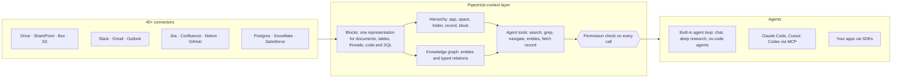

<div align="center">

**Translations:** [English](../../../README.md) · [Français](../fr/README.md) · [Deutsch](../de/README.md) · [简体中文](../zh-CN/README.md) · [日本語](../ja/README.md) · [Русский](../ru/README.md) · [עברית](../he/README.md) · [한국어](../ko/README.md) · [Español](../es/README.md) · **Português** · [Türkçe](../tr/README.md) · [Tiếng Việt](../vi/README.md) · [Italiano](../it/README.md)

</div>

<div align="center">

<a href="https://www.pipeshub.com"></a>

<h3>A camada de contexto open source para agentes de IA</h3>

<p>
  <a href="https://www.pipeshub.com/">Website</a> ·
  <a href="https://docs.pipeshub.com/">Docs</a> ·
  <a href="https://discord.com/invite/K5RskzJBm2">Discord</a> ·
  <a href="https://plum-myrtle-9f7.notion.site/Pipeshub-s-Product-Roadmap-33841c164f54803a9989fd0fdbfdb1ee">Roadmap</a>
</p>

<a href="https://trendshift.io/repositories/14618"></a>

<p>
  <a href="https://opensource.org/licenses/Apache-2.0"></a>
  <a href="https://github.com/pipeshub-ai/pipeshub-ai/releases"></a>
  <a href="https://hub.docker.com/r/pipeshubai/pipeshub-ai"></a>
  <a href="https://discord.com/invite/K5RskzJBm2"></a>
  
  
  <a href="https://github.com/pipeshub-ai/pipeshub-ai/issues">
    
  </a>
  <a href="https://github.com/pipeshub-ai/pipeshub-ai/pulls">
    
  </a>
  <br/>
  <a href="https://x.com/PipesHub"></a>
  <a href="https://www.linkedin.com/company/pipeshub"></a>
  <br/>
  
  <br/>
  <a href="https://www.npmjs.com/package/@pipeshub-ai/sdk"></a>
  <a href="https://pypi.org/project/pipeshub-sdk/"></a>
  <a href="https://github.com/pipeshub-ai/pipeshub-sdk-go"></a>
  <a href="https://www.npmjs.com/package/@pipeshub-ai/mcp"></a>
</p>

</div>

<h2 id="about-pipeshub">Dê aos seus agentes de IA uma compreensão real da sua empresa</h2>

<strong>[PipesHub](https://www.pipeshub.com/)</strong> transforma tudo o que sua empresa sabe em um espaço de trabalho que respeita permissões, que agentes de IA exploram como agentes de código exploram um repositório. Os agentes fazem buscas, usam `grep`, percorrem pastas e o grafo de conhecimento, leem só o que precisam e citam o bloco exato de onde veio cada resposta.

Conecte Slack, Google Drive, GitHub, Microsoft 365, Jira, Notion, Postgres e mais de 25 outros sistemas. Use o chat, a pesquisa aprofundada e os agentes integrados, ou entregue o mesmo contexto ao Claude Code, Cursor, Codex e aos seus próprios agentes via MCP e SDKs. Auto-hospedado, Apache 2.0, use o seu próprio modelo.

> [!TIP]
> Implante com um único comando:
> ```bash
> curl -fsSL https://get.pipeshub.com/install | bash
> ```

## Por que uma camada de contexto?

Agentes costumam falhar com o conhecimento da empresa por causa do contexto, não do modelo. A recuperação top-k de trechos entrega ao agente um punhado de fragmentos e descarta onde cada um fica, a que se liga, quem pode vê-lo e de onde veio.

Agentes de código ficaram bons quando passaram a usar `ls`, `grep` e ler um repositório, em vez de receber trechos colados. O PipesHub dá aos agentes o mesmo sobre os dados da sua empresa.

| | RAG com trechos top-k | PipesHub |
| --- | --- | --- |
| **O que o agente vê primeiro** | Alguns trechos de texto | Nome, localização, metadados e resumo de cada registro, mais os blocos encontrados |
| **Como ele se aprofunda** | Não consegue: uma recuperação por pergunta | Busca híbrida, `grep`/`find` sobre registros, navegação por pastas e consultas ao grafo de conhecimento, em loop |
| **Estrutura** | Perdida na divisão em trechos | Toda fonte vira Blocks: seções, tabelas com linhas e células, threads, código, tabelas SQL com seu esquema |
| **Permissões** | Muitas vezes aproximadas na indexação | Verificadas contra as permissões do sistema de origem para o usuário solicitante, em cada chamada de ferramenta |
| **Citações** | Por trecho, quando há | Por bloco: a página, célula de tabela, linha, slide ou linha de código, com citações inventadas removidas |

## Como funciona



Toda fonte vira **Blocks** (blocos): uma única representação que mantém tabelas, threads e código intactos e lembra a página, célula ou linha exata de onde veio cada bloco. Os Blocks são organizados de duas formas: pela **estrutura de pastas** de cada sistema de origem e em um **grafo de conhecimento** de pessoas, projetos e clientes. Os agentes exploram os dois com **ferramentas que revelam os detalhes passo a passo**: uma busca mostra primeiro o nome, o resumo e os trechos correspondentes de cada registro, e o agente só se aprofunda (grep, navegar pelas pastas, seguir entidades, ler o registro completo) quando precisa. **Cada chamada de ferramenta é verificada contra as permissões do sistema de origem** para a pessoa em nome de quem o agente atua.

**[Leia como funciona a camada de contexto →](../../context-layer.md)** O texto cobre o formato Block, a hierarquia e o grafo, cada ferramenta do agente e o código onde ela vive, a aplicação de permissões, o loop do agente e as limitações atuais.

## O que você pode construir com o PipesHub

Uma camada de contexto, muitos produtos em cima dela. Use os apps integrados como estão, ou construa os seus via MCP e SDKs.

| O que construir | O que o PipesHub oferece | Comece aqui |
| --- | --- | --- |
| **Pipelines de RAG agêntico** | Ferramentas de recuperação que um agente chama em loop (busca híbrida, `grep`, navegação, consultas de entidades, leitura de registros completos), com verificação de permissões e citações por bloco já resolvidas | [Starter de SDK](https://github.com/pipeshub-ai/examples/tree/main/sdk-starter) · [MCP](#use-no-claude-code-cursor-ou-codex) |
| **Busca corporativa** | Uma caixa de busca sobre mais de 40 conectores que mostra a cada pessoa só o que ela pode ver, com respostas citadas | Integrado · [exemplo](https://github.com/pipeshub-ai/examples/tree/main/private-enterprise-search) |
| **Assistente de IA para o trabalho** | Chat e pesquisa aprofundada sobre o conhecimento da empresa, além de busca na web e entrada por voz | Integrado |
| **Contexto para agentes de código** | Claude Code, Cursor e Codex respondem a partir de documentos de design, tickets, incidentes e threads de chat, não só do código | [exemplo](https://github.com/pipeshub-ai/examples/tree/main/company-knowledge-mcp) |
| **Agentes e construtores de fluxos de trabalho no-code** | Um construtor visual de arrastar e soltar que liga o conhecimento da empresa a ações no Slack, Gmail, Jira, Confluence, GitHub, Linear, Notion, Salesforce, Zendesk, Freshdesk e mais 20 ferramentas. Ou construa seu próprio produto de fluxos de trabalho sobre a mesma API, para que cada etapa receba um contexto que respeita permissões. | Integrado · [Construir headless](#posso-usar-o-pipeshub-de-forma-headless-sem-a-interface) |
| **Copilotos de suporte ao cliente** | Respostas tiradas de tickets antigos, runbooks e documentação (ServiceNow, Zammad, Jira, Confluence), com ações de volta na ferramenta de tickets | Integrado · SDKs |
| **Inteligência de vendas e contas** | Contas, contatos e negócios do Salesforce no grafo de conhecimento, pesquisáveis junto com os e-mails, documentos e chats sobre os mesmos clientes | Integrado |
| **Perguntas sobre seus bancos de dados** | Tabelas de Postgres, MariaDB e Snowflake indexadas com seus esquemas e chaves estrangeiras, além de sandboxes que rodam SQL e Python para análise | Integrado |
| **Relatórios, gráficos e dashboards** | Os agentes escrevem e executam código em uma sandbox e devolvem o resultado como um artefato compartilhável | Integrado |
| **Busca de conhecimento de engenharia** | Código, pull requests e commits do GitHub e do GitLab, ligados aos tickets e documentos ao redor deles | Integrado |
| **Seus próprios apps sobre o conhecimento da empresa** | SDKs para Python, TypeScript e Go, "Sign in with PipesHub" para que cada usuário busque como ele mesmo, e uma API de upload para documentos que nenhum conector cobre | [exemplos](https://github.com/pipeshub-ai/examples) |
| **Apps jurídicos e de contratos (CLM)** | Faça perguntas sobre contratos no Drive, SharePoint, Box ou em arquivos enviados. As respostas citam a cláusula ou a página exata, e cada pessoa vê só os contratos que tem permissão para ver. | [Construir headless](#posso-usar-o-pipeshub-de-forma-headless-sem-a-interface) |
| **IA privada e on-premises** | Tudo o que está acima, auto-hospedado, com qualquer provedor de LLM ou modelos locais via Ollama, com os dados mantidos na sua infraestrutura | [Implantar](#-guia-de-implantação) |

## Use no Claude Code, Cursor ou Codex

**[Dê ao seu assistente de código acesso seguro ao conhecimento da sua empresa →](https://github.com/pipeshub-ai/examples/tree/main/company-knowledge-mcp)**

Cerca de dez minutos, depois que o PipesHub estiver rodando com dados indexados. Gere um Personal Access Token (sem precisar de admin), conecte seu assistente (um comando para o Claude Code, um arquivo de configuração para o Cursor ou o Codex) e pergunte *"por que a lógica de retry no worker de faturamento mudou?"* Ele responde a partir do postmortem do incidente, do pull request, da thread do chat e do documento de design, cada um citado, e só se você tiver permissão para vê-los.

Via MCP, os assistentes já têm hoje as ferramentas de busca, chat e registros do PipesHub. O restante do conjunto de ferramentas do agente (`grep`, `navigate`, consultas de entidades) chega ao MCP em seguida.

Quer a mesma recuperação dentro do seu próprio código, ou atrás de uma caixa de busca para sua equipe? O [starter de SDK e o exemplo de busca](https://github.com/pipeshub-ai/examples) cobrem os dois casos. Construiu algo? [Mostre para nós](https://github.com/pipeshub-ai/examples/issues/new?template=showcase.yml).

## PipesHub em ação

### Citações


### Conectores


<details>
<summary><b>Mais demos: todos os registros, busca de conhecimento</b></summary>

### Todos os registros


### Busca de conhecimento


</details>

## Recursos

**Contexto para agentes**

- 🗂️ **Explorável, não só pesquisável:** busca híbrida, `grep` sobre registros, navegação por pastas e consultas ao grafo de conhecimento, todos como ferramentas do agente.
- 🔒 **Respeita permissões em cada etapa:** cada chamada de ferramenta é verificada contra as permissões do sistema de origem para a pessoa em nome de quem o agente atua.
- 📝 **Citações por bloco:** as respostas citam a página, célula de tabela, linha, slide ou linha de código de onde vieram.
- 🧱 **Estruturado, semiestruturado e não estruturado em uma só camada:** documentos, planilhas, tickets, threads de chat, código e tabelas SQL viram Blocks.

**Conectado aos seus sistemas**

- 🔌 **Mais de 40 conectores:** Google Workspace, Microsoft 365, Slack, Jira, Confluence, Notion, GitHub, GitLab, Salesforce, ServiceNow, Postgres, Snowflake e outros, com sincronização em tempo real e agendada.
- 🕸️ **Grafo de conhecimento:** entidades e relações extraídas na indexação e usadas na hora da resposta.
- 🎙️ **Multimodal:** imagens, diagramas e arquivos digitalizados, além de entrada por voz.
- 🧠 **Use o seu próprio modelo, totalmente auto-hospedado:** qualquer provedor de LLM ou um modelo local, implantado na sua própria infraestrutura.

## PipesHub Cloud

Prefere um PipesHub totalmente gerenciado, sem rodar sua própria infraestrutura? O PipesHub Cloud chega em breve.

👉 **[Entre na lista de espera do Cloud](https://pipeshub.com/cloud-waitlist)** para ter acesso antecipado.

## Conectores

<p align="center">
<a href="https://pipeshub.com/connectors"></a>
</p>

## 🚀 Guia de implantação

O PipesHub pode rodar localmente ou ser implantado em qualquer servidor com Docker Compose. O instalador interativo cuida de toda a configuração — incluindo segredos, banco de grafos, broker e escolha da tag da imagem — e gera um `.env` para você.

> **HTTPS em servidores na nuvem:** se você implantar o PipesHub em um servidor na nuvem, use um endpoint HTTPS. Os navegadores bloqueiam certas requisições sobre HTTP simples. Use Cloudflare, Nginx ou Traefik para terminar o TLS. Uma tela branca após uma implantação só com HTTP costuma ser causada por essa restrição.

---

### ⚡ Início rápido (recomendado)

Requer [Docker](https://docs.docker.com/get-docker/) com Compose v2. Um comando:

```bash
curl -fsSL https://get.pipeshub.com/install | bash
```

Isso baixa os arquivos de implantação da versão mais recente em `./pipeshub` e
inicia o instalador interativo. Abra **http://localhost:3000** quando ele
terminar.

> **Prefere ler antes de executar?** Baixe e inspecione o script primeiro:
>
> ```bash
> curl -fsSL https://get.pipeshub.com/install -o pipeshub-install.sh
> less pipeshub-install.sh        # review it
> bash pipeshub-install.sh
> ```

O instalador vai:
- Verificar os pré-requisitos de Docker, RAM e disco
- Perguntar se você quer uma implantação **slim** ou **full**
- Permitir, opcionalmente, personalizar o banco de grafos, o message broker e o KV store
- Gerar segredos aleatórios e gravar um arquivo `.env`
- Baixar as imagens e iniciar a stack
- Aguardar o PipesHub ficar saudável, verificar se está acessível e exibir a URL

### 🛠️ A partir de um repositório clonado (desenvolvedores)

Para compilar a partir do código-fonte, contribuir ou fixar o instalador no seu checkout:

```bash
git clone https://github.com/pipeshub-ai/pipeshub-ai.git
cd pipeshub-ai

# Same installer, run from the repo root
./install.sh
```

Compilar imagens locais a partir do código-fonte exige este caminho com o repositório clonado (`./install.sh --build`);
o instalador de um comando acima sempre usa imagens pré-compiladas.

> **Opções avançadas:** flags do instalador (`--yes`, `--version`, `--reconfigure`, `--print-env-only`), variáveis de ambiente de CI, tipos de implantação slim vs. full, uso manual de profiles do Compose e builds locais a partir do código-fonte estão em [Opções avançadas de implantação](../../../deployment/docker-compose/ADVANCED_DEPLOYMENT.md).

## Construa sobre o PipesHub: MCP e SDKs

A experiência de busca integrada é uma forma de usar o PipesHub. O mesmo contexto
conectado e filtrado por permissões está disponível para seus próprios agentes e aplicações —
via MCP, para qualquer cliente compatível, ou pelos SDKs, quando você o chama
a partir do seu próprio código.

Um agente se conecta como uma pessoa específica, não como a aplicação, então
recupera exatamente o que essa pessoa pode ver. O acesso é resolvido quando
a consulta roda, contra as permissões do próprio sistema de origem, em vez de ser
aproximado no momento da construção.

Tutoriais passo a passo para os casos mais comuns — um MCP para o seu assistente
de código, busca corporativa privada e starters de SDK — ficam em
[**pipeshub-ai/examples**](https://github.com/pipeshub-ai/examples). O
material de referência de cada peça está abaixo.

### Servidor MCP

Use o PipesHub com qualquer cliente compatível com MCP para levar o contexto da sua empresa aos fluxos de IA. Consulte o README para configuração e uso.

**Repositório:** [pipeshub-ai/mcp-server](https://github.com/pipeshub-ai/mcp-server/)

Usa o [Omnigent](https://omnigent.ai)? Veja [`integrations/omnigent/`](../../../integrations/omnigent/) para três formas de conexão, de um attach pela interface web a um kit de conexão por script.

### SDKs

O PipesHub oferece SDKs para Python, TypeScript e Go para você integrar rápido. Consulte o README do repositório de cada SDK para detalhes de configuração e uso.

| Nome | Descrição | Link |
|------|-------------|------|
| **Python SDK** | SDK Python para o PipesHub | [pipeshub-ai/pipeshub-sdk-python](https://github.com/pipeshub-ai/pipeshub-sdk-python) |
| **TypeScript SDK** | SDK TypeScript para o PipesHub | [pipeshub-ai/pipeshub-sdk-typescript](https://github.com/pipeshub-ai/pipeshub-sdk-typescript) |
| **Go SDK** | SDK Go para o PipesHub | [pipeshub-ai/pipeshub-sdk-go](https://github.com/pipeshub-ai/pipeshub-sdk-go) |

> Precisa de um SDK em outra linguagem? Fale com a gente em developer@pipeshub.com

## Roadmap

<p>Desenvolvemos de forma aberta. Veja o que já está pronto e o que vem a seguir:</p>

<ul>
<li>✅ 🤖 <strong>Agentes de IA para o trabalho</strong>: construtor de agentes no-code de primeira classe</li>
<li>✅ 🔗 Suporte a <strong>MCP (Model Context Protocol)</strong>, como servidor e como cliente</li>
<li>✅ 🧰 <strong>SDKs para desenvolvedores</strong></li>
<li>✅ 🔍 <strong>Busca de código</strong> no GitHub e no GitLab</li>
<li>⬜ 👤 <strong>Busca personalizada</strong> com base em equipe, função e histórico</li>
<li>✅ ☸️ Implantação em <strong>Kubernetes de produção</strong> com padrões de alta disponibilidade</li>
<li>⬜ 📈 <strong>Relevância com PageRank</strong> em todo o grafo de conhecimento</li>
</ul>
<p>👉 <strong><a href="https://plum-myrtle-9f7.notion.site/Pipeshub-s-Product-Roadmap-33841c164f54803a9989fd0fdbfdb1ee">Veja o roadmap completo do produto no Notion</a></strong></p>

<hr>

## 👥 Como contribuir

Quer fazer parte da nossa comunidade de desenvolvedores? Confira o nosso [Guia de contribuição](https://github.com/pipeshub-ai/pipeshub-ai/blob/main/CONTRIBUTING.md) para saber como configurar o ambiente de desenvolvimento, nossos padrões de código e o fluxo de contribuição.
<h3>Onde encontrar o quê</h3>

<table>

<tr><td>Fazer uma pergunta ou pedir ajuda</td><td><a href="https://discord.com/invite/K5RskzJBm2">Discord</a></td></tr>
<tr><td>Relatar um bug ou pedir um recurso</td><td><a href="https://github.com/pipeshub-ai/pipeshub-ai/issues">GitHub Issues</a></td></tr>
<tr><td>Relatar um problema de segurança</td><td><a href="https://github.com/pipeshub-ai/pipeshub-ai/blob/main/SECURITY.md">Relatar problema de segurança</a></td></tr>
<tr><td>Ler a documentação</td><td><a href="https://docs.pipeshub.com/">Documentação do Pipeshub</a></td></tr>
<tr><td>Ver o que mudou em cada versão</td><td><a href="https://github.com/pipeshub-ai/pipeshub-ai/blob/main/CHANGELOG.md">Changelog</a></td></tr>
</table>

## Perguntas frequentes

### O que é o PipesHub?

O PipesHub é a camada de contexto open source para agentes de IA. Ele transforma o conhecimento guardado nos sistemas da sua empresa em um espaço de trabalho que respeita permissões, onde os agentes podem buscar, usar `grep`, navegar e citar.

Ele conecta sistemas como Slack, Google Drive, GitHub, Microsoft 365 e Notion e disponibiliza o que eles guardam de duas formas: busca com citações e respeito a permissões para sua equipe, e contexto confiável para seus agentes de IA via APIs, SDKs e MCP. Os agentes recebem a mesma visão governada do conhecimento da empresa que uma pessoa teria, com os mesmos controles de acesso, para responder a partir de dados reais da empresa em vez de adivinhar entre ferramentas. Você pode usar a experiência de busca integrada ou construir seus próprios agentes, fluxos de trabalho e aplicações sobre ela.

### Posso usar o PipesHub de forma headless, sem a interface?

Sim. O app web do PipesHub usa a mesma API que você pode chamar por conta própria, então tudo o que você faz na interface também pode fazer no código: conectar fontes, enviar arquivos, gerenciar usuários e permissões, buscar, conversar no chat e criar e executar agentes.

- **API REST:** uma [especificação OpenAPI](../../../backend/nodejs/apps/src/modules/api-docs/pipeshub-openapi.yaml) com cerca de 300 endpoints. Navegue por ela em `/api/v1/docs` na sua instância.
- **SDKs:** [Python](https://github.com/pipeshub-ai/pipeshub-sdk-python), [TypeScript](https://github.com/pipeshub-ai/pipeshub-sdk-typescript) e [Go](https://github.com/pipeshub-ai/pipeshub-sdk-go).
- **MCP:** para Claude Code, Cursor, Codex e outros clientes MCP.

Escolha como o seu código faz login:
- **Personal Access Token ou OAuth:** age como uma pessoa e vê só o que essa pessoa pode ver.
- **Conta de serviço:** para tarefas em segundo plano, com permissões próprias.
- **App OAuth:** permite que cada usuário do seu app faça login como ele mesmo ("Sign in with PipesHub").

Equipes usam isso para construir seus próprios produtos sobre o PipesHub, como construtores de fluxos de trabalho, ferramentas jurídicas e de gestão de contratos (CLM), consoles de suporte e agentes internos, sem mostrar a interface do PipesHub.

### Em que o PipesHub difere de outras ferramentas de IA para o trabalho?

A maioria das ferramentas entrega a um modelo de IA alguns trechos de texto recuperados. O PipesHub dá aos agentes ferramentas para explorar o conhecimento da sua empresa como um agente de código explora um repositório: busca híbrida, `grep` sobre registros, navegação por pastas e consultas ao grafo de conhecimento, cada uma verificada contra as permissões do usuário solicitante no sistema de origem. Toda fonte vira Blocks, então as respostas citam a página, célula de tabela, linha ou slide exatos. É totalmente open source (Apache 2.0) e auto-hospedável, então seus dados nunca saem da sua infraestrutura. Veja [Por que uma camada de contexto?](#por-que-uma-camada-de-contexto)

### Quais conectores o PipesHub suporta?

O PipesHub tem mais de 40 conectores para mais de 30 sistemas, com indexação em tempo real e agendada. Veja a [visão geral dos conectores](https://docs.pipeshub.com/connectors/overview).

### Quais provedores de LLM o PipesHub suporta?

O PipesHub segue o modelo "Bring Your Own Model" (use o seu próprio modelo) — você pode usar qualquer provedor de LLM. Implante na sua VPC com os modelos que preferir.

**Mais perguntas:** formatos de arquivo, stack tecnológica, o grafo de conhecimento, suporte multimodal e solução de problemas são respondidos no [FAQ completo](../../FAQ.md).

<hr>
<div align="center">
<h3>⭐ Dê uma estrela no GitHub!</h3>

<p>Isso ajuda o projeto a chegar às equipes que precisam dele.</p>

<p>
<a href="https://github.com/pipeshub-ai/pipeshub-ai">

</a>
</p>

<p>
<a href="https://www.star-history.com/?repos=pipeshub-ai%2Fpipeshub-ai">
 <picture>
   <source media="(prefers-color-scheme: dark)" srcset="https://api.star-history.com/chart?repos=pipeshub-ai/pipeshub-ai&amp;type=date&amp;theme=dark&amp;legend=top-left&amp;sealed_token=msbcJ843ZmXCld8-zgduwH9hV6yn69hyfrnwfkcWiRqe7htnO6pSbQJrkxdoarzriLW6aGAETT-iQ3m7yWN3BacAyPyHfNIiPGabl6r6CbXFjcvJ7n1NZw" />
   <source media="(prefers-color-scheme: light)" srcset="https://api.star-history.com/chart?repos=pipeshub-ai/pipeshub-ai&amp;type=date&amp;legend=top-left&amp;sealed_token=msbcJ843ZmXCld8-zgduwH9hV6yn69hyfrnwfkcWiRqe7htnO6pSbQJrkxdoarzriLW6aGAETT-iQ3m7yWN3BacAyPyHfNIiPGabl6r6CbXFjcvJ7n1NZw" />
   
 </picture>
</a>
</p>

<p><sub>Feito com ❤️ pela <a href="https://www.pipeshub.com/">equipe PipesHub</a> e por colaboradores do mundo todo.</sub></p>

</div>

