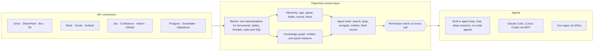

<div align="center">

**Translations:** [English](../../../README.md) · [Français](../fr/README.md) · [Deutsch](../de/README.md) · [简体中文](../zh-CN/README.md) · [日本語](../ja/README.md) · **Русский** · [עברית](../he/README.md) · [한국어](../ko/README.md) · [Español](../es/README.md) · [Português](../pt/README.md) · [Türkçe](../tr/README.md) · [Tiếng Việt](../vi/README.md) · [Italiano](../it/README.md)

</div>

<div align="center">

<a href="https://www.pipeshub.com"></a>

<h3>Открытый слой контекста для ИИ-агентов</h3>

<p>
  <a href="https://www.pipeshub.com/">Сайт</a> ·
  <a href="https://docs.pipeshub.com/">Документация</a> ·
  <a href="https://discord.com/invite/K5RskzJBm2">Discord</a> ·
  <a href="https://plum-myrtle-9f7.notion.site/Pipeshub-s-Product-Roadmap-33841c164f54803a9989fd0fdbfdb1ee">Дорожная карта</a>
</p>

<a href="https://trendshift.io/repositories/14618"></a>

<p>
  <a href="https://opensource.org/licenses/Apache-2.0"></a>
  <a href="https://github.com/pipeshub-ai/pipeshub-ai/releases"></a>
  <a href="https://hub.docker.com/r/pipeshubai/pipeshub-ai"></a>
  <a href="https://discord.com/invite/K5RskzJBm2"></a>
  
  
  <a href="https://github.com/pipeshub-ai/pipeshub-ai/issues">
    
  </a>
  <a href="https://github.com/pipeshub-ai/pipeshub-ai/pulls">
    
  </a>
  <br/>
  <a href="https://x.com/PipesHub"></a>
  <a href="https://www.linkedin.com/company/pipeshub"></a>
  <br/>
  
  <br/>
  <a href="https://www.npmjs.com/package/@pipeshub-ai/sdk"></a>
  <a href="https://pypi.org/project/pipeshub-sdk/"></a>
  <a href="https://github.com/pipeshub-ai/pipeshub-sdk-go"></a>
  <a href="https://www.npmjs.com/package/@pipeshub-ai/mcp"></a>
</p>

</div>

<h2 id="about-pipeshub">Дайте агентам рабочее пространство, а не груду фрагментов</h2>

<strong>[PipesHub](https://www.pipeshub.com/)</strong> превращает всё, что знает ваша компания, в рабочее пространство с учётом прав доступа. ИИ-агенты исследуют его так же, как агенты для программирования исследуют репозиторий. Они ищут по нему, запускают `grep`, обходят папки и граф знаний, читают только нужное и указывают точный блок, из которого взят каждый ответ.

Подключите Slack, Google Drive, GitHub, Microsoft 365, Jira, Notion, Postgres и ещё 25+ систем. Используйте встроенный чат, глубокое исследование и агентов. Или передайте тот же контекст в Claude Code, Cursor, Codex и собственных агентов через MCP и SDK. Самостоятельный хостинг, Apache 2.0, любая модель на ваш выбор.

> [!TIP]
> Развёртывание одной командой:
> ```bash
> curl -fsSL https://get.pipeshub.com/install | bash
> ```

## Зачем нужен слой контекста?

Агенты обычно ошибаются на корпоративных знаниях из-за контекста, а не из-за модели. Поиск top-k фрагментов даёт агенту горстку обрывков. При этом теряется, где лежит каждый из них, на что он ссылается, кому он доступен и откуда взялся.

Агенты для программирования стали хорошими, когда научились выполнять `ls`, `grep` и читать репозиторий, а не получать вставленные куски кода. PipesHub даёт агентам то же самое для данных вашей компании.

| | RAG на top-k фрагментах | PipesHub |
| --- | --- | --- |
| **Что агент видит сначала** | Несколько текстовых фрагментов | Название, расположение, метаданные и краткое содержание каждой записи, а также совпавшие блоки |
| **Как он копает глубже** | Никак: один поиск на вопрос | Гибридный поиск, `grep`/`find` по записям, навигация по папкам и запросы к графу знаний, в цикле |
| **Структура** | Теряется при нарезке | Каждый источник превращается в Blocks: разделы, таблицы со строками и ячейками, треды, код, SQL-таблицы со схемой |
| **Права доступа** | Часто приблизительно, в момент индексации | Проверяются по правам исходной системы для запрашивающего пользователя при каждом вызове инструмента |
| **Цитаты** | По фрагменту, если вообще есть | По блоку: страница, ячейка таблицы, строка, слайд или строка кода; выдуманные цитаты удаляются |

## Как это работает



Каждый источник превращается в **Blocks** (блоки) — единое представление, которое сохраняет таблицы, треды и код целыми и помнит точную страницу, ячейку или строку, откуда пришёл каждый блок. Над Blocks лежат две карты: **иерархия** исходной системы и **граф знаний** сущностей. Агенты исследуют обе с помощью **инструментов с поэтапным раскрытием**. Результаты поиска начинаются с метаданных и краткого содержания каждой записи. Агент выполняет grep, переходит по иерархии, следует за сущностями или читает запись целиком только тогда, когда это нужно. **Каждый вызов инструмента проверяется по правам исходной системы** для того человека, от имени которого действует агент.

**[Узнайте, как работает слой контекста →](../../context-layer.md)** Там описаны формат Blocks, иерархия и граф, каждый инструмент агента и код, в котором он реализован, контроль прав доступа, цикл агента и текущие ограничения.

## Что можно построить на PipesHub

Один слой контекста — много продуктов поверх него. Используйте встроенные приложения как есть или постройте свои через MCP и SDK.

| Что построить | Что даёт PipesHub | С чего начать |
| --- | --- | --- |
| **Агентные RAG-пайплайны** | Инструменты поиска, которые агент вызывает в цикле (гибридный поиск, `grep`, навигация, запросы к сущностям, чтение записи целиком), с уже готовыми проверками прав и цитатами на уровне блоков | [Стартовый SDK-проект](https://github.com/pipeshub-ai/examples/tree/main/sdk-starter) · [MCP](#используйте-из-claude-code-cursor-или-codex) |
| **Корпоративный поиск** | Одна строка поиска по 40+ коннекторам: каждый видит только то, что ему разрешено, и получает ответы с цитатами | Встроено · [пример](https://github.com/pipeshub-ai/examples/tree/main/private-enterprise-search) |
| **ИИ-ассистент для работы** | Чат и глубокое исследование по знаниям компании, а также веб-поиск и голосовой ввод | Встроено |
| **Контекст для агентов программирования** | Claude Code, Cursor и Codex отвечают по дизайн-документам, тикетам, инцидентам и тредам чатов, а не только по коду | [пример](https://github.com/pipeshub-ai/examples/tree/main/company-knowledge-mcp) |
| **No-code агенты и автоматизации** | Конструктор агентов с действиями в Slack, Gmail, Jira, Confluence, GitHub, Linear, Notion, Salesforce, Zendesk, Freshdesk и ещё 20 инструментах | Встроено |
| **Копилоты для поддержки клиентов** | Ответы на основе прошлых тикетов, ранбуков и документации (ServiceNow, Zammad, Jira, Confluence) с действиями прямо в системе тикетов | Встроено · SDK |
| **Аналитика по продажам и клиентам** | Аккаунты, контакты и сделки из Salesforce в графе знаний, с поиском вместе с письмами, документами и чатами о тех же клиентах | Встроено |
| **Вопросы к вашим базам данных** | Таблицы Postgres, MariaDB и Snowflake индексируются со схемами и внешними ключами, а песочницы выполняют SQL и Python для анализа | Встроено |
| **Отчёты, графики и дашборды** | Агенты пишут и запускают код в песочнице и возвращают результат в виде артефакта, которым можно поделиться | Встроено |
| **Поиск по инженерным знаниям** | Код, pull request и коммиты из GitHub и GitLab, связанные с тикетами и документами вокруг них | Встроено |
| **Свои приложения на знаниях компании** | SDK для Python, TypeScript и Go, вход через «Sign in with PipesHub», чтобы каждый пользователь искал от своего имени, и API загрузки для документов, которые не покрывает ни один коннектор | [примеры](https://github.com/pipeshub-ai/examples) |
| **Приватный ИИ on-prem** | Всё перечисленное, на своих серверах, с любым провайдером LLM или локальными моделями через Ollama; данные остаются в вашей инфраструктуре | [Развернуть](#-руководство-по-развёртыванию) |

## Используйте из Claude Code, Cursor или Codex

**[Дайте ассистенту для программирования безопасный доступ к знаниям компании →](https://github.com/pipeshub-ai/examples/tree/main/company-knowledge-mcp)**

Около десяти минут, если PipesHub уже запущен и данные проиндексированы. Выпустите Personal Access Token (права администратора не нужны). Подключите ассистента: одна команда для Claude Code, один файл конфигурации для Cursor или Codex. Затем спросите *«почему изменили логику повторных попыток в billing worker?»* Ассистент ответит по постмортему инцидента, pull request, треду в чате и дизайн-документу, с цитатой для каждого — и только если вам разрешено их видеть.

Через MCP ассистенты уже сейчас получают инструменты PipesHub для поиска, чата и работы с записями. Остальные инструменты агента (`grep`, `navigate`, запросы к сущностям) появятся в MCP следующими.

Нужен тот же поиск в вашем собственном коде или за строкой поиска для вашей команды? [Стартовый SDK-проект и пример поиска](https://github.com/pipeshub-ai/examples) покрывают оба случая. Что-то построили? [Покажите нам](https://github.com/pipeshub-ai/examples/issues/new?template=showcase.yml).

## PipesHub в действии

### Цитаты


### Коннекторы


<details>
<summary><b>Ещё демо: все записи, поиск по знаниям</b></summary>

### Все записи


### Поиск по знаниям


</details>

## Возможности

**Контекст для агентов**

- 🗂️ **Можно исследовать, а не только искать:** гибридный поиск, `grep` по записям, навигация по папкам и запросы к графу знаний — всё в виде инструментов агента.
- 🔒 **Учёт прав доступа на каждом шаге:** каждый вызов инструмента проверяется по правам исходной системы для человека, от имени которого действует агент.
- 📝 **Цитаты на уровне блоков:** ответы указывают страницу, ячейку таблицы, строку, слайд или строку кода, откуда они взяты.
- 🧱 **Структурированные, полуструктурированные и неструктурированные данные в одном слое:** документы, таблицы, тикеты, треды чатов, код и SQL-таблицы — всё превращается в Blocks.

**Подключено к вашим системам**

- 🔌 **40+ коннекторов:** Google Workspace, Microsoft 365, Slack, Jira, Confluence, Notion, GitHub, GitLab, Salesforce, ServiceNow, Postgres, Snowflake и другие, с синхронизацией в реальном времени и по расписанию.
- 🕸️ **Граф знаний:** сущности и связи извлекаются при индексации и используются при ответе.
- 🎙️ **Мультимодальность:** изображения, диаграммы и отсканированные файлы, а также голосовой ввод.
- 🧠 **Своя модель, полностью на своих серверах:** любой провайдер LLM или локальная модель в вашей собственной инфраструктуре.

## PipesHub Cloud

Хотите полностью управляемый PipesHub без собственной инфраструктуры? PipesHub Cloud скоро появится.

👉 **[Запишитесь в лист ожидания Cloud](https://pipeshub.com/cloud-waitlist)**, чтобы получить ранний доступ.

## Коннекторы

<p align="center">
<a href="https://pipeshub.com/connectors"></a>
</p>

## 🚀 Руководство по развёртыванию

PipesHub можно запустить локально или развернуть на любом сервере с помощью Docker Compose. Интерактивный установщик берёт на себя всю настройку — включая секреты, графовую БД, брокер сообщений и выбор тега образа — и создаёт для вас файл `.env`.

> **HTTPS на облачных серверах:** если вы разворачиваете PipesHub на облачном сервере, используйте HTTPS-адрес. Браузеры блокируют некоторые запросы по обычному HTTP. Для терминирования TLS используйте Cloudflare, Nginx или Traefik. Белый экран после развёртывания только с HTTP обычно вызван именно этим ограничением.

---

### ⚡ Быстрый старт (рекомендуется)

Нужен [Docker](https://docs.docker.com/get-docker/) с Compose v2. Одна команда:

```bash
curl -fsSL https://get.pipeshub.com/install | bash
```

Команда скачивает файлы развёртывания последнего релиза в `./pipeshub` и
запускает интерактивный установщик. Когда он закончит, откройте **http://localhost:3000**.

> **Хотите сначала прочитать скрипт?** Скачайте и проверьте его:
>
> ```bash
> curl -fsSL https://get.pipeshub.com/install -o pipeshub-install.sh
> less pipeshub-install.sh        # review it
> bash pipeshub-install.sh
> ```

Установщик:
- Проверит Docker, объём RAM и диска
- Спросит, нужно ли **slim** или **full** развёртывание
- Позволит при желании настроить графовую БД, брокер сообщений и KV-хранилище
- Сгенерирует случайные секреты и запишет файл `.env`
- Скачает образы и запустит стек
- Дождётся, пока PipesHub станет работоспособным, проверит его доступность и выведет URL

### 🛠️ Из клонированного репозитория (для разработчиков)

Чтобы собрать из исходников, внести вклад или привязать установщик к своей копии репозитория:

```bash
git clone https://github.com/pipeshub-ai/pipeshub-ai.git
cd pipeshub-ai

# Same installer, run from the repo root
./install.sh
```

Сборка локальных образов из исходников возможна только из клонированного репозитория (`./install.sh --build`);
установщик одной командой выше всегда использует готовые образы.

> **Расширенные параметры:** флаги установщика (`--yes`, `--version`, `--reconfigure`, `--print-env-only`), переменные окружения для CI, типы развёртывания slim и full, ручное использование профилей Compose и локальная сборка из исходников описаны в разделе [Расширенные параметры развёртывания](../../../deployment/docker-compose/ADVANCED_DEPLOYMENT.md).

## Разработка на PipesHub: MCP и SDK

Встроенный поиск — лишь один из способов использовать PipesHub. Тот же подключённый
контекст с фильтрацией по правам доступен вашим собственным агентам и приложениям —
через MCP для любого совместимого клиента или через SDK, когда вы вызываете его
из своего кода.

Агент подключается от имени конкретного человека, а не приложения. Поэтому он
получает ровно то, что этому человеку разрешено видеть. Доступ определяется в момент
выполнения запроса по правам самой исходной системы, а не приблизительно
во время сборки.

Пошаговые руководства для самых частых сценариев — MCP для ассистента
программирования, приватный корпоративный поиск и стартовые SDK-проекты — находятся в
[**pipeshub-ai/examples**](https://github.com/pipeshub-ai/examples). Справочные
материалы по каждому строительному блоку — ниже.

### MCP-сервер

Используйте PipesHub с любым MCP-совместимым клиентом, чтобы добавить корпоративный контекст в ИИ-процессы. Настройка и использование описаны в README.

**Репозиторий:** [pipeshub-ai/mcp-server](https://github.com/pipeshub-ai/mcp-server/)

Используете [Omnigent](https://omnigent.ai)? В [`integrations/omnigent/`](../../../integrations/omnigent/) описаны три способа подключения: от подключения через веб-интерфейс до набора скриптов для подключения.

### SDK

PipesHub предоставляет SDK для Python, TypeScript и Go, чтобы вы могли быстро выполнить интеграцию. Подробности по настройке и использованию — в README соответствующего репозитория SDK.

| Название | Описание | Ссылка |
|------|-------------|------|
| **Python SDK** | Python SDK для PipesHub | [pipeshub-ai/pipeshub-sdk-python](https://github.com/pipeshub-ai/pipeshub-sdk-python) |
| **TypeScript SDK** | TypeScript SDK для PipesHub | [pipeshub-ai/pipeshub-sdk-typescript](https://github.com/pipeshub-ai/pipeshub-sdk-typescript) |
| **Go SDK** | Go SDK для PipesHub | [pipeshub-ai/pipeshub-sdk-go](https://github.com/pipeshub-ai/pipeshub-sdk-go) |

> Нужен SDK на другом языке? Напишите нам на developer@pipeshub.com

## Дорожная карта

<p>Мы разрабатываем открыто. Вот что уже сделано и что впереди:</p>

<ul>
<li>✅ 🤖 <strong>ИИ-агенты для работы</strong>: полноценный no-code конструктор агентов</li>
<li>✅ 🔗 Поддержка <strong>MCP (Model Context Protocol)</strong>: и сервер, и клиент</li>
<li>✅ 🧰 <strong>SDK для разработчиков</strong></li>
<li>✅ 🔍 <strong>Поиск по коду</strong> в GitHub и GitLab</li>
<li>⬜ 👤 <strong>Персонализированный поиск</strong> с учётом команды, роли и истории</li>
<li>✅ ☸️ <strong>Продакшн-развёртывание в Kubernetes</strong> с настройками высокой доступности по умолчанию</li>
<li>⬜ 📈 <strong>Релевантность с учётом PageRank</strong> по графу знаний</li>
</ul>
<p>👉 <strong><a href="https://plum-myrtle-9f7.notion.site/Pipeshub-s-Product-Roadmap-33841c164f54803a9989fd0fdbfdb1ee">Полная дорожная карта продукта в Notion</a></strong></p>

<hr>

## 👥 Участие в разработке

Хотите присоединиться к нашему сообществу разработчиков? Прочитайте [руководство для контрибьюторов](https://github.com/pipeshub-ai/pipeshub-ai/blob/main/CONTRIBUTING.md). В нём описано, как настроить среду разработки, наши стандарты кода и процесс внесения изменений.
<h3>Куда обращаться</h3>

<table>

<tr><td>Задать вопрос или получить помощь</td><td><a href="https://discord.com/invite/K5RskzJBm2">Discord</a></td></tr>
<tr><td>Сообщить об ошибке или предложить функцию</td><td><a href="https://github.com/pipeshub-ai/pipeshub-ai/issues">GitHub Issues</a></td></tr>
<tr><td>Сообщить о проблеме безопасности</td><td><a href="https://github.com/pipeshub-ai/pipeshub-ai/blob/main/SECURITY.md">Сообщить о проблеме безопасности</a></td></tr>
<tr><td>Прочитать документацию</td><td><a href="https://docs.pipeshub.com/">Документация Pipeshub</a></td></tr>
<tr><td>Узнать, что изменилось в каждом релизе</td><td><a href="https://github.com/pipeshub-ai/pipeshub-ai/blob/main/CHANGELOG.md">Список изменений</a></td></tr>
</table>

## Частые вопросы

### Что такое PipesHub?

PipesHub — это открытый слой контекста для ИИ-агентов. Он превращает знания, разбросанные по бизнес-системам вашей компании, в рабочее пространство с учётом прав доступа. Агенты могут искать по нему, запускать `grep`, перемещаться по нему и цитировать его.

PipesHub подключает такие системы, как Slack, Google Drive, GitHub, Microsoft 365 и Notion, и делает их содержимое доступным двумя способами: поиск с учётом прав доступа и с цитатами для вашей команды и надёжный контекст для ваших ИИ-агентов через API, SDK и MCP. Агенты получают тот же управляемый взгляд на знания компании, что и человек, с теми же правами доступа. Поэтому они отвечают по реальным данным компании, а не гадают по разным инструментам. Можно пользоваться встроенным поиском или строить на его основе собственных агентов, процессы и приложения.

### Чем PipesHub отличается от других ИИ-инструментов для работы?

Большинство инструментов передают ИИ-модели несколько найденных текстовых фрагментов. PipesHub даёт агентам инструменты, чтобы исследовать знания компании так, как агент для программирования исследует репозиторий: гибридный поиск, `grep` по записям, навигация по папкам и запросы к графу знаний. Каждый вызов проверяется по правам запрашивающего пользователя в исходной системе. Каждый источник превращается в Blocks, поэтому ответы указывают точную страницу, ячейку таблицы, строку или слайд. PipesHub полностью открыт (Apache 2.0) и разворачивается на ваших серверах, так что данные никогда не покидают вашу инфраструктуру. См. [Зачем нужен слой контекста?](#зачем-нужен-слой-контекста)

### Какие коннекторы поддерживает PipesHub?

В PipesHub более 40 коннекторов к 30+ системам, с индексацией в реальном времени и по расписанию. См. [обзор коннекторов](https://docs.pipeshub.com/connectors/overview).

### Каких провайдеров LLM поддерживает PipesHub?

PipesHub работает по принципу «Bring Your Own Model» — можно использовать любого провайдера LLM. Разворачивайте в своём VPC с моделями, которые вы предпочитаете.

**Другие вопросы:** форматы файлов, технологический стек, граф знаний, мультимодальность и устранение неполадок разобраны в [полном FAQ](../../FAQ.md).

<hr>
<div align="center">
<h3>⭐ Поставьте нам звезду на GitHub!</h3>

<p>Так проект быстрее найдут команды, которым он нужен.</p>

<p>
<a href="https://github.com/pipeshub-ai/pipeshub-ai">

</a>
</p>

<p>
<a href="https://www.star-history.com/?repos=pipeshub-ai%2Fpipeshub-ai">
 <picture>
   <source media="(prefers-color-scheme: dark)" srcset="https://api.star-history.com/chart?repos=pipeshub-ai/pipeshub-ai&amp;type=date&amp;theme=dark&amp;legend=top-left&amp;sealed_token=msbcJ843ZmXCld8-zgduwH9hV6yn69hyfrnwfkcWiRqe7htnO6pSbQJrkxdoarzriLW6aGAETT-iQ3m7yWN3BacAyPyHfNIiPGabl6r6CbXFjcvJ7n1NZw" />
   <source media="(prefers-color-scheme: light)" srcset="https://api.star-history.com/chart?repos=pipeshub-ai/pipeshub-ai&amp;type=date&amp;legend=top-left&amp;sealed_token=msbcJ843ZmXCld8-zgduwH9hV6yn69hyfrnwfkcWiRqe7htnO6pSbQJrkxdoarzriLW6aGAETT-iQ3m7yWN3BacAyPyHfNIiPGabl6r6CbXFjcvJ7n1NZw" />
   
 </picture>
</a>
</p>

<p><sub>Сделано с ❤️ <a href="https://www.pipeshub.com/">командой PipesHub</a> и контрибьюторами со всего мира.</sub></p>

</div>
