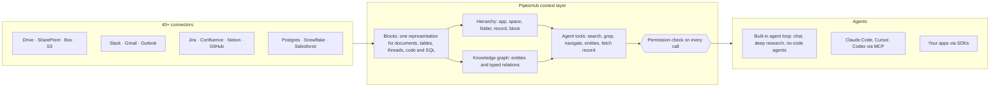

<div align="center">

**Translations:** [English](../../../README.md) · [Français](../fr/README.md) · [Deutsch](../de/README.md) · [简体中文](../zh-CN/README.md) · [日本語](../ja/README.md) · [Русский](../ru/README.md) · [עברית](../he/README.md) · [한국어](../ko/README.md) · [Español](../es/README.md) · [Português](../pt/README.md) · **Türkçe** · [Tiếng Việt](../vi/README.md) · [Italiano](../it/README.md)

</div>

<div align="center">

<a href="https://www.pipeshub.com"></a>

<h3>Yapay zekâ ajanları için açık kaynaklı bağlam katmanı</h3>

<p>
  <a href="https://www.pipeshub.com/">Website</a> ·
  <a href="https://docs.pipeshub.com/">Docs</a> ·
  <a href="https://discord.com/invite/K5RskzJBm2">Discord</a> ·
  <a href="https://plum-myrtle-9f7.notion.site/Pipeshub-s-Product-Roadmap-33841c164f54803a9989fd0fdbfdb1ee">Roadmap</a>
</p>

<a href="https://trendshift.io/repositories/14618"></a>

<p>
  <a href="https://opensource.org/licenses/Apache-2.0"></a>
  <a href="https://github.com/pipeshub-ai/pipeshub-ai/releases"></a>
  <a href="https://hub.docker.com/r/pipeshubai/pipeshub-ai"></a>
  <a href="https://discord.com/invite/K5RskzJBm2"></a>
  
  
  <a href="https://github.com/pipeshub-ai/pipeshub-ai/issues">
    
  </a>
  <a href="https://github.com/pipeshub-ai/pipeshub-ai/pulls">
    
  </a>
  <br/>
  <a href="https://x.com/PipesHub"></a>
  <a href="https://www.linkedin.com/company/pipeshub"></a>
  <br/>
  
  <br/>
  <a href="https://www.npmjs.com/package/@pipeshub-ai/sdk"></a>
  <a href="https://pypi.org/project/pipeshub-sdk/"></a>
  <a href="https://github.com/pipeshub-ai/pipeshub-sdk-go"></a>
  <a href="https://www.npmjs.com/package/@pipeshub-ai/mcp"></a>
</p>

</div>

<h2 id="about-pipeshub">Yapay zekâ ajanlarınıza şirketinizi gerçekten anlama yeteneği verin</h2>

<strong>[PipesHub](https://www.pipeshub.com/)</strong>, şirketinizin bildiği her şeyi izinlere duyarlı bir çalışma alanına dönüştürür. Yapay zekâ ajanları bu alanı, kodlama ajanlarının bir depoyu keşfettiği gibi keşfeder. Ajanlar arama yapar, `grep` çalıştırır, klasörlerde ve bilgi grafında gezinir, yalnızca ihtiyaç duyduklarını okur ve her yanıtın geldiği bloğu tam olarak kaynak gösterir.

Slack, Google Drive, GitHub, Microsoft 365, Jira, Notion, Postgres ve 25'ten fazla başka sistemi bağlayın. Yerleşik sohbeti, derin araştırmayı ve ajanları kullanın ya da aynı bağlamı MCP ve SDK'lar üzerinden Claude Code, Cursor, Codex ve kendi ajanlarınıza verin. Kendi sunucunuzda barındırılır, Apache 2.0 lisanslıdır ve kendi modelinizi kullanırsınız.

> [!TIP]
> Tek komutla kurun:
> ```bash
> curl -fsSL https://get.pipeshub.com/install | bash
> ```

## Neden bir bağlam katmanı?

Ajanlar şirket bilgisinde genellikle modelleri yüzünden değil, bağlamları yüzünden başarısız olur. Top-k parça getirme, ajana bir avuç parça verir; her parçanın nerede durduğunu, neye bağlandığını, kimin görebileceğini ve nereden geldiğini kaybeder.

Kodlama ajanları, yapıştırılmış kod parçaları yerine bir depoda `ls`, `grep` çalıştırıp okuyabildiklerinde iyileşti. PipesHub, ajanlara aynı imkânı şirketinizin verileri üzerinde sunar.

| | Top-k parça RAG | PipesHub |
| --- | --- | --- |
| **Ajanın ilk gördüğü** | Birkaç metin parçası | Her kaydın adı, konumu, meta verisi ve özeti, artı eşleşen bloklar |
| **Nasıl derine iner** | İnemez: soru başına tek getirme | Hibrit arama, kayıtlar üzerinde `grep`/`find`, klasör gezintisi ve bilgi grafı sorguları, bir döngü içinde |
| **Yapı** | Parçalama sırasında kaybolur | Her kaynak Blocks'a dönüşür: bölümler, satır ve hücreleriyle tablolar, yazışma dizileri, kod, şemasıyla SQL tabloları |
| **İzinler** | Çoğu zaman indeksleme anında yaklaşık olarak belirlenir | Her araç çağrısında, istekte bulunan kullanıcı için kaynak sistemin izinlerine göre denetlenir |
| **Kaynak gösterme** | Varsa parça başına | Blok başına: sayfa, tablo hücresi, satır, slayt veya kod satırı; uydurma kaynaklar kaldırılır |

## Nasıl çalışır



Her kaynak **Blocks**'a (bloklara) dönüşür: tabloları, yazışma dizilerini ve kodu bozmadan tutan, her bloğun geldiği sayfayı, hücreyi veya satırı tam olarak hatırlayan tek bir temsil. Her belge düz metin olarak saklanır; bu yüzden ajanlar bir PDF, Word dosyası veya sunum üzerinde de bir metin dosyasındaki gibi `grep` çalıştırabilir. Blocks iki şekilde düzenlenir: her kaynak sistemin **klasör yapısına** göre ve kişilerden, projelerden ve müşterilerden oluşan bir **bilgi grafında**. Ajanlar ikisini de **ayrıntıyı adım adım gösteren araçlarla** keşfeder: bir arama önce her kaydın adını, özetini ve eşleşen bölümlerini gösterir; ajan yalnızca gerektiğinde daha derine iner (grep, klasörlerde gezinme, varlıkları izleme, kaydın tamamını okuma). **Her araç çağrısı, ajanın adına çalıştığı kişi için kaynak sistemin izinlerine göre denetlenir.**

**[Bağlam katmanının nasıl çalıştığını okuyun →](../../context-layer.md)** Block biçimini, hiyerarşiyi ve grafı, her ajan aracını ve bulunduğu kodu, izin denetimini, ajan döngüsünü ve mevcut sınırlamaları anlatır.

## PipesHub ile neler geliştirebilirsiniz

Tek bağlam katmanı, üzerinde birçok ürün. Yerleşik uygulamaları olduğu gibi kullanın ya da MCP ve SDK'lar üzerinden kendinizinkini geliştirin.

| Ne geliştirebilirsiniz | PipesHub size ne sağlar | Buradan başlayın |
| --- | --- | --- |
| **Ajan tabanlı RAG hatları** | Bir ajanın döngü içinde çağırdığı getirme araçları (hibrit arama, `grep`, gezinme, varlık sorguları, tam kayıt okuma); izin denetimleri ve blok düzeyinde kaynak gösterme hazır gelir | [SDK başlangıç projesi](https://github.com/pipeshub-ai/examples/tree/main/sdk-starter) · [MCP](#claude-code-cursor-veya-codexten-kullanın) |
| **Kurumsal arama** | 40'tan fazla bağlayıcı üzerinde, herkese yalnızca görebileceklerini gösteren ve kaynaklı yanıtlar veren tek bir arama kutusu | Yerleşik · [örnek](https://github.com/pipeshub-ai/examples/tree/main/private-enterprise-search) |
| **İş yeri yapay zekâ asistanı** | Şirket bilgisi üzerinde sohbet ve derin araştırma, ayrıca web araması ve sesli giriş | Yerleşik |
| **Kodlama ajanları için bağlam** | Claude Code, Cursor ve Codex yalnızca koddan değil; tasarım belgelerinden, taleplerden, olaylardan ve sohbet dizilerinden de yanıt verir | [örnek](https://github.com/pipeshub-ai/examples/tree/main/company-knowledge-mcp) |
| **Kodsuz ajanlar ve iş akışı oluşturucular** | Şirket bilgisini Slack, Gmail, Jira, Confluence, GitHub, Linear, Notion, Salesforce, Zendesk, Freshdesk ve 20 araçta daha eylemlere bağlayan, sürükle-bırak ile çalışan görsel bir oluşturucu. Ya da aynı API üzerinde kendi iş akışı ürününüzü geliştirin; böylece her adım izinlere duyarlı bağlam alır. | Yerleşik · [Headless geliştirin](#pipeshubı-arayüzü-olmadan-headless-olarak-kullanabilir-miyim) |
| **Müşteri desteği yardımcıları** | Geçmiş taleplerden, runbook'lardan ve belgelerden (ServiceNow, Zammad, Jira, Confluence) alınan yanıtlar; talep aracında geri eylemlerle birlikte | Yerleşik · SDK'lar |
| **Satış ve hesap içgörüsü** | Salesforce hesapları, kişileri ve fırsatları bilgi grafında; aynı müşterilerle ilgili e-postalar, belgeler ve sohbetlerle birlikte aranabilir | Yerleşik |
| **Veritabanlarınız üzerine sorular** | Şemaları ve yabancı anahtarlarıyla indekslenen Postgres, MariaDB ve Snowflake tabloları, ayrıca analiz için SQL ve Python çalıştıran korumalı alanlar | Yerleşik |
| **Raporlar, grafikler ve panolar** | Ajanlar korumalı alanda kod yazıp çalıştırır ve sonucu paylaşılabilir bir yapıt olarak döndürür | Yerleşik |
| **Mühendislik bilgisi araması** | GitHub ve GitLab'den kod, pull request'ler ve commit'ler; çevrelerindeki taleplere ve belgelere bağlı olarak | Yerleşik |
| **Şirket bilgisi üzerinde kendi uygulamalarınız** | Python, TypeScript ve Go SDK'ları, her kullanıcının kendi kimliğiyle arama yapması için "Sign in with PipesHub" ve hiçbir bağlayıcının kapsamadığı belgeler için bir yükleme API'si | [örnekler](https://github.com/pipeshub-ai/examples) |
| **Hukuk ve sözleşme (CLM) uygulamaları** | Drive, SharePoint, Box'taki ya da yüklenen dosyalardaki sözleşmeler hakkında soru sorun. Yanıtlar tam maddeyi veya sayfayı kaynak gösterir ve herkes yalnızca görmesine izin verilen sözleşmeleri görür. | [Headless geliştirin](#pipeshubı-arayüzü-olmadan-headless-olarak-kullanabilir-miyim) |
| **Özel, şirket içi yapay zekâ** | Yukarıdakilerin tümü; kendi sunucunuzda, herhangi bir LLM sağlayıcısıyla ya da Ollama üzerinden yerel modellerle, veriler altyapınızda kalarak | [Kurulum](#-kurulum-kılavuzu) |

## Claude Code, Cursor veya Codex'ten kullanın

**[Kodlama asistanınıza şirket bilginize güvenli erişim verin →](https://github.com/pipeshub-ai/examples/tree/main/company-knowledge-mcp)**

PipesHub çalışır durumda ve veriler indekslenmişse yaklaşık on dakika sürer. Bir Personal Access Token oluşturun (yönetici yetkisi gerekmez), asistanınızı bağlayın (Claude Code için tek komut, Cursor veya Codex için tek yapılandırma dosyası) ve *"faturalama worker'ındaki retry mantığı neden değiştirildi?"* diye sorun. Asistan; olay sonrası raporundan, pull request'ten, sohbet dizisinden ve tasarım belgesinden, her birini kaynak göstererek yanıt verir. Bunu da yalnızca onları görme izniniz varsa yapar.

MCP üzerinden asistanlar bugün PipesHub'ın arama, sohbet ve kayıt araçlarına erişebilir. Ajan araç setinin geri kalanı (`grep`, `navigate`, varlık sorguları) yakında MCP'ye geliyor.

Aynı getirmeyi kendi kodunuzda ya da ekibiniz için bir arama kutusunun arkasında mı istiyorsunuz? [SDK başlangıç projesi ve arama örneği](https://github.com/pipeshub-ai/examples) ikisini de kapsar. Bir şey mi geliştirdiniz? [Bize gösterin](https://github.com/pipeshub-ai/examples/issues/new?template=showcase.yml).

## PipesHub iş başında

### Kaynak gösterme


### Bağlayıcılar


<details>
<summary><b>Diğer demolar: tüm kayıtlar, bilgi araması</b></summary>

### Tüm kayıtlar


### Bilgi araması


</details>

## Özellikler

**Ajanlar için bağlam**

- 🗂️ **Yalnızca aranabilir değil, keşfedilebilir:** hibrit arama, her belge üzerinde `grep` (PDF ve Office dosyaları dahil), klasör gezintisi ve bilgi grafı sorguları; hepsi ajan aracı olarak.
- 🔒 **Her adımda izinlere duyarlı:** her araç çağrısı, ajanın adına çalıştığı kişi için kaynak sistemin izinlerine göre denetlenir.
- 📝 **Blok düzeyinde kaynak gösterme:** yanıtlar geldikleri sayfayı, tablo hücresini, satırı, slaytı veya kod satırını gösterir.
- 🧱 **Yapılandırılmış, yarı yapılandırılmış ve yapılandırılmamış veri tek katmanda:** belgeler, elektronik tablolar, talepler, sohbet dizileri, kod ve SQL tabloları Blocks'a dönüşür.

**Sistemlerinize bağlı**

- 🔌 **40'tan fazla bağlayıcı:** Google Workspace, Microsoft 365, Slack, Jira, Confluence, Notion, GitHub, GitLab, Salesforce, ServiceNow, Postgres, Snowflake ve daha fazlası; gerçek zamanlı ve zamanlanmış eşitleme ile.
- 🕸️ **Bilgi grafı:** varlıklar ve ilişkiler indeksleme sırasında çıkarılır, yanıt anında kullanılır.
- 🎙️ **Çok modlu:** görseller, diyagramlar ve taranmış dosyalar, ayrıca sesli giriş.
- 🧠 **Kendi modelinizi kullanın, tamamen kendi sunucunuzda:** herhangi bir LLM sağlayıcısı veya yerel bir model, kendi altyapınızda.

## PipesHub Cloud

Kendi altyapınızı çalıştırmadan, tamamen yönetilen bir PipesHub mı istiyorsunuz? PipesHub Cloud yakında geliyor.

👉 Erken erişim için **[Cloud bekleme listesine katılın](https://pipeshub.com/cloud-waitlist)**.

## Bağlayıcılar

<p align="center">
<a href="https://pipeshub.com/connectors"></a>
</p>

## 🚀 Kurulum kılavuzu

PipesHub, Docker Compose ile yerelde çalıştırılabilir veya herhangi bir sunucuya kurulabilir. Etkileşimli kurulum aracı tüm yapılandırmayı — gizli anahtarlar, graf veritabanı, broker ve imaj etiketi seçimi dahil — üstlenir ve sizin için bir `.env` dosyası oluşturur.

> **Bulut sunucularda HTTPS:** PipesHub'ı bir bulut sunucuya kuruyorsanız HTTPS uç noktası kullanın. Tarayıcılar düz HTTP üzerinden bazı istekleri engeller. TLS sonlandırması için Cloudflare, Nginx veya Traefik kullanın. Yalnızca HTTP ile yapılan kurulumdan sonra görülen beyaz ekran genellikle bu kısıtlamadan kaynaklanır.

---

### ⚡ Hızlı başlangıç (önerilen)

Compose v2 ile birlikte [Docker](https://docs.docker.com/get-docker/) gerekir. Tek komut:

```bash
curl -fsSL https://get.pipeshub.com/install | bash
```

Bu komut, en son sürümün kurulum dosyalarını `./pipeshub` dizinine indirir ve
etkileşimli kurulum aracını başlatır. İşlem bittiğinde **http://localhost:3000**
adresini açın.

> **Çalıştırmadan önce okumak mı istersiniz?** Önce betiği indirip inceleyin:
>
> ```bash
> curl -fsSL https://get.pipeshub.com/install -o pipeshub-install.sh
> less pipeshub-install.sh        # review it
> bash pipeshub-install.sh
> ```

Kurulum aracı şunları yapar:
- Docker, RAM ve disk ön koşullarını denetler
- **slim** mi yoksa **full** kurulum mu istediğinizi sorar
- İsterseniz graf veritabanını, mesaj broker'ını ve KV deposunu özelleştirmenize izin verir
- Rastgele gizli anahtarlar üretir ve bir `.env` dosyası yazar
- İmajları çeker ve yığını başlatır
- PipesHub'ın sağlıklı hâle gelmesini bekler, erişilebilir olduğunu doğrular ve URL'yi yazdırır

### 🛠️ Klonlanmış bir depodan (geliştiriciler)

Kaynaktan derlemek, katkıda bulunmak veya kurulum aracını kendi checkout'unuza sabitlemek için:

```bash
git clone https://github.com/pipeshub-ai/pipeshub-ai.git
cd pipeshub-ai

# Same installer, run from the repo root
./install.sh
```

Yerel imajları kaynaktan derlemek için bu klonlanmış depo yolu gerekir (`./install.sh --build`);
yukarıdaki tek komutluk kurulum aracı her zaman önceden derlenmiş imajları kullanır.

> **Gelişmiş seçenekler:** kurulum aracı bayrakları (`--yes`, `--version`, `--reconfigure`, `--print-env-only`), CI ortam değişkenleri, slim ve full kurulum türleri, Compose profillerinin elle kullanımı ve kaynaktan yerel derlemeler [Gelişmiş kurulum seçenekleri](../../../deployment/docker-compose/ADVANCED_DEPLOYMENT.md) belgesinde anlatılır.

## PipesHub üzerine geliştirin: MCP ve SDK'lar

Yerleşik arama deneyimi, PipesHub'ı kullanmanın yollarından biridir. Aynı bağlı ve
izinlere göre filtrelenmiş bağlam, kendi ajanlarınız ve uygulamalarınız için de kullanılabilir —
uyumlu her istemci için MCP üzerinden, ya da kendi kodunuzdan çağırıyorsanız
SDK'lar aracılığıyla.

Bir ajan uygulama olarak değil, belirli bir kişi olarak bağlanır; böylece
o kişinin görmesine izin verilen şeyleri tam olarak getirir. Erişim, sorgu
çalıştığında kaynak sistemin kendi izinlerine göre çözülür; derleme anında
yaklaşık olarak belirlenmez.

En yaygın senaryolar için adım adım eğitimler — kodlama asistanınız için bir MCP,
özel kurumsal arama ve SDK başlangıç projeleri —
[**pipeshub-ai/examples**](https://github.com/pipeshub-ai/examples) deposunda. Her
yapı taşının başvuru belgeleri aşağıdadır.

### MCP sunucusu

Kurumsal bağlamınızı yapay zekâ iş akışlarına taşımak için PipesHub'ı MCP uyumlu herhangi bir istemciyle kullanın. Kurulum ve kullanım için README'ye bakın.

**Depo:** [pipeshub-ai/mcp-server](https://github.com/pipeshub-ai/mcp-server/)

[Omnigent](https://omnigent.ai) mi kullanıyorsunuz? Web arayüzünden bağlamadan betikli bağlantı kitine kadar üç bağlanma yolu için [`integrations/omnigent/`](../../../integrations/omnigent/) dizinine bakın.

### SDK'lar

PipesHub, hızlı entegrasyon için Python, TypeScript ve Go geliştirici SDK'ları sunar. Kurulum ve kullanım ayrıntıları için ilgili SDK deposunun README dosyasına bakın.

| Ad | Açıklama | Bağlantı |
|------|-------------|------|
| **Python SDK** | PipesHub için Python SDK | [pipeshub-ai/pipeshub-sdk-python](https://github.com/pipeshub-ai/pipeshub-sdk-python) |
| **TypeScript SDK** | PipesHub için TypeScript SDK | [pipeshub-ai/pipeshub-sdk-typescript](https://github.com/pipeshub-ai/pipeshub-sdk-typescript) |
| **Go SDK** | PipesHub için Go SDK | [pipeshub-ai/pipeshub-sdk-go](https://github.com/pipeshub-ai/pipeshub-sdk-go) |

> Başka bir dilde SDK mı gerekiyor? developer@pipeshub.com adresinden bize ulaşın

## Yol haritası

<p>Açık geliştiriyoruz. Tamamlananlar ve sıradakiler:</p>

<ul>
<li>✅ 🤖 <strong>İş yeri yapay zekâ ajanları</strong>: birinci sınıf kodsuz ajan oluşturucu</li>
<li>✅ 🔗 Hem sunucu hem istemci olarak <strong>MCP (Model Context Protocol)</strong> desteği</li>
<li>✅ 🧰 <strong>Geliştirici SDK'ları</strong></li>
<li>✅ 🔍 GitHub ve GitLab genelinde <strong>kod arama</strong></li>
<li>⬜ 👤 Ekip, rol ve geçmişe dayalı <strong>kişiselleştirilmiş arama</strong></li>
<li>✅ ☸️ Yüksek erişilebilirlik varsayılanlarıyla <strong>üretim Kubernetes</strong> kurulumu</li>
<li>⬜ 📈 Bilgi grafı genelinde <strong>PageRank destekli alaka düzeyi</strong></li>
</ul>
<p>👉 <strong><a href="https://plum-myrtle-9f7.notion.site/Pipeshub-s-Product-Roadmap-33841c164f54803a9989fd0fdbfdb1ee">Ürün yol haritasının tamamını Notion'da görün</a></strong></p>

<hr>

## 👥 Katkıda bulunma

Geliştirici topluluğumuza katılmak ister misiniz? Geliştirme ortamının kurulumu, kodlama standartlarımız ve katkı süreci hakkında ayrıntılar için [Katkı Rehberimize](https://github.com/pipeshub-ai/pipeshub-ai/blob/main/CONTRIBUTING.md) göz atın.
<h3>Ne için nereye gitmeli</h3>

<table>

<tr><td>Soru sormak veya yardım almak</td><td><a href="https://discord.com/invite/K5RskzJBm2">Discord</a></td></tr>
<tr><td>Hata bildirmek veya özellik istemek</td><td><a href="https://github.com/pipeshub-ai/pipeshub-ai/issues">GitHub Issues</a></td></tr>
<tr><td>Güvenlik sorunu bildirmek</td><td><a href="https://github.com/pipeshub-ai/pipeshub-ai/blob/main/SECURITY.md">Güvenlik sorunu bildir</a></td></tr>
<tr><td>Belgeleri okumak</td><td><a href="https://docs.pipeshub.com/">Pipeshub belgeleri</a></td></tr>
<tr><td>Her sürümde nelerin değiştiğini görmek</td><td><a href="https://github.com/pipeshub-ai/pipeshub-ai/blob/main/CHANGELOG.md">Değişiklik günlüğü</a></td></tr>
</table>

## SSS

### PipesHub nedir?

PipesHub, yapay zekâ ajanları için açık kaynaklı bağlam katmanıdır. Şirketinizin iş sistemlerinde saklanan bilgiyi, ajanların arayabileceği, `grep` çalıştırabileceği, gezinebileceği ve kaynak gösterebileceği izinlere duyarlı bir çalışma alanına dönüştürür.

Slack, Google Drive, GitHub, Microsoft 365 ve Notion gibi sistemleri bağlar ve içerdiklerini iki yolla kullanıma sunar: ekibiniz için izinlere duyarlı, kaynak gösteren arama ve API'ler, SDK'lar ve MCP aracılığıyla yapay zekâ ajanlarınız için güvenilir bağlam. Ajanlar, şirket bilgisinin bir kişinin göreceği aynı yönetilen görünümünü, aynı erişim denetimleriyle alır. Böylece araçlar arasında tahmin yürütmek yerine gerçek şirket verilerinden yanıt verebilirler. Yerleşik arama deneyimini kullanabilir ya da onun üzerine kendi ajanlarınızı, iş akışlarınızı ve uygulamalarınızı geliştirebilirsiniz.

### PipesHub'ı arayüzü olmadan, headless olarak kullanabilir miyim?

Evet. PipesHub web uygulaması, sizin de çağırabileceğiniz aynı API'yi kullanır. Bu yüzden arayüzde yaptığınız her şeyi kodla da yapabilirsiniz: kaynak bağlamak, dosya yüklemek, kullanıcıları ve izinleri yönetmek, arama yapmak, sohbet etmek, ajan oluşturmak ve çalıştırmak.

- **REST API:** yaklaşık 300 uç noktalı bir [OpenAPI belirtimi](../../../backend/nodejs/apps/src/modules/api-docs/pipeshub-openapi.yaml). Kendi örneğinizde `/api/v1/docs` adresinden inceleyebilirsiniz.
- **SDK'lar:** [Python](https://github.com/pipeshub-ai/pipeshub-sdk-python), [TypeScript](https://github.com/pipeshub-ai/pipeshub-sdk-typescript) ve [Go](https://github.com/pipeshub-ai/pipeshub-sdk-go).
- **MCP:** Claude Code, Cursor, Codex ve diğer MCP istemcileri için.

Kodunuzun nasıl oturum açacağını seçin:
- **Personal Access Token veya OAuth:** tek bir kişi olarak çalışır ve yalnızca o kişinin görebildiğini görür.
- **Hizmet hesabı:** arka plan işleri için, kendi izinleriyle.
- **OAuth uygulaması:** uygulamanızın her kullanıcısının kendi kimliğiyle oturum açmasını sağlar ("Sign in with PipesHub").

Ekipler bunu PipesHub üzerinde kendi ürünlerini geliştirmek için kullanır; örneğin iş akışı oluşturucular, hukuk ve sözleşme yönetimi (CLM) araçları, destek konsolları ve şirket içi ajanlar. Kullanıcılar PipesHub arayüzünü hiç görmez.

### PipesHub diğer iş yeri yapay zekâ araçlarından nasıl ayrılır?

Çoğu araç, bir yapay zekâ modeline getirilmiş birkaç metin parçası verir. PipesHub ise ajanlara, şirket bilginizi bir kodlama ajanının depoyu keşfettiği gibi keşfetmeleri için araçlar verir: hibrit arama, kayıtlar üzerinde `grep`, klasör gezintisi ve bilgi grafı sorguları. Her biri, istekte bulunan kullanıcının kaynak sistemdeki izinlerine göre denetlenir. Her kaynak Blocks'a dönüşür; böylece yanıtlar sayfayı, tablo hücresini, satırı veya slaytı tam olarak gösterir. Tamamen açık kaynaklıdır (Apache 2.0) ve kendi sunucunuzda barındırılabilir; verileriniz altyapınızdan hiç çıkmaz. Bkz. [Neden bir bağlam katmanı?](#neden-bir-bağlam-katmanı)

### PipesHub hangi bağlayıcıları destekler?

PipesHub, 30'dan fazla sistem için 40'tan fazla bağlayıcı sunar; gerçek zamanlı ve zamanlanmış indeksleme yapar. Bkz. [bağlayıcılara genel bakış](https://docs.pipeshub.com/connectors/overview).

### PipesHub hangi LLM sağlayıcılarını destekler?

PipesHub "Bring Your Own Model" (kendi modelinizi getirin) yaklaşımını izler — istediğiniz LLM sağlayıcısını kullanabilirsiniz. Tercih ettiğiniz modellerle kendi VPC'nize kurun.

**Daha fazla soru:** dosya biçimleri, teknoloji yığını, bilgi grafı, çok modlu destek ve sorun giderme [SSS'nin tamamında](../../FAQ.md) yanıtlanır.

<hr>
<div align="center">
<h3>⭐ GitHub'da bize yıldız verin!</h3>

<p>Projenin ona ihtiyaç duyan ekiplere ulaşmasına yardımcı olur.</p>

<p>
<a href="https://github.com/pipeshub-ai/pipeshub-ai">

</a>
</p>

<p>
<a href="https://www.star-history.com/?repos=pipeshub-ai%2Fpipeshub-ai">
 <picture>
   <source media="(prefers-color-scheme: dark)" srcset="https://api.star-history.com/chart?repos=pipeshub-ai/pipeshub-ai&amp;type=date&amp;theme=dark&amp;legend=top-left&amp;sealed_token=msbcJ843ZmXCld8-zgduwH9hV6yn69hyfrnwfkcWiRqe7htnO6pSbQJrkxdoarzriLW6aGAETT-iQ3m7yWN3BacAyPyHfNIiPGabl6r6CbXFjcvJ7n1NZw" />
   <source media="(prefers-color-scheme: light)" srcset="https://api.star-history.com/chart?repos=pipeshub-ai/pipeshub-ai&amp;type=date&amp;legend=top-left&amp;sealed_token=msbcJ843ZmXCld8-zgduwH9hV6yn69hyfrnwfkcWiRqe7htnO6pSbQJrkxdoarzriLW6aGAETT-iQ3m7yWN3BacAyPyHfNIiPGabl6r6CbXFjcvJ7n1NZw" />
   
 </picture>
</a>
</p>

<p><sub><a href="https://www.pipeshub.com/">PipesHub ekibi</a> ve dünyanın dört bir yanındaki katkıcılar tarafından ❤️ ile geliştirildi.</sub></p>

</div>

