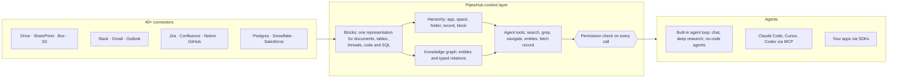

<div align="center">

**Translations:** [English](../../../README.md) · [Français](../fr/README.md) · [Deutsch](../de/README.md) · [简体中文](../zh-CN/README.md) · [日本語](../ja/README.md) · [Русский](../ru/README.md) · [עברית](../he/README.md) · [한국어](../ko/README.md) · [Español](../es/README.md) · [Português](../pt/README.md) · [Türkçe](../tr/README.md) · **Tiếng Việt** · [Italiano](../it/README.md)

</div>

<div align="center">

<a href="https://www.pipeshub.com"></a>

<h3>Lớp ngữ cảnh mã nguồn mở cho tác nhân AI</h3>

<p>
  <a href="https://www.pipeshub.com/">Trang web</a> ·
  <a href="https://docs.pipeshub.com/">Tài liệu</a> ·
  <a href="https://discord.com/invite/K5RskzJBm2">Discord</a> ·
  <a href="https://plum-myrtle-9f7.notion.site/Pipeshub-s-Product-Roadmap-33841c164f54803a9989fd0fdbfdb1ee">Lộ trình</a>
</p>

<a href="https://trendshift.io/repositories/14618"></a>

<p>
  <a href="https://opensource.org/licenses/Apache-2.0"></a>
  <a href="https://github.com/pipeshub-ai/pipeshub-ai/releases"></a>
  <a href="https://hub.docker.com/r/pipeshubai/pipeshub-ai"></a>
  <a href="https://discord.com/invite/K5RskzJBm2"></a>
  
  
  <a href="https://github.com/pipeshub-ai/pipeshub-ai/issues">
    
  </a>
  <a href="https://github.com/pipeshub-ai/pipeshub-ai/pulls">
    
  </a>
  <br/>
  <a href="https://x.com/PipesHub"></a>
  <a href="https://www.linkedin.com/company/pipeshub"></a>
  <br/>
  
  <br/>
  <a href="https://www.npmjs.com/package/@pipeshub-ai/sdk"></a>
  <a href="https://pypi.org/project/pipeshub-sdk/"></a>
  <a href="https://github.com/pipeshub-ai/pipeshub-sdk-go"></a>
  <a href="https://www.npmjs.com/package/@pipeshub-ai/mcp"></a>
</p>

</div>

<h2 id="about-pipeshub">Trao cho tác nhân một không gian làm việc, không phải một đống đoạn văn rời rạc</h2>

<strong>[PipesHub](https://www.pipeshub.com/)</strong> biến mọi tri thức của công ty bạn thành một không gian làm việc tôn trọng quyền truy cập. Các tác nhân AI khám phá nó giống như tác nhân lập trình khám phá một kho mã. Tác nhân tìm kiếm trong đó, chạy `grep`, duyệt thư mục và đồ thị tri thức, chỉ đọc những gì cần, và trích dẫn chính xác block mà mỗi câu trả lời lấy từ đó.

Kết nối Slack, Google Drive, GitHub, Microsoft 365, Jira, Notion, Postgres và hơn 25 hệ thống khác. Dùng chat, nghiên cứu chuyên sâu và tác nhân có sẵn, hoặc cung cấp cùng ngữ cảnh đó cho Claude Code, Cursor, Codex và tác nhân của riêng bạn qua MCP và SDK. Tự lưu trữ, Apache 2.0, dùng mô hình của riêng bạn.

> [!TIP]
> Triển khai bằng một lệnh duy nhất:
> ```bash
> curl -fsSL https://get.pipeshub.com/install | bash
> ```

## Tại sao cần một lớp ngữ cảnh?

Tác nhân thường thất bại với tri thức doanh nghiệp vì ngữ cảnh, không phải vì mô hình. Truy xuất top-k đoạn văn chỉ đưa cho tác nhân vài mảnh rời rạc. Nó làm mất thông tin mỗi mảnh nằm ở đâu, liên kết tới gì, ai được xem và đến từ đâu.

Tác nhân lập trình trở nên giỏi khi chúng có thể chạy `ls`, `grep` và đọc kho mã thay vì nhận những đoạn mã được dán sẵn. PipesHub mang lại điều tương tự cho tác nhân trên dữ liệu của công ty bạn.

| | RAG với top-k đoạn văn | PipesHub |
| --- | --- | --- |
| **Tác nhân thấy gì trước tiên** | Vài đoạn văn bản | Tên, vị trí, siêu dữ liệu và tóm tắt của từng bản ghi, cùng các block khớp |
| **Cách đào sâu hơn** | Không thể: một lần truy xuất cho mỗi câu hỏi | Tìm kiếm lai, `grep`/`find` trên bản ghi, điều hướng thư mục và tra cứu đồ thị tri thức, trong một vòng lặp |
| **Cấu trúc** | Mất khi chia đoạn | Mọi nguồn đều trở thành Blocks: mục, bảng với hàng và ô, luồng hội thoại, mã, bảng SQL kèm schema |
| **Quyền truy cập** | Thường chỉ ước lượng lúc lập chỉ mục | Được kiểm tra theo quyền của hệ thống nguồn cho người dùng gửi yêu cầu, ở mọi lần gọi công cụ |
| **Trích dẫn** | Theo đoạn, nếu có | Theo block: trang, ô bảng, hàng, slide hoặc dòng, và các trích dẫn bịa đặt bị loại bỏ |

## Cách hoạt động



Mọi nguồn đều trở thành **Blocks** (các khối dữ liệu), một dạng biểu diễn duy nhất giữ nguyên bảng, luồng hội thoại và mã, đồng thời ghi nhớ chính xác trang, ô hoặc dòng mà mỗi block đến từ đó. Phía trên Blocks có hai bản đồ: **cấu trúc phân cấp** của hệ thống nguồn và **đồ thị tri thức** về các thực thể. Tác nhân khám phá cả hai bằng **các công cụ tiết lộ thông tin theo từng bước**. Kết quả tìm kiếm hiển thị trước siêu dữ liệu và tóm tắt của từng bản ghi. Tác nhân chỉ chạy grep, điều hướng, đi theo thực thể hoặc đọc toàn bộ bản ghi khi thật sự cần. **Mọi lần gọi công cụ đều được kiểm tra theo quyền của hệ thống nguồn** cho người mà tác nhân đang hành động thay mặt.

**[Đọc cách lớp ngữ cảnh hoạt động →](../../context-layer.md)** Tài liệu này bao gồm định dạng Block, cấu trúc phân cấp và đồ thị, từng công cụ của tác nhân và mã nguồn của nó, cơ chế thực thi quyền truy cập, vòng lặp tác nhân và các giới hạn hiện tại.

## Bạn có thể xây dựng gì với PipesHub

Một lớp ngữ cảnh, nhiều sản phẩm bên trên. Dùng các ứng dụng có sẵn như hiện có, hoặc tự xây dựng qua MCP và SDK.

| Xây dựng | PipesHub mang lại gì | Bắt đầu từ đây |
| --- | --- | --- |
| **Pipeline RAG dạng tác nhân** | Các công cụ truy xuất mà tác nhân gọi trong vòng lặp (tìm kiếm lai, `grep`, điều hướng, tra cứu thực thể, đọc toàn bộ bản ghi), với kiểm tra quyền và trích dẫn cấp block đã có sẵn | [SDK starter](https://github.com/pipeshub-ai/examples/tree/main/sdk-starter) · [MCP](#dùng-từ-claude-code-cursor-hoặc-codex) |
| **Tìm kiếm doanh nghiệp** | Một ô tìm kiếm trên hơn 40 trình kết nối, mỗi người chỉ thấy những gì mình được phép xem, kèm câu trả lời có trích dẫn | Có sẵn · [ví dụ](https://github.com/pipeshub-ai/examples/tree/main/private-enterprise-search) |
| **Trợ lý AI cho nơi làm việc** | Chat và nghiên cứu chuyên sâu trên tri thức công ty, cùng với tìm kiếm web và nhập liệu bằng giọng nói | Có sẵn |
| **Ngữ cảnh cho tác nhân lập trình** | Claude Code, Cursor và Codex trả lời dựa trên tài liệu thiết kế, ticket, sự cố và luồng chat, không chỉ dựa trên mã | [ví dụ](https://github.com/pipeshub-ai/examples/tree/main/company-knowledge-mcp) |
| **Tác nhân và tự động hóa không cần lập trình** | Trình tạo tác nhân với các hành động trong Slack, Gmail, Jira, Confluence, GitHub, Linear, Notion, Salesforce, Zendesk, Freshdesk và 20 công cụ khác | Có sẵn |
| **Copilot hỗ trợ khách hàng** | Câu trả lời lấy từ ticket cũ, runbook và tài liệu (ServiceNow, Zammad, Jira, Confluence), với hành động ngược lại trong công cụ quản lý ticket | Có sẵn · SDK |
| **Thông tin bán hàng và khách hàng** | Tài khoản, liên hệ và giao dịch Salesforce trong đồ thị tri thức, có thể tìm kiếm cùng với email, tài liệu và chat về chính những khách hàng đó | Có sẵn |
| **Hỏi đáp trên cơ sở dữ liệu của bạn** | Bảng Postgres, MariaDB và Snowflake được lập chỉ mục cùng schema và khóa ngoại, cùng sandbox chạy SQL và Python để phân tích | Có sẵn |
| **Báo cáo, biểu đồ và dashboard** | Tác nhân viết và chạy mã trong sandbox rồi trả kết quả dưới dạng artifact có thể chia sẻ | Có sẵn |
| **Tìm kiếm tri thức kỹ thuật** | Mã, pull request và commit từ GitHub và GitLab, liên kết với ticket và tài liệu liên quan | Có sẵn |
| **Ứng dụng của riêng bạn trên tri thức công ty** | SDK cho Python, TypeScript và Go, "Sign in with PipesHub" để mỗi người dùng tìm kiếm với tư cách chính mình, và API tải lên cho các tài liệu mà không trình kết nối nào hỗ trợ | [ví dụ](https://github.com/pipeshub-ai/examples) |
| **AI riêng tư, on-prem** | Tất cả những điều trên, tự lưu trữ, với bất kỳ nhà cung cấp LLM nào hoặc mô hình cục bộ qua Ollama, dữ liệu nằm trong hạ tầng của bạn | [Triển khai](#-hướng-dẫn-triển-khai) |

## Dùng từ Claude Code, Cursor hoặc Codex

**[Cho trợ lý lập trình quyền truy cập an toàn vào tri thức của công ty →](https://github.com/pipeshub-ai/examples/tree/main/company-knowledge-mcp)**

Mất khoảng mười phút khi PipesHub đã chạy và dữ liệu đã được lập chỉ mục. Tạo một Personal Access Token (không cần quyền quản trị). Kết nối trợ lý của bạn: một lệnh cho Claude Code, một tệp cấu hình cho Cursor hoặc Codex. Rồi hỏi *"tại sao logic thử lại trong billing worker bị thay đổi?"* Trợ lý trả lời dựa trên báo cáo sự cố, pull request, luồng chat và tài liệu thiết kế, mỗi nguồn đều có trích dẫn, và chỉ khi bạn được phép xem chúng.

Qua MCP, trợ lý hiện đã có các công cụ tìm kiếm, chat và bản ghi của PipesHub. Phần còn lại của bộ công cụ tác nhân (`grep`, `navigate`, tra cứu thực thể) sẽ sớm có trên MCP.

Muốn có cùng khả năng truy xuất trong mã của riêng bạn, hoặc sau một ô tìm kiếm cho nhóm của bạn? [SDK starter và ví dụ tìm kiếm](https://github.com/pipeshub-ai/examples) đáp ứng cả hai. Đã xây dựng được gì đó? [Hãy cho chúng tôi xem](https://github.com/pipeshub-ai/examples/issues/new?template=showcase.yml).

## PipesHub trong thực tế

### Trích dẫn


### Trình kết nối


<details>
<summary><b>Thêm bản demo: tất cả bản ghi, tìm kiếm tri thức</b></summary>

### Tất cả bản ghi


### Tìm kiếm tri thức


</details>

## Tính năng

**Ngữ cảnh cho tác nhân**

- 🗂️ **Có thể khám phá, không chỉ tìm kiếm:** Tìm kiếm lai, `grep` trên bản ghi, điều hướng thư mục và tra cứu đồ thị tri thức, tất cả đều là công cụ cho tác nhân.
- 🔒 **Tôn trọng quyền truy cập ở mọi bước:** Mọi lần gọi công cụ đều được kiểm tra theo quyền của hệ thống nguồn cho người mà tác nhân đang hành động thay mặt.
- 📝 **Trích dẫn ở cấp block:** Câu trả lời trích dẫn trang, ô bảng, hàng, slide hoặc dòng mà chúng đến từ đó.
- 🧱 **Dữ liệu có cấu trúc, bán cấu trúc và phi cấu trúc trong một lớp:** Tài liệu, bảng tính, ticket, luồng chat, mã và bảng SQL đều trở thành Blocks.

**Kết nối với hệ thống của bạn**

- 🔌 **Hơn 40 trình kết nối:** Google Workspace, Microsoft 365, Slack, Jira, Confluence, Notion, GitHub, GitLab, Salesforce, ServiceNow, Postgres, Snowflake và nhiều hơn nữa, với đồng bộ thời gian thực và theo lịch.
- 🕸️ **Đồ thị tri thức:** Thực thể và quan hệ được trích xuất lúc lập chỉ mục và được dùng lúc trả lời.
- 🎙️ **Đa phương thức:** Hình ảnh, sơ đồ và tệp quét, cùng với nhập liệu bằng giọng nói.
- 🧠 **Dùng mô hình của riêng bạn, tự lưu trữ hoàn toàn:** Bất kỳ nhà cung cấp LLM nào hoặc mô hình cục bộ, triển khai trên hạ tầng của chính bạn.

## PipesHub Cloud

Bạn muốn dùng PipesHub được quản lý hoàn toàn mà không phải tự vận hành hạ tầng? PipesHub Cloud sắp ra mắt.

👉 **[Tham gia danh sách chờ Cloud](https://pipeshub.com/cloud-waitlist)** để được truy cập sớm.

## Trình kết nối

<p align="center">
<a href="https://pipeshub.com/connectors"></a>
</p>

## 🚀 Hướng dẫn triển khai

PipesHub có thể chạy cục bộ hoặc triển khai trên bất kỳ máy chủ nào bằng Docker Compose. Trình cài đặt tương tác xử lý toàn bộ cấu hình — bao gồm secret, graph DB, broker và chọn image tag — và tạo sẵn tệp `.env` cho bạn.

> **HTTPS trên máy chủ đám mây:** Nếu bạn triển khai PipesHub trên máy chủ đám mây, hãy dùng endpoint HTTPS. Trình duyệt chặn một số yêu cầu qua HTTP thường. Dùng Cloudflare, Nginx hoặc Traefik để kết thúc TLS. Màn hình trắng sau khi triển khai chỉ với HTTP thường là do hạn chế này.

---

### ⚡ Bắt đầu nhanh (Khuyến nghị)

Cần [Docker](https://docs.docker.com/get-docker/) với Compose v2. Chỉ một lệnh:

```bash
curl -fsSL https://get.pipeshub.com/install | bash
```

Lệnh này tải các tệp triển khai của bản phát hành mới nhất vào `./pipeshub` và
khởi chạy trình cài đặt tương tác. Mở **http://localhost:3000** khi
quá trình kết thúc.

> **Muốn đọc trước khi chạy?** Hãy tải về và kiểm tra script trước:
>
> ```bash
> curl -fsSL https://get.pipeshub.com/install -o pipeshub-install.sh
> less pipeshub-install.sh        # review it
> bash pipeshub-install.sh
> ```

Trình cài đặt sẽ:
- Kiểm tra các điều kiện tiên quyết về Docker, RAM và ổ đĩa
- Hỏi bạn muốn triển khai **slim** hay **full**
- Cho phép tùy chỉnh graph DB, message broker và KV store nếu muốn
- Tạo secret ngẫu nhiên và ghi tệp `.env`
- Kéo image và khởi động stack
- Chờ PipesHub hoạt động ổn định, xác minh có thể truy cập và in ra URL

### 🛠️ Từ kho mã đã clone (dành cho nhà phát triển)

Để build từ mã nguồn, đóng góp, hoặc gắn trình cài đặt với bản checkout của bạn:

```bash
git clone https://github.com/pipeshub-ai/pipeshub-ai.git
cd pipeshub-ai

# Same installer, run from the repo root
./install.sh
```

Build image cục bộ từ mã nguồn chỉ có thể thực hiện từ kho mã đã clone (`./install.sh --build`);
trình cài đặt một lệnh ở trên luôn dùng image dựng sẵn.

> **Tùy chọn nâng cao:** các cờ của trình cài đặt (`--yes`, `--version`, `--reconfigure`, `--print-env-only`), biến môi trường CI, các kiểu triển khai slim và full, cách dùng Compose profile thủ công và build cục bộ từ mã nguồn được trình bày trong [Tùy chọn triển khai nâng cao](../../../deployment/docker-compose/ADVANCED_DEPLOYMENT.md).

## Xây dựng trên PipesHub: MCP và SDK

Trải nghiệm tìm kiếm có sẵn là một cách để dùng PipesHub. Cùng ngữ cảnh đã kết nối
và được lọc theo quyền đó cũng có sẵn cho tác nhân và ứng dụng của riêng bạn —
qua MCP cho mọi client tương thích, hoặc qua SDK khi bạn gọi nó
từ mã của mình.

Tác nhân kết nối với tư cách một người cụ thể chứ không phải với tư cách ứng dụng, nên nó
truy xuất đúng những gì người đó được phép xem. Quyền truy cập được xác định khi
truy vấn chạy, theo chính quyền của hệ thống nguồn, thay vì được
ước lượng lúc build.

Hướng dẫn từng bước cho các trường hợp phổ biến nhất — MCP cho trợ lý
lập trình, tìm kiếm doanh nghiệp riêng tư và SDK starter — có tại
[**pipeshub-ai/examples**](https://github.com/pipeshub-ai/examples). Tài liệu
tham khảo cho từng thành phần ở bên dưới.

### Máy chủ MCP

Dùng PipesHub với bất kỳ client nào tương thích MCP để đưa ngữ cảnh doanh nghiệp vào quy trình AI. Xem README để biết cách cài đặt và sử dụng.

**Kho mã:** [pipeshub-ai/mcp-server](https://github.com/pipeshub-ai/mcp-server/)

Đang dùng [Omnigent](https://omnigent.ai)? Xem [`integrations/omnigent/`](../../../integrations/omnigent/) để biết ba cách kết nối, từ gắn qua giao diện web đến bộ kết nối bằng script.

### SDK

PipesHub cung cấp SDK cho nhà phát triển bằng Python, TypeScript và Go để giúp bạn tích hợp nhanh chóng. Xem README của kho SDK tương ứng để biết chi tiết cài đặt và sử dụng.

| Tên | Mô tả | Liên kết |
|------|-------------|------|
| **Python SDK** | Python SDK cho PipesHub | [pipeshub-ai/pipeshub-sdk-python](https://github.com/pipeshub-ai/pipeshub-sdk-python) |
| **TypeScript SDK** | TypeScript SDK cho PipesHub | [pipeshub-ai/pipeshub-sdk-typescript](https://github.com/pipeshub-ai/pipeshub-sdk-typescript) |
| **Go SDK** | Go SDK cho PipesHub | [pipeshub-ai/pipeshub-sdk-go](https://github.com/pipeshub-ai/pipeshub-sdk-go) |

> Cần SDK cho ngôn ngữ khác? Liên hệ với chúng tôi tại developer@pipeshub.com

## Lộ trình

<p>Chúng tôi phát triển công khai. Đây là những gì đã xong và sắp tới:</p>

<ul>
<li>✅ 🤖 <strong>Tác nhân AI cho nơi làm việc</strong>: trình tạo tác nhân không cần lập trình hoàn chỉnh</li>
<li>✅ 🔗 Hỗ trợ <strong>MCP (Model Context Protocol)</strong>, cả server lẫn client</li>
<li>✅ 🧰 <strong>SDK cho nhà phát triển</strong></li>
<li>✅ 🔍 <strong>Tìm kiếm mã</strong> trên GitHub và GitLab</li>
<li>⬜ 👤 <strong>Tìm kiếm cá nhân hóa</strong> dựa trên nhóm, vai trò và lịch sử</li>
<li>✅ ☸️ Triển khai <strong>Kubernetes cho môi trường production</strong> với cấu hình HA mặc định</li>
<li>⬜ 📈 <strong>Tăng cường độ liên quan bằng PageRank</strong> trên đồ thị tri thức</li>
</ul>
<p>👉 <strong><a href="https://plum-myrtle-9f7.notion.site/Pipeshub-s-Product-Roadmap-33841c164f54803a9989fd0fdbfdb1ee">Xem toàn bộ lộ trình sản phẩm trên Notion</a></strong></p>

<hr>

## 👥 Đóng góp

Muốn tham gia cộng đồng nhà phát triển của chúng tôi? Hãy xem [Hướng dẫn đóng góp](https://github.com/pipeshub-ai/pipeshub-ai/blob/main/CONTRIBUTING.md) để biết cách thiết lập môi trường phát triển, tiêu chuẩn viết mã và quy trình đóng góp.
<h3>Cần gì thì tìm ở đâu</h3>

<table>

<tr><td>Đặt câu hỏi hoặc nhận trợ giúp</td><td><a href="https://discord.com/invite/K5RskzJBm2">Discord</a></td></tr>
<tr><td>Báo lỗi hoặc đề xuất tính năng</td><td><a href="https://github.com/pipeshub-ai/pipeshub-ai/issues">GitHub Issues</a></td></tr>
<tr><td>Báo cáo vấn đề bảo mật</td><td><a href="https://github.com/pipeshub-ai/pipeshub-ai/blob/main/SECURITY.md">Báo cáo vấn đề bảo mật</a></td></tr>
<tr><td>Đọc tài liệu</td><td><a href="https://docs.pipeshub.com/">Tài liệu Pipeshub</a></td></tr>
<tr><td>Xem thay đổi trong từng bản phát hành</td><td><a href="https://github.com/pipeshub-ai/pipeshub-ai/blob/main/CHANGELOG.md">Nhật ký thay đổi</a></td></tr>
</table>

## Câu hỏi thường gặp

### PipesHub là gì?

PipesHub là lớp ngữ cảnh mã nguồn mở cho tác nhân AI. Nó biến tri thức nằm rải rác trong các hệ thống nghiệp vụ của công ty bạn thành một không gian làm việc tôn trọng quyền truy cập, nơi tác nhân có thể tìm kiếm, chạy `grep`, điều hướng và trích dẫn.

Nó kết nối các hệ thống như Slack, Google Drive, GitHub, Microsoft 365 và Notion, rồi cung cấp nội dung của chúng theo hai cách: tìm kiếm có trích dẫn và tôn trọng quyền truy cập cho nhóm của bạn, và ngữ cảnh đáng tin cậy cho tác nhân AI qua API, SDK và MCP. Tác nhân có cùng góc nhìn được quản lý về tri thức công ty như một người dùng, với cùng các kiểm soát truy cập. Nhờ vậy chúng trả lời dựa trên dữ liệu thật của công ty thay vì đoán mò giữa các công cụ. Bạn có thể dùng trải nghiệm tìm kiếm có sẵn, hoặc xây dựng tác nhân, quy trình và ứng dụng của riêng bạn trên nền tảng đó.

### PipesHub khác gì so với các công cụ AI cho nơi làm việc khác?

Hầu hết công cụ chỉ đưa cho mô hình AI vài đoạn văn bản được truy xuất. PipesHub cung cấp cho tác nhân các công cụ để khám phá tri thức công ty như cách tác nhân lập trình khám phá một kho mã: tìm kiếm lai, `grep` trên bản ghi, điều hướng thư mục và tra cứu đồ thị tri thức, mỗi thao tác đều được kiểm tra theo quyền của người dùng gửi yêu cầu trong hệ thống nguồn. Mọi nguồn đều trở thành Blocks, nên câu trả lời trích dẫn chính xác trang, ô bảng, hàng hoặc slide. PipesHub hoàn toàn mã nguồn mở (Apache 2.0) và có thể tự lưu trữ, nên dữ liệu của bạn không bao giờ rời khỏi hạ tầng của bạn. Xem [Tại sao cần một lớp ngữ cảnh?](#tại-sao-cần-một-lớp-ngữ-cảnh)

### PipesHub hỗ trợ những trình kết nối nào?

PipesHub có hơn 40 trình kết nối cho hơn 30 hệ thống, với lập chỉ mục thời gian thực và theo lịch. Xem [tổng quan về trình kết nối](https://docs.pipeshub.com/connectors/overview).

### PipesHub hỗ trợ những nhà cung cấp LLM nào?

PipesHub theo mô hình "Bring Your Own Model" — bạn có thể dùng bất kỳ nhà cung cấp LLM nào. Triển khai trong VPC của bạn với các mô hình bạn ưa thích.

**Thêm câu hỏi:** định dạng tệp, công nghệ sử dụng, đồ thị tri thức, hỗ trợ đa phương thức và khắc phục sự cố được giải đáp trong [FAQ đầy đủ](../../FAQ.md).

<hr>
<div align="center">
<h3>⭐ Gắn sao cho chúng tôi trên GitHub!</h3>

<p>Điều đó giúp dự án đến được với những nhóm cần nó.</p>

<p>
<a href="https://github.com/pipeshub-ai/pipeshub-ai">

</a>
</p>

<p>
<a href="https://www.star-history.com/?repos=pipeshub-ai%2Fpipeshub-ai">
 <picture>
   <source media="(prefers-color-scheme: dark)" srcset="https://api.star-history.com/chart?repos=pipeshub-ai/pipeshub-ai&amp;type=date&amp;theme=dark&amp;legend=top-left&amp;sealed_token=msbcJ843ZmXCld8-zgduwH9hV6yn69hyfrnwfkcWiRqe7htnO6pSbQJrkxdoarzriLW6aGAETT-iQ3m7yWN3BacAyPyHfNIiPGabl6r6CbXFjcvJ7n1NZw" />
   <source media="(prefers-color-scheme: light)" srcset="https://api.star-history.com/chart?repos=pipeshub-ai/pipeshub-ai&amp;type=date&amp;legend=top-left&amp;sealed_token=msbcJ843ZmXCld8-zgduwH9hV6yn69hyfrnwfkcWiRqe7htnO6pSbQJrkxdoarzriLW6aGAETT-iQ3m7yWN3BacAyPyHfNIiPGabl6r6CbXFjcvJ7n1NZw" />
   
 </picture>
</a>
</p>

<p><sub>Được xây dựng với ❤️ bởi <a href="https://www.pipeshub.com/">đội ngũ PipesHub</a> và những người đóng góp trên khắp thế giới.</sub></p>

</div>
