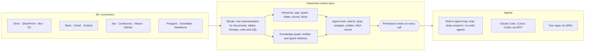

<div align="center">

**Translations:** [English](../../../README.md) · [Français](../fr/README.md) · [Deutsch](../de/README.md) · **简体中文** · [日本語](../ja/README.md) · [Русский](../ru/README.md) · [עברית](../he/README.md) · [한국어](../ko/README.md) · [Español](../es/README.md) · [Português](../pt/README.md) · [Türkçe](../tr/README.md) · [Tiếng Việt](../vi/README.md) · [Italiano](../it/README.md)

</div>

<div align="center">

<a href="https://www.pipeshub.com"></a>

<h3>开源的 AI 智能体上下文层</h3>

<p>
  <a href="https://www.pipeshub.com/">官网</a> ·
  <a href="https://docs.pipeshub.com/">文档</a> ·
  <a href="https://discord.com/invite/K5RskzJBm2">Discord</a> ·
  <a href="https://plum-myrtle-9f7.notion.site/Pipeshub-s-Product-Roadmap-33841c164f54803a9989fd0fdbfdb1ee">路线图</a>
</p>

<a href="https://trendshift.io/repositories/14618"></a>

<p>
  <a href="https://opensource.org/licenses/Apache-2.0"></a>
  <a href="https://github.com/pipeshub-ai/pipeshub-ai/releases"></a>
  <a href="https://hub.docker.com/r/pipeshubai/pipeshub-ai"></a>
  <a href="https://discord.com/invite/K5RskzJBm2"></a>
  
  
  <a href="https://github.com/pipeshub-ai/pipeshub-ai/issues">
    
  </a>
  <a href="https://github.com/pipeshub-ai/pipeshub-ai/pulls">
    
  </a>
  <br/>
  <a href="https://x.com/PipesHub"></a>
  <a href="https://www.linkedin.com/company/pipeshub"></a>
  <br/>
  
  <br/>
  <a href="https://www.npmjs.com/package/@pipeshub-ai/sdk"></a>
  <a href="https://pypi.org/project/pipeshub-sdk/"></a>
  <a href="https://github.com/pipeshub-ai/pipeshub-sdk-go"></a>
  <a href="https://www.npmjs.com/package/@pipeshub-ai/mcp"></a>
</p>

</div>

<h2 id="about-pipeshub">给智能体一个工作区，而不是一堆文本块</h2>

<strong>[PipesHub](https://www.pipeshub.com/)</strong> 把公司掌握的一切知识变成一个感知权限的工作区。AI 智能体探索它的方式，就像编程智能体探索代码仓库一样：搜索它、对它执行 `grep`、浏览它的文件夹和知识图谱，只读取需要的内容，并为每个回答引用其来源的确切块。

连接 Slack、Google Drive、GitHub、Microsoft 365、Jira、Notion、Postgres 以及其他 25+ 个系统。你可以使用内置的对话、深度研究和智能体，也可以通过 MCP 和 SDK 把同样的上下文提供给 Claude Code、Cursor、Codex 以及你自己的智能体。支持自托管，采用 Apache 2.0 许可，可自带模型。

> [!TIP]
> 一条命令即可部署：
> ```bash
> curl -fsSL https://get.pipeshub.com/install | bash
> ```

## 为什么需要上下文层？

智能体在公司知识上表现不佳，通常是上下文的问题，而不是模型的问题。Top-k 文本块检索只给智能体几段零散的片段，却丢掉了每段内容位于何处、关联了什么、谁有权查看，以及它从哪里来。

编程智能体之所以变得好用，是因为它们可以对代码仓库执行 `ls`、`grep` 并直接阅读，而不再只是接收粘贴进来的代码片段。PipesHub 让智能体在公司数据上也拥有同样的能力。

| | Top-k 文本块 RAG | PipesHub |
| --- | --- | --- |
| **智能体首先看到什么** | 几个文本块 | 每条记录的名称、位置、元数据和摘要，以及命中的块 |
| **如何进一步深挖** | 做不到：每个问题只检索一次 | 混合搜索、对记录执行 `grep`/`find`、文件夹导航和知识图谱查询，循环进行 |
| **结构** | 分块时丢失 | 每个数据源都会转换为 Blocks：章节、包含行和单元格的表格、讨论串、代码、带有 schema 的 SQL 表 |
| **权限** | 通常在索引时近似处理 | 每次工具调用时，都按源系统权限对发起请求的用户进行校验 |
| **引用** | 按文本块引用（如果有的话） | 按块引用：页面、表格单元格、行、幻灯片或代码行，并移除编造的引用 |

## 工作原理



每个数据源都会转换为 **Blocks**（块）。这是一种统一的表示形式，能完整保留表格、讨论串和代码，并记住每个块来自哪个页面、单元格或代码行。Blocks 之上有两张地图：源系统的**层级结构**，以及由实体构成的**知识图谱**。智能体通过**分阶段披露信息的工具**来探索这两者：搜索结果先给出每条记录的元数据和摘要，智能体只在需要时才执行 grep、导航、追踪实体或读取完整记录。**每次工具调用都会按源系统的权限进行校验**，校验对象是智能体所代表的那个人。

**[了解上下文层的工作原理 →](../../context-layer.md)** 内容涵盖 Block 格式、层级结构与图谱、每个智能体工具及其代码位置、权限执行、智能体循环，以及当前的局限。

## 用 PipesHub 能构建什么

一个上下文层，可以支撑许多产品。你可以直接使用内置应用，也可以通过 MCP 和 SDK 构建自己的应用。

| 构建什么 | PipesHub 提供什么 | 从这里开始 |
| --- | --- | --- |
| **智能体式 RAG 管道** | 供智能体循环调用的检索工具（混合搜索、`grep`、导航、实体查询、读取完整记录），权限校验和块级引用都已内置 | [SDK 入门示例](https://github.com/pipeshub-ai/examples/tree/main/sdk-starter) · [MCP](#在-claude-codecursor-或-codex-中使用) |
| **企业搜索** | 一个覆盖 40+ 个连接器的搜索框，每个人只能看到自己有权查看的内容，并提供带引用的回答 | 内置 · [示例](https://github.com/pipeshub-ai/examples/tree/main/private-enterprise-search) |
| **职场 AI 助手** | 基于公司知识的对话和深度研究，另有网页搜索和语音输入 | 内置 |
| **编程智能体的上下文** | Claude Code、Cursor 和 Codex 不只依据代码作答，还能依据设计文档、工单、事故记录和聊天讨论串作答 | [示例](https://github.com/pipeshub-ai/examples/tree/main/company-knowledge-mcp) |
| **无代码智能体和自动化** | 一个智能体构建器，可在 Slack、Gmail、Jira、Confluence、GitHub、Linear、Notion、Salesforce、Zendesk、Freshdesk 以及其他 20 个工具中执行操作 | 内置 |
| **客服 Copilot** | 依据历史工单、运维手册和文档（ServiceNow、Zammad、Jira、Confluence）作答，并能回到工单系统中执行操作 | 内置 · SDK |
| **销售与客户洞察** | Salesforce 中的客户、联系人和商机进入知识图谱，可与同一客户相关的邮件、文档和聊天一起搜索 | 内置 |
| **对数据库提问** | 对 Postgres、MariaDB 和 Snowflake 表连同其 schema 和外键一起建立索引，另有可运行 SQL 和 Python 进行分析的沙箱 | 内置 |
| **报告、图表和仪表盘** | 智能体在沙箱中编写并运行代码，把结果作为可分享的制品返回 | 内置 |
| **工程知识搜索** | 来自 GitHub 和 GitLab 的代码、拉取请求和提交，并与相关的工单和文档关联 | 内置 |
| **基于公司知识构建你自己的应用** | Python、TypeScript 和 Go SDK；“使用 PipesHub 登录”让每个用户以自己的身份搜索；以及用于上传任何连接器都未覆盖的文档的上传 API | [示例](https://github.com/pipeshub-ai/examples) |
| **私有化、本地部署的 AI** | 以上全部能力均可自托管，可使用任意 LLM 提供商或通过 Ollama 使用本地模型，数据始终留在你的基础设施中 | [部署](#-部署指南) |

## 在 Claude Code、Cursor 或 Codex 中使用

**[让你的编程助手安全地访问公司知识 →](https://github.com/pipeshub-ai/examples/tree/main/company-knowledge-mcp)**

在 PipesHub 已运行且数据已完成索引的前提下，大约十分钟即可完成。创建一个个人访问令牌（Personal Access Token，无需管理员权限），连接你的助手（Claude Code 只需一条命令，Cursor 或 Codex 只需一个配置文件），然后提问 *“为什么修改了计费 worker 中的重试逻辑？”* 它会依据事故复盘、拉取请求、聊天讨论串和设计文档作答，每条都附有引用，并且只引用你有权查看的内容。

目前，助手可以通过 MCP 使用 PipesHub 的搜索、对话和记录工具。其余智能体工具（`grep`、`navigate`、实体查询）接下来会陆续接入 MCP。

想在自己的代码里使用同样的检索能力，或者为团队做一个搜索框？[SDK 入门示例和搜索示例](https://github.com/pipeshub-ai/examples) 两者都有覆盖。做出了什么作品？[展示给我们看](https://github.com/pipeshub-ai/examples/issues/new?template=showcase.yml)。

## PipesHub 实际演示

### 引用


### 连接器


<details>
<summary><b>更多演示：全部记录、知识搜索</b></summary>

### 全部记录


### 知识搜索


</details>

## 功能特性

**为智能体提供上下文**

- 🗂️ **可探索，而不只是可搜索：** 混合搜索、对记录执行 `grep`、文件夹导航和知识图谱查询，全部作为智能体工具提供。
- 🔒 **每一步都感知权限：** 每次工具调用都会按源系统的权限进行校验，校验对象是智能体所代表的那个人。
- 📝 **块级引用：** 回答会引用其来源的页面、表格单元格、行、幻灯片或代码行。
- 🧱 **结构化、半结构化和非结构化数据统一在一层：** 文档、电子表格、工单、聊天讨论串、代码和 SQL 表都会转换为 Blocks。

**连接你的系统**

- 🔌 **40+ 个连接器：** Google Workspace、Microsoft 365、Slack、Jira、Confluence、Notion、GitHub、GitLab、Salesforce、ServiceNow、Postgres、Snowflake 等，支持实时同步和定时同步。
- 🕸️ **知识图谱：** 在索引时抽取实体和关系，在回答时加以利用。
- 🎙️ **多模态：** 支持图片、图表和扫描文件，以及语音输入。
- 🧠 **自带模型，完全自托管：** 可使用任意 LLM 提供商或本地模型，部署在你自己的基础设施中。

## PipesHub Cloud

想使用完全托管的 PipesHub，而不必运维自己的基础设施？PipesHub Cloud 即将推出。

👉 **[加入 Cloud 候补名单](https://pipeshub.com/cloud-waitlist)**，抢先体验。

## 连接器

<p align="center">
<a href="https://pipeshub.com/connectors"></a>
</p>

## 🚀 部署指南

PipesHub 可以在本地运行，也可以通过 Docker Compose 部署到任意服务器。交互式安装程序会处理全部配置，包括密钥、图数据库、消息代理和镜像标签的选择，并为你生成 `.env` 文件。

> **云服务器上的 HTTPS：** 如果你在云服务器上部署 PipesHub，请使用 HTTPS 端点。浏览器会拦截通过明文 HTTP 发出的某些请求。可以使用 Cloudflare、Nginx 或 Traefik 来终止 TLS。仅使用 HTTP 部署后出现白屏，通常就是这一限制导致的。

---

### ⚡ 快速开始（推荐）

需要安装带有 Compose v2 的 [Docker](https://docs.docker.com/get-docker/)。只需一条命令：

```bash
curl -fsSL https://get.pipeshub.com/install | bash
```

该命令会把最新版本的部署文件下载到 `./pipeshub`，
并启动交互式安装程序。安装完成后，打开 **http://localhost:3000**。

> **想先看看再运行？** 先下载脚本并检查：
>
> ```bash
> curl -fsSL https://get.pipeshub.com/install -o pipeshub-install.sh
> less pipeshub-install.sh        # review it
> bash pipeshub-install.sh
> ```

安装程序会：
- 检查 Docker、内存和磁盘等前置条件
- 询问你要使用 **slim**（精简）还是 **full**（完整）部署
- 允许你按需自定义图数据库、消息代理和 KV 存储
- 生成随机密钥并写入 `.env` 文件
- 拉取镜像并启动整套服务
- 等待 PipesHub 进入健康状态，确认可以访问，并输出访问地址

### 🛠️ 从克隆的仓库安装（面向开发者）

如果要从源码构建、参与贡献，或让安装程序固定使用你检出的代码：

```bash
git clone https://github.com/pipeshub-ai/pipeshub-ai.git
cd pipeshub-ai

# Same installer, run from the repo root
./install.sh
```

从源码构建本地镜像必须使用这种克隆仓库的方式（`./install.sh --build`）；
上面的一键安装程序始终使用预构建镜像。

> **高级选项：** 安装程序参数（`--yes`、`--version`、`--reconfigure`、`--print-env-only`）、CI 环境变量、slim 与 full 部署类型的区别、手动使用 Compose profile，以及本地源码构建，详见[高级部署选项](../../../deployment/docker-compose/ADVANCED_DEPLOYMENT.md)。

## 基于 PipesHub 构建：MCP 与 SDK

内置的搜索体验只是使用 PipesHub 的一种方式。同样经过连接、
按权限过滤的上下文，也可以提供给你自己的智能体和应用：
任何兼容的客户端都可以通过 MCP 使用，在自己的代码中调用时
则可以使用 SDK。

智能体以某个具体用户的身份连接，而不是以应用的身份连接，
因此它检索到的内容恰好是这个人有权查看的内容。访问权限在
查询运行时依据源系统自身的权限进行判定，而不是在构建时
近似处理。

最常见构建场景的分步教程，包括为编程助手搭建 MCP、私有企业搜索
以及 SDK 入门示例，都在
[**pipeshub-ai/examples**](https://github.com/pipeshub-ai/examples) 中。
各个构建模块的参考资料见下文。

### MCP 服务器

将 PipesHub 与任何兼容 MCP 的客户端配合使用，把企业上下文带入 AI 工作流。设置和使用方法请参阅其 README。

**仓库：** [pipeshub-ai/mcp-server](https://github.com/pipeshub-ai/mcp-server/)

在使用 [Omnigent](https://omnigent.ai)？请参阅 [`integrations/omnigent/`](../../../integrations/omnigent/)，其中介绍了三种连接方式，从在 Web 界面中直接接入到使用脚本化的连接工具包。

### SDK

PipesHub 提供 Python、TypeScript 和 Go 的开发者 SDK，帮助你快速完成集成。设置和使用详情请参阅相应 SDK 仓库的 README。

| 名称 | 说明 | 链接 |
|------|-------------|------|
| **Python SDK** | 适用于 PipesHub 的 Python SDK | [pipeshub-ai/pipeshub-sdk-python](https://github.com/pipeshub-ai/pipeshub-sdk-python) |
| **TypeScript SDK** | 适用于 PipesHub 的 TypeScript SDK | [pipeshub-ai/pipeshub-sdk-typescript](https://github.com/pipeshub-ai/pipeshub-sdk-typescript) |
| **Go SDK** | 适用于 PipesHub 的 Go SDK | [pipeshub-ai/pipeshub-sdk-go](https://github.com/pipeshub-ai/pipeshub-sdk-go) |

> 需要其他语言的 SDK？请联系我们：developer@pipeshub.com

## 路线图

<p>我们公开开发。以下是已完成和即将推进的内容：</p>

<ul>
<li>✅ 🤖 <strong>职场 AI 智能体</strong>：一流的无代码智能体构建器</li>
<li>✅ 🔗 <strong>MCP（Model Context Protocol）</strong>支持，包括服务端和客户端</li>
<li>✅ 🧰 <strong>开发者 SDK</strong></li>
<li>✅ 🔍 跨 GitHub 和 GitLab 的<strong>代码搜索</strong></li>
<li>⬜ 👤 基于团队、角色和历史记录的<strong>个性化搜索</strong></li>
<li>✅ ☸️ 带有高可用默认配置的<strong>生产级 Kubernetes</strong> 部署</li>
<li>⬜ 📈 覆盖整个知识图谱的 <strong>PageRank 增强相关性</strong></li>
</ul>
<p>👉 <strong><a href="https://plum-myrtle-9f7.notion.site/Pipeshub-s-Product-Roadmap-33841c164f54803a9989fd0fdbfdb1ee">在 Notion 上查看完整产品路线图</a></strong></p>

<hr>

## 👥 参与贡献

想加入我们的开发者社区？请查看我们的[贡献指南](https://github.com/pipeshub-ai/pipeshub-ai/blob/main/CONTRIBUTING.md)，了解如何搭建开发环境、我们的编码规范以及贡献流程。
<h3>去哪里做什么</h3>

<table>

<tr><td>提问或寻求帮助</td><td><a href="https://discord.com/invite/K5RskzJBm2">Discord</a></td></tr>
<tr><td>报告 Bug 或提出功能请求</td><td><a href="https://github.com/pipeshub-ai/pipeshub-ai/issues">GitHub Issues</a></td></tr>
<tr><td>报告安全问题</td><td><a href="https://github.com/pipeshub-ai/pipeshub-ai/blob/main/SECURITY.md">报告安全问题</a></td></tr>
<tr><td>阅读文档</td><td><a href="https://docs.pipeshub.com/">Pipeshub 文档</a></td></tr>
<tr><td>查看每个版本的变更</td><td><a href="https://github.com/pipeshub-ai/pipeshub-ai/blob/main/CHANGELOG.md">更新日志</a></td></tr>
</table>

## 常见问题

### PipesHub 是什么？

PipesHub 是开源的 AI 智能体上下文层。它把分散在公司各个业务系统中的知识，变成一个感知权限的工作区，让智能体可以搜索、`grep`、导航和引用。

它连接 Slack、Google Drive、GitHub、Microsoft 365 和 Notion 等系统，并以两种方式提供其中的内容：为团队提供带引用、感知权限的搜索，以及通过 API、SDK 和 MCP 为 AI 智能体提供可信的上下文。智能体看到的公司知识视图与人看到的一样受管控，并应用同样的访问控制，因此它们可以基于真实的公司数据作答，而不是在各个工具之间猜测。你可以使用内置的搜索体验，也可以在其之上构建自己的智能体、工作流和应用。

### PipesHub 与其他职场 AI 工具有什么不同？

大多数工具只是把几段检索到的文本块交给 AI 模型。PipesHub 则为智能体提供工具，让它们像编程智能体探索代码仓库一样探索公司知识：混合搜索、对记录执行 `grep`、文件夹导航和知识图谱查询，每一项都会按源系统中发起请求的用户的权限进行校验。每个数据源都会转换为 Blocks，因此回答可以引用确切的页面、表格单元格、行或幻灯片。它完全开源（Apache 2.0）且支持自托管，你的数据永远不会离开你的基础设施。参见[为什么需要上下文层？](#为什么需要上下文层)

### PipesHub 支持哪些连接器？

PipesHub 拥有覆盖 30+ 个系统的 40+ 个连接器，支持实时索引和定时索引。参见[连接器概览](https://docs.pipeshub.com/connectors/overview)。

### PipesHub 支持哪些 LLM 提供商？

PipesHub 支持“自带模型”（Bring Your Own Model），你可以使用任意 LLM 提供商。将它部署在你的 VPC 中，并搭配你偏好的模型。

**更多问题：** 文件格式、技术栈、知识图谱、多模态支持和故障排查等问题，请参阅[完整 FAQ](../../FAQ.md)。

<hr>
<div align="center">
<h3>⭐ 在 GitHub 上给我们点个 Star！</h3>

<p>这能帮助项目被更多需要它的团队看到。</p>

<p>
<a href="https://github.com/pipeshub-ai/pipeshub-ai">

</a>
</p>

<p>
<a href="https://www.star-history.com/?repos=pipeshub-ai%2Fpipeshub-ai">
 <picture>
   <source media="(prefers-color-scheme: dark)" srcset="https://api.star-history.com/chart?repos=pipeshub-ai/pipeshub-ai&amp;type=date&amp;theme=dark&amp;legend=top-left&amp;sealed_token=msbcJ843ZmXCld8-zgduwH9hV6yn69hyfrnwfkcWiRqe7htnO6pSbQJrkxdoarzriLW6aGAETT-iQ3m7yWN3BacAyPyHfNIiPGabl6r6CbXFjcvJ7n1NZw" />
   <source media="(prefers-color-scheme: light)" srcset="https://api.star-history.com/chart?repos=pipeshub-ai/pipeshub-ai&amp;type=date&amp;legend=top-left&amp;sealed_token=msbcJ843ZmXCld8-zgduwH9hV6yn69hyfrnwfkcWiRqe7htnO6pSbQJrkxdoarzriLW6aGAETT-iQ3m7yWN3BacAyPyHfNIiPGabl6r6CbXFjcvJ7n1NZw" />
   
 </picture>
</a>
</p>

<p><sub>由 <a href="https://www.pipeshub.com/">PipesHub 团队</a>和世界各地的贡献者用 ❤️ 打造。</sub></p>

</div>
