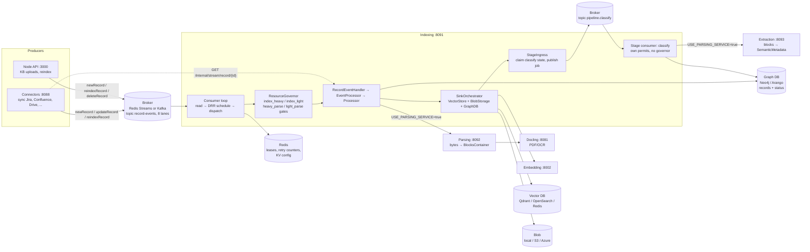
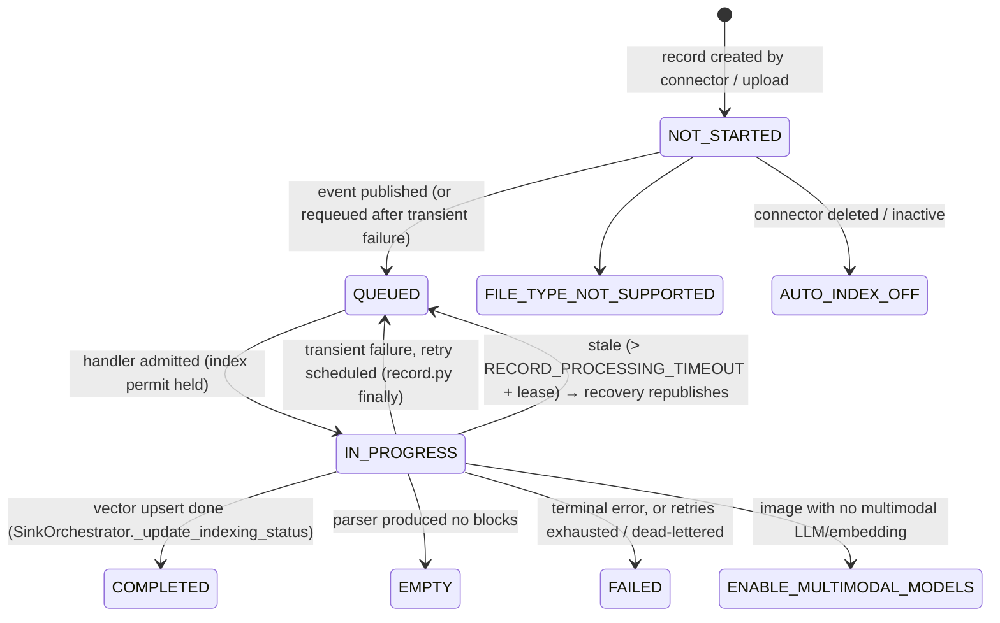
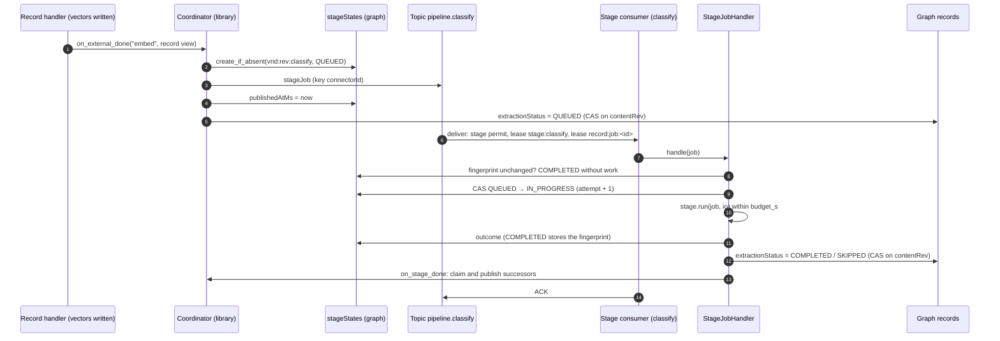
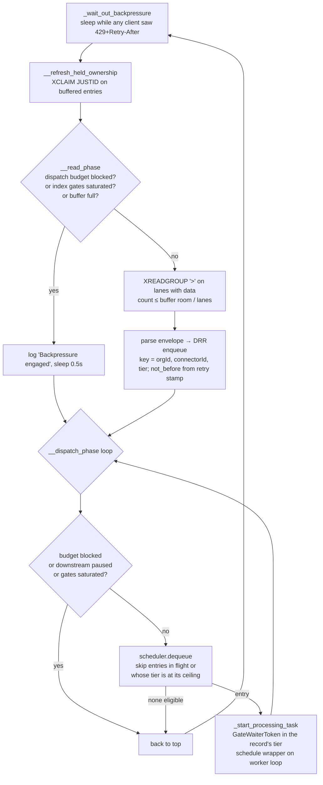

# Indexing Service — Architecture, Data Flow, and Admission Control

This is the working reference for `backend/python/app/indexing_main.py` and everything a record passes through between a `record-events` message and `indexingStatus=COMPLETED`, plus the pipeline stages that run after it (§2.3). Read it before changing anything under `app/services/messaging/`, `app/services/resource_governor/`, `app/events/`, `app/modules/transformers/`, or `app/modules/pipeline/`.

Section 5 is the root-cause analysis of the "indexing starts fast, then drops to 2–3 records" throughput collapse. If that is why you are here, skip to it, but the mechanism only makes sense with sections 3 and 4.2 in mind.

---

## 1. High-level design

Indexing is one Python process (`app.indexing_main`, port 8091) that consumes record events from the broker, downloads each record's bytes, parses them into a `BlocksContainer`, embeds the blocks into the vector store and stores the blocks in blob storage. The record is then searchable, and the handler hands it to the pipeline stage runtime (§2.3): classification (summary, categories, topics, departments, all LLM-extracted) runs afterwards as the `classify` stage, on its own topic with its own permits, status, retries and dead-lettering. It does not talk to a source system directly: the Connectors service owns source access and streams bytes on request.



**Two parsing modes exist.** With `USE_PARSING_SERVICE=false` (the shipped default) the handler parses in-process via `app/events/processor.py` (`Processor.process_*`), which itself calls the Docling service for PDF layout. With `USE_PARSING_SERVICE=true` it POSTs the bytes to the Parsing service. Both paths yield the same three pipeline events to the consumer (`START_PARSING`, `PARSING_COMPLETE`, `INDEXING_COMPLETE`), which is what the admission control below keys on.

**One worker loop.** Handlers run on a second event loop on a dedicated thread (`services/messaging/worker_loop.WorkerLoop`), shared by every indexing consumer in the process: the record consumer and each pipeline-stage consumer. Broker I/O (XREADGROUP/XACK, Kafka poll/commit, producer sends) stays on the main loop; every handler, the governor gates, the graph and vector clients, the lease renewers and the recovery loops run on the worker loop. Service clients bind to the loop that first uses them (an aiohttp session, an LLM or embedding HTTP pool, an `asyncio.Lock` once contended), so a second worker loop would put the same clients on two loops; a client that must also serve the main loop keeps one resource per loop (`utils/loop_local.LoopLocal`, as the ArangoDB, Neo4j and Qdrant clients do). Anything that must cross loops goes through `consumer_concurrency.bridge_to_main_loop` or `run_on_loop`.

Related services and ports are listed in `AGENTS.md`.

---

## 2. Record lifecycle and data flow

### 2.1 Status state machine

Status lives on the record node in the graph (`records` collection) as three fields: `indexingStatus`, `parsingStatus`, `extractionStatus`, plus `processingStartedAt` and `reason`. `contentRev`, the revision of the record's content (the first 16 hex digits of its bytes' sha256), is written with `IN_PROGRESS`; pipeline stage writes are conditional on it.



`extractionStatus` belongs to the `classify` stage (§2.3) and never blocks searchability: a record is searchable as soon as `indexingStatus=COMPLETED`. It moves to `QUEUED` when the stage job is claimed and published, then to `COMPLETED`, `SKIPPED` (classification off, nothing to classify, or no LLM configured; `reason` says which) or `FAILED`. A retrying or paused job leaves it `QUEUED`.

### 2.2 Data flow for one record (happy path)

```mermaid
sequenceDiagram
    autonumber
    participant Br as Broker (lane stream)
    participant Main as Consumer main loop
    participant W as Worker loop task
    participant Gov as ResourceGovernor gates
    participant Red as Redis (leases)
    participant Hnd as RecordEventHandler / EventProcessor
    participant Conn as Connectors :8088
    participant Prs as Parser (in-proc or :8092)
    participant Sink as SinkOrchestrator
    participant G as Graph DB
    participant V as Vector DB + Blob

    Br->>Main: XREADGROUP (batch ≤ buffer room)
    Main->>Main: parse envelope, DRR enqueue by (orgId, connectorId)
    Main->>Main: dispatch phase: dequeue while waiters < pending ceiling
    Main->>W: run_coroutine_threadsafe(_process_message_wrapper) + GateWaiterToken
    W->>W: retry backoff? PEL ownership check, per-process record claim
    W->>Gov: acquire INDEX_HEAVY or INDEX_LIGHT permit (tier from payload ext/mime)
    Gov-->>W: admitted → token.admit() (waiter count −1)
    W->>Red: lease "indexing" (cluster cap) + lease "record:<id>" (exclusivity)
    W->>Hnd: process_event(message)
    Hnd->>G: get record, connector active?, supported type?
    Hnd->>Conn: stream bytes (signed URL or /internal/stream/record)
    Hnd->>G: md5 dedup lookup; parsingStatus/indexingStatus = IN_PROGRESS
    Hnd-->>W: yield START_PARSING(tier, size_bytes)
    W->>Gov: acquire HEAVY_PARSE or LIGHT_PARSE permit (bounded wait, clock paused)
    W->>Red: lease "parsing" / "parsing:light"
    Hnd->>Prs: parse → BlocksContainer
    Hnd-->>W: yield PARSING_COMPLETE → release parse permit + lease
    Hnd->>Sink: index(ctx): describe images, blob write, embed + upsert
    Sink->>V: upsert points / store blocks
    Sink->>G: indexingStatus = COMPLETED
    Hnd->>G: StageIngress: claim the classify stage state (unique insert, QUEUED)
    Hnd->>Br: publish stageJob on pipeline.classify (retry producer)
    Hnd->>G: extractionStatus = QUEUED
    Hnd-->>W: yield INDEXING_COMPLETE → release index permit + lease
    W->>Main: XACK (bridged), clear retry counters
```

Failure paths from the same wrapper (`redis_streams/indexing_consumer.py::_process_message_wrapper`, mirrored in the Kafka consumer):

| Outcome | What happens |
| --- | --- |
| Terminal exception (`MessageErrorClassifier` → TERMINAL) | Record marked FAILED via the disposition sink, message ACKed. |
| Transient exception, attempts < `MAX_DELIVERY_ATTEMPTS` (3) | Record reverted `IN_PROGRESS → QUEUED`, message re-published to the same lane with `_retry_not_before` (15s, 60s, 240s backoff) and `_retry_tracking_id`, original ACKed. |
| Transient, attempts exhausted | Dead-lettered: record FAILED, message ACKed, next MD5 duplicate triggered. |
| `ParseAdmissionTimeout` (no parse slot within `RECORD_PROCESSING_TIMEOUT`) | Re-queued **without** counting an attempt; delivery counter bounds it (`REDIS_MAX_DELIVERIES`). Every `RequeueWithoutAttempt` takes this path, including a paused stage job (§2.3). |
| `RECORD_PROCESSING_TIMEOUT` (1800s) elapsed inside the handler | Task cancelled, handler leaves the record IN_PROGRESS, counted as a transient failure. |
| Lease lost (renewer could not prove ownership) | Handler cancelled, message left un-ACKed for redelivery. |
| Process crash | Entry stays in the PEL; `XAUTOCLAIM` after `claim_min_idle_ms`, and the stale-record scan republishes IN_PROGRESS records older than ~32 min. |
| Stage hand-off fails after the vectors are written | A graph error while claiming the stage state fails the attempt like any transient error; the retry overwrites the same deterministic vector points and hands off again. A broker that refuses the stage job does not fail it: the claim stays `QUEUED` and the stage sweep publishes it (§2.3). |

### 2.3 Pipeline stages (after indexing)

Work that needs a record to be searchable first, but must not hold its index permit, runs as a **pipeline stage** (`app/modules/pipeline/`). There is one today: `classify`, which reads the stored blocks, calls the classifier (the Extraction service with `USE_PARSING_SERVICE=true`, in-process `DocumentExtraction` otherwise) and writes the summary into the stored record, the summary vector and the taxonomy edges. Its prerequisite, `embed`, is still produced by the record handler above; the registry knows it as an *external* stage.



| Guarantee | Mechanism |
| --- | --- |
| A stage is dispatched once per revision, however many upstream completions race | The dispatcher claims the stage's state before publishing: a unique insert of `vrid:rev:stage`, or one compare-and-set from a terminal status back to `QUEUED`. Only the claimer publishes. |
| A duplicated or redelivered job runs once | `work_key` (`job:<jobId>`) serialises deliveries in-process and cluster-wide, the claim to `IN_PROGRESS` is a compare-and-set, and a job whose fingerprint matches the stored one completes without work. |
| Unchanged content costs no LLM call | Fingerprint = `stage@version` + an input digest + a config digest; for `classify`, the text digest, the resolved indexing model, the prompt version and the org's departments. `forceReindex` forces the job. A stage whose output lives outside its state keeps it with the state: classification's is in the stored record, which a re-index of unchanged content rewrites without it, and an unchanged job puts it back without a model call. |
| A stale job cannot overwrite newer content | Every headline write is a compare-and-set on the record's `contentRev`; a job none of whose records is still on its revision ends `SKIPPED` ("superseded"). Classification writes the stored record under the record's exclusivity lease (`record:<recordId>`, the one its re-index holds), re-checking `contentRev` first, so it never lands over a newer revision's content. |
| A lost publish or a dead worker is recovered | The stage sweep, below. |
| An LLM outage never stalls indexing | The index permit is released before the stage job exists; stage consumers have their own permits and lease pool. A paused job waits out the outage on its own schedule, so one organization's provider outage does not hold up another's classification. |

Outcomes (`StageJobHandler`, `app/modules/pipeline/worker.py`):

| Outcome | Stage state | `extractionStatus` | Consumer |
| --- | --- | --- | --- |
| COMPLETED | COMPLETED + fingerprint | COMPLETED, reason cleared | successors dispatched, ACK |
| SKIPPED (classification off, nothing to classify, no LLM configured) | SKIPPED + reason | SKIPPED + reason | successors dispatched, ACK |
| STALE (no bound record is on this revision any more) | SKIPPED "superseded" | untouched | ACK |
| RETRY (the model produced nothing usable, an Extraction-service 5xx or 429, `budget_s` elapsed) | QUEUED + reason | stays QUEUED | transient: backoff, re-publish, dead-letter after `MAX_DELIVERY_ATTEMPTS` |
| PAUSED (the model provider is unavailable, or the Extraction service is down, breaker-open or backpressured) | PAUSED + reason | stays QUEUED | `StagePaused`: re-queued without counting an attempt or a delivery, after a delay that grows with the stage attempt (15 s, 1 min, 4 min, then every 5 min) and is never shorter than the provider's remaining cooldown, so an outage of any length is waited out |
| FAILED (the Extraction service rejected the document: a 4xx) | FAILED + reason | FAILED + reason | terminal, ACK |
| Dead-lettered | FAILED | FAILED | the handler is also the consumer's `AbandonedMessageSink` |

**Admission.** A stage consumer is an ordinary indexing consumer built by `MessagingFactory.create_consumer(..., stage_admission=StageAdmission(stage, limit))`, without a ResourceGovernor: stage work is bounded by its downstream (an LLM provider's rate), not by this node's CPU or memory. It has its own `limit` permits, its own cluster lease pool `stage:<name>` and the per-job exclusivity lease; the dispatch budget, 429 backpressure, PEL/offset watermark, retry counters and dead-lettering are the record consumer's, unchanged. `classify`'s limit is `MAX_CONCURRENT_INDEXING_LLM_CALLS`. On Kafka a stage consumer always dispatches in parallel within a partition (the fair scheduler's parallel mode, which `record-events` leaves off because a record holds its partition for its whole lifetime): stage jobs are independent and serialised per job by `work_key`, so the admission limit, not the partition count, bounds concurrency.

**Topics.** One per stage, `pipeline.<stage>`, consumer group `pipeline_<stage>_group`, not laned. On Kafka the indexing service creates them at startup (`KafkaAdmin`, `KAFKA_TOPIC_PARTITIONS` partitions, replication factor 1 like the topics Node creates); create them beforehand where the indexing service's Kafka principal may not create topics, or where the cluster needs more replicas. If they cannot be created, indexing still starts and records are still indexed and searchable: the stage publisher stays unbound, so each hand-off leaves its claim `QUEUED`, and a background task retries (30 s, doubling to 5 min), then binds the publisher and starts the stage consumers; the sweeper then publishes the waiting claims. Until then `/health` reports `stages.publisher_bound: false`. Redis Streams needs no setup.

**Schema.** Before any consumer starts, the indexing service ensures the graph schema the pipeline writes against (`IGraphDBProvider.ensure_pipeline_schema`), without relying on the connector service's bootstrap having run: on ArangoDB the `stageStates` collection with its schema and indexes, and the current `records` schema; on Neo4j the unique constraint on `StageState.id` and its indexes. Stage-state nodes written while that constraint was missing can share an id and block it; they are removed first, keeping the most recently updated. Startup retries (2 s, doubling to 60 s) until the graph accepts the schema, for example while the connector service is still creating `records` on a first start.

**Loops.** A stage consumer runs its handlers on the process's one worker loop (§1), with its own permits and lease pool. The coordinator publishes through the retry producer, which lives on the main loop, via `DeferredPublisher` (`run_on_loop`); it is bound when the consumers start, and a hand-off before that raises instead of dropping the job.

**Status and retry.** Record detail (`GET /api/v1/records/{id}`, and the knowledge-base record API that proxies it) returns `stageStates` for the record's current revision, and connector and collection stats count `extractionStatus` beside `indexingStatus`. `POST /api/v1/connectors/{id}/reindex` with `stages: ["classify"]` re-runs only classification, for records whose `extractionStatus` matches `statusFilters` (default `FAILED`): the connectors service publishes `reindexRecord` with `stages`, and the indexing service re-dispatches the stage from its stored state (no re-parse, no re-embed, no record status written) or, when it holds no state for the record's revision, falls back to a full reindex. `GET /health` on the indexing service reports `stages`: each stage's topic, limit and how its deliveries ended since start.

**Stage sweep.** `recover_in_progress_records`, under the cluster-wide `recovery` lease, also runs `Coordinator.sweep`: a `QUEUED` claim older than 2 min that never reached the broker is published; one that did is published again only after 6 h (a backstop for a lost message, since a long backlog is not a loss); an `IN_PROGRESS` job older than 30 min whose job lease is free goes back to `QUEUED` and is published; a `PAUSED` state untouched for 6 h has lost its message (a paused job rewrites its state every time it comes back) and is published again. At most 200 states per pass. A re-published duplicate is harmless: see the second guarantee above.

### 2.4 Model calls: the LLM gateway

Every indexing-time model call (classification, image description, VLM OCR, table and row summaries) goes through one `LLMGateway` per process (`app/services/llm_gateway/`), in the indexing, parsing and Extraction services alike. A unit test fails if a parser, transformer or the extraction module calls `.ainvoke(` on a model directly.

| Concern | Behaviour |
| --- | --- |
| Concurrency | One process-wide cap, `MAX_CONCURRENT_INDEXING_LLM_CALLS`, held across event loops by a thread-safe FIFO semaphore (an `asyncio.Semaphore` binds to one loop, so a per-loop cap multiplies with the loops). `indexing_llm_slot()` hands out the same permits. A 429 is retried up to 3 times with jitter, sleeping outside the permit. |
| Hangs | A call is cut off after 600 s and counts as a provider failure. It is a ceiling on hangs, not a latency target: self-hosted models legitimately take minutes on long inputs. |
| Outages | A circuit breaker per model and endpoint (model class, model and base URL; never the credentials): an overloaded model or one deployment's rate limit must not stop the other models on the endpoint. Five consecutive provider failures (unreachable, timeout, 5xx, a 429 that outlasts its retries) open it for 30 s, and the first real call after the cooldown is the probe, since a health endpoint cannot tell whether the provider serves completions. While it is open, calls fail fast with `ProviderUnavailableError`, an `LLMUnavailableError` carrying the remaining cooldown as `retry_after`. An error that is the request's fault (a 4xx, output that does not parse) is raised unchanged and does not count against the provider. |
| Degradation | Image description leaves the image undescribed. A VLM OCR page whose call fails becomes an empty page; a provider outage stops the document, so it is retried. An Excel or CSV table summary falls back to a plain one naming the row count and columns. Classification pauses (§2.3); across the Extraction service an outage is a `424` with `error_code: LLM_UNAVAILABLE` and, while the provider's circuit is open, `Retry-After`, which the classify stage waits at least. |
| Observability | `pipeshub_indexing_llm_calls_total{call_site,outcome}`, `pipeshub_indexing_llm_tokens_total{call_site,direction}` and `pipeshub_indexing_llm_breaker_open{provider}`. `GET /health` on the indexing, parsing and Extraction services reports `llm_gateway`: the cap, permits in use, waiters, and each provider's circuit state and remaining cooldown. |

---

### 2.5 Upgrading and rolling back

**Order.** The indexing service applies the graph schema it writes against before it consumes (§2.3), so it can start before or after the connector service. In a split deployment, upgrade the Extraction service with or before the indexing service: an older Extraction service's answer to a model outage is recorded as `SKIPPED`.

**Records from the old inline classification.** Before the classify stage, classification ran inside the record's indexing attempt. A record it left with `extractionStatus` `IN_PROGRESS` (its pod stopped mid-classification) or `NOT_STARTED` (`DEFER_EXTRACTION=true`) has no stage state, so no sweep revisits it. `POST /api/v1/connectors/{id}/reindex` with `stages: ["classify"]` and `statusFilters: ["IN_PROGRESS", "NOT_STARTED"]` classifies them again; with no stage state for the record's revision, that is a full reindex.

**Rolling back to 0.7.0 on ArangoDB.** 0.7.0's connector service re-applies its strict `records` schema, which does not declare `contentRev` or `awaitingEventSince`, and does not accept `SKIPPED` in any status field, `PAUSED` or `ENABLE_MULTIMODAL_MODELS` in `parsingStatus`, or `QUEUED` or `ENABLE_MULTIMODAL_MODELS` in `extractionStatus`. ArangoDB then rejects every later update to a record carrying one of them, so status writes to those records fail. Stop the new services and run this first; it is accepted under either schema, and `stageStates` can stay (0.7.0 does not read it):

```aql
LET parsing = ["ENABLE_MULTIMODAL_MODELS", "PAUSED", "SKIPPED"]
LET extraction = ["ENABLE_MULTIMODAL_MODELS", "QUEUED", "SKIPPED"]
FOR r IN records
  FILTER HAS(r, "contentRev") OR HAS(r, "awaitingEventSince")
    OR r.parsingStatus IN parsing OR r.indexingStatus == "SKIPPED" OR r.extractionStatus IN extraction
  UPDATE r WITH {
    contentRev: null,
    awaitingEventSince: null,
    parsingStatus: r.parsingStatus == "SKIPPED" ? "FAILED" : (r.parsingStatus IN parsing ? "NOT_STARTED" : r.parsingStatus),
    indexingStatus: r.indexingStatus == "SKIPPED" ? "FAILED" : r.indexingStatus,
    extractionStatus: r.extractionStatus == "SKIPPED" ? "FAILED" : (r.extractionStatus IN extraction ? "NOT_STARTED" : r.extractionStatus)
  } IN records OPTIONS { keepNull: false }
```

Neo4j has no schema for these fields and needs no cleanup.

## 3. Light and heavy documents

Every record is classified once, from the event payload's `extension` and `mimeType`, by `app/services/resource_governor/tiers.py::classify`:

| Tier | Formats | Why it is separate |
| --- | --- | --- |
| **HEAVY** | pdf, doc/docx, ppt/pptx, xls/xlsx, png/jpg/jpeg/webp/svg, and **anything unrecognised** | Docling layout analysis, OCR, LibreOffice, VLM image description: CPU-bound for minutes, ~1.5 GiB RSS per parse. |
| **LIGHT** | txt, md, html, csv/tsv, json/yaml, source code, `application/blocks` (Jira/Confluence/Slack-shaped payloads), `text/gmail_content` | Milliseconds of CPU on a few KB; wall time is I/O (embedding, graph, vector writes). |

Jira issues and Confluence pages are published as `application/blocks` (Jira) or blocks/HTML (Confluence), so they are LIGHT. Their **attachments** are published with the attachment's real media type: PDFs, screenshots, Office files. Those are HEAVY. A Jira/Confluence sync is therefore a mixed stream: mostly light records with a heavy minority interleaved. That mix is the precondition for the bug in section 5.

The tier decides four things, all in `consumer_concurrency.py` and `resource_governor/`:

1. **Which index pool** the record holds for its whole lifetime: `Pool.INDEX_HEAVY` or `Pool.INDEX_LIGHT` (`acquire_index_slot`). This permit is taken before the handler runs and released on `INDEXING_COMPLETE`, so it covers download, the wait for a parse slot, parsing and embedding. Classification is outside it, on the `classify` stage's own permits (§2.3).
2. **Which parse pool** the record waits on at `START_PARSING`: `HEAVY_PARSE` or `LIGHT_PARSE`, cost 2 permits for a heavy file over 25 MiB.
3. **Which cluster-wide Redis lease** it takes: `parsing` vs `parsing:light` always; `indexing` vs `indexing:light` only once `INDEXING_SPLIT_LEASE_POOLS=true`.
4. **The ceilings and floors** the governor sizes each pool with (section 4.3).

The tier also decides two things at the dispatch layer (added by the fix in section 5.8):

5. **Which read-ahead bucket** a spawned task counts in: `GateWaiters` keeps one count per tier, and `DispatchBudget` gives heavy its own ceiling (2× the current `INDEX_HEAVY` limit, at least 8) under the shared total.
6. **Which leaf of the fairness tree** the message is buffered in: the fairness key is `(orgId, connectorId, tier)`, so a connector's heavy and light records are sibling queues and DRR can pass over a blocked heavy head.

The tier does not influence the lane a message lands in (lanes stay keyed by `connectorId`) or the read-phase read-ahead, which is bounded by buffer room.

---

## 4. Low-level design

### 4.1 Consumer loop

`IndexingRedisStreamsConsumer._consume_loop` (Kafka: `IndexingKafkaConsumer`) with fair scheduling on (the default):



Key structures:

- **`DRRScheduler`** (`scheduling/drr_scheduler.py`): hierarchical deficit round robin over `(orgId, connectorId, tier)`; the tier level is appended by `TieredKeyExtractor` and enabled by `FairSchedulerConfig.tier_level` (on by default). Each leaf is a FIFO. `try_pop` only inspects the *head* of each leaf; a head that is not eligible is skipped without spending deficit, which is what lets a connector's light leaf proceed while its heavy leaf is blocked. Buffer bounded by `FAIR_SCHEDULING_MAX_BUFFER` (2000) and `FAIR_SCHEDULING_MAX_PER_ENTITY` (500 per connector across both tiers; `entity_key()` gives the prefix the cap applies to).
- **Lanes**: `record-events.0..7` streams (or Kafka partitions), chosen by hash of `connectorId`. A lane whose entries are parked for lack of buffer room is skipped while another lane is producing.
- **Held entries / PEL**: buffered entries stay un-ACKed; ownership is refreshed with `XCLAIM JUSTID` so they are neither stolen nor counted as failed deliveries. Idle drains (`_drain_pending`) run only after 3 consecutive empty polls.
- **Retry counters** (`RetryManager`, Redis): `messaging:retry:<stable id>` counts processing failures; `messaging:deliveries:<stable id>` counts hand-backs. Both are separate from Redis's own `times_delivered`, which is only a poison-message backstop (`REDIS_MAX_DELIVERIES`, 10).

### 4.2 Admission control layers

A record passes through these, in order. Each is a separate limiter with its own counter; only the ones marked "per tier" know about heavy vs light.

| # | Layer | Where | Scope | Per tier? | What it bounds |
| --- | --- | --- | --- | --- | --- |
| 1 | Scheduler buffer | consumer | process | no | messages read ahead of dispatch (2000 total, 500 per connector) |
| 2 | **Dispatch budget** (`dispatch_budget` / `pending_task_ceiling`) | `consumer_concurrency.py` | process | yes | tasks spawned but not yet admitted through an index gate. Total `max(64, min(256, 2 × (index_heavy limit + index_light limit)))` (or `MAX_PENDING_INDEXING_TASKS`); heavy additionally capped at `max(8, 2 × index_heavy limit)`; light bounded by the total only. Without a scheduler (fair scheduling off) every tier gets the total |
| 3 | `index_gates_saturated` | `consumer_concurrency.py` | process | both-tiers-AND | stops reads/dispatch only when **both** index gates are full |
| 4 | Index gate (`INDEX_HEAVY` / `INDEX_LIGHT`) | `resource_governor/gate.py` | process | yes | records in flight per tier (permit held download → vector upsert) |
| 5 | Distributed `indexing` lease | Redis | cluster | only with `INDEXING_SPLIT_LEASE_POOLS` | fleet-wide in-flight cap at the resolved ceiling |
| 6 | Per-record `record:<id>` lease + in-process claim | Redis / consumer | cluster | n/a | one delivery of a record at a time |
| 7 | Parse gate (`HEAVY_PARSE` / `LIGHT_PARSE`) | `gate.py` | process | yes | concurrent parses; heavy also throttled by a `StartRateLimiter` (≥0.5 admits/s) |
| 8 | Distributed `parsing` / `parsing:light` lease | Redis | cluster | yes | fleet-wide parse cap |
| 9 | Parse admission wait | `parse_admission_wait` | record | n/a | how long a record may queue for a parse slot (`RECORD_PROCESSING_TIMEOUT`) with its own clock paused |
| 10 | `BackpressureCoordinator` | `messaging/backpressure.py` | process | no | pauses all reads/dispatch while any downstream client saw `429 + Retry-After` |
| 11 | `CircuitBreaker` per HTTP client | `services/base_client.py` | process | no | fails fast for 30s after 5 consecutive failures to parsing/extraction/docling |
| 12 | Record processing timeout | wrapper | record | n/a | 1800s of active processing (queue time excluded) |

A pipeline-stage consumer (§2.3) has the same layers except the governor's: its `StageAdmission` permits and `stage:<name>` lease replace layers 3–5, and it has no parse layers (7–9).

`GateWaiterToken` is the counter behind layer 2, one bucket per tier (`GateWaiters`). It is incremented synchronously in `_start_processing_task`, in the tier `dispatch_tier` resolves from the envelope, and decremented either when `acquire_index_slot` returns (`admit()`) or when the task ends without ever being admitted (`release()`). Between those two points the task is parked in the index gate's FIFO. The dispatch phase asks `DispatchBudget.allows(tier)` per buffered entry and DRR skips a leaf whose tier is at its ceiling without charging it; reads pause only when `DispatchBudget.blocked` (no tier may spawn), the buffer is full, or both index gates are saturated. Counts are reset when the worker loop stops, so a restart never inherits phantom waiters.

### 4.3 ResourceGovernor

One instance per process (`indexing_main.py` lifespan). It resolves **ceilings** once at startup (`policy.resolve_ceilings`) and adapts **limits** between a floor and that ceiling every 15s (`policy.next_limits`). Gates admit against the current limit; leases are sized from the ceiling.

Ceiling derivation with defaults (`MAX_CONCURRENT_*` unset), `cpus` = cgroup quota, embedding reservation on when a local CPU embedding model is configured:

```
heavy_cpus         = cpus − min(2, 0.25 × cpus)          # embedding reservation
heavy_parse        = floor(heavy_cpus × 1.0)
light_parse        = min(floor(cpus × 10), 256)
index_heavy        = clamp(2 × heavy_parse, ≥ min(8, heavy_parse), ≤ 512)
index_light        = clamp(2 × light_parse, ≥ 8, ≤ 512)
total              = clamp(6 × cpus, 24, 96)             # or MAX_CONCURRENT_INDEXING
if index_heavy + index_light > total:
    index_heavy    = min(index_heavy, total − min(8, index_light, total/2), 2/3 × total)
    index_light    = min(index_light, total − index_heavy)
heavy_parse        = min(heavy_parse, index_heavy);  light_parse = min(light_parse, index_light)
```

Worked examples (what most self-hosted installs run):

| Host | heavy_parse | light_parse | index_heavy | index_light | warm-start limits (h_parse / l_parse / idx_h / idx_l) | gate-waiter ceiling |
| --- | --- | --- | --- | --- | --- | --- |
| 4 CPU, local embeddings | 3 | 18 | 6 | 18 | 2 / 9 / 3 / 9 | **64** |
| 4 CPU, `MAX_CONCURRENT_INDEXING=24`, no reservation (unit-test governor) | 4 | 16 | 8 | 16 | 2 / 8 / 4 / 8 | **64** |
| 8 CPU, local embeddings | 6 | 36 | 12 | 36 | 2 / 18 / 6 / 18 | **64** |
| 16 CPU, local embeddings | 14 | 68 | 28 | 68 | 2 / 34 / 14 / 34 | 96 |

Note the heavy parse pool always **starts at 2** regardless of host size, and only grows one step per 15s sample while memory pressure is under `GOVERNOR_MEM_SOFT` (70% raw) and the pool shows demand. `heavy_memory_cap = free_GiB / 1.5` can hold it at 1 on a crowded all-in-one container.

Control law per pool (`policy._next_pool_limit`), every sample:

1. Shrink if raw memory ≥ 80% (halve), ≥ 70% or CPU brake (−1, CPU brake applies to heavy parse only), downstream incident on index pools (halve), ≥ 2 downstream timeouts (×0.75), or the live memory target is below the current limit (index pools halve the gap).
2. Otherwise grow one slow-start step (doubling while the previous grow's resource delta was small) if memory < 70%, not cooling down (30s after a shrink, 60s after an incident), the pool showed demand (≥ 70% utilisation for heavy, ≥ 30% for light/index, or any blocked acquire), and, for index pools, no downstream hold-off and mean hold time < 2× its low-water baseline.

Floors: heavy parse 2; light parse and both index pools half their ceiling as the *warm-start* width, but the index pools may be braked down to a memory-derived `pressure_floor` (heavy 2 records, light `int(2 × 0.15 / 0.02) = 15` records, or half the ceiling if smaller). A light pool therefore never drops below roughly 8–15 on any host. Governor state is exposed on `GET /health` under `resource_governor` (limits, in_use, ceilings, demand, downstream feedback).

Downstream feedback (`resource_governor/feedback.py`) is fed by `BaseServiceClient` (timeouts, 429s, exhausted retries), the Neo4j client (pool exhaustion), and the lease Redis client. It only ever shrinks or holds the index pools.

**One memory brake per memory domain.** In the all-in-one image the indexing, parsing and Docling processes share one container, and each runs a governor on the same memory reading; a heavy parse was braked three times in series, each governor at its own floor. A process that admits a parse under its memory brake now stamps the request with its memory domain (`x-pipeshub-admitted-in`: a hash of the memory cgroup's inode and the host's boot id, carried by `inject_request_headers`). A service in the same domain admits that request against its pool's fixed ceiling instead of braking it again (`memory_domain.parse_admission_cap`); a service in another domain (its own pod) brakes it and restamps. Where the domain cannot be read, every process keeps its own brake.

### 4.4 Handler chain

`RecordEventHandler.process_event` (`kafka/handlers/record.py`) → `EventProcessor.on_event` (`events/events.py`) → `Processor.process_<format>` (`events/processor.py`) or `_orchestrate_via_services` → `IndexingPipeline.apply` (`modules/transformers/pipeline.py`) → `SinkOrchestrator.index`, then `StageIngress.on_indexed` (`modules/pipeline/ingress.py`) hands the record to the stage runtime.

Responsibilities by layer:

- **RecordEventHandler**: routes non-record events (bulk delete, membership sync, collection rebuild), checks connector active, resolves extension/mime, rejects unsupported types, downloads bytes (signed URL, else `GET {connectors}/api/v1/internal/stream/record/{id}` with a scoped JWT), and owns the terminal status write in its `finally` (FAILED vs revert to QUEUED). Implements the `AbandonedMessageSink` the consumer calls before any dead-letter ACK.
- **EventProcessor**: MD5 dedup against `records` (same content → reuse the duplicate's `virtualRecordId`, skip work), writes IN_PROGRESS with the record's `contentRev`, mints or preserves the `virtualRecordId` (reconciliation-enabled types keep it for diff-based updates), yields `START_PARSING` with tier and size, then dispatches by format. PDFs go through OCR-need detection, then Docling (via the Docling service), OCR, or pdfplumber.
- **IndexingPipeline / SinkOrchestrator**: validate blocks, optional image description, blob write, reconciliation diff, embed + upsert (`VectorStore`), `indexingStatus=COMPLETED`, cache invalidation, then the hand-off to the stage runtime. The parsing-service path (`_orchestrate_via_services`) ends the same way. A pipeline built without the runtime refuses the record rather than silently skip classification.

### 4.5 Background loops in the indexing process

| Loop | Interval | Purpose |
| --- | --- | --- |
| `ResourceGovernor.run` | 15s ± 1s | sample cgroup/CPU/memory, adjust pool limits |
| `LeaseRenewer` (worker loop) | 30s | renew every held Redis lease in one pipeline; marks holders lost after ~90s of failures |
| `run_stale_recovery_loop` | 60s, after a startup grace of `SHUTDOWN_TASK_TIMEOUT + 90s` | republish records IN_PROGRESS for longer than `RECORD_PROCESSING_TIMEOUT + lease` (~32 min); park records of gone/inactive connectors as AUTO_INDEX_OFF; optional stranded-record republish; the pipeline stage sweep (§2.3) |
| `run_vector_membership_backfill_loop` | 30s | repair `connectorIds`/`recordGroupIds` on vector points |

---

## 5. Root cause: throughput collapses to a few records after the first few hundred

**Status: fixed** by the per-tier dispatch budget and the tier fairness level described in 5.8. Sections 5.2–5.7 describe the code as it was, kept because the mechanism is the reason the dispatch layer is shaped the way it now is. Regression test: `backend/python/tests/unit/services/messaging/test_tier_dispatch_regression.py` (both brokers), with the unit-level guards in `test_fair_scheduling_limits.py::TestDispatchIsBoundedPerTier` and `test_consumer_concurrency.py::TestDispatchBudget`.

### 5.1 Symptom

A Jira or Confluence sync indexes hundreds of records quickly, then after roughly 15–20 minutes (or 500–1000 records) drops to two or three records at a time. CPU and memory are idle. Restarting the service restores speed for a while, then it collapses again.

### 5.2 Mechanism

The gate-waiter ceiling (layer 2 in section 4.2) is one counter shared by both tiers, while the pools it protects are per tier. A heavy record that has been dispatched but cannot get an `INDEX_HEAVY` permit sits in the gate's FIFO and counts as a waiter for as long as it waits, which for attachments behind two Docling slots is minutes to tens of minutes. Nothing stops the dispatcher from adding more of them until the shared ceiling is reached, and once it is, dispatch and reads stop for **every** record, including light ones for which `INDEX_LIGHT` is sitting empty.

Step by step, on a 4-CPU host (ceiling 64, `index_heavy` warm start 3–4, `heavy_parse` 2):

1. The sync publishes a mixed stream. Pages/issues (light) flow through in seconds; the pipeline is fast.
2. Each attachment (heavy) is dispatched in DRR order, takes a `GateWaiterToken`, and blocks in `acquire_index_slot` on `INDEX_HEAVY`. The first 3–4 are admitted and then queue on `HEAVY_PARSE` (2 slots, Docling takes minutes each; `parse_admission_wait` lets them wait up to 1800s).
3. Every further heavy record is a permanent gate waiter. Heavy arrivals exceed heavy completions by a wide margin, so the waiter count climbs by roughly one per attachment dispatched.
4. When `_gate_waiters` reaches `pending_task_ceiling` (64), `__dispatch_phase` breaks and `__read_phase` logs `Backpressure engaged: 64 tasks waiting for indexing admission (index gates saturated: False, scheduler buffer full: False)` and sleeps. `index_gates_saturated` is False because `INDEX_LIGHT` is empty, which is exactly the point: the light pool is idle and nothing can reach it.
5. From then on the only thing that frees a waiter slot is a heavy record finishing. Each completion admits one queued heavy record (waiters 64 → 63), the dispatcher dispatches **one** more entry in DRR order and breaks again. Observed throughput becomes the heavy completion rate: two or three records per Docling cycle. The light records already admitted drain, `INDEX_LIGHT` goes to `0/N`, and stays there.
6. Restarting clears the in-memory waiter set; the buffered/PEL entries are re-read in stream order, so the burst repeats and the same collapse follows.

Fair scheduling across connectors delays but does not prevent this. DRR interleaves a Jira sync with a Confluence sync only until the Confluence attachments fill the shared ceiling; then Jira stops too. Within one connector the leaf queue is FIFO, so DRR cannot skip a heavy head to reach the light records behind it either.

### 5.3 Why "enough CPU and RAM" does not help

The stall is a counter, not a resource. The governor may even have grown `INDEX_LIGHT` and `LIGHT_PARSE` toward their ceilings before the collapse; afterwards their demand accumulators read zero (no blocked acquires, no permit-seconds), so the governor sees an idle pool and does nothing. `/health` during the stall shows the fingerprint:

```
resource_governor.in_use.index_light   = 0
resource_governor.in_use.index_heavy   = <its limit>
resource_governor.in_use.heavy_parse   = <its limit>
resource_governor.demand.index_light.utilisation ≈ 0
```

together with the consumer log line above repeating every 0.5s while `_backpressure_active` is set, and heavy records logging `<id> waited Ns for a parse slot` with N in the hundreds.

### 5.4 When it trips

Collapse happens once `index_heavy limit + 64` heavy records have been dispatched but not completed. For a stream that is 10% attachments that is roughly the 700th record; at 30% it is around the 250th. Heavy completions during that window are few (2 parses at a time, warm-start, memory-capped), which is why it reads as "500–1000 records" or "15–20 minutes" rather than an instant failure. A single connector with many image attachments (screenshots in Jira, diagrams in Confluence) trips it fastest, because images are HEAVY and, without a multimodal model, each still spends its time in the queue before being marked `ENABLE_MULTIMODAL_MODELS`.

### 5.5 Reproduction

The following test drives the real `__dispatch_phase`, `GateWaiterToken`, `acquire_index_slot` and governor gates (only the worker-loop hop and the handler are stubbed). Before the fix it demonstrated the bug with the numbers below; it now lives as `test_tier_dispatch_regression.py` with the assertions inverted. Governor from `tests/unit/services/messaging/governor_test_helpers.py` (4 CPU: `index_heavy=8`, `index_light=16`, warm start 4 / 8).

```python
async def fake_start_processing_task(stream, message_id, fields, parsed=None):
    token = concurrency.GateWaiterToken(consumer)                     # what _start_processing_task does
    tier = concurrency.effective_index_tier(
        consumer, classify(parsed.payload.get("extension"), parsed.payload.get("mimeType")))
    async def run():
        admission = await concurrency.acquire_index_slot(consumer, tier)  # blocks on the tier's gate
        token.admit()
        if tier is ParseTier.LIGHT:
            await asyncio.sleep(0.001); concurrency.release_admission(admission); finished["light"] += 1
        else:
            await asyncio.sleep(3600)                                  # attachment stuck behind heavy parse
    asyncio.create_task(run())

consumer._start_processing_task = fake_start_processing_task
for i in range(150): await enqueue(pdf_fields(i, connector="confluence"))       # attachments burst
for i in range(100): await enqueue(blocks_fields(i, connector="confluence"))    # pages behind them
for _ in range(20): await dispatch_phase(); await asyncio.sleep(0.01)
```

Result before the fix:

```
pending_ceiling=64  gate_waiters=64  index_heavy=4/4  index_light=0/8
started={'heavy': 68, 'light': 0}  finished={'light': 0}  still_buffered=182  saturated=False
```

Same run with the pages coming from a second connector (Jira): 67 light records got through while DRR interleaved, then the ceiling filled and the remaining 33 sat buffered with `index_light=0/8`.

Result after the fix (same inputs):

```
budget='heavy 8/8, light 0/64, total 8/64'  index_heavy=4/4  index_light=0/8
started={'heavy': 12, 'light': 100}  finished={'light': 100}  buffered=138
```

Heavy is capped at its own ceiling, every page indexed, and the remaining attachments wait in the buffer for a heavy permit instead of holding the read-ahead budget.

### 5.6 Amplifiers (not causes)

- `HEAVY_PARSE` warm-starts at 2 on every host and `heavy_memory_cap` can pin it at 1 when the cgroup has under 3 GiB free, which is common on the all-in-one container once Docling and embedding models are resident. Fewer heavy completions means the ceiling fills sooner and drains slower.
- `parse_admission_wait` lets an admitted heavy record wait 1800s for a parse slot, so `INDEX_HEAVY` permits turn over slowly by design.
- `ParseAdmissionTimeout` re-queues a heavy record at the tail of its lane without counting an attempt; it comes back heavy and re-joins the same queue.
- After a restart, buffered/PEL entries are re-read in stream order, so the attachment burst is replayed.

### 5.7 Ruled out

| Hypothesis | Why not |
| --- | --- |
| Governor shrinking the light pools | `pressure_floor` keeps `INDEX_LIGHT` ≥ 8–15 and `LIGHT_PARSE` ≥ half its ceiling; would log `ResourceGovernor limits changed: index_light:N->M`. Observed pool is idle, not small. |
| Downstream 429 backpressure | Would log `Downstream backpressure from ParsingService: pausing new stream reads`; only fires on `429 + Retry-After`, and pauses at most 30s per signal. |
| Redis lease failures | Would log `Distributed concurrency acquire:… failed; indexing remains paused` every 30s; capacity leases fail open after 5 errors anyway. |
| Retry backoff holding pending slots | With fair scheduling the `_retry_not_before` stamp is honoured inside the DRR buffer; a sleeping retry is never dispatched. |
| Stale-record recovery flooding | Only touches records IN_PROGRESS for > ~32 min; runs under a single cluster lock; republishes at most 100 per pass. |
| Heavy `StartRateLimiter` | 0.5 admits/s sustained; orders of magnitude above the heavy completion rate. |
| Circuit breaker open | Would fail records fast with `circuit breaker open`, not stall them. |
| Kafka vs Redis Streams | Both consumers share `consumer_concurrency.py` and have the identical dispatch-phase check (`kafka/consumer/indexing_consumer.py::__dispatch_phase`). |

### 5.8 Fix (implemented)

The invariant the tier split was introduced for is "a queue of heavy records must never sit in front of light records". Layers 4, 7 and 8 honoured it; layer 2 broke it. Dispatch admission is now per tier, in `consumer_concurrency.py` and both consumers' dispatch phases:

1. **Gate waiters are counted per tier.** `GateWaiters` (one lock, one count per `ParseTier`) replaces the bare integer; `GateWaiterToken(host, tier)` takes the tier that `dispatch_tier(host, message)` resolves from the envelope, the same function the wrapper uses for `acquire_index_slot`, so the token, the dispatcher and the gate can never disagree. Counts are reset when the worker loop stops.
2. **`DispatchBudget`** (`dispatch_budget(host)`) is computed once per loop turn: the total is unchanged (`pending_task_ceiling`, still pinned by `MAX_PENDING_INDEXING_TASKS`); heavy gets `max(8, 2 × current INDEX_HEAVY limit)` under it, because its waiters park for the length of the heavy-parse queue; light is bounded by the total only, because its waiters are admitted in milliseconds. `allows(tier)`, `blocked`, `remaining` and `describe()` are the only things the consumers read. A collapsed light budget (`index_light == 0`) leaves one tier with the whole total; without a governor, or without a scheduler (fair scheduling off), every tier gets the total, which is exactly the previous behaviour.
3. **Dispatch by tier.** `can_dispatch(item)` in both `__dispatch_phase`s rejects an entry whose tier is at its ceiling; `DRRScheduler.try_pop` skips that leaf without charging it. The loop breaks only when the budget is `blocked`, downstream is paused, or both index gates are saturated.
4. **Tier is the innermost fairness level.** `FairSchedulerConfig.tier_level` (default on) adds a third key level; `TieredKeyExtractor` appends `dispatch_tier(...)` to the entity key, so every connector has a heavy leaf and a light leaf. The scheduler stays tier-agnostic (it only learns `key_depth` / `entity_depth`); the per-connector cap applies at `entity_key()`, and lane pause/resume and deferred parking compare at that depth.
5. **Read-phase and partition backpressure** use `blocked`, so a heavy tier at its ceiling no longer pauses Redis reads or Kafka partitions while light can still be served. Recovery paths (PEL claim budget, FIFO read sizing) use `remaining`.
6. **Observability.** `pipeshub_indexing_gate_waiters{broker,tier}`; `GET /health` → `dispatch.record` with the budget (`tiers.heavy/light.waiters|ceiling|allows`, `blocked`); the backpressure log line reads `heavy 8/8, light 0/64, total 8/64`.

What is deliberately unchanged: the broker-order path (fair scheduling disabled) still uses one shared total, because without a buffer it cannot pass over a record; lanes stay keyed by `connectorId`; the cluster-wide `indexing:light` lease remains behind `INDEXING_SPLIT_LEASE_POOLS`.

If a deployment still stalls with `blocked` true and both gates full, the node is genuinely at capacity: more CPUs or `MAX_CONCURRENT_PARSING` raise the heavy completion rate; excluding attachments in the Jira/Confluence connector filters keeps the stream light-only.

---

## 6. Where things live

| Concern | Path |
| --- | --- |
| Process lifespan, governor wiring, recovery loops, `/health` | `backend/python/app/indexing_main.py` |
| Redis Streams consumer (read/dispatch/PEL/retry) | `backend/python/app/services/messaging/redis_streams/indexing_consumer.py` |
| Kafka consumer (same shape, offset watermark) | `backend/python/app/services/messaging/kafka/consumer/indexing_consumer.py` |
| Shared admission, gate-waiter ceiling, leases, parse wait | `backend/python/app/services/messaging/consumer_concurrency.py` |
| Env knobs, retry backoff, event models | `backend/python/app/services/messaging/config.py` |
| DRR scheduler, lanes, Kafka offset tracker | `backend/python/app/services/messaging/scheduling/`, `lanes/` |
| Distributed leases, renewer, retry counters | `distributed_concurrency.py`, `lease.py`, `retry_manager.py` |
| 429 backpressure, HTTP retry/circuit breaker | `messaging/backpressure.py`, `services/base_client.py` |
| Tiers, gates, control law, probe, feedback | `backend/python/app/services/resource_governor/` |
| Record handler, status writes, disposition sink | `backend/python/app/services/messaging/kafka/handlers/record.py` |
| Dedup, IN_PROGRESS, START_PARSING, format dispatch | `backend/python/app/events/events.py` |
| Per-format parsers (in-process path) | `backend/python/app/events/processor.py` |
| Parsing / extraction / docling HTTP clients | `backend/python/app/services/parsing/client.py`, `extraction/client.py`, `docling/client.py` |
| Parsing service route with its own gate + 429 | `backend/python/app/api/routes/parsing.py` |
| Record indexing pipeline and sinks | `backend/python/app/modules/transformers/{pipeline,sink_orchestrator,vectorstore,blob_storage,graphdb}.py` |
| Stage runtime: contracts, registry, coordinator, state store, worker, ingress, assembly | `backend/python/app/modules/pipeline/` |
| Stages and their IO adapters | `backend/python/app/modules/pipeline/stages/` |
| Stage admission, work key, cross-loop calls | `consumer_concurrency.py` (`StageAdmission`, `work_key`, `run_on_loop`) |
| Kafka topic creation for stage topics | `backend/python/app/services/messaging/kafka/admin.py` |
| Governor / consumer unit tests | `backend/python/tests/unit/services/messaging/`, `tests/unit/services/resource_governor/` |

## 7. Tunables that matter for throughput

| Variable | Default | Effect |
| --- | --- | --- |
| `MAX_CONCURRENT_PARSING` | derived | caps both parse ceilings |
| `MAX_CONCURRENT_INDEXING` | derived (`6 × cpus`, 24–96) | total in-flight budget across both index tiers |
| `MAX_PENDING_INDEXING_TASKS` | derived (`2 × index limits`, 64–256) | total dispatch budget; the heavy tier's ceiling is derived under it (see 4.2 layer 2) |
| `RECORD_PROCESSING_TIMEOUT` | 1800s | active-processing budget and parse-slot wait bound |
| `FAIR_SCHEDULING_ENABLED` / `_MAX_BUFFER` / `_MAX_PER_ENTITY` / `_LANE_COUNT` | true / 2000 / 500 / 8 | consumer buffering and lane routing |
| `GOVERNOR_MEM_SOFT` / `GOVERNOR_MEM_HARD` | 0.70 / 0.80 | memory brakes on raw cgroup occupancy |
| `GOVERNOR_HEAVY_PARSE_WORKING_SET_GB` | 1.5 | sizes `heavy_memory_cap` |
| `GOVERNOR_EMBEDDING_CPU_RESERVATION` | 2 (≤ 25% of quota) | CPUs withheld from heavy parse when embeddings are local |
| `INDEXING_SPLIT_LEASE_POOLS` | false | separate cluster-wide light indexing lease |
| `MAX_DELIVERY_ATTEMPTS` / `REDIS_MAX_DELIVERIES` | 3 / 10 | failure retries / delivery backstop |
| `MAX_CONCURRENT_INDEXING_LLM_CALLS` | 24 | the LLM gateway's process-wide cap on indexing-time model calls, across event loops (§2.4); also the `classify` stage consumer's job limit |
| `KAFKA_TOPIC_PARTITIONS` | 1 | partitions of `record-events` (created by Node) and of the `pipeline.*` stage topics (created by indexing) |
