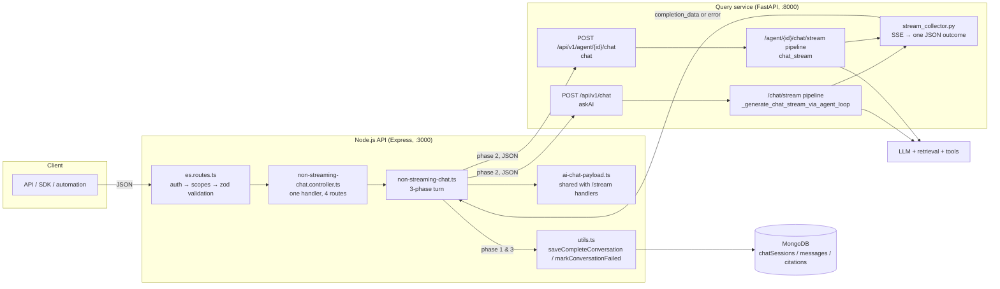
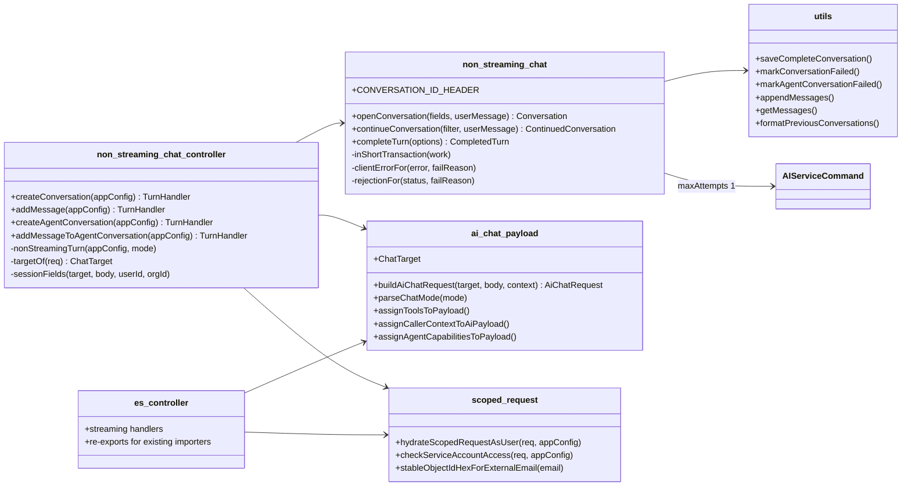
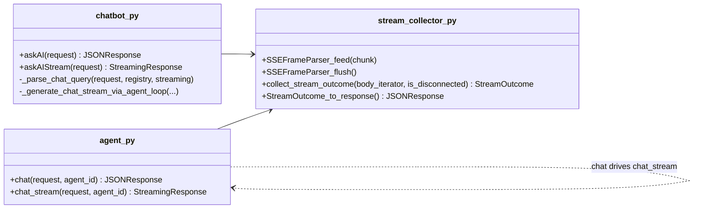
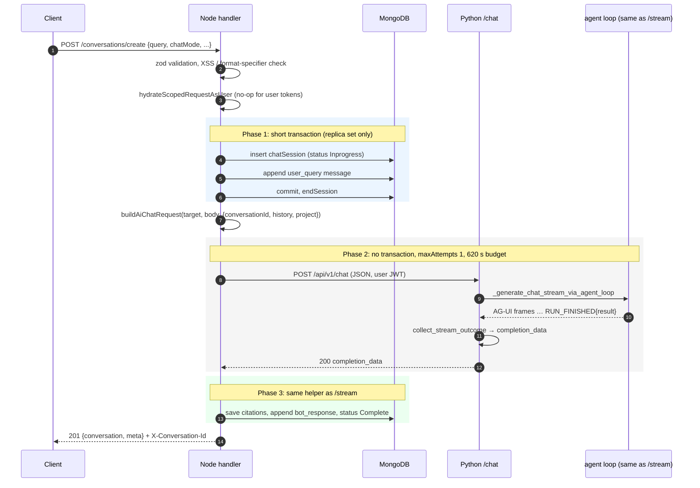
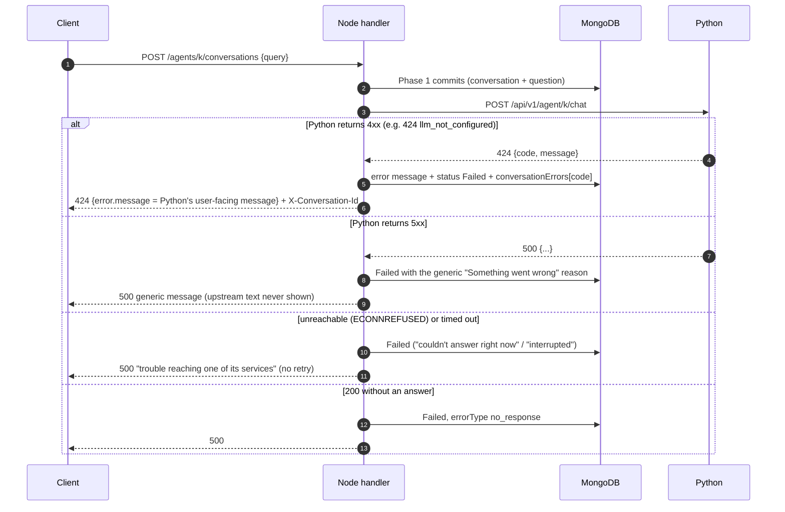
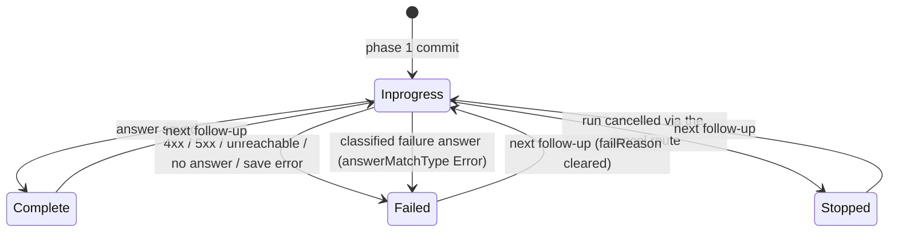

# Non-streaming chat endpoints

Design notes for the four JSON (non-SSE) chat routes and the Python routes behind them.
They cover what was broken and why, the high-level and low-level design, how data
moves through a turn, the error contract, and how the change is tested.

| Public route (Node, `/api/v1`) | Scope | Python route it calls |
| --- | --- | --- |
| `POST /conversations/create` (and `/conversations/internal/create`) | `conversation:write` | `POST /api/v1/chat`, or `/api/v1/agent/agentIdPlaceholder/chat` when `chatMode` is `agent` |
| `POST /conversations/:conversationId/messages` (and `/internal/...`) | `conversation:chat` | same as above |
| `POST /agents/:agentKey/conversations` | `agent:execute` | `POST /api/v1/agent/{agentKey}/chat` |
| `POST /agents/:agentKey/conversations/:conversationId/messages` | `agent:execute` | `POST /api/v1/agent/{agentKey}/chat` |

The frontend, the Slack bot and the in-repo Python services all use the `/stream`
twins. The non-streaming routes serve API and SDK callers: the published
`@pipeshub-ai/mcp` SDK ships `conversationsCreateConversation` and
`conversationsAddMessage`, and automation calls the routes directly.

## 1. What was broken

| # | Defect | Effect |
| --- | --- | --- |
| 1 | Python's `POST /api/v1/chat` was deleted with the LangGraph pipeline in the agent-loop rewrite (#2702, 2026-07-28). Node's `createConversation` and `addMessage` still called it. | **Every** assistant non-streaming turn failed: 404/405 from Python, conversation marked `Failed`. |
| 2 | The Node handlers ran the LLM call **inside** the MongoDB transaction that saved the user message. | On replica-set installs, any answer slower than MongoDB's 60 s transaction lifetime was aborted, and the retry logic of `withTransaction` could repeat the whole turn. |
| 3 | `AIServiceCommand.execute()` retries three times on transport errors by default. | A dropped connection re-ran the LLM, duplicating the answer and any tool side effects. |
| 4 | The four handlers were ~1,300 lines of hand-copied payload building that had drifted from the streaming handlers. | Missing `conversationId`, `runId`, `timezone` and `currentTime`; `chatMode: agent` was never routed to the universal agent; `tools` were ignored. |
| 5 | The agent non-streaming routes had no request validation. | Arbitrary bodies reached Mongo and Python. |
| 6 | `createConversation` resolved scoped-token callers inline. On a lookup failure it called `next(error)` and **kept going**. A missing query `throw`s outside `try`, and Express 4 does not catch rejected async handlers. | Double responses, and hung requests. |
| 7 | Python's agent `chat()` parsed SSE frames one chunk at a time, with no buffer. | A frame split across two chunks was silently lost, so the result was "The agent did not produce a response" even though the agent had answered. |
| 8 | The two assistant routes had been removed from the OpenAPI spec (#2282). `AgentConversation.status` documented values the code never writes (`INPROGRESS`/`COMPLETED`/`FAILED`), and `Conversation.status` lacked `Stopped`. | The SDK and API docs were wrong. |
| 9 | Frontend `chatApi.fetchMessages` and `chatApi.createConversation` targeted `/api/chat/conversations`, a route that does not exist. | Dead code that would fail if anyone called it. |

## 2. High-level design

The principle: **one pipeline, two framings.** The non-streaming route runs exactly
the code its `/stream` twin runs and only changes how the result leaves each process.



Why this shape:

- **No second pipeline in Python.** `askAI` and `chat` drive the same generator the
  streaming routes return and hand it to `collect_stream_outcome`. Security-sensitive
  setup (credential scoping, toolset loading, LLM resolution) exists once.
- **No second persistence path in Node.** Phase 3 is the same
  `saveCompleteConversation` / `markConversationFailed` the streaming routes call,
  so a conversation created without streaming is indistinguishable from a streamed one.
- **No second payload builder.** `buildAiChatRequest` builds the AI request body for
  both the streaming and non-streaming handlers, so the two cannot drift again (the
  cause of defect 4).

## 3. Low-level design

### 3.1 Node modules



- **Single responsibility.** The controller maps HTTP to a turn. `non-streaming-chat.ts`
  owns the transaction boundary and the AI call. `ai-chat-payload.ts` owns the wire
  contract with Python. `scoped-request.ts` owns internal-caller identity.
- **Open/closed.** A new target kind means a new `ChatTarget` variant and one branch in
  `buildAiChatRequest`. A new route that starts a chat reuses `nonStreamingTurn`.
- **No cycles.** `scoped-request.ts` was extracted from `es_controller.ts` so the new
  controller does not import the 8,000-line controller. `es_controller` re-exports
  everything it used to export, so no importer changes.

### 3.2 Python modules



`collect_stream_outcome` rules:

1. Frames are buffered until a blank line, so a frame split across chunks is parsed
   once it is whole. CRLF line endings, multi-line `data:` fields, `: keep-alive`
   comments and a missing final blank line are all handled.
2. Frames carrying `parentRunId` belong to sub-agents and are ignored. A sub-agent's
   `RUN_ERROR` is handed back to its parent as a tool result, and the parent still answers.
3. The completion is the root `RUN_FINISHED.result`, or a legacy `complete` frame.
   The **last** root terminal frame wins: a `RUN_ERROR` after `RUN_FINISHED` means the
   answer was not saved, and a graceful `RUN_FINISHED` after a `RUN_ERROR` (see
   `agui_emitter.py`) is the run's real result.
4. `is_disconnected` is checked between chunks. AG-UI heartbeats arrive at least every
   15 s, so a caller that gave up stops the agent loop within that window. The iterator
   is always `aclose()`d, and both route adapters wrap their bridge in
   `contextlib.aclosing`, so closing the outer stream cancels the bridge's producer and
   heartbeat tasks at once. (`async for` does not close the generator it iterates, so
   without it they ran until garbage collection. This applies to `/stream` disconnects too.)

`_parse_chat_query` is the request prelude shared by `/chat` and `/chat/stream`: JSON
parse, `ChatQuery` validation, the 409 for a `runId` that is already active, and the
`chat_session_started` telemetry event, which now carries `streaming: true|false`.
`agent.py::chat` sets `request.state.chat_streaming = False`, so the `agent_run` event
reports the real mode.

## 4. Data flow

### 4.1 Successful turn



A follow-up differs only in phase 1: `continueConversation` loads the conversation,
scoped to `{_id, orgId, userId, isDeleted: false}` plus assistant-or-agent (and
`agentKey`). It reads the history *before* appending the new question, then sets
`Inprogress`, all in one transaction. Project scope comes from the stored
conversation, never from the request.

### 4.2 Failure turn



### 4.3 Request field mapping (Node → Python)

`buildAiChatRequest` produces the payload for both framings; the streaming handlers
add `protocol: "agui"` on top.

| Field | Assistant | Agent | Source |
| --- | --- | --- | --- |
| `query`, `filters`, `attachments` | ✓ | ✓ | body (defaults `{}` / `[]`) |
| `previousConversations` | ✓ | ✓ | body on create; stored history on follow-ups |
| `recordIds` | create only | create only | body |
| `conversationId` | ✓ | ✓ | the conversation phase 1 wrote |
| `modelKey`, `modelName`, `modelFriendlyName`, `reasoningEffort`, `timezone`, `currentTime`, `runId` | ✓ | ✓ | body, `null` when absent |
| `chatMode` | `parseChatMode` (`agent:<m>` → `<m>`) | body or `quick` (never `auto`, which Python treats as "run the tier classifier") | body |
| `tools`, `agentCapabilities` | only when `chatMode` is agent | ✓ | body |
| `quickMode` | — | create only | body |
| `callerDisplayName`, `callerEmail` | — | ✓ | body (internal callers) |
| `projectInstructions`, `strictScope`, narrowed `filters`/`tools` | ✓ | ✓ | `applyProjectScope` (after `tools`) |

### 4.4 Conversation status



A crash between phases leaves `Inprogress` with the question saved: the same state a
crashed streaming turn leaves, and the next follow-up moves it on.

## 5. Error contract

| Python outcome | Python HTTP | Node → client | Persisted `errorType` |
| --- | --- | --- | --- |
| `RUN_FINISHED` | 200 | 201 / 200 with the conversation | — |
| `RUN_ERROR` `invalid_request` / `request_failed` | 400 | 400, message kept | same code |
| `request_too_large` | 413 | 413, message kept | same |
| `content_filter` | 422 | 422, message kept | same |
| `llm_not_configured` / `llm_initialization_failed` | 424 | 424, message kept | same |
| `toolset_config_missing` / `mcp_server_config_missing` | 424 | 424, message kept ("connect your actions in Workspace → Actions") | same |
| `rate_limit` / `quota_exceeded` | 429 | 429, message kept | same |
| `auth_error` / `server_error` (provider) | 502 | 500, generic message | same |
| `timeout` | 504 | 500, "unavailable" | same |
| unknown code / no terminal frame | 500 | 500, generic message | code / `no_response` |
| agent not found / no access (raised before the stream) | 404 / 403 | 404 / 403, message kept | `ai_service_error` |
| Node cannot reach Python | — | 500 `SERVICE_UNAVAILABLE_MESSAGE` | `internal_error` |

Node only surfaces the text of a sub-500 reply (`userFacingStatusError`). That is why
Python maps codes whose message tells the user what to do (configure a model, slow
down, shorten the input) below 500, and keeps provider and infrastructure failures at
5xx, so their text never reaches the user.

Every response after phase 1, success or failure, carries `X-Conversation-Id`. A
caller whose *first* turn failed can still `GET` or continue that conversation.

## 6. API contract

Documented in `backend/nodejs/apps/src/modules/api-docs/pipeshub-openapi.yaml`
(`x-pipeshub-sdk: true`, so the generated SDK keeps them):

| operationId | Request schema | Success |
| --- | --- | --- |
| `createConversation` | `CreateConversationRequest` | `201 CreateConversationResponse` |
| `addMessage` | `AddMessageRequest` | `200 AddMessageResponse` |
| `createAgentConversation` | `AgentCreateConversationRequest` | `201 CreateAgentConversationResponse` |
| `addAgentConversationMessage` | `AgentAddMessageRequest` | `200 AddMessageResponse` |

`AgentStreamCreateConversationRequest` and `AgentAddMessageStreamRequest` are now
`allOf: [<base>, {required: [chatMode]}]` over the new base schemas, so the streaming
and non-streaming contracts cannot drift. The new header `components.headers.X-Conversation-Id`
is referenced from every response after phase 1.

## 7. Operational notes

- **Latency.** The response arrives only when the whole answer is ready. Agent runs can
  take minutes. Node's AI call budget is 620 s (`AIServiceCommand`). Proxies in front
  of Node (ingress, ALB, nginx) need an idle timeout above the expected answer time.
  Interactive clients should use `/stream`.
- **No retries.** `completeTurn` passes `maxAttempts: 1`. An LLM run is not idempotent.
- **Client gives up.** If the client disconnects from Node, the turn still finishes and
  is persisted. The answer shows up in `GET /conversations/:id`. If Node gives up on
  Python (the 620 s budget), Python notices at its next chunk and stops the agent loop.
- **Cancellation.** Send a `runId` and call `POST …/cancel {runId}` from another
  request. The turn ends `Stopped` and returns 200.
- **Telemetry.** `chat_session_started.streaming` and `agent_run.streaming` distinguish
  the two framings.

## 8. Tests

| Layer | File | What it pins |
| --- | --- | --- |
| Python unit | `tests/unit/agents/agent_loop/protocol/test_stream_collector.py` | frame buffering across chunks, CRLF, multi-line data, comments, flush; root vs sub-agent frames; completion-wins; disconnect stops and closes the stream; error-code → status table |
| Python unit | `tests/unit/api/routes/test_chatbot_non_streaming.py` | `askAI` drives the same generator as `/chat/stream` with the same `ChatQuery`; 400/409 prelude; 424 mapping; telemetry `streaming: false` |
| Python unit | `tests/unit/api/routes/test_agent_chat_non_streaming.py` | agent `chat()` over AG-UI frames, split frames, status mapping |
| Python in-process e2e | `tests/integration/test_chat_stream_agent_loop_e2e.py::TestChatNonStreamingAgentLoopEndToEnd` | real route → bridge → agent factory → finalizer chain, only outer I/O mocked, all chat modes, missing LLM |
| Node flow | `tests/.../controller/es_controller.non-streaming.test.ts` | all four handlers against the in-memory Mongo store and a fake AI backend: persistence, response shape, `X-Conversation-Id`, AI URL/payload/history, citations, 4xx/5xx/unreachable/no-answer/classified/stopped, a single fetch (no retry), XSS rejection with zero writes, ownership and cross-type 404s, scoped-token re-signing, replica-set session ended before the AI call |
| Node unit | `tests/.../utils/ai-chat-payload.test.ts`, `tests/.../validators/es_validators.non-streaming.test.ts`, `es.routes.test.ts` | payload builder, new schemas, validation wired on the agent routes |
| Live e2e | `integration-tests/response-validation/enterprise-search/conversations/integration_test_conversation_non_streaming.py` | against a running stack: bodies validated against the OpenAPI operation, persisted state re-read via `GET`, KB-grounded answers, follow-ups, validation 400s, auth, 404 scoping, unknown agent leaves a `Failed` conversation named by `X-Conversation-Id` |

Run them:

```bash
# Python
cd backend/python && pytest tests/unit/agents/agent_loop/protocol \
  tests/unit/api/routes/test_chatbot_non_streaming.py \
  tests/unit/api/routes/test_agent_chat_non_streaming.py \
  tests/integration/test_chat_stream_agent_loop_e2e.py

# Node
cd backend/nodejs/apps && npm test -- --grep "non-streaming|ai-chat-payload"

# Live stack (see integration-tests/README.md for env setup)
cd integration-tests && pytest -m integration \
  response-validation/enterprise-search/conversations/integration_test_conversation_non_streaming.py
```

## 9. Follow-ups

- `regenerateAnswers` / `regenerateAgentAnswers` still build their AI payloads by hand;
  moving them onto `buildAiChatRequest` would finish the DRY work.
- `hydrateScopedRequestAsUser` resolves Slack service accounts only when `:agentKey` is
  present. There is no internal (scoped-token) non-streaming agent route today. Add one
  only if a caller needs it.
